```{r xaringan-themer, include = FALSE}
library(xaringanthemer)
mono_light(
  base_color = "midnightblue",
  header_font_google = google_font("Josefin Sans"),
  text_font_google   = google_font("Montserrat", "500", "500i"),
  code_font_google   = google_font("Droid Mono"),
  link_color = "#8B1A1A", #firebrick4, "deepskyblue1"
  text_font_size = "28px"
)
library(dplyr)
library(ggplot2)
```


<!-- HTML style block -->
<style>
.large { font-size: 130%; }
.small { font-size: 70%; }
.tiny { font-size: 40%; }
</style>

## Age of OMICS

```{r, out.width = "800px", fig.align='center', echo=FALSE}
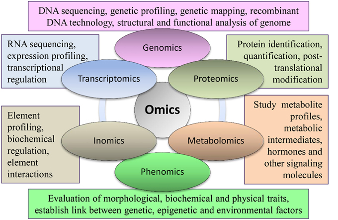
```

.small[Deshmukh, Rupesh, et al. "Integrating omic approaches for abiotic stress tolerance in soybean." Frontiers in Plant science (2014) https://doi.org/10.3389/fpls.2014.00244]

---
class: middle, center

# Genome in a nutshell

---
## Genome arithmetics

- Haploid (one copy) human genome has 23 chromosomes, autosomes (chromosome 1-22) and one sex chromosome (X, Y)

- Human genome is _diploid_ - comprised of a paternal and a maternal "haplotype". Together, they form our "genotype" of 46 chromosomes

```{r, out.width = "800px", fig.align='center', echo=FALSE}
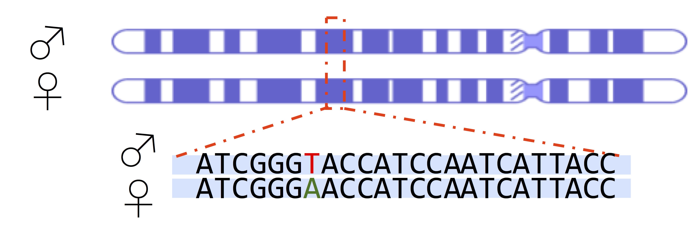
```

---
## Genome arithmetics

- One genome per cell, located in the nucleus - most of the time (Red blood cells lack chromosomes)  

- Mitochondria (cell powerhouses) have their own genomes - many mitochondrial genomes (Liver cells have 1000-2000 mito)

- A typical human is comprised of roughly 40 trillion human cells (excluding trillions of bacterial cells in our gut)

- If stretched out, each haploid genome would be roughly 2 meters - each cell has 4 meters of DNA (1 m = 3.28 ft)
  - 40 trillion * 4 meters = 160 trillion meters
  - 160 trillion meters / 1609.34 = 99,750,623,441 miles
  - 99,750,623,441 / 92,960,000 = 1,073.05 trips to the sun

---
## Genome arithmetics

- ~3,235 billion base pairs (haploid)

- ~20,000 protein coding genes

- ~200,000 coding transcripts (isoforms of a gene that each encode a distinct protein product)

```{r, out.width = "600px", fig.align='center', echo=FALSE}
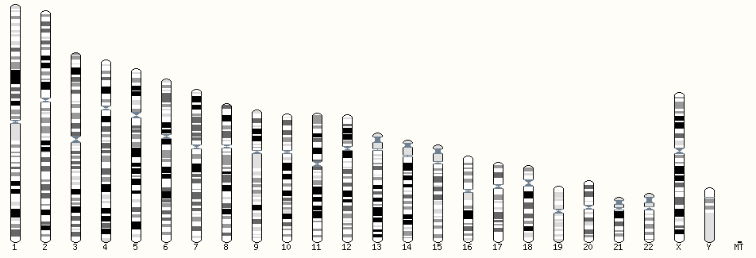
```

.small[ https://www.ensembl.org/Homo_sapiens/Location/Genome ]

---
## The human genome from a micro to macro scale 

```{r, out.width = "550px", fig.align='center', echo=FALSE}
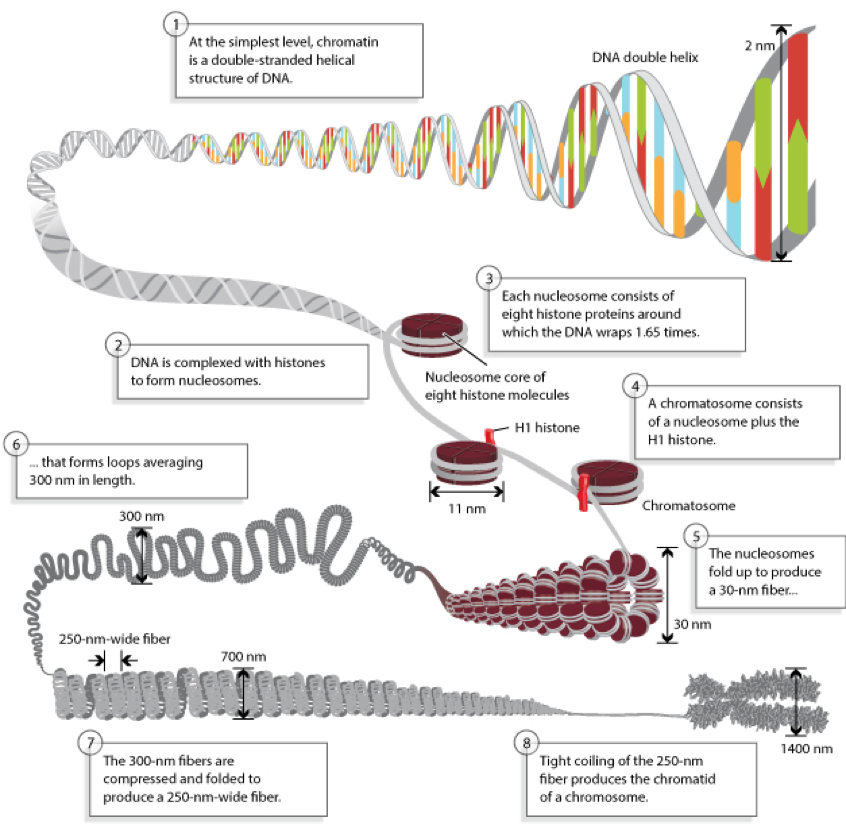
```

---
##  The basic structure of a chromosome

.pull-left[
- **Size**. This is the easiest way to tell chromosomes apart.

- **Banding pattern**. The size and location of Giemsa bands make each chromosome unique.

- **Centromere position**. Centromeres appear as a constriction. They have a role in the separation of chromosomes into daughter cells during cell division (mitosis and meiosis).
]
.pull-right[
```{r, out.width = "400px", fig.align='center', echo=FALSE}
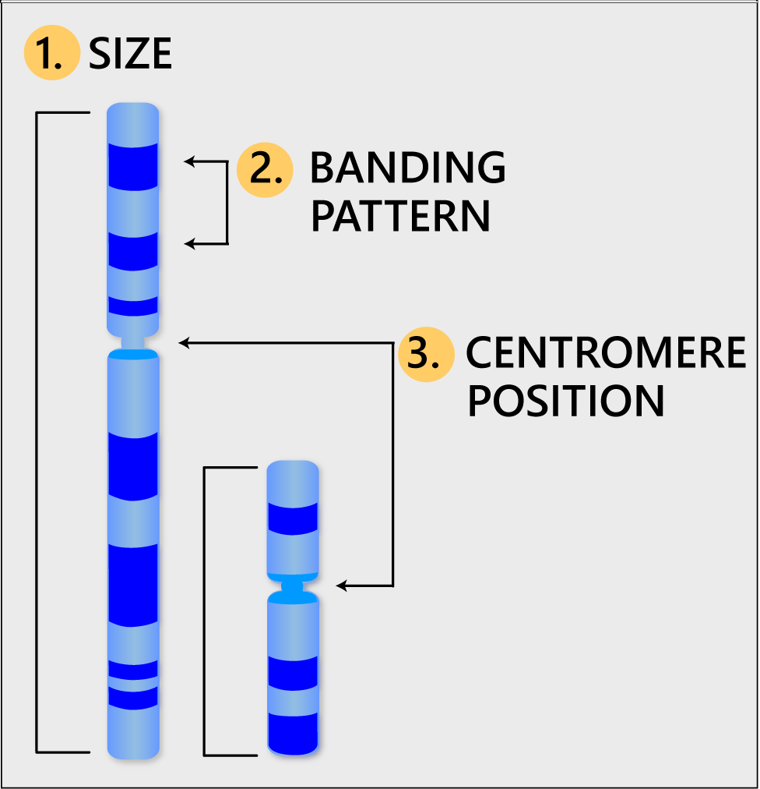
```
]
.small[http://learn.genetics.utah.edu/content/basics/readchromosomes/]

---
##  Chromosome Giemsa banding (G-banding)

```{r, out.width = "600px", fig.align='center', echo=FALSE}
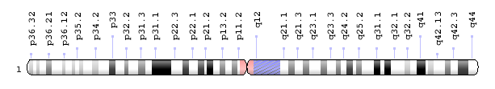
```

- Heterochromatic regions, which tend to be rich with adenine and thymine (AT-rich) DNA and relatively gene-poor, stain more darkly with Giemsa and result in G-banding  

- Less condensed ("open") chromatin, which tends to be (GC-rich) and more transcriptionally active, incorporates less Giemsa stain, resulting in light bands in G-banding. 

---
##  Chromosome Giemsa banding (G-banding)

```{r, out.width = "600px", fig.align='center', echo=FALSE}

```

- Cytogenetic bands are labeled p1, p2, p3,   q1, q2, q3, etc., counting from the centromere out toward 
the telomeres. At higher resolutions, sub-bands can be seen within the bands. 

- For example, the locus for the CFTR (cystic fibrosis) gene is 7q31.2, which indicates it is on chromosome 7, q arm, band 3, sub-band 1, and sub-sub-band 2. (Say 7,q,3,1 dot 2)

.small[https://ghr.nlm.nih.gov/chromosome/1#ideogram]

---
##  The role of the centromere

```{r, out.width = "500px", fig.align='center', echo=FALSE}
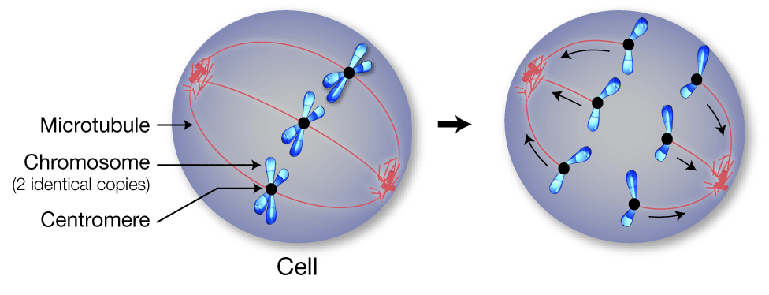
```

- Centromeres are required for chromosome separation during cell division.
- The centromeres are attachment points for microtubules, which are protein fibers that pull duplicate chromosomes toward opposite ends of the cell before it divides. 
- This separation ensures that each daughter cell will have a full set of chromosomes.  
- Each chromosome has only one centromere.

.small[http://learn.genetics.utah.edu/content/basics/readchromosomes/]

---
## Centromere positions

```{r, out.width = "400px", fig.align='center', echo=FALSE}
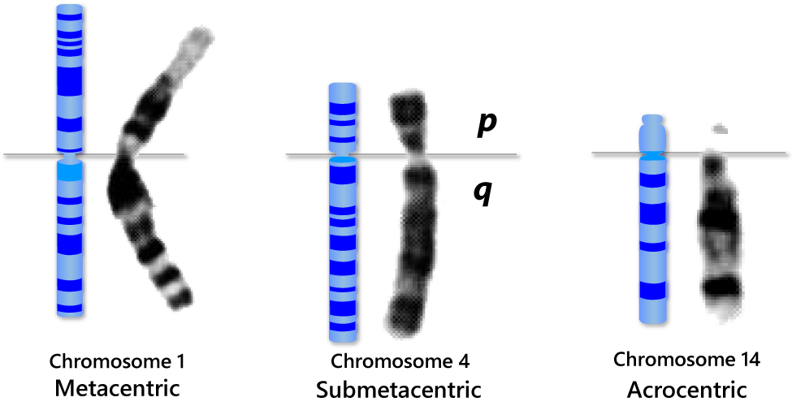
```

The position of the centromere relative to the ends helps scientists tell chromosomes apart. Centromere position can be described as:

- **Metacentric** - the centromere lies near the center of the chromosome.
- **Submetacentric** - the centromere that is off-center, so that one chromosome arm is longer than the other. The short arm is designated "p" (for petite), and the long arm is designated "q" (because it follows the letter "p").
- **Acrocentric** - the centromere is very near one end.

.small[http://learn.genetics.utah.edu/content/basics/readchromosomes/]

---
## Telomeres: The Genomic "End-Caps"

Telomeres are specialized nucleoprotein structures found at the ends of linear chromosomes. They act like the plastic tips on shoelaces (aglets), preventing chromosomes from fraying, sticking to each other, or being recognized as "broken" DNA by the cell's repair machinery.

--
* **Sequence:** In humans and all vertebrates, telomeres consist of thousands of tandem repeats of the hexanucleotide sequence **TTAGGG**.

--
* **Structure:** They terminate in a single-stranded 3' overhang that tucks back into the double-stranded DNA to form a protective **T-loop**, stabilized by the **Shelterin** protein complex.

--
* **The "End Replication Problem":** DNA polymerase cannot replicate the very tip of a linear chromosome. Consequently, telomeres shorten with every cell division, eventually triggering cellular senescence (the Hayflick limit).

---
## Telomeres in Humans vs. Mice

While the repetitive sequence ( is identical, there are profound biological differences between the two species:

| Feature | Humans | Mice (*Mus musculus*) |
| --- | --- | --- |
| **Telomere Length** | Relatively short (**5–15 kb**) | Extremely long (**20–50 kb**) |
| **Telomerase Activity** | Restricted primarily to germ, stem, and cancer cells | Active in many adult somatic tissues |
| **Replicative Aging** | Telomere shortening is a primary driver of aging | Aging is less dependent on telomere length |
| **Cancer Risk** | Short telomeres act as a tumor-suppressive barrier | Long telomeres and active telomerase make mice more prone to certain tumors |

---
## Genes and Transcripts

**Gene:** A region of DNA that encodes a functional product
- Includes regulatory elements (promoter, enhancers) + transcribed sequence
<!-- - Human genome: ~19,400 protein-coding genes, ~36,000 non-coding RNA genes -->

**Transcript (or RNA):** The specific variant of an RNA molecule produced by transcription of a gene
- One gene can produce multiple different transcripts (isoforms) through:
    - **Alternative splicing**: Different exon combinations
    - **Alternative transcription start sites**: Different 5' ends
    - **Alternative polyadenylation**: Different 3' ends

<!--**Isoforms:**
- Different transcript variants from the same gene
- Can encode different protein products or have different regulatory properties
- Average human gene produces ~3-4 isoforms; some genes produce >100-->

**Example:** The human DSCAM gene produces >38,000 potential isoforms through alternative splicing

<!-- **Key point:** Genes are genomic features (DNA); transcripts are the expressed RNA products. The relationship is one-to-many: 1 gene → multiple transcripts → potentially multiple proteins. -->

---
## Gene content

- "There appear to be about $30,000 \pm 40,000$ protein-coding genes in the human genome -- only about twice as many as in worm or fly. However, the genes are more complex, with more alternative splicing generating a larger number of protein products."  
- Over time this has evolved to an estimate of approximately 20,000 protein coding genes, which reflects roughly the number of genes in fly and worm

```{r, out.width = "500px", fig.align='center', echo=FALSE}
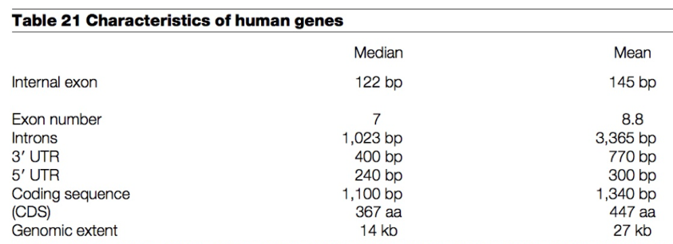
```

.small[ International Human Genome Sequencing Consortium. Initial sequencing and analysis of the human genome. Nature 409, 860–921 (2001). https://doi.org/10.1038/35057062 ]

---
## Genes are unevenly distributed across chromosomes

Highly expressed genes positively correlated with

- Very short indels
- High gene density
- High GC content
- High density of Short interspersed nuclear elements (SINE) repeats
- Low density of Long interspersed nuclear elements (LINE) repeats
- Both housekeeping and tissue-specific expression

The opposite is true for lowly expressed genes

.small[Versteeg, Rogier, et al. "The human transcriptome map reveals extremes in gene density, intron length, GC content, and repeat pattern for domains of highly and weakly expressed genes." Genome research (2003) https://doi.org/10.1101/gr.1649303 ]

---
## Genes are unevenly distributed across chromosomes

- **Chromosome 19**: Most gene-dense (~23 genes/Mb) - 1,332 genes in only 59 Mb

- **Chromosome 17**: Second most gene-dense (~14 genes/Mb) - 1,111 genes

- **Chromosome 11**: Third most gene-dense (~9 genes/Mb) - 1,236 genes

- Gene-rich chromosomes (19, 17, 11) tend to be located toward the nuclear center

.small[ Grimwood, J., Gordon, L., Olsen, A. et al. The DNA sequence and biology of human chromosome 19. Nature 428, 529–535 (2004). https://doi.org/10.1038/nature02399]
.small[ Nusbaum, C., Zody, M., Borowsky, M. et al. Correction: Corrigendum: DNA sequence and analysis of human chromosome 18. Nature 438, 696 (2005). https://doi.org/10.1038/nature04363 ]

---
## Genes are unevenly distributed across chromosomes

- **Chromosome 18**: Least gene-dense (~3.4 genes/Mb) - only 257 genes in 78 Mb

- **Chromosome 13**: Second least gene-dense (~3.2 genes/Mb) - 305 genes

- **Chromosome Y**: Lowest overall (~2.5 genes/Mb) - only 65 genes in 59 Mb

- Gene-poor chromosomes (18, 13, Y) tend to be located at the nuclear periphery

- Only three autosomal trisomies are survivable to term: chromosomes 13 (Patau), 18 (Edwards), and 21 (Down syndrome)
<!-- - Despite low gene density, chromosome 18 has similar levels of conserved non-coding sequences as the genome average -->
<!--
```{r, out.width = "800px", fig.align='center', echo=FALSE}
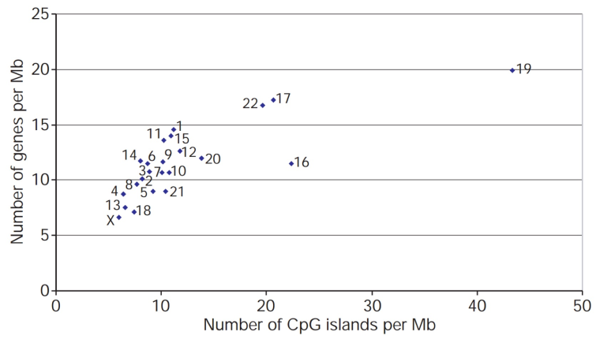
```
-->

---
## GENCODE – Annotation Gene Features (Release 49, 2024)

- **~19,433 protein coding genes**
    - ~211,446 protein-coding transcripts
    - ~186,646 full-length protein-coding transcripts
    - ~24,800 partial-length protein-coding transcripts
    - ~129,801 distinct translation products
    
- **~35,899 long non-coding RNA (lncRNA) genes**
    - ~191,079 lncRNA transcripts
    - Dramatic expansion from earlier releases
    
---
## GENCODE – Annotation Gene Features (Release 49, 2024)

- **~14,701 pseudogenes**
    - ~10,638 processed pseudogenes
    - ~3,536 unprocessed pseudogenes
    - ~1,149 transcribed processed pseudogenes
    
- **~7,563 small non-coding RNA genes**
    - miRNA, snoRNA, snRNA, rRNA, and others

.small[https://www.gencodegenes.org/human/stats.html - GENCODE Release 49, 2024]

<!---
## GENCODE – Annotation Gene Features

- ~12,000 pseudogenes – results of duplications
    - 876 are transcribed – can have regulatory function by serving as decoys
    - Infrequently spliced
- ~10,000 lncRNA = noncoding RNAs >200bp
    - 92% are not translated
    - Many show tissue-specific expression – more so than protein coding genes
    - 33% are primate specific but few are human specific – most new genes are in this category
    - Poorly spliced – most are two exon transcripts
- ~9000 small RNAs - many of the lncRNA transcripts are processed into stable small RNAs
    - tRNA, miRNA, siRNA, snRNA, snoRNA
-->

---
## GENCODE – Annotation Gene Features

- Most (62%) of the genome is transcribed – the genome is pervasively transcribed
    - <5% can be identified as exons

- ~82,000 – 128,000 transcription start sites - depending on detection method
    - ~44% are near annotated transcripts

---
## GENCODE – Annotation Gene Features

**Millions of RNA editing sites** detected genome-wide (estimates range from ~2.5 million to >100 million sites)

**A-to-I editing** (Adenosine to Inosine): Catalyzed by ADAR enzymes, inosine is read as guanosine

- \>95% occur in Alu repetitive elements forming double-stranded RNA structures

- Mostly in introns, UTRs, and non-coding regions

- <5% in protein coding sequences

---
## GENCODE – Annotation Gene Features

**Millions of RNA editing sites** detected genome-wide (estimates range from ~2.5 million to >100 million sites)

**C-to-U editing** (Cytidine to Uridine): Catalyzed by APOBEC family enzymes, uridine is read as thymine

- APOBEC1 edits apolipoprotein B mRNA; APOBEC3A edits in monocytes/macrophages

- Also predominantly in non-coding regions

---
## Half of the human genome is low complexity

.pull-left[
Retrotransposons - fossil records of evolution

- McClintock's "jumping genes" in maize
- Retrotransposons use a "copy/paste" mechanism - transcribed to RNA and then reverse transcribed into DNA and insert
- DNA transposons use a "cut/paste" mechanism - excise themselves and insert to another place
]
.pull-right[
```{r, out.width = "400px", fig.align='center', echo=FALSE}
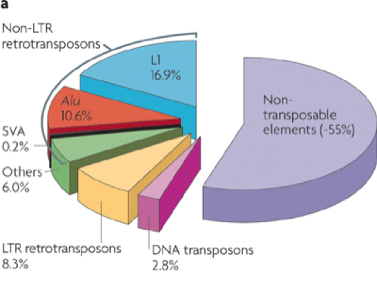
```
.small[Cordaux, R., Batzer, M. The impact of retrotransposons on human genome evolution. Nat Rev Genet 10, 691–703 (2009). https://doi.org/10.1038/nrg2640]
]

---
## Transposable Elements (TEs) in the Human Genome

\~45-50% of the human genome is derived from transposable elements

.pull-left[
- **LINE-1 (L1)**: \~17% of genome, \~6 kb long, autonomous retrotransposon. Only ~80-100 remain active in humans
    
- **Alu elements (SINEs)**: \~11% of genome, \~300 bp long. \>1 million copies, non-autonomous (uses L1 machinery). Most successful transposon in primates
]
.pull-right[
- **SVA elements**: \~0.15% of genome, 0.7-4 kb long. Hominid-specific, composite structure (SINE-VNTR-Alu)
    
- **HERVs (LTR retrotransposons)**: ~8% of genome. Human endogenous retroviruses, now inactive
]
    
.small[International Human Genome Sequencing Consortium. Initial sequencing and analysis of the human genome. Nature 409, 860–921 (2001). https://doi.org/10.1038/35057062]

---
## Repeats - Tandem Repetitive DNA

Repetitive DNA not driven by retrotransposition (e.g., ATATATATATATATAT...)

**CpG islands:**
- Clusters of CG dinucleotides (~20 sites/kbp in gene-rich regions)
- "p" = phosphodiester bond (distinguishes from Watson-Crick C-G pairing)
- ~60% of human promoters contain CpG islands

```{r, out.width = "400px", fig.align='center', echo=FALSE}
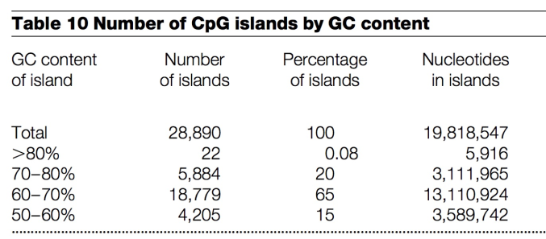
```

.small[International Human Genome Sequencing Consortium. Initial sequencing and analysis of the human genome. Nature 409, 860–921 (2001). https://doi.org/10.1038/35057062]

---
## Repeats - Tandem Repetitive DNA

**Microsatellites (STRs)**: 1-6 bp repeat units

- \~3% of genome (50,000-100,000 dinucleotide repeats)

- Example: (CA)n, (AT)n, (GATA)n

- Used in DNA profiling and paternity testing

--

**Minisatellites (VNTRs)**: 10-60 bp repeat units  

- \>1,000 loci in human genome

- Highly polymorphic between individuals

- Used in DNA fingerprinting
    
---
## Repeats - Tandem Repetitive DNA

**Satellite DNA**: 100s-1000s bp repeat units

- \~3% of genome, located at centromeres and telomeres

- Alpha-satellite repeats span 0.2-10 Mb at centromeres
    
**Telomeres**: TTAGGG repeats

- 5-15 kb of repeats protect chromosome ends

---
## Genome variability

A typical genome differs from the reference genome at 4.1 to 5.0 million sites - Single Nucleotide Polymorphisms (SNPs)

- Over 99.9% are SNPs or short indels
- Only 1-4% are rare (frequency <0.5% in the population)
- Contains 2,100 – 2,500 structural variants, which affect more bases (~20 million bases)
- ~1,000 large deletions
- ~1,094 Alu, L1, SINE (short interspersed nuclear element), VNTR (variable number tandem repeat) insertions
- ~160 CNVs
- ~10 inversions
- ~ 4 NUMTs (nuclear mitochondrial DNA variations)

---
## Genome variability

- 149-182 protein truncating variants

- ~2,000 variants associated with complex traits

- 24-30 variants associated with rare disease

- On average 74 _de novo_ SNVs per individual 

.small[the 1000 Genomes Project. Variation in genome-wide mutation rates within and between human families. Nat Genet 43, 712–714 (2011). https://doi.org/10.1038/ng.862]

