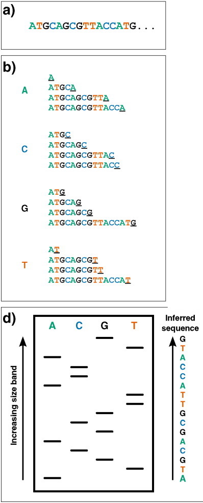
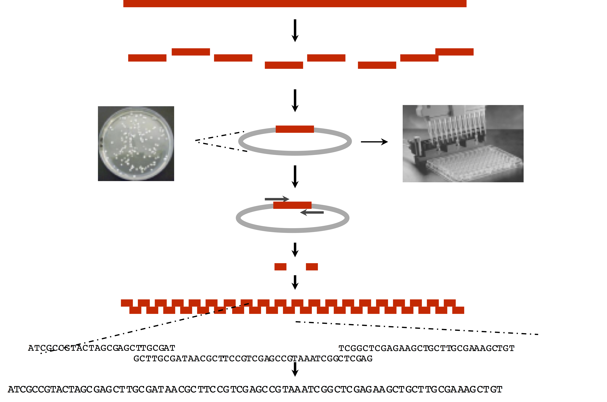
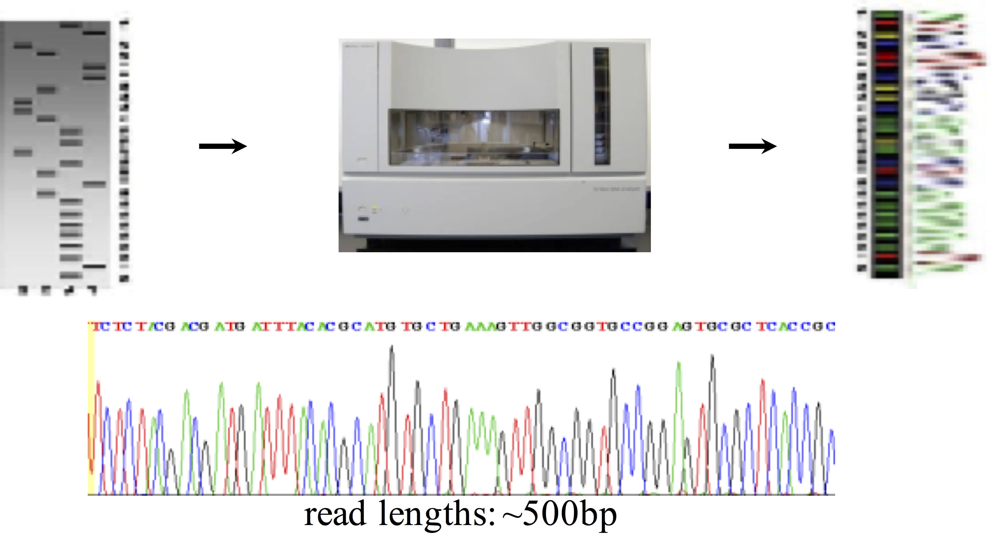
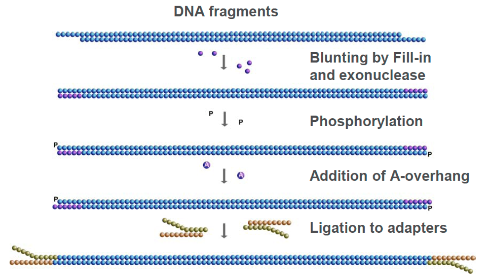

```{r xaringan-themer, include = FALSE}
library(xaringanthemer)
mono_light(
  base_color = "midnightblue",
  header_font_google = google_font("Josefin Sans"),
  text_font_google   = google_font("Montserrat", "500", "500i"),
  code_font_google   = google_font("Droid Mono"),
  link_color = "#8B1A1A", #firebrick4, "deepskyblue1"
  text_font_size = "28px"
)
library(dplyr)
library(ggplot2)
```


<!-- HTML style block -->
<style>
.large { font-size: 130%; }
.small { font-size: 70%; }
.tiny { font-size: 40%; }
</style>

## Why sequence a reference genome?

- Determine the "complete" sequence of a human haploid genome.

- Identify the sequence and location of every protein coding gene.

- Use as a "map" with which to track the location and frequency of genetic variation in the human genome.

- Unravel the genetic architecture of inherited and somatic human diseases.

- Understand genome and species evolution.

---
## DNA sequencing: Maxam-Gilbert, Sanger

.pull-left[
1) Sequencing by synthesis (not degradation)

2) Radioactive primers hybridize to DNA

3) Polymerase + dNTPs (normal dNTPs) + ddNTP (dideoxynucleotides terminators) at low concentration

4) 1 lane per base, visually interpret ladder 

.small[https://en.wikipedia.org/wiki/Maxam%E2%80%93Gilbert_sequencing]
.small[https://www.youtube.com/watch?v=bEFLBf5WEtc]
]

.pull-right[
```{r, out.width = "200px", fig.align='center', echo=FALSE}

```
]

<!--Sanger's 'chain-termination' sequencing. Radio- or fluorescently-labelled ddNTP nucleotides of a given type - which once incorporated, prevent further extension - are included in DNA polymerisation reactions at low concentrations (primed off a 5′ sequence, not shown). Therefore in each of the four reactions, sequence fragments are generated with 3′ truncations as a ddNTP is randomly incorporated at a particular instance of that base (underlined 3′ terminal characters).
Dideoxynucleotides (ddNTPs) lack the 3′ hydroxyl group that is required for extension of DNA chains, and therefore cannot form a bond with the 5′ phosphate of the next dNTP
-->

---
## Shotgun genome sequencing milestones

- **1977**: Bacteriophage $\Phi X 174$ (5.4 kb) - first DNA genome sequenced

- **1995**: _H. influenzae_ (1.8 Mb) - first free-living organism

- **1996**: _S. cerevisiae_ (yeast, 12 Mb) - first eukaryote

- **1998**: _C. elegans_ (worm, 97 Mb) - first multicellular animal

- **2000**: _Drosophila melanogaster_ (fruit fly, 165 Mb)

- **2000**: _Arabidopsis thaliana_ (mustard plant, 125 Mb) - first plant

- **2001**: _Homo sapiens_ (human, 3 Gb) - draft sequence

- **2004**: Human genome - "finished" sequence (92% complete)

- **2022**: Human genome - truly complete (T2T-CHM13, all gaps closed)

<!-- .small[https://en.wikipedia.org/wiki/Phi_X_174] -->
.small[Sergey Nurk et al. ,The complete sequence of a human genome. Science (2022) https://doi.org/10.1126/science.abj6987 ]

---
class: middle,center

# Sequencing on a scale

---
## Sequencing in a nutshell

- Cut the long DNA into smaller segments (several hundreds to several thousand bases).

- Sequence each segment: start from one end and sequence along the chain, base by base.

- The process stops after a while because the noise level is too high.

- Results from sequencing are many sequence pieces. The lengths vary, usually a few thousands from Sanger, and several hundreds from NGS.

- The sequence pieces are called "reads" for NGS data.

---
## Shotgun genome sequencing (Sanger, 1979)

.pull-left[
1) Fragment the genome

2) Clone 2-10kb fragments into plasmids (Bacterial artificial chromosome (BAC) clones); pick lots of colonies; purify DNA from each

3) Use a primer to plasmid to sequence into genomic DNA

4) Assemble the genome from overlapping "reads"
]
.pull-right[
```{r, out.width = "800px", fig.align='center', echo=FALSE}

```
]

---
## How to sequence a human genome: Lee Hood

.pull-left[
- Lee Hood and colleagues developed the first automated DNA sequencer (1986-1987)
- Replaced radioactive labels with four fluorescent dyes (one per base)
- Automated capillary electrophoresis replaced manual gel reading
- Computer-based base calling eliminated human interpretation ]
.pull-right[
```{r, out.width = "400px", fig.align='center', echo=FALSE}

```
- Increased throughput from ~700 bases/day to thousands of bases/day per machine
- Made the Human Genome Project feasible ]

.small[ Hood LE, Hunkapiller MW, Smith LM. Automated DNA sequencing and analysis of the human genome. Genomics. 1987 https://doi.org/10.1016/0888-7543(87)90046-2 ]
<!-- **Impact:** Without automation, sequencing the human genome would have taken >100 years with manual methods. Hood's invention reduced this to ~13 years for the first genome. -->


---
## Massively Parallel DNA sequencing instruments

- All MPS platforms require a library obtained either by amplification or ligation with custom linkers (adapters)

- Each library fragment is amplified on a solid surface (either bead or flat _Si_-derived surface) with covalently attached adapters that hybridize the library adapters

- Direct step-by-step detection of the nucleotide base incorporated by each amplified library fragment set

- Hundreds of thousands to hundreds of millions of reactions detected per instrument run = "massively parallel sequencing"

- A "digital" read type that enables direct quantitative comparisons

- Shorter read lengths than capillary sequencers

---
## Library Construction for MPS

.pull-left[
- Shear high molecular weight DNA with sonication

- Enzymatic treatments to blunt ends

- Ligate synthetic DNA adapters (each with a DNA barcode), PCR amplify 

- Quantitate library

- Proceed to WGS, or do exome or specific gene hybrid capture
]
.pull-right[
```{r, out.width = "400px", fig.align='center', echo=FALSE}

```
]

---
## PCR-related Problems in MPS

- PCR is an effective vehicle for amplifying DNA, however...

- In MPS library construction, PCR can introduce preferential amplification ("jackpotting") of certain fragments

- Duplicate reads with exact start/stop alignments

- Need to "de-duplicate" after alignment and keep only one pair

- Low input DNA amounts favor jackpotting due to lack of complexity in the fragment population

---
## PCR-related Problems in MPS

- PCR also introduces false positive artifacts due to substitution errors by the polymerase

- If substitution occurs in early PCR cycles, error appears as a true variant

- If substitution occurs in later cycles, error typically is drowned out by correctly copied fragments in the cluster

- Cluster formation is a type of PCR ("bridge amplification")

- Introduces bias in amplifying high and low G+C fragments

- Reduced coverage at these loci is a result

---
## Hybrid Capture

- Selectively enrich specific genomic regions from a whole genome library

- Biotinylated DNA/RNA probes hybridize to target sequences

- Streptavidin magnetic beads capture probe-bound fragments

- Wash away non-target DNA, elute enriched library for sequencing

---
## Hybrid Capture

- **Exome sequencing**: Probes target ~1-2% of genome containing all annotated exons
    - "Exome" = all exons of protein-coding genes in the reference genome
    - Captures ~98% of disease-causing mutations at fraction of WGS cost

--

- **Custom panels**: Probes designed for specific clinical targets
    - Cancer gene panels, cardiovascular panels, etc.
    - Enables deeper coverage of clinically relevant loci

--

**Advantages:** Reduces sequencing cost while increasing coverage depth in regions of interest

**Disadvantages:** Capture efficiency is typically 50-70%; not all target regions are captured equally
