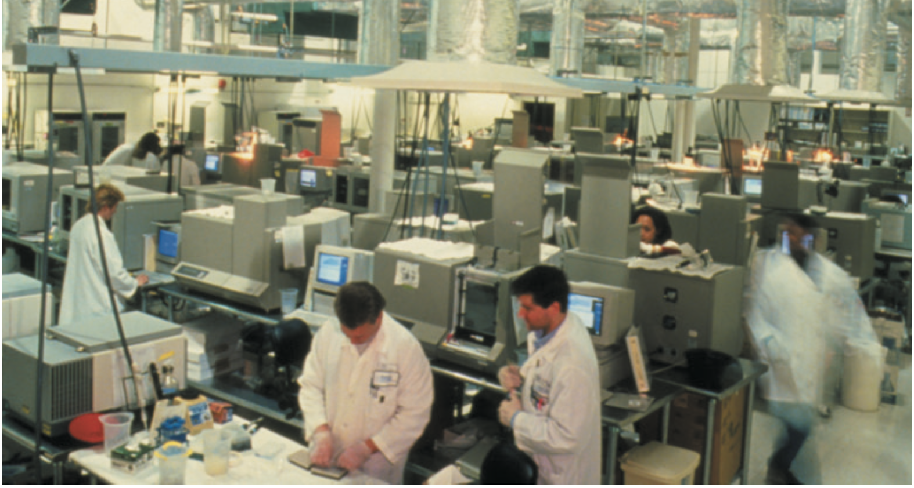
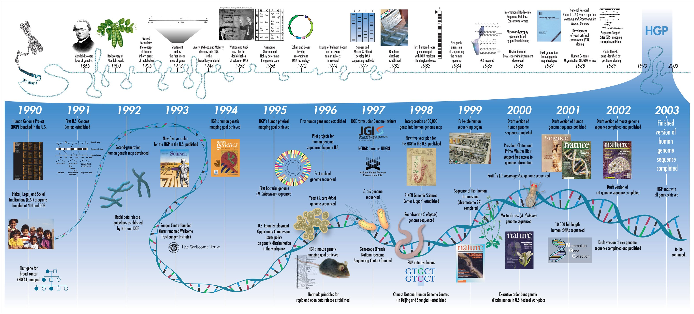
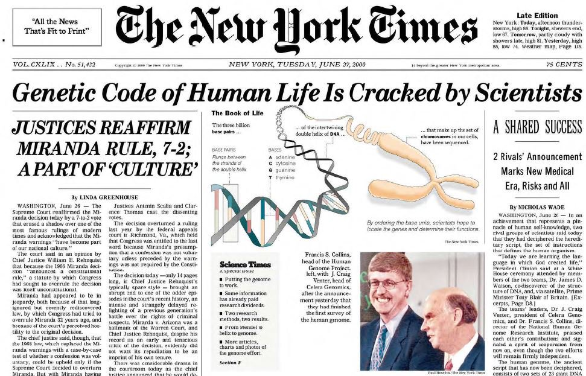
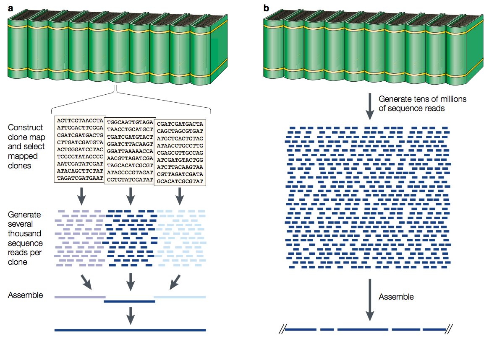
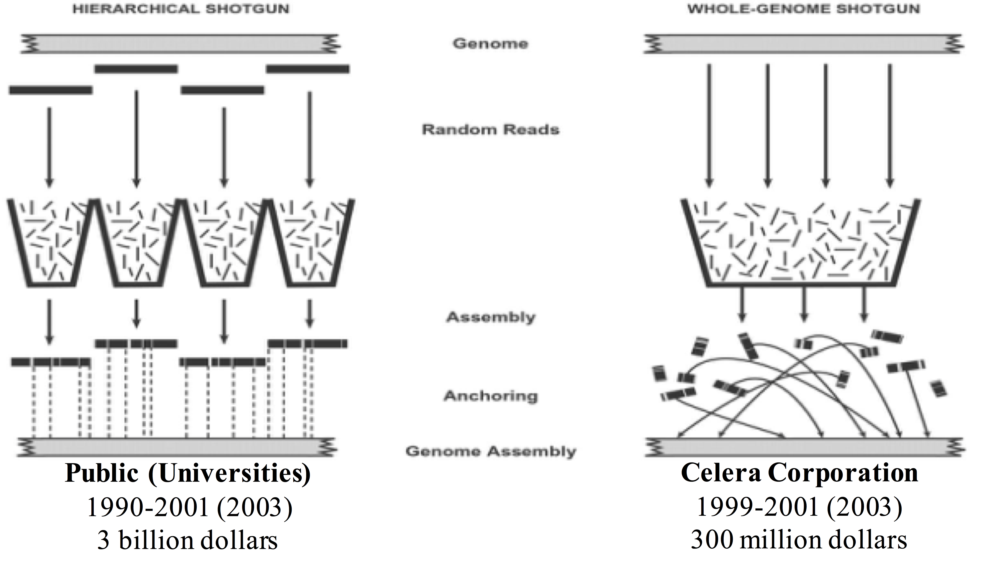
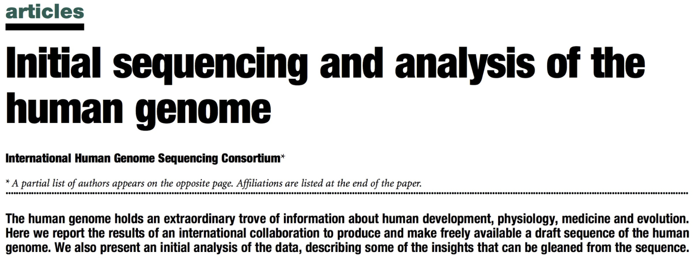

```{r xaringan-themer, include = FALSE}
library(xaringanthemer)
mono_light(
  base_color = "midnightblue",
  header_font_google = google_font("Josefin Sans"),
  text_font_google   = google_font("Montserrat", "500", "500i"),
  code_font_google   = google_font("Droid Mono"),
  link_color = "#8B1A1A", #firebrick4, "deepskyblue1"
  text_font_size = "28px"
)
library(dplyr)
library(ggplot2)
```


<!-- HTML style block -->
<style>
.large { font-size: 130%; }
.small { font-size: 70%; }
.tiny { font-size: 40%; }
</style>

## The Human Genome roadmap

**A 13-year scientific odyssey (1990-2003)**

- The Human Genome Project officially began in October 1990 with an ambitious 15-year timeline and a projected cost of $3 billion. 

- The project was a coordinated international effort led by the NIH and DOE, with James Watson as the first director (1990-1992), followed by Francis Collins (1993-2003).

```{r, out.width = "400px", fig.align='center', echo=FALSE}

```

---
## The Human Genome milestones

- **1990**: Project officially launches; ELSI (Ethical, Legal, and Social Implications) program established (3-5% of NHGRI's budget)

- **1994**: Genetic linkage map completed (one year ahead of schedule)

- **1998**: Revised timeline announced - completion moved up to 2003

- **2000**: Working draft sequence (June 26) - Clinton & Blair joint announcement

- **2001**: Draft sequence published in Nature (February 15)

- **2003**: Finished sequence completed (April 14) - 2 years ahead of schedule, coinciding with 50th anniversary of Watson & Crick's DNA structure

<!-- .small[ The project exceeded its goals, completing ahead of schedule and under budget, while establishing data sharing standards and addressing ethical implications. ] -->

---
## The Human Genome roadmap

```{r, out.width = "1100px", fig.align='center', echo=FALSE}

```

.small[ https://www.genome.gov/news/news-release/the-Human-Genome-Project-turns-the-big-3-0 ]

---
## Human genome is sequenced!

```{r, out.width = "800px", fig.align='center', echo=FALSE}

```

---
## Two shotgun-sequencing strategies

.pull-left[
**Clone-by-clone approach:**

- Create physical map of overlapping BAC clones spanning each chromosome

- Sequence individual BACs separately (~150 kb each)

- Assemble BAC sequences into chromosomes using map

- Slower but more systematic; easier assembly

]
.pull-right[
<!--
```{r, out.width = "400px", fig.align='center', echo=FALSE}

``` 
-->
```{r, out.width = "600px", fig.align='center', echo=FALSE}

```
.small[Green, E. Strategies for the systematic sequencing of complex genomes. Nat Rev Genet 2, 573–583 (2001). https://doi.org/10.1038/35084503]
]

---
## Two shotgun-sequencing strategies

.pull-left[
**Whole-genome shotgun approach:**

- Fragment entire genome randomly and sequence everything

- Use computational assembly to piece together from overlaps alone

- Faster and cheaper, but computationally challenging

- Championed by Celera Genomics (Craig Venter)

]
.pull-right[
<!--
```{r, out.width = "400px", fig.align='center', echo=FALSE}

``` 
-->
```{r, out.width = "500px", fig.align='center', echo=FALSE}

```
**Outcome:** Public project used clone-by-clone approach; Celera used whole-genome shotgun. Both published draft sequences in 2001. Modern sequencing uses whole-genome shotgun exclusively.
]

<!--a | Schematic overview of clone-by-clone shotgun sequencing. A representation of a genome is made by analogy to an encyclopaedia set, with each volume corresponding to an individual chromosome. The construction of clone-based physical maps produces overlapping series of clones (that is, contigs), each of which spans a large, contiguous region of the source genome. Each clone (for example, a bacterial artificial chromosome (BAC)) can be thought of as containing the DNA represented by one page of a volume. For shotgun sequencing, individual mapped clones are subcloned into smaller-insert libraries, from which sequence reads are randomly derived. In the case of BACs, this typically requires the generation of several thousand sequence reads per clone. The resulting sequence data set is then used to assemble the complete sequence of that clone (see Figs 3,4). b | Schematic overview of whole-genome shotgun sequencing. In this case, the mapping phase is skipped and shotgun sequencing proceeds using subclone libraries prepared from the entire genome. Typically, tens of millions of sequence reads are generated and these in turn are subjected to computer-based assembly to generate contiguous sequences of various sizes.-->

---
## A first map of the human genome

.pull-left[
**February 15, 2001: The draft sequence is published**

After intense competition and collaboration, both the public Human Genome Project and Celera Genomics published their draft sequences simultaneously:

- **Nature**: International Human Genome Sequencing Consortium 
- **Science**: Celera Genomics - Craig Venter's whole-genome shotgun approach
]
.pull-right[
```{r, out.width = "500px", fig.align='center', echo=FALSE}

```
.small[ The draft covered ~90% of the euchromatic genome with gaps remaining in repetitive and heterochromatic regions. This landmark publication revealed surprising findings: only ~20,000-25,000 protein-coding genes (far fewer than expected), and extensive repetitive elements comprising nearly half the genome.

International Human Genome Sequencing Consortium. Initial sequencing and analysis of the human genome. Nature 409, 860–921 (2001). https://doi.org/10.1038/35057062]
]

<!--
## Sanger sequencing: technological advances

- 1977: Fred Sanger
    - 1 hardworking technician = 700 bases per day = 118,000 years to sequence the human genome
- 1985: ABI 370 (first automated sequencer)
    - 5000 bases per day= 16,000 years
- 1995: ABI 377 (Bigger gels, better chemistry & optics, more sensitive dyes, faster computers)
    - 19,000 bases per day = 4,400 years
- 1999: ABI 3700 (96 capillaries, 96 well plates, fluid handling robots)
    - 400,000 bases per day = 205 years
-->
