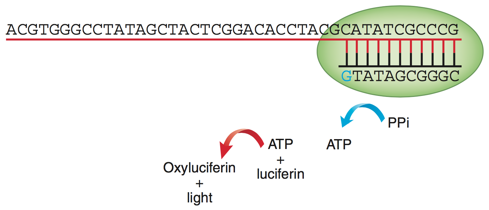
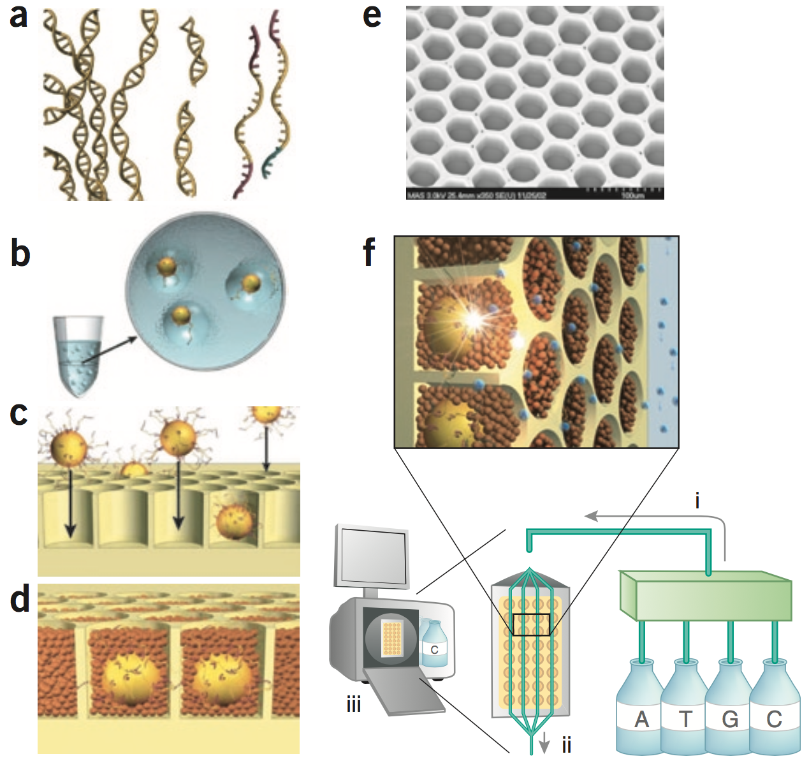
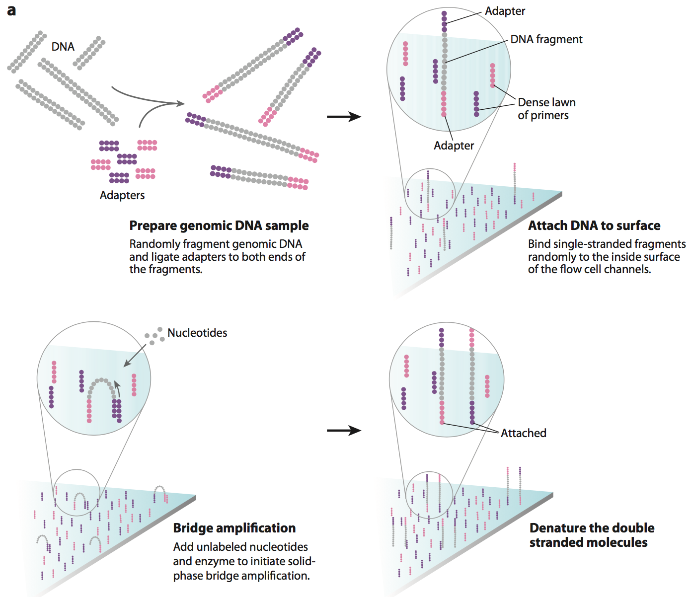
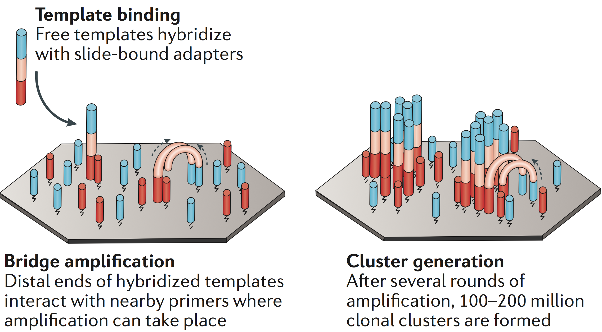
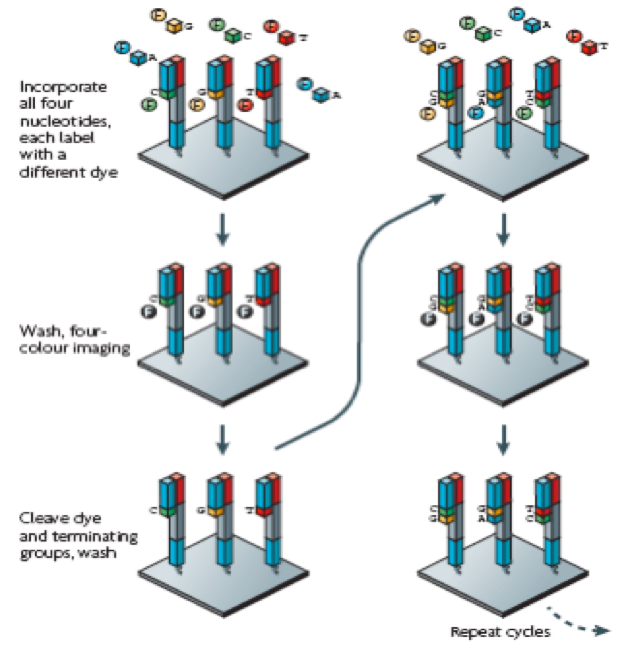
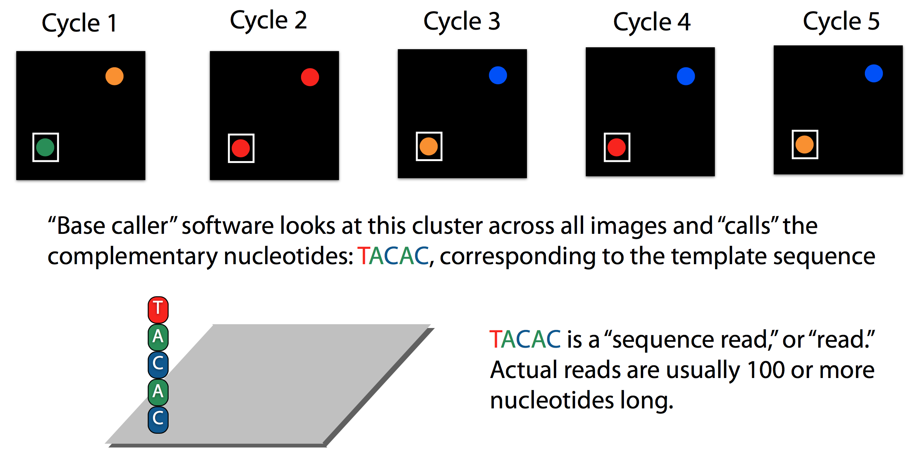
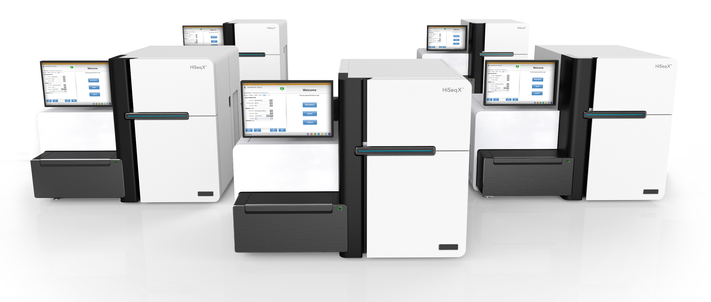
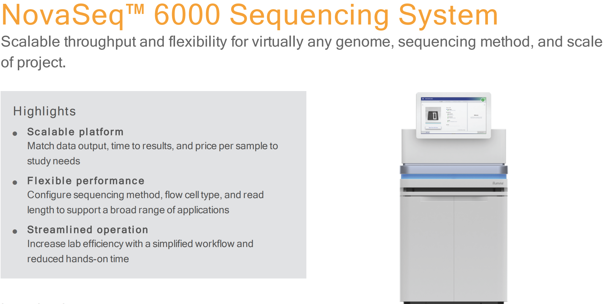
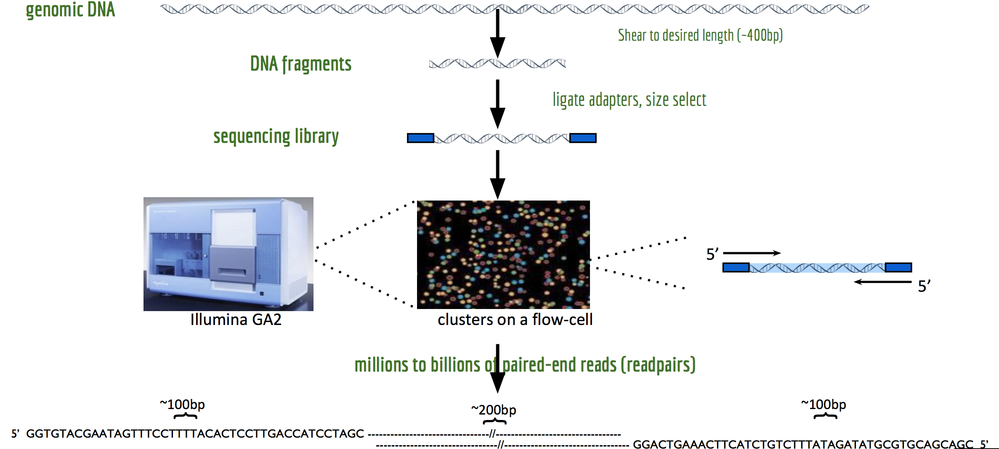
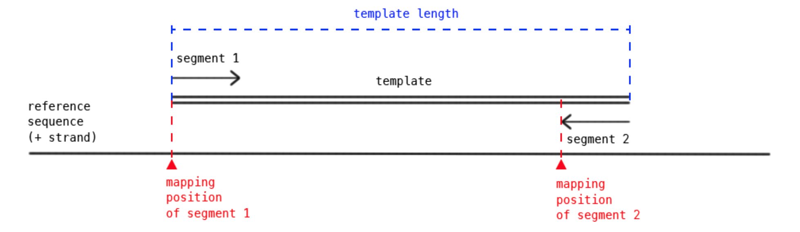

```{r xaringan-themer, include = FALSE}
library(xaringanthemer)
mono_light(
  base_color = "midnightblue",
  header_font_google = google_font("Josefin Sans"),
  text_font_google   = google_font("Montserrat", "500", "500i"),
  code_font_google   = google_font("Droid Mono"),
  link_color = "#8B1A1A", #firebrick4, "deepskyblue1"
  text_font_size = "28px"
)
library(dplyr)
library(ggplot2)
```


<!-- HTML style block -->
<style>
.large { font-size: 130%; }
.small { font-size: 70%; }
.tiny { font-size: 40%; }
</style>

## Sanger sequencing: technological advances

**The automation revolution that enabled the Human Genome Project:**

- **1977: Fred Sanger's method**
    - Manual gel reading: ~700 bases per technician per day
    - Time to sequence human genome: ~118,000 years
    
- **1986-1987: ABI 370 (first automated sequencer)**
    - Four-color fluorescent dyes replace radioactivity
    - Automated base calling: ~5,000 bases per day
    - Time to sequence human genome: ~16,000 years
    
---
## Sanger sequencing: technological advances

- **1995: ABI 377 (scaled-up automation)**
    - Bigger gels, improved chemistry & optics, faster computers
    - Throughput: ~19,000 bases per day
    - Time to sequence human genome: ~4,400 years
    
- **1999: ABI 3700 (capillary electrophoresis)**
    - 96 capillaries, robotic liquid handling, no manual gel pouring
    - Throughput: ~400,000 bases per day per machine
    - Time to sequence human genome: ~205 years **per machine**

**Reality check:** The HGP used hundreds of ABI 3700 sequencers running 24/7, enabling completion in 13 years (1990-2003). Each machine cost ~$300,000; sequencing cost ~$0.50-$1.00 per base in the late 1990s.

---
## Terminology for post-Sanger sequencing technologies

- **"Next generation" sequencing (NGS)**: Most common term
    - Originally referred to technologies after Sanger (454, Illumina, SOLiD)
    - Now generally includes all modern platforms

--

- **"Second generation" sequencing**: 
    - Short-read technologies (Illumina, Ion Torrent, 454, SOLiD)
    - Distinguished from "third generation" long-read technologies (PacBio, Nanopore)

--

- **"Massively parallel" sequencing (MPS)**:
    - Emphasizes simultaneous sequencing of millions of DNA fragments
    - Technical descriptor of the core innovation
    
---
## Terminology for post-Sanger sequencing technologies

- **"High-throughput" sequencing (HTS)**:
    - Emphasizes data output capacity
    - Generates gigabases to terabases per run
    
- **"Ultra high-throughput" sequencing**:
    - Reserved for latest platforms with highest output (e.g., NovaSeq, NextSeq)

**Note:** These terms are often used interchangeably in the literature. The field has moved beyond "next generation" - we're now in the era of "third generation" (long-read) and emerging "fourth generation" (real-time, nanopore) technologies.

---
## Evolution of sequencing technologies

- **2005**: 454 (Roche) - first NGS platform, pyrosequencing
- **2006**: Solexa (Illumina) - later became Illumina Genome Analyzer
- **2007**: SOLiD (Applied Biosystems/Life Technologies) - sequencing by ligation
- **2010**: Complete Genomics - nanoball sequencing
- **2010**: Ion Torrent (Life Technologies) - semiconductor sequencing
- **2011**: Pacific Biosciences (PacBio) - SMRT, single-molecule real-time
- **2012**: Oxford Nanopore Technologies (MinION) - nanopore sequencing
- **2014**: Illumina HiSeq X Ten - first sub-$1,000 genome
- **2017**: Illumina NovaSeq - ultra-high throughput platform

**Note**: 454 was discontinued in 2016; SOLiD discontinued in 2016. Illumina dominates the market today with >80% share.

---
## 454 pyrosequencing

.pull-left[
**Sequencing by synthesis - light detection:**

1) Hybridize sequencing primer to template DNA

2) Add enzyme cocktail: DNA polymerase, ATP sulfurylase, luciferase, apyrase, plus substrates (APS and luciferin)

3) Nucleotide incorporation triggers enzymatic cascade producing light
]
.pull-right[

```{r, out.width = "500px", fig.align='center', echo=FALSE}

```
4) Sequential base addition: add dATP → image → wash → add dTTP → image → wash → add dGTP → image → wash → add dCTP → image → wash. Repeat ~500 cycles
]

.small[Rothberg, J., Leamon, J. The development and impact of 454 sequencing. Nat Biotechnol 26, 1117–1124 (2008). https://doi.org/10.1038/nbt1485]

---
## 454 pyrosequencing

.pull-left[
**Library preparation and sequencing workflow:**

1) Fragment genomic DNA

2) Ligate adapters, bind fragments to beads (1 fragment per bead)

3) Emulsion PCR amplification to create clonal bead populations

4) Break emulsion, deposit beads into picotiter plate wells

5) Perform pyrosequencing reaction, capture light signals
]
.pull-right[

```{r, out.width = "500px", fig.align='center', echo=FALSE}

```
]

---
## 454 sequencing: summary

**Advantages:**
- First commercially successful post-Sanger platform (2005)
- Longer reads than early Illumina (~400-500 bp, later up to 700 bp)
- Used to sequence Jim Watson's genome ($2M, 2007) and many microbial genomes

--

**Disadvantages:**
- Homopolymer errors (difficulty distinguishing AAAA vs. AAAAA)
- Much lower throughput than Illumina (~1 million reads vs. billions)
- Higher per-base cost

**Legacy:** Rapidly surpassed by Illumina technology. Roche discontinued 454 platform in 2016. Now obsolete.

---
## Solexa (Illumina) sequencing (2006)

**1. Bridge amplification:**
- DNA fragments bind to oligonucleotides on glass flow cell surface
- "Bridge PCR" creates millions of clonal clusters (~1,000 copies each)

--

**2. Reversible terminator chemistry:**
- All four fluorescent-labeled nucleotides added simultaneously
- 3' blocking group prevents multiple incorporations per cycle
- After imaging, cleave fluorophore and blocker, then repeat

--

**3. Massively parallel sequencing:**
- Billions of clusters sequenced simultaneously
- High accuracy, scalable throughput

.small[http://www.youtube.com/watch?v=77r5p8IBwJk (1.5m), https://www.youtube.com/watch?v=fCd6B5HRaZ8 (5m)]

---
## Solexa (Illumina) sequencing (2006)

```{r, out.width = "500px", fig.align='center', echo=FALSE}

```
Dominant NGS platform (>80% market share), enabled $1,000 genome.

.small[
Elaine R. Mardis "Next-Generation DNA Sequencing Methods" Annual Review of Genomics and Human Genetics (2008) https://doi.org/10.1146/annurev.genom.9.081307.164359
]

---
##  Cluster amplification by "bridge" PCR

.pull-left[
**Generating clonal DNA clusters on the flow cell:**

- Single-stranded DNA fragments with adapters bind to complementary oligonucleotides on flow cell surface
- Fragment arches over ("bridge") and hybridizes to adjacent oligo
- DNA polymerase extends, creating double-stranded bridge
- Denaturation releases strands; process repeats
]
.pull-right[
```{r, out.width = "500px", fig.align='center', echo=FALSE}

```
- After ~35 cycles, creates cluster of ~1,000 identical copies
- Ensures sufficient signal for detection during sequencing
]

---
## Clonal amplification

.pull-left[
- Each DNA fragment generates a spatially distinct cluster

- ~1,000 identical copies per cluster provide sufficient fluorescent signal

<!-- - Millions of clusters across the flow cell enable massively parallel sequencing -->
- Cluster density: ~200,000-300,000 sequences per mm²

- Optimal spacing prevents signal overlap between adjacent clusters
]
.pull-right[
```{r, out.width = "450px", fig.align='center', echo=FALSE}

```
]

---
## Base calling

- 6 cycles with base-calling

```{r, out.width = "800px", fig.align='center', echo=FALSE}

```
.small[https://www.youtube.com/watch?v=IzXQVwWYFv4]  
.small[https://www.youtube.com/watch?time_continue=65&v=tuD-ST5B3QA]

---
## Illumina sequencers

.pull-left[
- **NovaSeq 6000**: Up to 3 Tb per run (S4 flow cell), ~200 human genomes at 30X

- **NovaSeq X Plus** (launched 2023): Up to 16 Tb per run (dual 25B flow cells), 2.5× faster than NovaSeq 6000
    - **$200 per genome** at scale (25B flow cell)
    - Up to 128 human genomes per run at 30X coverage
    - DRAGEN onboard for real-time analysis
]
.pull-right[
```{r, out.width = "400px", fig.align='center', echo=FALSE}

```

- **NovaSeq X** (single flow cell, launched 2024): Up to 8 Tb per run, lower entry cost

- **NextSeq 1000/2000**: Mid-throughput, 100-360 Gb per run

.small[https://www.illumina.com/systems/sequencing-platforms.html]
]

<!-- - **Illumina HiSeq**: ~3 billion paired 100bp reads, ~600Gb, $10K, 8 days (or "rapid run" ~90Gb in 1-2 days) -->
<!-- - **Illumina X Ten**: ~6 billion paired 150bp reads, 1.8Tb, <3 days, ~$1000 / genome, (or "rapid run" ~90Gb in 1-2 days) -->
<!-- - **Illumina NextSeq**: One human genome in <30 hours -->

<!--
## Illumina sequencers

```{r, out.width = "400px", fig.align='center', echo=FALSE}

```

- Massive improvement of the cluster density - higher output
- Less expensive than the previous sequencers
- Faster runs

.small[https://blog.genohub.com/2017/01/10/illumina-unveils-novaseq-5000-and-6000/]

.small[http://www.mrdnalab.com/illumina-novaseq.html]-->

---
## Illumina sequencing: Advantages

- Dominant platform with >80% global market share

- Highest throughput: up to 16 Tb per NovaSeq X Plus run

- Best cost-effectiveness: **$200 per human genome** at 30X coverage

- High accuracy: >99.9% (Q30+) with latest XLEAP-SBS chemistry

- Mature ecosystem: extensive bioinformatics tools and protocols

- Read lengths now up to 2×300 bp (NovaSeq X, MiSeq)


---
## Illumina sequencing: Disadvantages

- Short reads limit structural variant detection and de novo assembly

- GC bias in high/low GC-content regions

- PCR duplicates reduce effective coverage

- Cannot directly detect base modifications (methylation)

- Index hopping can occur on patterned flow cells

**Competition:** PacBio HiFi and Oxford Nanopore now offer long reads (10-100+ kb) with improving accuracy, challenging Illumina's dominance for certain applications.

---
class: middle,center

# Single-end vs. paired-end sequencing

---
## Single-end vs. paired-end sequencing

.pull-left[
**Single-end sequencing:**

- Sequence one end of the DNA fragment only

- Generate one read per template molecule

- Faster and less expensive

- Sufficient for gene expression quantification (RNA-seq)
]
.pull-right[
**Paired-end sequencing:**

- Sequence both ends of the same DNA fragment

- Generate two reads per template separated by known distance (insert size)

- Higher accuracy, better alignment in complex/repetitive regions

- Can detect insertions, deletions, inversions, and structural variants
]

<!--**Mate-pair sequencing** (specialized paired-end):
- Long insert sizes: 2-5 kb (or longer)
- Reads are in **RF orientation** (Reverse-Forward, outward-facing)
- Requires circularization during library prep
- Used for de novo assembly and large structural variant detection
- Note: Illumina discontinued Nextera Mate Pair kit -->

---
## Paired-end sequencing - a workaround to sequence longer fragments

.pull-left[
- Fragment DNA to desired size

- Ligate sequencing adapters to both ends

- Sequence first end (Read 1, forward direction)

- Regenerate template, sequence second end (Read 2, reverse direction)

- Two reads per fragment separated by known insert size
]
.pull-right[
```{r, out.width = "500px", fig.align='center', echo=FALSE}

```

**Typical configurations:**
- Insert size: 300-500 bp (standard), up to 800 bp (extended)
- Length of sequencing pairs: 2×75 bp, 2×100 bp, 2×150 bp
]

---
## Templates and segments

```{r, out.width = "600px", fig.align='center', echo=FALSE}

```

- **Template**: The original DNA/RNA molecule subjected to sequencing
    - Also called "insert" or "fragment"
    
- **Insert size**: The length of the template molecule
    - Includes sequenced segments plus unsequenced middle portion
    - Typical ranges: 300-500 bp (paired-end), 2-5 kb (mate-pair)
    
---
## Templates and segments

```{r, out.width = "600px", fig.align='center', echo=FALSE}

```

- **Segment** (or "Read"): The portion of the template that was sequenced
    - Represented by sequencing reads in FASTQ files
    - Read 1 (R1): Forward read from 5' end
    - Read 2 (R2): Reverse read from 3' end
    - Read length: 50, 75, 100, 150, 250, 300 bp

**Important:** Insert size ≠ total read length. For 2×150 bp reads with 400 bp insert, the middle ~100 bp is not sequenced.

---
## Advantages of paired-end sequencing

**1. Improved mapping accuracy:**
- Two anchor points per fragment reduce ambiguous alignments

- Particularly valuable in repetitive or low-complexity regions

- Correct orientation (FR) and insert size validate proper alignment

**2. Structural variant detection:**
- **Deletions**: Insert size larger than expected
- **Insertions**: Insert size smaller than expected
- **Inversions**: Incorrect read orientation (FF or RR instead of FR)
- **Translocations**: Read pairs map to different chromosomes
- **Copy number variations**: Abnormal read pair density

---
## Advantages of paired-end sequencing

**3. De novo assembly:**
- Link contigs separated by sequencing gaps

- Scaffold assembly based on paired-read distance information

- Resolve ambiguities in assembly graphs

**4. Phasing and haplotyping:**
- Read pairs from same chromosome reveal allelic linkage

- Important for resolving heterozygous variants
