```{r xaringan-themer, include = FALSE}
library(xaringanthemer)
mono_light(
  base_color = "midnightblue",
  header_font_google = google_font("Josefin Sans"),
  text_font_google   = google_font("Montserrat", "500", "500i"),
  code_font_google   = google_font("Droid Mono"),
  link_color = "#8B1A1A", #firebrick4, "deepskyblue1"
  text_font_size = "28px"
)
library(dplyr)
library(ggplot2)
```


<!-- HTML style block -->
<style>
.large { font-size: 130%; }
.small { font-size: 70%; }
.tiny { font-size: 40%; }
</style>

## ION Torrent-pH Sensing of Base Incorporation

```{r, out.width = "600px", fig.align='center', echo=FALSE}
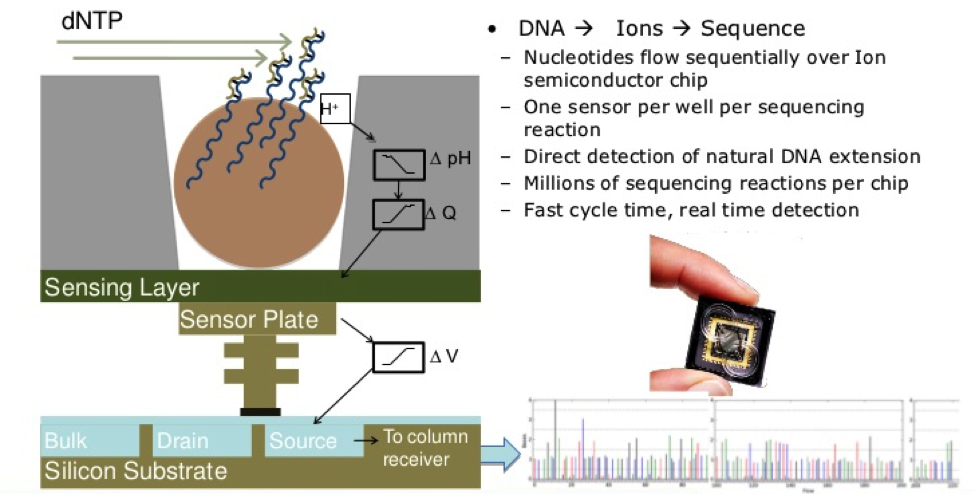
```

- Low substitution error rate, in/dels problematic, no paired end reads

- Inexpensive and fast turn-around for data production

- Improved computational workflows for analysis

---
## Semiconductor sequencing - detecting chemistry without optics (2010)

Ion Torrent introduced a fundamentally different approach: directly detecting the hydrogen ions (H⁺) released during DNA synthesis, eliminating the need for expensive cameras and fluorescent labels.

.pull-left[
- DNA polymerase incorporates natural (unlabeled) nucleotides
- Each incorporation releases a hydrogen ion (H⁺)
- Ion-sensitive field-effect transistor (ISFET) detects pH change
- Sequential base addition (dATP → wash → dTTP → wash → dGTP → wash → dCTP → wash)
]
.pull-right[
```{r, out.width = "500px", fig.align='center', echo=FALSE}

```
Signal intensity indicates number of bases incorporated (homopolymer length)
]

---
## Platforms: Ion Torrent (2024-2025)

.pull-left[
- **Ion Genexus System** (2019-present): Fully automated specimen-to-report workflow
    - Genexus Integrated Sequencer + Genexus Purification System
    - Complete automation: 5 min hands-on time, results in 1 day
    - GX5 chip: 4 lanes, up to 32 samples multiplexed
    - 50 Mb - 2 Gb per run, 200-600 bp reads
]
.pull-right[
```{r, out.width = "500px", fig.align='center', echo=FALSE}
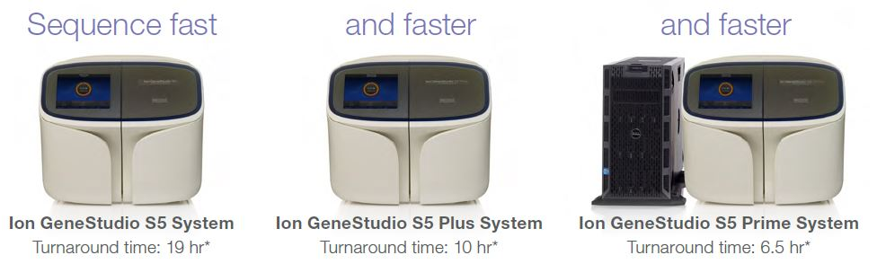
```
- **Ion GeneStudio S5 Series**: Scalable benchtop system for research
    - S5 Plus: up to 15 Gb per run (550 chip)
    - S5 Prime: up to 50 Gb per run (550 chip)
    - Requires Ion Chef for automation
]

---
## ION Torrent-pH Sensing of Base Incorporation

**Advantages:**
- Fast turnaround: runs complete in 2-4 hours
- Low cost per run (~$100-1,000 depending on chip)
- Simple, compact instrumentation (no optical components)
- Low substitution error rate (<1%)

**Disadvantages:**
- Homopolymer indel errors problematic (difficulty distinguishing AAAA vs. AAAAA)
<!-- - No native paired-end reads (requires mate-pair library construction) -->
- Lower throughput than Illumina (400 Mb - 15 Gb per run)
- Read length limited to ~200-400 bp

**Current status:** Still used in targeted sequencing panels and microbial sequencing, but largely displaced by Illumina for most applications.

---
##  Pacific Biosciences - Single Molecule, Real-Time (SMRT) Sequencing

.pull-left[
- DNA polymerase attached to bottom of zero-mode waveguide (ZMW) well

- Single DNA molecule (SMRTbell template) loaded per ZMW

- Four fluorescently-labeled nucleotides diffuse into well

- Polymerase incorporates bases, light flashes detected in real-time
]
.pull-right[
```{r, out.width = "400px", fig.align='center', echo=FALSE}
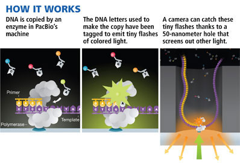
```
- Circular consensus sequencing (CCS): polymerase reads same molecule multiple times

- Multiple passes correct random errors → HiFi reads (>99.9% accuracy, Q30+)
]

---
##  Pacific Biosciences: Applications

- De novo genome assembly

- Structural variant discovery

- Full-length transcript sequencing (Iso-Seq)

- Direct methylation detection (5mC, 6mA)

---
## Pacific Biosciences: Advantages

- **HiFi reads**: >99.9% accuracy (Q30+) with 15-25 kb average read length

- **High throughput**: Up to 360 Gb per SMRT Cell (4 cells/run = 1.44 Tb/day)

- **Affordable**: ~$500-1,000 per human genome at 20-30X coverage

- **Direct methylation detection**: 5mC and 6mA without bisulfite treatment

- **No GC bias**: Uniform coverage across genome

- **No amplification**: Libraries preserve native DNA modifications

- **Long reads** resolve complex regions: repeats, centromeres, structural variants

---
## Pacific Biosciences: Disadvantages

- **High DNA input required**: 3-5 μg high molecular weight (HMW) DNA for WGS

- **DNA quality critical**: Nicks or contaminants terminate reads prematurely

- **Higher cost per base** than Illumina (~$7-10/Gb vs. ~$1-2/Gb)

- **Lower throughput** than NovaSeq X (1.44 Tb/day vs. 16 Tb/day)

- **Longer run times**: 12-30 hours per run

---
## Nanopore sequencing - Real-time, single-molecule sequencing

.pull-left[
- DNA/RNA molecule passes through protein nanopore embedded in membrane

- Applied voltage drives nucleic acid through pore

- Each base disrupts ionic current in characteristic way

- Current signal measured in real-time (450 bases/second)
]
.pull-right[
```{r, out.width = "400px", fig.align='center', echo=FALSE}
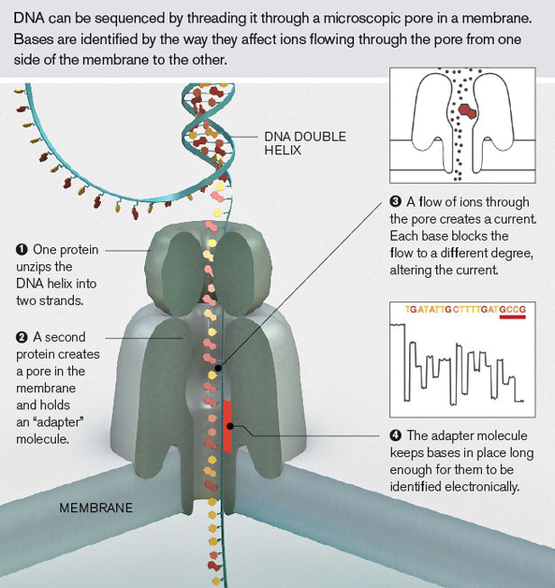
```
]

<!--**Evolution of accuracy:**
- **R9.4 chemistry** (2016-2021): ~95% accuracy
- **R10.4.1 chemistry** (2022-present): **>99% single-read accuracy (Q20+)**
- **Duplex reads**: >99.9% accuracy (Q30+) by sequencing both DNA strands
- **Super accuracy reads (SAR)**: Q28 with latest Kit 14 and E8.2.1+ motor-->

---
## Nanopore technology - Signal processing

**From ionic current to DNA sequence:**

- Nanopore sequencing yields raw signals reflecting modulation of ionic current as DNA passes through the pore
- Time-series of translocation 'events' are base-called by neural network algorithms

```{r, out.width = "400px", fig.align='center', echo=FALSE}
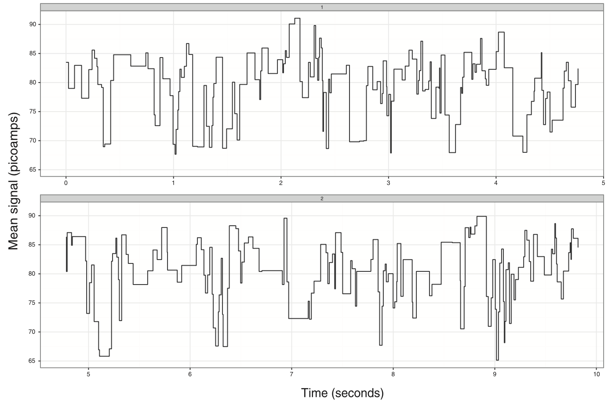
```

<!-- **Basecalling evolution:**
    - Early: Nanonet, Albacore (hidden Markov models)
    - Current: **Dorado** (transformer neural networks, integrated into MinKNOW)
    - Models: HAC (high accuracy), SUP (super accuracy)


**Data format:** FAST5 files (HDF5 format) contain raw signal data and metadata

.small[https://academic.oup.com/bioinformatics/article-lookup/doi/10.1093/bioinformatics/btu555] -->

---
## Nanopore sequencing - Current platforms

**Key advantages:** Portability, real-time sequencing, ultra-long reads (>4 Mb), direct modification detection

**Portable devices:**

- **MinION Mk1D** (launched Q4 2024): Pocket-sized, ~50 Gb per flow cell
    - First major update since 2015, robust Q20+ accuracy in field

- **Flongle**: Adapter for MinION, lower-cost option for small experiments

```{r, out.width = "300px", fig.align='center', echo=FALSE}
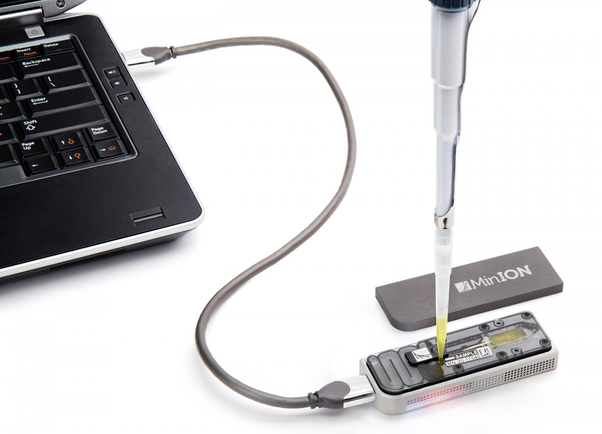
```

.small[https://www.technologyreview.com/s/600887/with-patent-suit-illumina-looks-to-tame-emerging-british-rival-oxford-nanopore/]

---
## Nanopore sequencing - Current platforms (2024-2025)

**Benchtop high-throughput:**

- **GridION Mk1**: Runs up to 5 MinION flow cells simultaneously

- **PromethION 2 (P2)**: Compact, benchtop sequencer (launched 2023-2024)
    - **P2 Solo** (P2S): Two flow cells, uses external compute, **$10,455 starter pack**
    - **P2 Integrated** (P2i): Two flow cells with integrated GPU and screen
    - Output: **100-290 Gb per flow cell** (580 Gb total with both flow cells)
    - \>1,350 P2 devices now deployed globally

<!-- **Legacy high-throughput:**
- **PromethION 24/48**: Up to 24 or 48 flow cells (being superseded by P2)-->

---
## Nanopore sequencing - Portability and field applications

- **Space sequencing**: First DNA sequencing in microgravity (ISS, 2016)
- **Outbreak surveillance**: Real-time pathogen identification (Zika, Ebola, COVID-19)
- **Remote fieldwork**: Biodiversity surveys, environmental monitoring
- **Point-of-care diagnostics**: Rapid infectious disease detection (<6 hours)
- **Antarctica research**: Microbiome studies in extreme environments

```{r, out.width = "300px", fig.align='center', echo=FALSE}
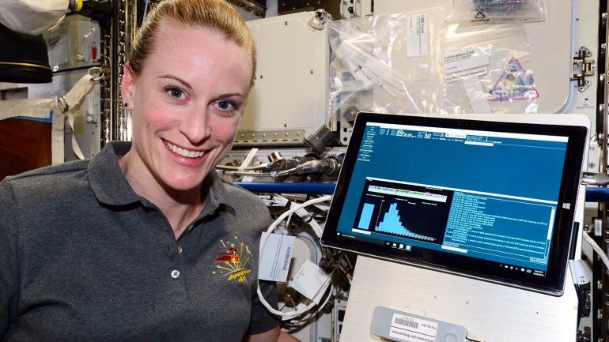
```

.small[https://phys.org/news/2016-08-nasa-dna-sequencing-space-success.html]

---
## Nanopore for human genome sequencing

- **2018**: First nanopore-only human genome assembly with ultra-long reads (>100 kb)
    - Closed 12 gaps in GRCh38 reference
    - Phased entire MHC region (most gene-dense, variable region)

- **2022**: Telomere-to-telomere (T2T) human genome completion
    - Nanopore ultra-long reads essential for closing remaining gaps
    - Resolved centromeres, segmental duplications, ribosomal DNA arrays

.small[Jain, M., Koren, S., Miga, K. et al. Nanopore sequencing and assembly of a human genome with ultra-long reads. Nat Biotechnol 36, 338–345 (2018). https://doi.org/10.1038/nbt.4060]

<!--
```{r, out.width = "400px", fig.align='center', echo=FALSE}
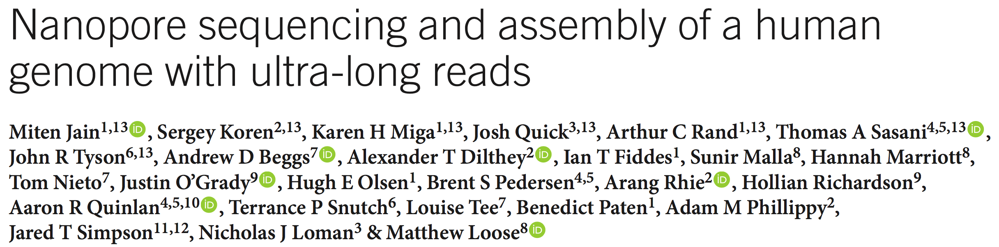
```
-->

---
## Nanopore for human genome sequencing

- **2024**: Routine human WGS at Q20+ accuracy
    - 30-40X coverage for SNV/indel detection comparable to Illumina
    - Cost: ~$500-1,000 per genome (P2 platform)
    - Detects structural variants and methylation simultaneously

**Current capability:** Single PromethION flow cell can sequence 1-2 human genomes at 30X coverage with >99% accuracy

.small[https://www.genengnews.com/gen-exclusives/first-nanopore-sequencing-of-human-genome/77901044]

<!---
## Nanopore base callers - Accuracy improvements

**Evolution of basecalling accuracy through machine learning:**

```{r, out.width = "400px", fig.align='center', echo=FALSE}
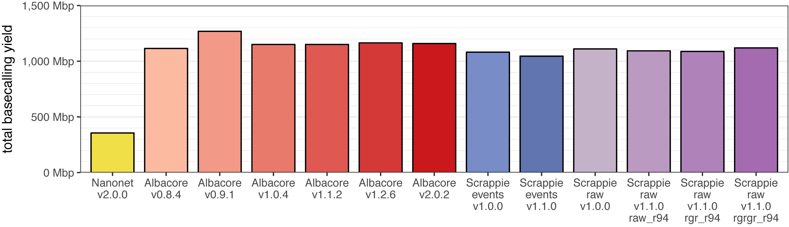
```

**Current basecalling models (2024-2025):**
- **Dorado v5.2**: Latest transformer-based basecaller
    - HAC (High Accuracy): >99% modal accuracy, real-time on GPU
    - SUP (Super Accuracy): >99.5% modal accuracy, ~2× slower
    - Duplex: >99.9% accuracy by reading both DNA strands

**Key innovations:**
- Real-time HAC basecalling during 72-hour runs (NVIDIA A100 GPU)
- Direct modification calling (5mC, 6mA) integrated into basecalling
- Continuous improvements through software updates (no hardware changes needed)

-->

---
## Nanopore analysis tools

**Data formats:**

- **FAST5**: Raw signal data (HDF5 format) with metadata

- **BAM/FASTQ**: Basecalled sequences with quality scores

- **POD5**: New compressed format for raw signal data (replacing FAST5)

.small[https://github.com/rrwick/Basecalling-comparison]

---
## Nanopore analysis tools

- **poretools** - Early toolkit for analyzing nanopore sequence data from FAST5 files

- **MinKNOW** - Operating software for running sequencers, now includes Dorado basecalling

- **EPI2ME** - Cloud-based or local analysis platform with push-button workflows
    - Human variation, metagenomics, single-cell analysis

- **Dorado** - State-of-the-art basecaller (transformer neural networks)

- **VolTRAX** - Automated library preparation device

<!--```{r, out.width = "400px", fig.align='center', echo=FALSE}
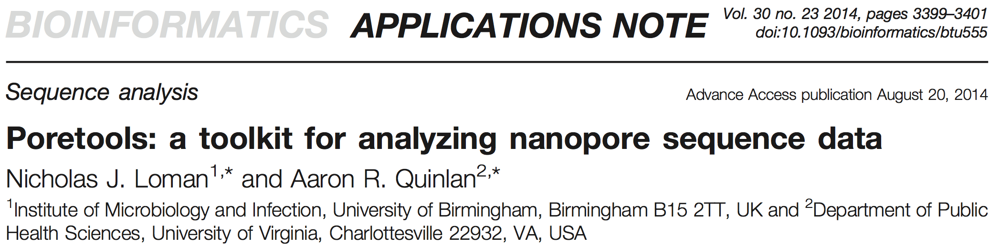
```-->

.small[https://github.com/arq5x/poretools]

.small[https://academic.oup.com/bioinformatics/article-lookup/doi/10.1093/bioinformatics/btu555]

---
## PacBio vs. Oxford Nanopore sequencing

```{r, out.width = "400px", fig.align='center', echo=FALSE, eval=FALSE}
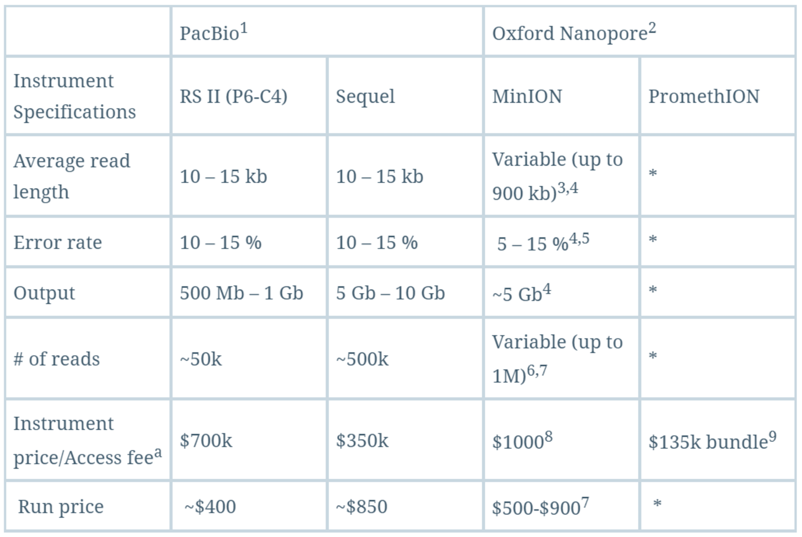
```

| Feature | PacBio (Revio) | Oxford Nanopore (P2) |
|---------|----------------|----------------------|
| **Accuracy** | >99.9% (HiFi, Q30+) | >99% (Q20+), >99.9% (duplex, Q30+) |
| **Read length** | 15-25 kb (HiFi) | 20 bp to >4 Mb (ultra-long) |
| **Throughput** | 360 Gb/cell, 1.44 Tb/run | 100-290 Gb/cell, 580 Gb/run |
| **Cost/genome** | ~$500-1,000 (30X) | ~$500-1,000 (30X) |
| **Run time** | 12-30 hours | 24-72 hours (flexible) |
| **Real-time** | No | Yes |
| **Portability** | No (benchtop only) | Yes (MinION pocket-sized) |
| **Methylation** | Yes (5mC, 6mA) | Yes (5mC, 6mA, 5hmC) |
| **DNA input** | 3-5 μg HMW DNA | 1-5 μg (50 ng for RNA) |

<!--
**Use cases:**
- **PacBio**: High-accuracy applications, clinical diagnostics, difficult samples
- **Nanopore**: Ultra-long reads, real-time applications, field sequencing, lower entry cost
-->

.small[https://blog.genohub.com/2017/06/16/pacbio-vs-oxford-nanopore-sequencing/]
