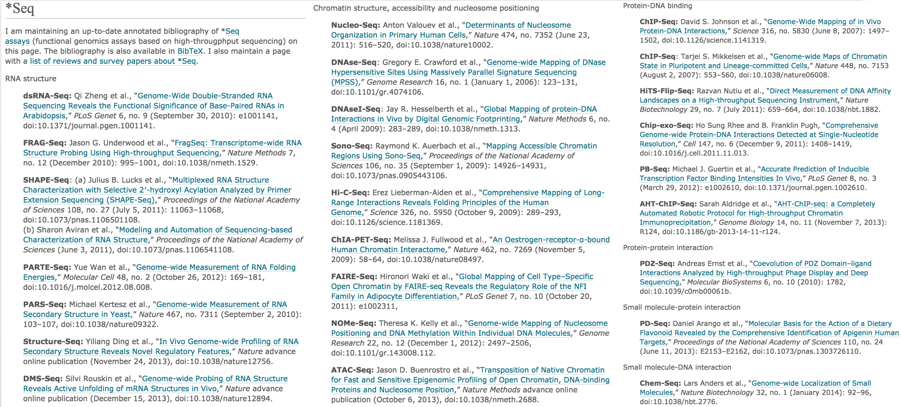
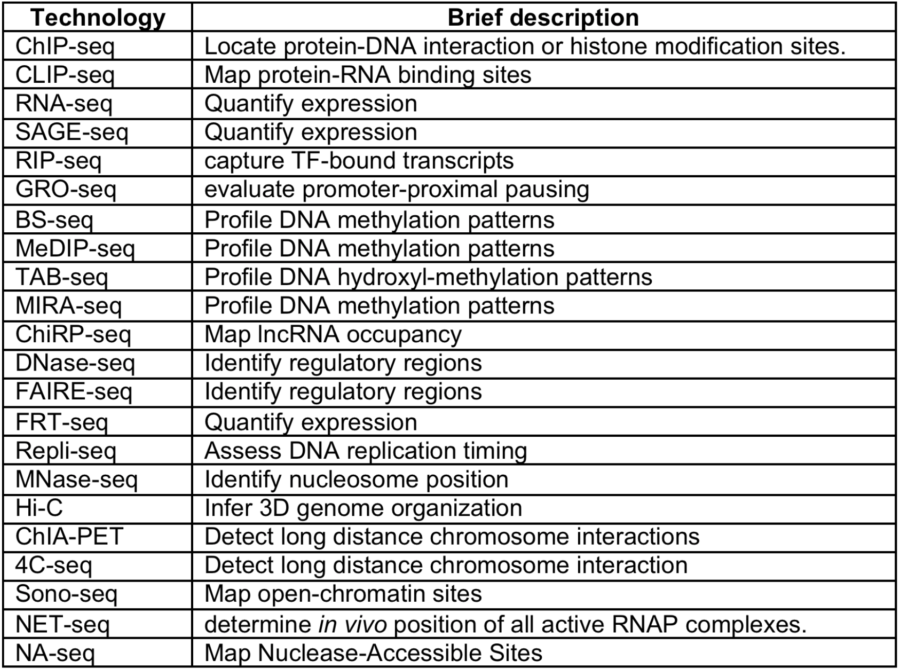
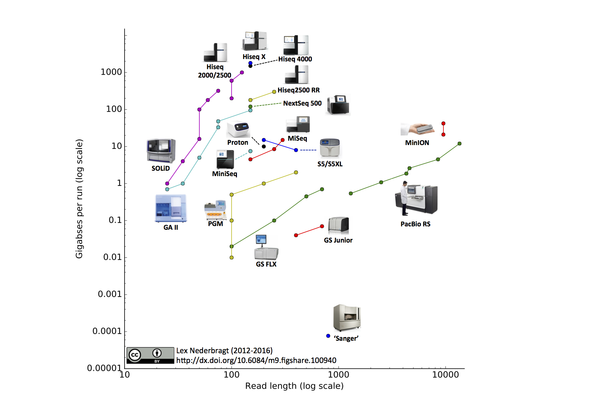

```{r xaringan-themer, include = FALSE}
library(xaringanthemer)
mono_light(
  base_color = "midnightblue",
  header_font_google = google_font("Josefin Sans"),
  text_font_google   = google_font("Montserrat", "500", "500i"),
  code_font_google   = google_font("Droid Mono"),
  link_color = "#8B1A1A", #firebrick4, "deepskyblue1"
  text_font_size = "28px"
)
library(dplyr)
library(ggplot2)
```


<!-- HTML style block -->
<style>
.large { font-size: 130%; }
.small { font-size: 70%; }
.tiny { font-size: 40%; }
</style>

## Applications: DNA Sequencing

- **Whole genome sequencing (WGS)**: Complete genome coverage

- **Whole exome sequencing (WES)**: All protein-coding regions (~1-2% of genome)

- **Targeted gene panels**: Specific genes for clinical diagnostics

- **Metagenomics**: Microbial community profiling

---
## Applications: RNA Sequencing

- **Bulk RNA-seq**: Gene expression profiling

- **Single-cell RNA-seq (scRNA-seq)**: Cell-type-specific expression, rare cell populations

- **Spatial transcriptomics**: Gene expression with tissue location preserved

- **Long-read RNA-seq (Iso-Seq)**: Full-length transcript isoforms

---
## Applications: Epigenomics

- **ChIP-seq**: Protein-DNA interactions, histone modifications

- **ATAC-seq**: Chromatin accessibility, regulatory elements

- **Bisulfite-seq**: DNA methylation profiling

- **scATAC-seq**: Single-cell chromatin accessibility

---
## Applications: Immunology

- **Immune repertoire sequencing (IRS)**: T-cell and B-cell receptor diversity

---
## DNA-seq (Whole-Genome sequencing)

<!-- **Workflow:**
- Extract high-quality DNA from cells/tissues
- Fragment DNA into sequenceable pieces (300-500 bp for short-read, >10 kb for long-read)
- Prepare sequencing libraries with adapters
- Sequence and align to reference genome -->

- **Variant detection**: Compare with reference genome to identify:
    - Single nucleotide polymorphisms (SNPs): ~4-5 million per individual
    - Insertions/deletions (indels): 100s of thousands per individual
    - Copy number variations (CNVs): duplications or deletions >1 kb
    - Structural variations (SVs): inversions, translocations, large indels

- **De novo assembly**: Build new genome without reference

- **Clinical applications**: Rare disease diagnosis, cancer genomics, pharmacogenomics

**Typical coverage:**
- Human genome discovery: 30-50X coverage
- Clinical diagnostics: 30-40X coverage  
- Population studies: 10-15X coverage sufficient for common variants

---
## Variations of DNA-seq

**Exome sequencing (WES):**

- Capture and sequence only protein-coding regions (~1-2% of genome)

- ~20,000 genes, ~180,000 exons, ~40-50 Mb total

- **Advantages**: 10-20× cheaper than WGS, higher coverage depth possible

- **Use cases**: Mendelian disease gene discovery, cancer mutation profiling

- **Limitation**: Misses regulatory, intronic, and structural variants

---
## Variations of DNA-seq

**Targeted gene panels:**

- Focus on specific genes of clinical interest (10-500 genes)

- **Ultra-deep coverage** (>500X) for sensitive variant detection

- **Examples**: Cancer panels (BRCA1/2, TP53, etc.), cardiac panels, neurodevelopmental panels

- **Advantages**: Lowest cost, fastest turnaround, highest accuracy

---
## Variations of DNA-seq

**Metagenomic sequencing:**

- Sequence DNA from complex mixtures of organisms (microbiomes, environmental samples)

- **Goals**: Identify species present, determine relative abundances, assemble genomes

- **Challenges**: Unknown number of species, varying abundances, de novo assembly required

- **Applications**: Gut microbiome studies, pathogen detection, environmental monitoring

- **Markers**: 16S rRNA (bacteria), 18S rRNA (eukaryotes), ITS (fungi)

---
## RNA-seq

- **Gene expression quantification**: Digital gene expression counting

- **Transcript discovery**: Identify novel transcripts, isoforms, fusion genes

- **Alternative splicing analysis**: Detect differential exon usage

- **Allele-specific expression**: Distinguish maternal vs. paternal alleles

- **Non-coding RNA profiling**: lncRNA, miRNA, circRNA characterization

---
## Standard bulk RNA-seq workflow

- Extract total RNA from cells/tissues

- Optional: Deplete ribosomal RNA (rRNA) or enrich for poly(A)+ mRNA

- Reverse transcribe RNA to cDNA

- Fragment and prepare sequencing libraries

- Sequence and quantify transcript abundance

**Typical depth**: 20-30 million reads for human differential expression

---
## Single-cell RNA-seq (scRNA-seq)

**Why single-cell?**
- **Cellular heterogeneity**: Bulk RNA-seq averages across millions of cells, masking rare populations
- **Cell type identification**: Discover and characterize cell types and states
- **Developmental trajectories**: Track cell fate decisions and differentiation
- **Rare cell detection**: Identify circulating tumor cells, stem cells, immune cell subsets

**Applications:**
- Tumor microenvironment profiling
- Immune cell repertoire analysis
- Brain cell atlas construction
- Embryonic development studies

---
## Single-cell RNA-seq (scRNA-seq)

**Major platforms (2024-2025):**
- **10x Genomics Chromium**: 500-20,000 cells per sample, droplet-based
    - 3' or 5' gene expression, immune profiling (V(D)J), CITE-seq (surface proteins)
    - **Flex**: Up to 1 million cells multiplexed, compatible with FFPE tissues
    - **Multiome**: Simultaneous scRNA-seq + scATAC-seq on same cells

- **Parse Biosciences**: Combinatorial barcoding, no specialized equipment

- **BD Rhapsody**: 200-20,000 cells, microchamber-based

**Typical depth**: >20,000 reads per cell for discovery, >50,000 for rare transcripts

---
## ChIP-seq - Chromatin Immunoprecipitation followed by sequencing

**Workflow:**

1. **Crosslink** proteins to DNA (formaldehyde)

2. **Fragment** chromatin by sonication (~200-500 bp)

3. **Immunoprecipitate** with antibody against target protein

4. **Reverse crosslinks**, purify DNA

5. **Sequence** and map enriched regions

---
## ChIP-seq Applications

**Transcription factor binding:**
- Map genome-wide binding sites of TFs
- Identify regulatory elements (enhancers, promoters)
- Understand gene regulatory networks

--

**Histone modifications:**
- **H3K4me3**: Active promoters; **H3K27ac**: Active enhancers; **H3K27me3**: Polycomb repression; **H3K9me3**: Heterochromatin, gene silencing; **H3K36me3**: Actively transcribed gene bodies

--

**Other DNA-binding proteins:**
- RNA polymerase II (Pol II): Active transcription;  CTCF: Chromatin loops and TAD boundaries; Cohesin: Sister chromatid cohesion and looping

**Typical depth**: 20-40 million reads for mammalian ChIP-seq

---
## ATAC-seq

**Assay for Transposase-Accessible Chromatin using sequencing:**

**Principle:**
- Map genome-wide chromatin accessibility
- Faster and simpler alternative to DNase-seq and FAIRE-seq

**Applications:**
- Identify active regulatory elements (promoters, enhancers, silencers)
- Transcription factor footprinting (infer TF binding from protected regions)
- Nucleosome positioning
- Compare chromatin states across cell types, development, disease

---
## Spatial transcriptomics

**Preserving spatial context in tissue gene expression profiling:**

**Why spatial matters:**
- Tissues are organized: cell-cell interactions, gradients, niches
- Bulk RNA-seq loses spatial information
- Traditional scRNA-seq requires tissue dissociation

--

**Applications:**
- Tumor microenvironment mapping (cancer-immune interactions)
- Developmental biology (spatial patterning during embryogenesis)
- Neuroscience (brain region-specific gene expression)
- Identify spatially-restricted cell types and states

---
## Spatial Technologies

**Spatial barcoding (next-generation sequencing-based):**
- **10x Genomics Visium**: Captures mRNA from 55 μm spots (~10 cells/spot)
    - Whole transcriptome profiling on tissue sections
    - 6.5 × 6.5 mm capture area, ~5,000 spots
- **10x Genomics Xenium**: In situ imaging of up to 5,000 genes
    - Single-cell resolution with subcellular localization
- **Slide-seq/Slide-seqV2**: Higher resolution (~10 μm beads)

--

**Imaging-based:**
- **MERFISH** (Multiplexed Error-Robust FISH): 10,000+ genes, subcellular resolution
- **seqFISH+**: Sequential FISH for high-throughput spatial profiling
- **CosMx SMI** (Nanostring): 1,000+ genes, single-cell resolution


---
## What matters is what you feed into the sequencer

```{r, out.width = "1100px", fig.align='center', echo=FALSE}

```

<!--
**Library preparation determines the biological question you can answer:**

- **RNA-seq variants**: poly(A)+ selection, rRNA depletion, strand-specific, small RNA
- **Enrichment strategies**: Exome capture, targeted panels, ChIP, ATAC
- **Fragmentation methods**: Enzymatic, sonication, tagmentation (ATAC)
- **Single-cell barcoding**: Droplet-based, plate-based, combinatorial indexing
- **Long-read libraries**: No amplification (Nanopore), circular consensus (PacBio)
- **Spatial barcoding**: Position-specific capture on slides
- **Methylation**: Bisulfite conversion, enzymatic conversion, direct detection

**The sequencer is just the readout - the biology is in the library prep!**
-->

.small[https://liorpachter.wordpress.com/seq/]

<!---
## Evolution of sequencing technologies

```{r, out.width = "400px", fig.align='center', echo=FALSE}

```

**From Sanger to modern platforms - a revolution in scale:**

- **1977-2005**: Sanger sequencing dominates (Human Genome Project era)
- **2005-2010**: Second-generation short-read platforms emerge (454, Illumina, SOLiD)
- **2010-2015**: Illumina dominates, costs plummet (~$1,000 genome achieved)
- **2011-present**: Third-generation long-read platforms (PacBio, Nanopore)
- **2015-present**: Single-cell technologies explode (10x Genomics, Drop-seq)
- **2020-present**: Spatial transcriptomics, multiomics integration
- **2024-present**: Real-time analysis, AI-driven basecalling, portable sequencing

**Key trends:**
- Throughput: 10^9-fold increase since 2005
- Cost: $100M/genome (2001) → $200/genome (2024)
- Speed: Years → hours
- Applications: Discovery → clinical diagnostics
-->

---
## Multi-omics integration

**Simultaneous measurement of multiple molecular layers in the same sample**

- Biological systems are complex - no single data type tells the whole story

- Integration reveals causal relationships between genotype, regulation, and phenotype

- Single-cell multiomics connects molecular layers in individual cells

**Bulk tissue multiomics:**
- **Genomics + Transcriptomics + Proteomics + Metabolomics**
- Example: Cancer studies combine WGS, RNA-seq, proteomics, drug response

---
## Major multi-omics approaches

**Single-cell multiomics:**
- **10x Multiome**: scRNA-seq + scATAC-seq on same cells
    - Links gene expression to chromatin accessibility
- **CITE-seq**: scRNA-seq + surface protein detection (antibody-derived tags)
- **REAP-seq**: scRNA-seq + epitope profiling
- **TEA-seq**: Transcriptome + Epigenome + Antigens simultaneously

**Spatial multiomics:**
- **Visium HD + protein**: Spatial transcriptomics + immunofluorescence
- **CosMx + protein**: RNA + up to 64 proteins with spatial resolution

<!--
## Sequencing milestones

- **2001**: First human genome draft - $100 million, 13 years
- **2007**: First NGS human genome (Jim Watson) - $2 million, months
- **2014**: Illumina HiSeq X Ten - first $1,000 genome
- **2022**: Complete telomere-to-telomere (T2T) human genome
- **2024**: NovaSeq X Plus - $200 genome at scale, routine clinical use
-->

---
## Developments in next generation sequencing

.pull-left[
- **Illumina**: Dominant short-read platform, >80% market share
- **PacBio**: High-accuracy long reads (HiFi), clinical adoption growing
- **Oxford Nanopore**: Ultra-long reads, portable, real-time, field deployment
- **Single-cell**: Routine profiling of millions of cells
- **Spatial**: Tissue architecture preserved in transcriptomics
]
.pull-right[
```{r, out.width = "500px", fig.align='center', echo=FALSE}

```
]
- **Multiomics**: Simultaneous measurement of genome, epigenome, transcriptome
.small[https://github.com/lexnederbragt/developments-in-next-generation-sequencing]