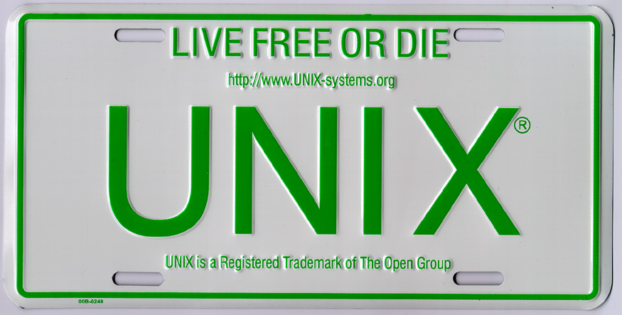
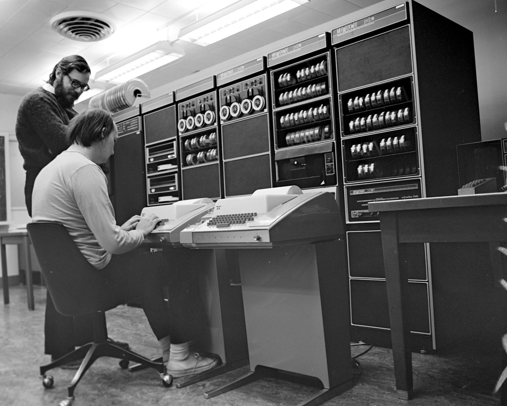
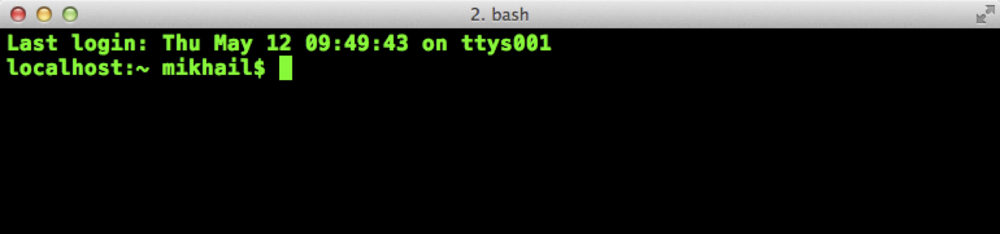
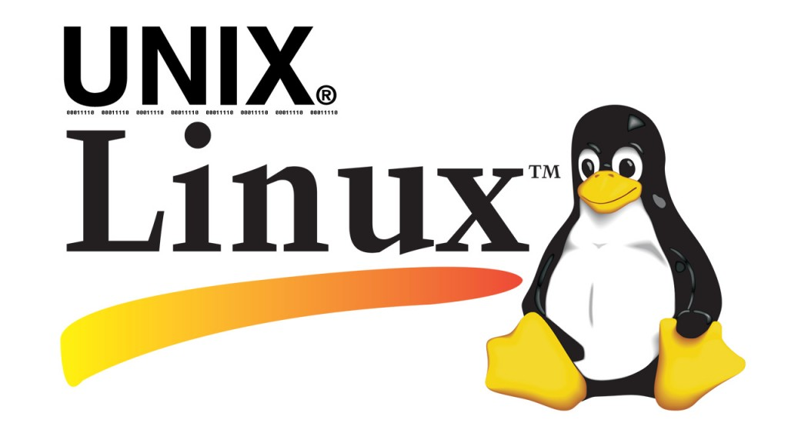
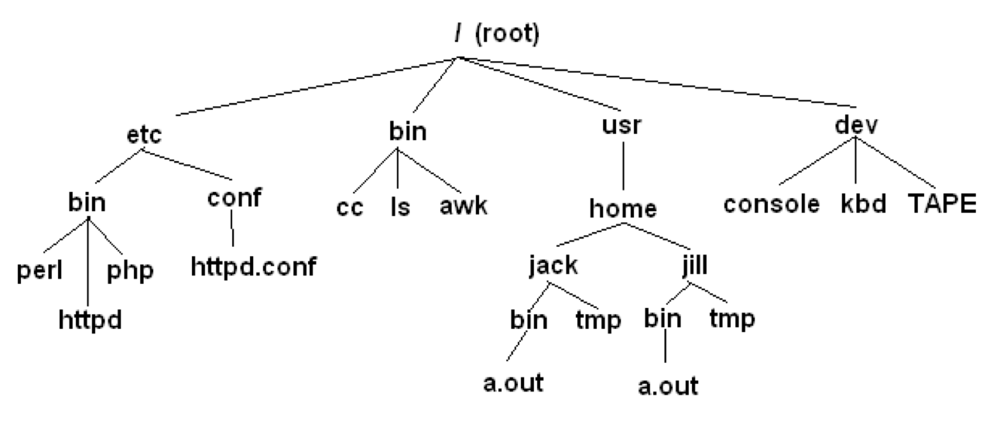

```{r xaringan-themer, include = FALSE}
library(xaringanthemer)
mono_light(
  base_color = "midnightblue",
  header_font_google = google_font("Josefin Sans"),
  text_font_google   = google_font("Montserrat", "500", "500i"),
  code_font_google   = google_font("Droid Mono"),
  link_color = "#8B1A1A", #firebrick4, "deepskyblue1"
  text_font_size = "28px"
)
library(dplyr)
library(ggplot2)
```

<!-- HTML style block -->
<style>
.large { font-size: 130%; }
.small { font-size: 70%; }
.tiny { font-size: 40%; }
</style>

## What is Unix

- Unix is a family of operating systems and environments that exploits the power of linguistic abstractions to perform tasks
- Unix is not an acronym; it is a pun on "Multics". Multics was a large multi-user operating system that was being developed at Bell Labs shortly before Unix was created in the early '70s. Brian Kernighan is credited with the name.
- All computational genomics is done in Unix

```{r, out.width = "400px", fig.align='center', echo=FALSE}

```

.small[http://www.read.seas.harvard.edu/~kohler/class/aosref/ritchie84evolution.pdf]

---
## History of Unix

- Initial file system, command interpreter (shell), and process management started by Ken Thompson
- File system and further development from Dennis Ritchie, as well as Doug McIlroy and Joe Ossanna
- Vast array of simple, dependable tools that each do one simple task

```{r, out.width = "350px", fig.align='center', echo=FALSE}

```
.small[Ken Thompson (sitting) and Dennis Ritchie working together at a PDP-11]

---
## The Unix Philosophy

**Core Design Principles**

* **Modularity:** A vast ecosystem of small, dependable tools.

* **Specialization:** Each utility performs one specific task perfectly.

* **Composition:** Chain simple tools together to build complex pipelines.

* **Self-Reliance:** High-quality, built-in documentation via `man` pages ("RTFM" (Read the F\*\*\*ing Manual)).

--

**The "Power of Pipes" Strategy:**
* Focus on programs that handle **text streams**, allowing any tool to be the input for the next.

---
## Know your Unix

- Unix users spend a lot of time at the **command line**

- In Unix, a word is worth a thousand mouse clicks

```{r, out.width = "1150px", fig.align='center', echo=FALSE}

```

---
## Unix systems

- Three common types of laptop/desktop operating systems: Windows, Mac, Linux.

- Mac and Linux are both Unix-like!

- What that means for us: Unix-like operating systems are equipped with "shells" that provide a command line user interface.

```{r, out.width = "500px", fig.align='center', echo=FALSE}

```

---
## The Shell: Your Interface to the OS

Just as a physical shell protects the internal organism, the software shell provides a user-friendly interface that encloses the intricate complexity of the operating system.

**The Interactive Command Layer**

* **The "Outer Layer":** Acts as a protective wrapper (shell) around the complex OS Kernel.

* **Command Execution:** An environment that interprets user input to initiate and direct computations.

* **The REPL Loop:** Reads your input, Evaluates the command, Prints the result, and Loops back.

.small[https://en.wikipedia.org/wiki/Unix_shell]

---
## The Shell: Your Interface to the OS

Just as a physical shell protects the internal organism, the software shell provides a user-friendly interface that encloses the intricate complexity of the operating system.

**Key Functions**

* **Abstraction:** Simplifies complex system calls into human-readable commands.

* **Automation:** Enables the sequencing of tasks via shell scripting.

* **Control:** Provides direct access to the file system and process management.

.small[https://en.wikipedia.org/wiki/Unix_shell]

---
## The Evolution of the Shell

**The Foundations: From `sh` to `bash`**

* **The Bourne Shell (`sh`):** The original command-line interpreter developed by Stephen Bourne at Bell Labs (1976). It established the standard for shell scripting.

* **The Bourne-Again Shell (`bash`):** The GNU Project’s modern successor. It incorporates features from `sh`, `csh`, and `ksh` while maintaining POSIX compliance.

* **The Z Shell (`zsh`):** An extended version of `bash` built for interactivity. It is now the default shell on macOS and is famous for its advanced "tab-completion" and customization.

.small[Source: https://en.wikipedia.org/wiki/Stephen_R._Bourne]

---
## Choosing a Shell: Bash vs. Zsh

| Feature | **Bash** (The Standard) | **Zsh** (The Power-User) |
| :--- | :--- | :--- |
| **Availability** | Pre-installed on almost every Linux distro. | Default on macOS; available via package managers. |
| **Compatibility** | Strict POSIX compliance; the industry standard for scripting. | High bash-compatibility, but adds many "quality of life" features. |
| **Interactivity** | Simple, functional auto-completion. | Recursive globbing and "fuzzy" path completion. |
| **Customization** | Configured via `.bashrc`. | Highly extensible via frameworks like **Oh My Zsh**. |
| **Best For** | Production servers and portable scripts. | Daily development and local terminal work. |

---
## Managing Your Shell Environment

**Identifying Your Shell**

The operating system tracks your active interpreter through an **environment variable**. This allows applications to know which syntax to use for commands.

* **The `$SHELL` Variable:** Holds the absolute path to your current command-line interpreter.

* **Check your current shell:** 
```bash
> echo $SHELL
/bin/zsh
```

---
## Managing Your Shell Environment

**Switching Interpreters**

If you prefer a different environment (like moving from `bash` to `zsh`), you can change your default login shell using the **Change Shell** utility.

* **The `chsh` Command:** Updates your user record in the system database.

* **Syntax to switch to Zsh:**
```bash
chsh -s /bin/zsh
```

**Note:** You may need to log out and back in for the change to take full effect across all terminal sessions.

---
## Getting to the command line

- Remote access, SSH, **PuTTY** (http://www.chiark.greenend.org.uk/~sgtatham/putty/), **MobaXterm** (https://mobaxterm.mobatek.net/)

- **Mac OS X + Xcode development suite** (free, https://developer.apple.com/xcode/) + **X11 server** (free, https://www.xquartz.org/) + **iTerm2** (optional, https://iterm2.com/)

- **Ubuntu Linux** (long-term support LTS version, XX.04, http://www.ubuntu.com/download/desktop)

---
## Accessing the Command Line

**Remote Access (SSH)**

* **Native Tools:** Most modern operating systems (Windows 10/11, macOS, Linux) now include a native OpenSSH client via the terminal.

* **Windows Clients:** * **PuTTY:** The classic, lightweight terminal emulator for SSH/Serial.
    * **MobaXterm:** An all-in-one workstation providing an X11 server, SFTP client, and tabbed SSH terminals.

---
## Accessing the Command Line

**macOS Environment**

* **Terminal:** Built-in access to `zsh` (default).

* **iTerm2:** The industry-standard replacement for the default Terminal, offering split panes and search.

* **XQuartz:** Necessary only if you need to run legacy X11 graphical applications remotely.
<!-- * *Note: Xcode is no longer required for basic shell access, though "Command Line Tools" (`xcode-select --install`) are essential for developers.* -->

.small[ https://iterm2.com/ ]

---
## Accessing the Command Line

**Windows & Linux Options**

* **WSL 2 (Windows Subsystem for Linux):** The modern standard for Linux on Windows. Runs a real Linux kernel (e.g., Ubuntu) directly inside Windows.

* **Ubuntu LTS:** The recommended Linux distribution for stability. Current versions follow the **YY.04** format (e.g., 22.04 LTS or 24.04 LTS).

<!--
## Getting to the command line | Windows users  

- **Cygwin**, http://www.cygwin.com/
- **Git Bash**, https://git-for-windows.github.io/ 
- Boot from a CD or USB
- Install the whole Linux system as a Virtual Machine in **VirtualBox** (https://www.virtualbox.org/)
-->

---
## Obtaining Command-Line Software

**Package Managers:** Modern systems use package managers to automate the downloading, installation, and updating of software. They handle "dependencies" (other tools a program needs to run) automatically.

**Windows: Modern Alternatives**

**WSL 2:** Recommended for a native Linux experience where you can use `apt` directly inside Windows.

* **Winget / Scoop:** Native Windows package managers that allow you to install CLI tools directly into PowerShell or Command Prompt.

* **Chocolatey (`choco`):** The "classic" choice with the largest library of traditional Windows apps.

---
## Obtaining Command-Line Software

**Package Managers:** Modern systems use package managers to automate the downloading, installation, and updating of software. They handle "dependencies" (other tools a program needs to run) automatically.

**macOS: Homebrew**

* **Homebrew (`brew`):** Known as "The Missing Package Manager for macOS." It is the industry standard for installing developer tools.

* **MacPorts:** A robust, long-standing alternative that builds software from source for maximum control.

---
## Obtaining Command-Line Software

**Package Managers:** Modern systems use package managers to automate the downloading, installation, and updating of software. They handle "dependencies" (other tools a program needs to run) automatically.

**Linux (Ubuntu/Debian): APT**

* **APT (Advanced Packaging Tool):** The native powerhouse for Ubuntu.

* **Usage:** Simple commands like `sudo apt install <package>` handle everything from security patches to complex toolsets.

**Workflow Tip:** Always run an "update" command (e.g., `brew update` or `sudo apt update`) before installing new software to ensure you are getting the latest version and security patches.

---
## Root and sudo: System Administration

In Unix-like systems, administrative power is centralized in a special user account called **root**. The `sudo` command allows regular users to execute tasks with these elevated privileges securely.

**The Root User (Superuser)**

* **Ultimate Authority:** The `root` account has the power to access, modify, or delete *any* file on the system, regardless of ownership.

* **Risk:** Logged in as root, a simple typo (like `rm -rf /`) can destroy the entire operating system.

* **Identity:** In the terminal, the root prompt usually ends in a `#`, while a standard user prompt ends in a `$`.

---
## Using `sudo` (SuperUser DO)

Rather than logging in as root, modern systems use `sudo` to perform specific administrative tasks.

* **The Command:** Prepend `sudo` to any command (e.g., `sudo apt update`).

* **Authentication:** You are prompted for **your own password**, not the root password.

* **Timeout:** Once authenticated, `sudo` usually "remembers" you for 5–15 minutes, so you don't have to re-type your password for every command.

---
## sudo Administrative Tasks

* **Software Management:** Installing or removing system-wide packages (`sudo apt-get update`).

* **Configuration:** Editing files in `/etc/` (like network settings or user lists).

* **User Management:** Adding, deleting, or changing permissions for other users.

---
## Interacting with the Shell

**Arguments and Flags**

* **Command Structure:** Most commands accept additional arguments to fine-tune their behavior.
    * *Example:* `ls` (list files) vs. `ls -la` (list all files with detail).

* **Positional Arguments:** Often follow the flags to specify targets (e.g., `cp source.txt destination.txt`).

---
## Interacting with the Shell

**Finding Help**

* **The Manual (`man`):** Use `man <command>` to open the definitive system manual.
    * **Navigation:** Use arrow keys or `Space` to scroll; press **`q`** to quit the viewer.

* **Built-in Help:** Most modern tools support `<command> -h` or `<command> --help` for a quick summary of options.

* **Fallback:** Many commands will automatically display a "usage" summary if executed with missing or incorrect arguments.

---
## The File System: Full vs. relative paths
```{r, out.width = "500px", fig.align='center', echo=FALSE}

```

- `cd /` - go to the root directory
- `cd /usr/home/jack/bin` - go to the user's sub-directory
- `cd ..` - go to the upper level directory
- `cd`, or `cd ~` - go to the user's home directory
- `cd -` - go to the last visited directory

---
## The File System: Full vs. Relative Paths

```{r, out.width = "500px", fig.align='center', echo=FALSE}

```

* **Absolute (Full) Paths:** Start from the root directory (`/`). They work regardless of your current location.
    * *Example:* `/usr/bin/python`

* **Relative Paths:** Start from your **Current Working Directory (CWD)**.
    * *Example:* `Documents/notes.txt`

---
## The File System: Navigating Paths

```{r, out.width = "500px", fig.align='center', echo=FALSE}

```

* **`cd /`** — Go to the **Root** directory (the base of the entire system).
* **`cd ~`** or **`cd`** — Return to your **Home** directory (e.g., `/home/jack`).
* **`cd ..`** — Move up one level to the **Parent** directory.
* **`cd -`** — Toggle back to the **Previous** directory you were in.
* **`cd .`** — Refers to the **Current** directory (useful for running local scripts).

The `.` and `..` are actual entries in every folder. Use `ls -a` to see these hidden "links" in action.

---
## Orienting in the Filesystem

**Where am I?**

* **`pwd`** (Print Working Directory): Displays the full absolute path of your current location.

**What is here?**

* The **`ls`** command is your primary tool for inspecting directory contents. Using "flags" allows you to see metadata and hidden files.

--

.small[
* **`ls`** — Standard list (multi-column, names only).
* **`ls -1`** — Forces the list into a **single column** (ideal for piping to other tools).
* **`ls -a`** — Shows **all** files, including hidden "dotfiles" (e.g., `.bashrc`).
* **`ls -lah`** — The "Power User" view:
    * **`-l`**: **Long** format (shows permissions, owner, size, and date).
    * **`-a`**: Includes **all** files.
    * **`-h`**: **Human-readable** sizes (displays 2K, 50M, 1G instead of bytes).

**Pro Tip:** In many shells, **`ll`** is a pre-configured alias (shortcut) for `ls -la` or `ls -lah`. Try it on your system! ]

---
## File and Directory Operations

**Creation and Editing**

* **`touch <file>`** — Creates an empty file or updates the timestamp of an existing one.

* **`mkdir <dir>`** — Creates a new directory.

* **`nano <file>`** — A simple, beginner-friendly text editor to modify file content (Ctrl + X to exit).

---
## File and Directory Operations

**Management: Move & Copy**

* **`cp <src> <dest>`** — Copies a file or folder.
* **`mv <src> <dest>`** — Moves or **renames** a file/folder. 
    * *Note: In Unix, renaming is simply "moving" a file to a new name.*

--

**Deletion (Caution Required)**

* **`rm <file>`** — Permanently removes a file.
* **`rm -r <dir>`** — **Recursive** removal; deletes a directory and all its contents.

.small[ **⚠️ Warning:** The shell has no "Recycle Bin." Once you use `rm`, the data is generally unrecoverable. Use `rm -i` (interactive) if you want the shell to ask for confirmation before each deletion. ]

---
## File Ownership and Groups

**The Three Tiers of Ownership**

In Unix, every file and directory is assigned to a specific user and group to control access:

* **User (u):** The individual owner (usually the person who created the file).

* **Group (g):** A collection of users with shared access needs (e.g., a "lab" or "student" group).
  * Every user belongs to at least one primary group, but can be a member of many.

* **Others (o):** Everyone else on the system (sometimes referred to as "World").

Permissions are set independently for each of these three tiers.

---
## Anatomy of Permissions

 **Reading `ls -l` Output**

A standard long-format listing reveals the security metadata of a file:

```text
 d  rwx  r-x  r-x   1  mdozmorov  staff   340B  _includes
 ┬  ─┬─  ─┬─  ─┬─   ┬      ┬        ┬
 │   │    │    │    │      │        └── Group Name
 │   │    │    │    │      └─────────── Owner Name
 │   │    │    │    └────────────────── Hard link count
 │   │    │    └─────────────────────── Others (o) Permissions
 │   │    └──────────────────────────── Group (g) Permissions
 │   └───────────────────────────────── User (u) Permissions
 └───────────────────────────────────── File Type (d=directory, -=file)
```

**Permission Types**

- **r (read):** View file content or list directory contents.
- **w (write):** Modify/delete files or create/remove files in a directory.
- **x (execute):** Run a file as a program or "enter" (cd) into a directory.

---
## Anatomy of Permissions

 **Reading `ls -l` Output**

```bash
drwxr-xr-x@ 31 mdozmorov  staff   992 Jan 13 15:44 .
drwxr-xr-x@ 49 mdozmorov  staff  1568 Dec  8 11:44 ..
-rw-r--r--@  1 mdozmorov  staff  8196 Dec 22 11:40 .DS_Store
-rw-r--r--@  1 mdozmorov  staff   186 Jan 12 19:09 .Rhistory
drwxr-xr-x@  4 mdozmorov  staff   128 Dec  8 12:49 .Rproj.user
drwxr-xr-x@ 12 mdozmorov  staff   384 Jan 14 11:11 .git
-rw-r--r--@  1 mdozmorov  staff  1398 Dec  8 14:23 .gitignore
-rw-r--r--@  1 mdozmorov  staff     0 Dec  8 12:50 .hugo_build.lock
-rw-r--r--@  1 mdozmorov  staff   225 Jan 13 15:44 BIOS668.2026.Rproj
-rw-r--r--@  1 mdozmorov  staff  2282 Apr 11  2024 Makefile
drwxr-xr-x@  3 mdozmorov  staff    96 Apr 11  2024 R
-rw-r--r--@  1 mdozmorov  staff  3787 Dec  8 13:57 README.md
-rwxr-xr-x@  1 mdozmorov  staff   146 Dec 31 14:07 ToDo.md
drwxr-xr-x@  3 mdozmorov  staff    96 Apr 11  2024 assets
drwxr-xr-x@  3 mdozmorov  staff    96 Jun  9  2025 classes
```

---
## Changing permissions and ownership

- `chmod` - change file mode (permissions)
    - `chmod u+x script.sh` - add execute permission for user
    - `chmod 755 script.sh` - set permissions using octal notation (rwxr-xr-x)
    - `chmod -R 644 directory/` - recursively change permissions

- `chown` - change file owner
    - `chown newuser file.txt` - change owner to newuser
    - `chown newuser:newgroup file.txt` - change owner and group

- `chgrp` - change file group
    - `chgrp newgroup file.txt` - change group to newgroup

---
## Finding Files and Directories

The `find` utility searches the filesystem in real-time based on specific attributes like name, type, size, or modification date.

* **Syntax:** `find [path] [expression] [action]`

* **`find .`** — Recursively list everything in the current directory.
* **`find . -type f`** — Find **files** only (`-type d` for directories).
* **`find . -maxdepth 1`** — Limit search to the current folder (don't go deeper).
* **`find . -name "*.mp3"`** — Search for files by name using **wildcards**.
* **`find . -mtime -7`** — Find files modified within the last **7 days**.

---
## Finding Files and Directories

The `find` utility searches the filesystem in real-time based on specific attributes like name, type, size, or modification date.

* **Syntax:** `find [path] [expression] [action]`

You can execute commands on every file found using the `-exec` flag:

```bash
find . -type f -name "README.md" -exec wc -l {} \;
```

- `{}` is a placeholder for each file found.

- `\;` terminates the command.

---
## Wildcards and Pattern Matching (Globbing)

**The "Special" Characters**

The shell uses **Wildcards** to perform "Globbing"—expanding a single pattern into a list of matching file or directory names.

* **`*` (Asterisk):** Matches **any number** of characters (including zero).

* **`?` (Question Mark):** Matches exactly **one** single character.

* **`[ ]` (Brackets):** Matches any **one** character contained within the brackets.
    * `[abc]` — Matches 'a', 'b', or 'c'.
    * `[a-z]` — Matches any lowercase letter in that range.
    * `[0-9]` — Matches any single digit.

---
## Wildcards and Pattern Matching (Globbing)

**Examples in Action**

| Command | Result |
| :--- | :--- |
| **`ls *.md`** | Lists all Markdown files in the current folder. |
| **`ls [Rt]*`** | Lists files starting with a capital **R** or lowercase **t**. |
| **`rm image_?.jpg`** | Deletes `image_1.jpg` and `image_a.jpg`, but **not** `image_10.jpg`. |
| **`cp data_[0-9].csv backup/`** | Copies files with a single-digit suffix (0-9) to the backup folder. |

.small[ **Pro Tip:** Wildcards are expanded by the **shell**, not the command itself. This means wildcards work with almost any command, including `ls`, `cp`, `mv`, and `rm`.]

---
## Inspecting File Contents

**Quick View (Standard Output)**

* **`cat <file>`** — **Concatenate**: Prints the entire file to the terminal. Best for short files.
* **`zcat <file>`** — (or `gzcat` on Mac) Prints the contents of **compressed** (.gz) files without decompressing them first.

--

**The "Head" and the "Tail"**

* **`head -n 20 <file>`** — View the first 20 lines.
* **`tail -n 20 <file>`** — View the last 20 lines.

.small[ **Pro Tip:** Use **`tail -f <file>`** to "follow" a file in real-time. This is the standard way to watch log files as they are being written! ]

---
## Inspecting File Contents

**Interactive Viewing with `less`**

Unlike `cat`, `less` doesn't load the whole file into memory at once, making it incredibly fast for massive datasets.

**Navigation Shortcuts:**

* **`Space` / `b`** — Page **forward** / Page **backward**.
* **`g` / `G`** — Jump to the **beginning** / **end** of the file.
* **`/<text>`** — **Search** for text (press `n` to find the next occurrence).
* **`q`** — **Quit** and return to the prompt.

.small[ **Pro Tip:** Use **`less -S <file>`** to avoid wrapping long lines. ]

---
## The Three Data Streams

**Standard Communication Channels**

Nearly every Unix command uses three "streams" or channels to handle data and communication:

1. **STDIN (Standard Input - 0):** Data fed into the command (usually from the keyboard).

2. **STDOUT (Standard Output - 1):** The "normal" output of a command (usually the terminal screen).

3. **STDERR (Standard Error - 2):** A separate stream specifically for error messages.

---
## File Redirection: `>` and `<`

**Writing to Files**

* **`command > file`** — **Overwrite**: Sends output to a file, deleting previous content.
    * *Example:* `ls > README.md` (Creates a directory list).
* **`command >> file`** — **Append**: Adds output to the end of the file without deleting it.

**Reading from Files**

* **`command < file`** — Feeds file content into a command as its input.
    * *Example:* `grep "CC0" < License.md`

.small[ **Advanced: Process Substitution** 

Use `<(command)` to treat the output of a command as if it were a temporary file:
* **`join <(sort file1) <(sort file2)`** — Sorts both files in memory before joining them.
]

---
## Handling Errors with STDERR

Separating errors from STDOUT allows you to clean up your terminal view:

* **`find / 2> error.log`** — Save only the errors to a file.

* **`find / 2> /dev/null`** — Suppress/discard all error messages.

* **`find / > output.txt 2>&1`** — Merge errors into the standard output file.

---
## Chaining Commands: Pipes

**The Power of the Pipe (`|`)**

The pipe character redirects the **STDOUT** of the left command directly into the **STDIN** of the right command. This allows you to build complex data "pipelines."

* **`find . | wc -l`** — Count how many files are in the current directory.

* **`cat names.txt | sort | uniq -c`** — Sort a list and count the unique occurrences.

---
## Chaining Commands: Logic

**Conditional Logic**

Sometimes you only want a command to run if the previous one succeeded.

* **`&&` (AND):** Run the second command **only if** the first one succeeds.
    * `mkdir music && mv *.mp3 music/`

* **`;` (Semicolon):** Run the second command regardless of the first one's outcome.

---
## Other Essential Unix Commands

**Text Processing & Analysis**

* **`sort` / `uniq`:** Sort lines and find unique/repeated entries.

* **`wc`:** Count words, lines, and characters.

* **`grep`:** Search for patterns within text.

* **`cut` / `tr` / `join`:** Extract columns, translate characters, or merge files.

* **`head` / `tail`:** View the start or end of a file.

---
## Other Essential Unix Commands

**System & File Intelligence**

* **`echo`:** Print text or variables to the terminal.

* **`basename` / `dirname`:** Strip paths to get filenames (or vice-versa).

* **`which`:** Locate the executable path of a command.

* **`history`:** View your previous command-line entries.

* **`who` / `kill`:** See who is logged in or terminate a frozen process.

.small[ **Pro Tip:** You can combine almost all of these. `history | grep "git" | tail -n 5` — Shows your last 5 git commands. ]

---
## Terminal Power User Shortcuts

**Speed & Efficiency**

* **Tab Completion:** The most important shortcut. Press `Tab` once to auto-complete, or twice to see all available options.

* **Up / Down Arrows:** Step through your recent commands one by one.
  * **`history`:** Displays a numbered list of your recently executed commands.

* **`!!` (Bang-Bang):** Repeats the previous command. 
    * *Pro Tip:* Use `sudo !!` if you forgot to run a command with admin privileges.

* **`!<number>`:** Executes a specific command from your `history` list by its ID.

---
## Terminal Power User Shortcuts

**Search & Correction**

* **`Ctrl + r`:** **Reverse Search**. Start typing a few letters of a past command to find it instantly.

* **`Ctrl + c`:** **Cancel/Interrupt**. Safely kills a running process or clears the current line to start over.

* **`Ctrl + l`:** **Clear Screen**. Quickly cleans up your terminal view (equivalent to typing `clear`).

**Navigation** 

* Use **`Ctrl + a`** to jump your cursor to the beginning of the line, and **`Ctrl + e`** to jump to the end.

<!--
## Statistical command line goodies

- **data_hacks**, https://github.com/bitly/data_hacks
    - Command line tools for data analysis
    - `histogram.py`
    - `bar_chart.py`
    - `sample.py`

- **datamash**, https://www.gnu.org/software/datamash/
    - summary statistics
    - transposing matrices
-->

---
## Unix for high-performance cluster computing

- Allow you to submit multiple jobs at once

- Depending on the system, can schedule jobs for you

- Are optimized for high-throughput performance

---
## Unix at VCU

- VCU Biostatistics cluster information, https://it.somhelp.vcu.edu/kb/articles/high-performance-computing

- Contact Helen Wang (huwang at vcu.edu) to establish an account

- Google if you run into problems using Unix!


---
## Learn more 

- Unix/Linux command reference sheets. [https://cheat-sheets.s3.amazonaws.com/linux-commands-cheat-sheet-new.pdf](https://cheat-sheets.s3.amazonaws.com/linux-commands-cheat-sheet-new.pdf) and [https://files.fosswire.com/2007/08/fwunixref.pdf](https://files.fosswire.com/2007/08/fwunixref.pdf) 

- Heng Li's "A Bioinformatician's UNIX Toolbox", http://lh3lh3.users.sourceforge.net/biounix.shtml

- Bioinformatics one-liners by Stephen Turner, https://github.com/stephenturner/oneliners

- Collection of bioinformatics-genomics bash one liners, using awk, sed etc. https://github.com/crazyhottommy/bioinformatics-one-liners

- Links and references to many genomics and bioinformatics resources, https://github.com/crazyhottommy/getting-started-with-genomics-tools-and-resources
