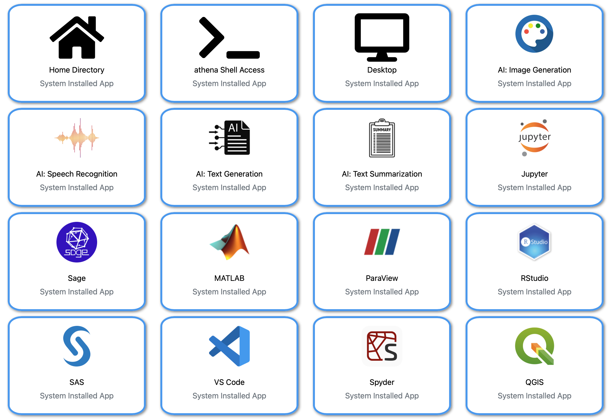

```{r xaringan-themer, include = FALSE}
library(xaringanthemer)
mono_light(
  base_color = "midnightblue",
  header_font_google = google_font("Josefin Sans"),
  text_font_google   = google_font("Montserrat", "500", "500i"),
  code_font_google   = google_font("Droid Mono"),
  link_color = "#8B1A1A", #firebrick4, "deepskyblue1"
  text_font_size = "28px"
)
library(dplyr)
library(ggplot2)
```

<!-- HTML style block -->
<style>
.large { font-size: 130%; }
.small { font-size: 70%; }
.tiny { font-size: 40%; }
</style>


## What is Athena?

Athena is VCU’s primary High-Performance Computing (HPC) cluster designed for research-intensive workloads.

* **Operating System:** Rocky Linux 9.

* **Storage:** 3 PB shared Lustre filesystem.

* **Architecture:** A 2-level hierarchy of partitions tailored for different computational needs.

* **Goal:** Fair allocation of 9,218 CPU cores and 36 high-end GPUs.

---
## Accessing the Cluster

1. **Account:** Request via the HPRC account creation form.  
.small[  https://docs.google.com/forms/d/1kal3qmZMCGrevvprKDjSouXpyi2o9kACG5Khh73y6Tk/viewform?edit_requested=true ]

2. **VPN:** All off-campus access **requires** the VCU VPN.

**Connection via SSH**

Open your terminal (MobaXterm, Terminal.app, or Linux shell) and run:

```bash
ssh yourvcueid@athena.hprc.vcu.edu
```

* There are two login nodes: `athena1` and `athena2`.

.small[ **Pro Tip:** Set up SSH keys for passwordless login. ]


---
## Hardware Overview: Partitions

| Partition | Nodes | CPU Cores/Node | RAM/Node | GPUs |
| --- | --- | --- | --- | --- |
| **cpu-small** | 73 | 28 - 36 | 96 - 256 GB | - |
| **cpu-large** | 43 | 128 | 256 - 1500 GB | - |
| **gpu-v100** | 4 | 32 - 128 | 384 - 512 GB | 2x V100 |
| **gpu-a100** | 2 | 128 | 1024 GB | 4x A100 |
| **gpu-h100** | 3 | 64 - 112 | 1024 - 2048 GB | 4-8x H100 |

.small[ **Note:** 2 CPUs and 8 GB RAM per node are reserved for the OS and cannot be allocated to user jobs. ]

---
## Cluster Etiquette (The "Do's and Don'ts")

* **Login Nodes:** NEVER run heavy computation on `athena1` or `athena2`. Use them only for editing scripts and submitting jobs.

* **Resources:** Remember it's a **shared** system. Don't "hog" resources; write jobs to be aware of actual CPU/RAM needs.

* **Monitoring:** Staff track resource usage. If your job impacts others, you will be contacted.

* **Open OnDemand:** Close sessions when finished to release resources.

---
## Open OnDemand (OOD)

OOD is a web-based portal that provides a Graphical User Interface (GUI) for Athena (runs on athena3).

```{r, out.width = "600px", fig.align='center', echo=FALSE}

```

.small[ * **Limitations:** Sessions are limited to **7 days**. For longer runs, use `sbatch`.  
https://athena3.hprc.vcu.edu/pun/sys/dashboard ]

---
## The Module System

Software on Athena is managed via Environment Modules. This prevents version conflicts.

* **`module avail`** — See all available software.

* **`module load <name>`** — Load a specific tool (e.g., `module load Matlab/R2024a`).

* **`module list`** — See what you currently have loaded.

* **`module purge`** — Clear all loaded modules to start fresh.

.small[ Default Rocky 9 tools include **GCC 11**, **Java 11**, and **Python 3.9**. ]

---
## Running Software

* **Command Line:** After loading a module, you can run the software directly from the terminal.

* **Scripts:** For complex analyses, write a shell script that loads the necessary modules and runs your commands.
  * Use variables to define paths and parameters for better readability and reproducibility.

```bash
SAMPLE="4DNFIIE6459J" # Sample name
BAM=${SAMPLE}_subsampled.bam # BAM file name
OUT=${SAMPLE}_subsampled.bw # Output file name
EGS=2913022398 # set effective genome size for hg38
bamCoverage -b ${BAM} -o ${OUT} --normalizeUsing RPGC --effectiveGenomeSize ${EGS}
```

* **Help:** Run the software with no arguments or `-h` or `--help` arguments to see usage information.

---
## Python Best Practices

Athena recommends using virtual environments to keep your projects isolated.

**The "User" Install**

When using `pip`, always install to your home directory:

```bash
pip install --user <package_name>
```

---
## SLURM: Terminology

Athena uses **Slurm** to schedule jobs.

* **Job:** The entire workload submitted to the cluster (usually via a script).

* **Task:** An instance of a program (usually 1 task = 1 process).

* **CPU:** In Slurm, "CPU" refers to a **CPU Core**.

* **Exclusivity:** Slurm allocates resources exclusively. While your job runs, those CPUs/GPUs/RAM "belong" only to you.

---
## Essential Slurm Commands

| Command | Action |
| --- | --- |
| **`sbatch`** | Submit a script to run in the background (Preferred). |
| **`squeue -u <eid>`** | Check the status of your jobs. |
| **`srun`** | Run a command interactively or as a task within a script. |
| **`scancel <id>`** | Kill a running or queued job. |
| **`sinfo`** | View cluster-wide node availability. |

Pro Tip: run `nodestat` to see real-time node status and load.

---
## Writing an `sbatch` Script

Create a file (e.g., `myscript.sh`):

```
#!/bin/bash
#SBATCH --job-name=MyResearch
#SBATCH --mail-user=mdozmorov@vcu.edu
#SBATCH --mail-type=ALL
#SBATCH --partition=cpu
#SBATCH --nodes=1
#SBATCH --ntasks=1
#SBATCH --cpus-per-task=4
#SBATCH --mem=16G
#SBATCH --time=01:00:00
#SBATCH --output=MyResearch.%j.out
#SBATCH --error=MyResearch.%j.err

module load R/4.4.1
Rscript my_analysis.R
```

Submit it with: `sbatch myscript.sh`

---
## GPU Computing: Exclusive vs. Shared

Athena allows you to request GPUs in two ways:

1. **Exclusive Mode (`gpu`):** You get the entire GPU.
```bash
#SBATCH --gres=gpu:1
```

2. **Shared Mode (`shard`):** Use for smaller jobs. You share the GPU with others.
```bash
#SBATCH --gres=shard:1
```

.small[ **Memory Warning:** If your job exceeds allocated `--mem`, Slurm will kill it. Don't under-allocate, but don't "over-hog" either. ]

---
## Slurm Interactive Sessions

Sometimes you need a live terminal on a compute node rather than submitting a script to the background. This is ideal for:

* **Debugging** code in real-time.

* **Testing** resource requirements (CPU/RAM/GPU).

* **Interactive tools** that require a shell.

To get an interactive shell, you use `srun` with the `--pty` (pseudo-terminal) flag and specify `bash` at the end.

```bash
srun -p cpu --ntasks=1 --cpus-per-task=16 --mem=120G --pty bash
```

---
## Slurm Interactive Sessions

**Example: A100 GPU Session**

```bash
srun -p gpu-a100 --gres=gpu:1 --mem=100G --pty bash
```

* Requests one NVIDIA A100 GPU and 100GB of system RAM.

* **`--pty bash`**: The most critical part; it opens an interactive Bash shell on the allocated node (pseudoterminal)

* **`-p <partition>`**: Directs your request to a specific pool of hardware (e.g., `cpu`, `gpu-a100`).

* **`--gres=gpu:1`**: Specifically requests the hardware accelerator.

* **`exit`** or **Ctrl+D**: Type this to end your session and release the resources back to the cluster.

.small[ **Note:** Always `exit` your interactive session when finished. If you just close your laptop, the session may keep running, "hogging" resources and consuming your account's allocation! ]

---
## Data Management & I/O

**Storage Tiers**

* **Home Directory:** Shared across all nodes. Best for scripts and small data.

* **`/tmp`:** Local SSD/NVMe on each node. **Crucial for high I/O jobs.** Copy your data here at the start of a job for 10x speed.

**Data Classification**

* **Category II & III:** Allowed on Athena (Public/Proprietary/De-identified).

* **Category I (Sensitive):** FERPA, HIPAA, CUI are **FORBIDDEN** on Athena. Use the **Apollo** cluster instead.

---
## Persistent Sessions with tmux

`tmux` (Terminal Multiplexer) is a critical tool for HPC users. It allows you to:

* **Keep processes running** even if your SSH connection drops or you close your laptop.

* **Divide one window** into multiple panes.

* **Manage multiple "windows"** within a single terminal session.

If your terminal gets "stuck" or you lose connection while running a long SLURM job, `tmux` is your safety net. Always start a `tmux` session on the login node **before** running `srun` or starting long file transfers.

---
## Session Management

* **Create a named session:** `tmux new -s my_project`

* **Re-attach to a session (after new login):** `tmux attach -t my_project`

* **List active sessions:** `tmux ls`

* **Detach from a session:** Press `Ctrl + b` then **`d`**. Your code keeps running in the background!

* **Kill/Exit a session:** Type `exit` inside the shell or press `Ctrl + d`.

**Pro Tip:** Your session lives on the node where you started it. If you start `tmux` on athena2, make sure you are on athena2 when you re-attach. Use `ssh athena2` to get there if needed.

---
## The "Prefix" Key

All `tmux` actions are triggered by a prefix. By default, this is:

**`Ctrl + b`** (Press them together, release, then press the next key).


---
## Managing Windows

Think of **Windows** like tabs in a web browser. Each window has its own full-screen shell.

* **Create a new window:** `Ctrl + b` then **`c`**

* **Switch by number:** `Ctrl + b` then **`0-9`**

* **Kill current window:** `Ctrl + b` then **`x`** (you will be prompted to confirm)

---
## Advanced window management

* **Next window:** `Ctrl + b` then **`n`**

* **Previous window:** `Ctrl + b` then **`p`**

* **List all windows:** `Ctrl + b` then **`w`** (allows you to pick from a menu).

- **Rename Window:**  `Ctrl + b` + `,` 

- **Split Vertically:**  `Ctrl + b` + `%` 

- **Split Horizontally:** `Ctrl + b` + `"` 

- **Switch Panes:** `Ctrl + b` + `Arrow Keys` 

