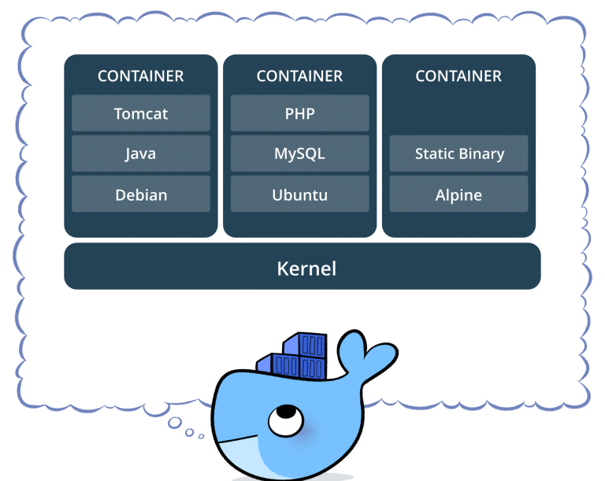
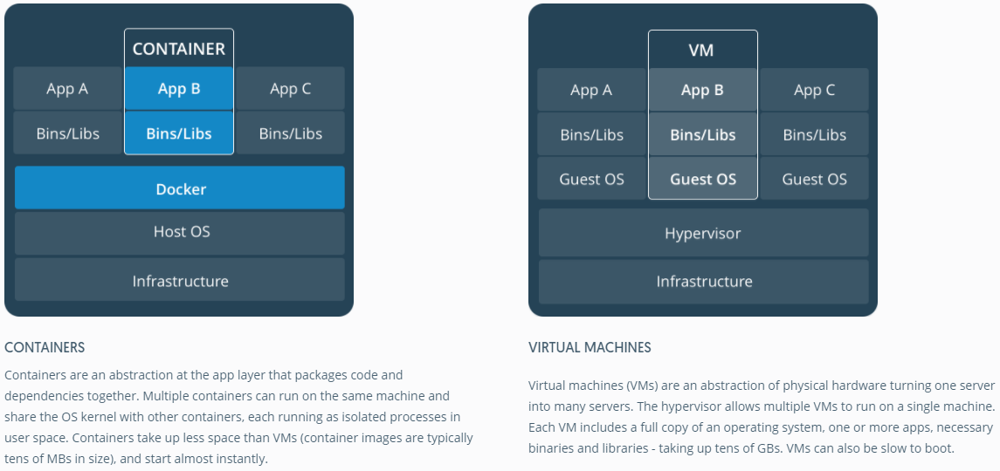
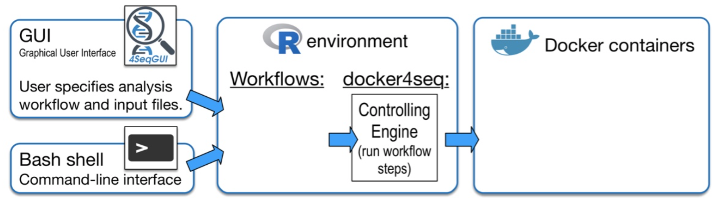

```{r xaringan-themer, include = FALSE}
library(xaringanthemer)
mono_light(
  base_color = "midnightblue",
  header_font_google = google_font("Josefin Sans"),
  text_font_google   = google_font("Montserrat", "500", "500i"),
  code_font_google   = google_font("Droid Mono"),
  link_color = "#8B1A1A", #firebrick4, "deepskyblue1"
  text_font_size = "28px"
)
library(dplyr)
library(ggplot2)
```

<!-- HTML style block -->
<style>
.large { font-size: 130%; }
.small { font-size: 70%; }
.tiny { font-size: 40%; }
</style>

## Docker - Reproducible Research Engine

- An open-source project to easily create lightweight, portable, self-sufficient containers from any application

- A tool for creating a layered filesystem; each layer is versioned and can be shared across running instances, making for much more lightweight deployments

- A company behind the project, as well as a site called the "Docker Hub" for sharing containers

Docker **is not** a virtual machine. Unlike a true VM, a docker container does not require a host OS, meaning it's much slimmer than a real VM

---
## Docker timeline

- January 2013 - First commit
- March 2013 - Docker 0.1.0 released
- April 2014 - Docker Governance Advisory Board announced with representation from IBM
- June 2014 - Docker 1.0 released
- September 2014 - $40 million investment round
- December 2014 - Docker and IBM announce strategic partnership
- February 2016 - Docker introduces first commercial product, now Docker Enterprise Edition
- Today - 3,300+ contributions, 43,000+ stars, 12,000+ forks

.small[ https://github.com/docker ]

---
## The Docker Family tree

- `moby` project - open source framework for assembling core components that make a container platform. Intended for open source contributors + ecosystem developers

- `Docker Enterprise Edition` - subscription-based, commercially supported products for delivering a secure software supply chain. Intended for product deployment + enterprise customers

- `Docker Community Edition` - free, community-supported product for delivering a container solution. Intended for software developers

.small[ https://mobyproject.org/ ]

---

## What is a container?

.pull-left[
```{r, out.width = "500px", fig.align='center', echo=FALSE}

```
]
.pull-right[

* Standardized packaging for software and dependencies

* Isolate apps from each other

* Share the same OS kernel

* Works with all major Linux and Windows Servers
]

---
## Container vs. VM

```{r, out.width = "1100px", fig.align='center', echo=FALSE}

```

---
## Key Benefits of Docker Containers

* **Speed** – Since containers leverage the host’s OS kernel rather than booting a full guest OS, applications start in milliseconds. 

* **Portability** – "Build once, run anywhere." By encapsulating the application and its entire runtime environment, Docker ensures the software behaves identically, on a laptop, a server, or a cloud.

* **Efficiency** – Containers are significantly more lightweight than Virtual Machines (VMs). 
    * **Minimal Overhead**: No redundant OS kernels taking up CPU and RAM.
    * **High Density**: You can run 10x to 100x more containers on the same hardware compared to VMs, maximizing resource utilization.

* **Version Control for Infrastructure** – Like Git for code, Docker allows version-control of your entire environment setup, making rollbacks and environment audits effortless.

---
## Docker components

* **Docker Daemon** - The background service running on the host that manages building, running, and distributing Docker containers. The daemon is the process that runs in the operating system to which clients talk.

* **Docker Client** - The command line tool that allows the user to interact with the daemon. More generally, there can be other forms of clients too - such as `Kitematic` which provides a GUI to the users.

* **Docker Desktop** is a user-friendly application for Mac, Windows, and Linux that bundles the Docker Engine, CLI, Docker Compose, and Kubernetes into a single package

* **Docker Hub** - A registry of Docker images.

.small[ https://hub.docker.com/ ]

---
## Docker components

* **Docker Compose** – A tool for defining and running multi-container applications. It uses a single YAML file to configure your application’s services, networks, and volumes, allowing you to start everything with one command (docker-compose up).

* **Docker Swarm** – Docker’s native orchestration and clustering tool. It turns a group of Docker engines into a single, virtual Docker engine, allowing you to deploy services at scale with high availability and load balancing across multiple machines.

---
## Docker terminology for developers

**Dockerfile** - A text-based configuration script used to automatically build Docker images. It defines:

- **Base Image:** Uses the `FROM` instruction to set the existing image as the starting point (e.g., Ubuntu or Python).

- **Layered Instructions:** A sequence of commands (like `RUN, COPY, ADD`) to augment the image. Each instruction creates a new, cached read-only layer in the filesystem.

- **Metadata:** Definitions for environment variables (`ENV`), persistent storage (`VOLUME`), and network ports exposed (`EXPOSE`) for inter-container communication.

- **Execution Point:** Specifies the default command to run when the container starts (`CMD` or `ENTRYPOINT`).

---
## Example: Dockerfile for Bioinformatics (samtools)

```dockerfile
# 1. Use a lightweight base image
FROM ubuntu:22.04

# 2. Prevent interactive prompts during installation
ENV DEBIAN_FRONTEND=noninteractive 

# 3. Install system dependencies and samtools
RUN apt-get update && apt-get install -y \
    wget \
    bzip2 \
    libncurses5-dev \
    libncursesw5-dev \
    libbz2-dev \
    liblzma-dev \
    samtools \
    && rm -rf /var/lib/apt/lists/* # keep the image size small by removing temporary cache files.

# 4. Set the working directory
WORKDIR /data

# 5. Default command: show samtools help
CMD ["samtools", "--help"]
```

---
## How to use this Dockerfile

**1. Build the image**:

`docker build -t my-samtools:v1 .`

**2. Run a command**:

`docker run --rm -v $(pwd):/data my-samtools:v1 samtools flagstat sample.bam`

---

## Example: Environment via Conda 

It is often more efficient to use a package manager like **Conda** or **Mamba** inside Docker to handle complex dependencies and versioning.

```dockerfile
# 1. Use a specialized miniconda base
FROM continuumio/miniconda3

# 2. Configure channels for Bioinformatics
RUN conda config --add channels defaults && \
    conda config --add channels bioconda && \
    conda config --add channels conda-forge

# 3. Install specific versions of tools
RUN conda install -y \
    samtools=1.17 \
    bcftools=1.17 \
    bedtools=2.31.0 \
    && conda clean -afy

# 4. Set the working directory
WORKDIR /analysis

# 5. Verify installation
CMD ["samtools", "--version"]
```

---
## Docker terminology for users

- **Image** - The read-only "blueprints" of applications used to create containers. Use docker pull to download them from a registry.

- **Filesystem Snapshot:** An image represents a complete, static snapshot of an environment (OS, libraries, and code) at a specific point in time.

- **Layered Architecture:** Images are composed of a series of stacked layers. If two different images share the same base (e.g., both use ubuntu:22.04), Docker only stores that base layer once.
  - Layers are immutable (cannot be changed).
  - Multiple running containers can share the same underlying image layers, significantly saving disk space and memory.

```bash
$ docker pull ubuntu
Pulling repository ubuntu
c4ff7513909d: Download complete 
511136ea3c5a: Download complete 
1c9383292a8f: Download complete
...
```

---
## Docker container

* **Container** - A lightweight, standalone, and executable package that includes everything needed to run a piece of software. 
    * It is a **runtime instance** of an image.
    * Technically, it consists of the read-only image layers plus a thin **read/write (writable) layer** on top.
    * **Lifecycle**: Create and start them with `docker run`, and view active containers using `docker ps`.

* **Isolated Environment**: A Docker container can be thought of as an isolated "sandbox". It shares the host's OS kernel but remains isolated from other containers and the host system.

<!-- * **Portability and Consistency**: Because the container encapsulates all dependencies (libraries, configurations, and binaries), you can send it to a colleague or move it to the cloud. When they run it, they are guaranteed to get the exact same results as you, eliminating the "it works on my machine" problem. -->

---
## What if I want to change an image?

* An image is read-only, how do we change it?

* We don't.

* We create a new container from that image.

* Then we make changes to that container.

* When we are satisfied with those changes, we transform them into a new layer.

* A new image is created by stacking the new layer on top of the old image.

---
## Persistent Containers: Stop & Start

A container does not have to be deleted after it finishes a task. You can pause its execution and resume it later, preserving the state of the processes.

* **Stopping**: `docker stop <container_id>`
    * Sends a `SIGTERM` signal to the application.
    * The container is no longer running, but its writable layer (and any data changes) is **preserved** on disk.

* **Starting**: `docker start <container_id>`
    * Resumes the container exactly where it left off.
    * Faster than `docker run` because the container already exists.

---
## Safety in Docker

* **Root Equivalency**: The Docker daemon (`dockerd`) runs with `root` privileges. Consequently, anyone who can execute Docker commands is effectively a **root-equivalent** user on the host.

* **Host Access**: Because containers can mount sensitive host directories (like `/etc` or `/root`), an unrestricted user could potentially modify host system files from within a container.

---
## Safety in Docker

* **The Docker API and Socket**: 
    * Access to the Docker API (via the Unix socket `/var/run/docker.sock`) is the gateway to the host.
    * If you grant someone access to this API, you are granting them full administrative control over the machine.
    * **Security Default**: By default, the Docker control socket is owned by the `root` user and the `docker` group to prevent unauthorized access on multi-user systems.

* **Best Practice**: Treat the `docker` group with the same level of security and caution as the `sudoers` list. Only grant Docker access to trusted users.

---
## Safety in Docker

* Add the Docker group

`$ sudo groupadd docker`

* Add ourselves to the group

`$ sudo gpasswd -a $USER docker`

* Restart the Docker daemon

`$ sudo service docker restart`

* Log out

`$ exit`

---
## Image provenance

* How can I trust `docker pull` an image?
  * Must trust the upstream image, Docker Hub, and the transport between the Hub and my Docker host.

* If you don't trust upstream, don't use `apt-get` and `yum`, verify all source code + changes, and compile everything from source.

* If you don't trust Docker, audit the whole Docker Engine code.

* If you don't trust transport, learn the protocol Docker uses to distribute signed content.

* Be reasonable.

---
## Immutable containers

* **Enforced Immutability**: Using `docker run --read-only` mounts the container's root filesystem as read-only. This prevents attackers from installing "backdoors" or modifying application binaries.

* **Copy-on-Write (CoW) Mechanism**:
    * Even without the `--read-only` flag, changes are made to a temporary writable layer, not the original image.
    * These changes are ephemeral; once the container is deleted, all modifications vanish.
    * **Recycling**: If a container becomes compromised or broken, you simply destroy it and launch a fresh instance from the original image.

* **Auditability**: The `docker diff` command allows you to inspect exactly what files have been added, changed, or deleted in the container’s writable layer compared to the original image.

* **Security Hardening**: Docker continues to integrate advanced security features like **Seccomp profiles** (filtering system calls) and **AppArmor/SELinux** to further restrict container capabilities.

.small[ https://www.docker.com/docker-security ]

---
## Docker Installation

Docker installation has been streamlined significantly. While the core engine is Linux-based, **Docker Desktop** provides a seamless experience for Windows and Mac users.

**Linux (Ubuntu/Debian)**

* The most reliable method is using the official Docker repository to get the latest version.

* **Quick Script**: `curl -fsSL https://get.docker.com -o get-docker.sh && sudo sh get-docker.sh`

* **Manual**: `sudo apt-get update && sudo apt-get install docker-ce docker-ce-cli containerd.io`

---
## Docker Installation

**Windows & Mac: Docker Desktop**

* Provides a GUI to manage containers, images, and volumes.

* **Windows**: Requires WSL 2 (Windows Subsystem for Linux) backend for best performance.

* **Mac**: Supports both Intel and Apple Silicon (M1/M2/M3) chips natively.

**Post-Installation Tip**: Always verify your installation by running the "Hello World" container:
  `docker run hello-world`

.small[ 
Official Docs: [https://docs.docker.com/get-docker/](https://docs.docker.com/get-docker/)
]

---
## Reproducible Genomics projects

```{r, out.width = "900px", fig.align='center', echo=FALSE}

```

BioContainers, a vast collection of bioinformatics software packaged into standardized Docker containers. It streamlines scientific research by offering ready-to-use, reproducible environments for hundreds of tools like blast, bwa, and samtools.

.small[ https://github.com/BioContainers/containers 

Bai, Jingwen, Chakradhar Reddy Bandla, Jiaxin Guo, et al. BioContainers Registry: Searching for Bioinformatics Tools, Packages and Containers. Preprint. Bioinformatics, 2020. https://doi.org/10.1101/2020.07.21.187609.
]

<!--
## Docker on Amazon Web Services

* **AWS Elastic Beanstalk** is an easy-to-use PaaS (Platform as a Service) for deploying and scaling web applications and services.
* Comes with reasonable defaults, easy to set up.

* **Amazon Elastic Container Service (Amazon ECS)** is a highly scalable, high-performance container orchestration service that supports Docker containers and allows you to easily run and scale containerized applications on AWS.
* Flexible customization, can be complex to start with.

.small[
https://aws.amazon.com/elasticbeanstalk/
https://aws.amazon.com/ecs/
https://docker-curriculum.com/
]

## More resources

* Container engines
* `rkt` - A security-minded, standards-based container engine.
* `Singularity` - scientific-oriented Docker images that can be run without superuser privileges.

* Image repositories
* `Biocontainers` - bioinformatics software containers.
* `Quay` - secure container storage.
* `Dockstore` - platform for sharing workflows and pipelines as Docker images.

.small[
https://coreos.com/rkt/
https://singularity.lbl.gov/
http://biocontainers.pro/
https://quay.io/
https://dockstore.org/
]
-->

---
## Docker CLI Cheat Sheet

| Command | Description |
|---------|-------------|
| `docker run <image>` | Create and start a container from an image |
| `docker ps` | List running containers |
| `docker ps -a` | List all containers (including stopped ones) |
| `docker stop <id>` | Gracefully stop a running container |
| `docker start <id>` | Start a stopped container |
| `docker exec -it <id> bash` | Open an interactive terminal inside a container |
| `docker logs <id>` | View the output/logs of a container |

---
### Advanced Cleanup

Sometimes you need to clear your workspace entirely. **Use with caution!**

* **Stop all containers**:  
  `docker ps -q | xargs -r docker stop`

* **Remove all containers**:  
  `docker ps -aq | xargs -r docker rm`

* **Remove all images**:  
  `docker images -q | xargs -r docker rmi -f`

* **Modern "Prune" (Recommended)**:  
  `docker system prune -a --volumes`  
  *(Cleans up all unused containers, networks, images, and volumes in one command)*

---
## Practical Example: Running Bioconductor

This command launches a specialized environment for genomic data analysis, pre-configured with RStudio and Bioconductor.

```bash
docker run \
  --rm \                               # Automatically remove the container when it stops
  -d \                                 # Run in "detached" mode (background)
  -p 8787:8787 \                       # Map host port 8787 to container port 8787 (RStudio)
  -e PASSWORD=gamma123 \               # Set environment variable: RStudio login password
  -v $(pwd):/home/rstudio \            # Mount current directory to container (Read/Write)
  -v $REAL_KEY_PATH:/home/rstudio/.ssh/id_rsa:ro \ # Mount SSH key as Read-Only (:ro)
  bioconductor/bioconductor_docker:devel          # Use the 'devel' image from Bioconductor
```

---
## Singularity / Apptainer

Singularity (now primarily known as **Apptainer** in the open-source community) was designed specifically for **High-Performance Computing (HPC)** environments where security and shared resources are the priority.

* **No Root Daemon**: Unlike Docker, Singularity does not run a background daemon with root privileges. It runs as a standard user process.

* **Single-File Images**: Singularity uses the **SIF (Singularity Image Format)**, which compresses the entire environment into a single, portable file (similar to a virtual disk or a `.iso`).

* **HPC Integration**: Designed to work seamlessly with resource managers like Slurm and to natively support MPI and GPU hardware without complex configuration.

---
## Docker vs. Singularity / Apptainer

While both use containers, they are optimized for different environments:

.small[
| Feature | Docker | Singularity / Apptainer |
| :--- | :--- | :--- |
| **Primary Goal** | Microservices & Cloud | Data Science & HPC |
| **Privileges** | Requires `root` or `sudo` | Runs as a standard `user` |
| **Security** | Isolation (Sandbox) | Integration (Same user as host) |
| **Image Format** | Layered (Distributed) | Single file (.sif) |
| **Filesystem** | Writable (by default) | Read-only (by default) |
| **Host Integration** | Difficult (Networking/GPU) | Easy (Mounts $HOME by default) |
| **Supercomputer Use** | Rare (Security risk) | Industry Standard |
]

---

## Using Singularity / Apptainer

One of Singularity's greatest strengths is its ability to use existing Docker images.

* **Pull from Docker Hub**:
`singularity pull docker://ubuntu:22.04`
*(This creates a local file: ubuntu_22.04.sif)*

* **Run a container**:
`singularity run my_analysis.sif`

* **Shell into a container**:
`singularity shell my_analysis.sif`

* **Execute a specific command**:
`singularity exec my_analysis.sif samtools flagstat sample.bam`

.small[
Note: By default, Singularity automatically mounts your current directory and your `$HOME` folder, making data access immediate and easy.
]

---
## Containers: Apptainer & Singularity

Docker is not available on Athena for security reasons (it requires root access).

* **Alternative:** **Apptainer** (formerly Singularity).

* **Compatibility:** Fully compatible with Docker images.

```bash
module load Apptainer
apptainer pull docker://ubuntu:latest
apptainer exec ubuntu_latest.sif cat /etc/os-release
```

* Supports GPUs and MPI applications natively.

---
## References

https://colinfay.me/docker-r-reproducibility/

https://docker-curriculum.com/

https://github.com/veggiemonk/awesome-docker