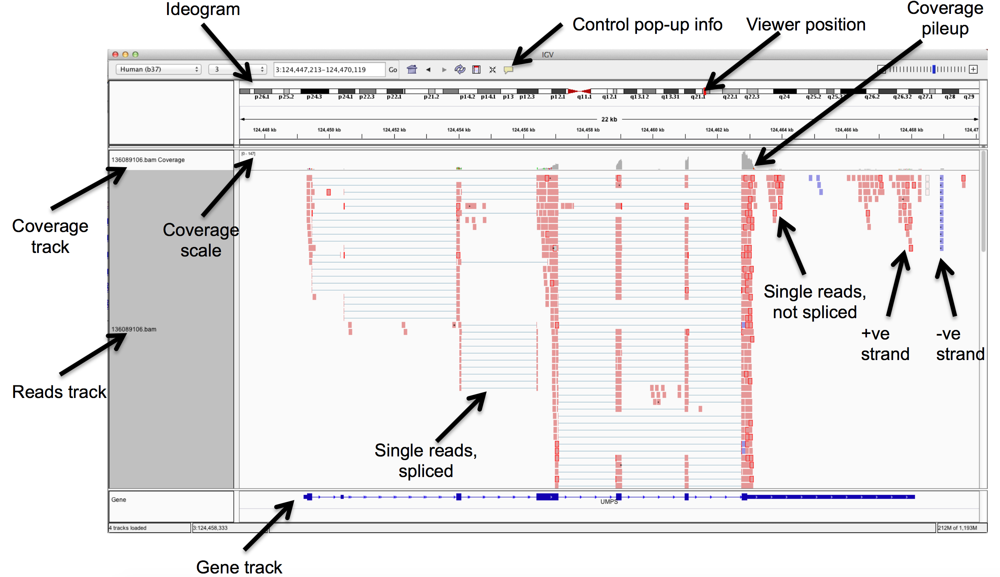

```{r xaringan-themer, include = FALSE}
library(xaringanthemer)
mono_light(
  base_color = "midnightblue",
  header_font_google = google_font("Josefin Sans"),
  text_font_google   = google_font("Montserrat", "500", "500i"),
  code_font_google   = google_font("Droid Mono"),
  link_color = "#8B1A1A", #firebrick4, "deepskyblue1"
  text_font_size = "28px"
)
library(dplyr)
library(ggplot2)
```

<!-- HTML style block -->
<style>
.large { font-size: 130%; }
.small { font-size: 70%; }
.tiny { font-size: 40%; }
</style>

<!-- https://claude.ai/chat/38d486b0-ebfc-4186-96db-b9b69051b66c -->

## Key Resource Categories

1. **Cancer Genomics** - TCGA, cBioPortal, COSMIC, ICGC/PCAWG

2. **Variant Interpretation** - ClinVar, COSMIC

3. **Gene & Genome Browsers** - UCSC, Ensembl, NCBI Gene

4. **Bulk Expression Data** - GTEx, GEO, SRA, ArrayExpress

5. **Single-Cell Expression** - CELLxGENE, Human Cell Atlas, Tumor Atlas

6. **Functional Genomics** - DepMap, ENCODE, Roadmap

7. **Protein & Pathways** - Human Protein Atlas, STRING, Reactome

---
## TCGA: The Cancer Genome Atlas

- **33 cancer types**, >11,000 patients

- Multi-omic data: genomics, transcriptomics, epigenomics, proteomics

- Gold standard for cancer genomics research

- **GDC Data Portal**: https://portal.gdc.cancer.gov

- **Broad Firehose**: https://gdac.broadinstitute.org

- R/Bioconductor packages (TCGAbiolinks)

---
## cBioPortal

- User-friendly **web interface** for cancer genomics, no coding required

- Integrates TCGA + 300+ other studies


- **OncoPrint visualizations**
- **Survival analysis **
- **Mutation mapping on protein structures**
- **Pathway enrichment analysis**
- **Co-expression & correlation tools**

.small[ https://www.cbioportal.org ]

---
## COSMIC: Catalogue of Somatic Mutations

- World's largest database of **somatic mutations**

- Curated from literature + systematic screens

- \>1,000 cancer genomes


- **Cancer Gene Census** - curated cancer drivers
- **Mutation signatures** - mutational processes
- **Resistance mutations** - therapy resistance
- **Structural variants**
- **Fusion genes** - gene fusions in cancer

.small[ https://cancer.sanger.ac.uk/cosmic ]

---
## ClinVar: Clinical Variant Interpretation

- **Germline variant** clinical significance database

- Aggregates interpretations from clinical labs

- Links variants to diseases & phenotypes


- **Classification Levels**
  - Pathogenic / Likely pathogenic
  - Uncertain significance (VUS)
  - Likely benign / Benign
  - Conflicting interpretations flagged

.small[ https://www.ncbi.nlm.nih.gov/clinvar ]

---
## UCSC Genome Browser

**The Hub for Genomic Visualization**

* **Interactive Context:** Explore hundreds of annotation tracks.

* **Data Integration:** Seamlessly upload and view **Custom Tracks**.

* **Comparative Analysis:** Conservation, regulation, and multi-species alignments.

* **Global Standard:** Real-time access to variation and clinical data.

.small[ https://genome.ucsc.edu ]

---
## Ensembl

**Comprehensive Genome Annotation**

* **Core Genes:** Gold-standard gene and transcript annotations.

* **Variant Analysis:** Industry-leading **Variant Effect Predictor (VEP)**.

* **Regulation:** Deep epigenomics and regulatory feature mapping.

* **Evolution:** Extensive comparative genomics across lineages.

.small[ https://www.ensembl.org ]

---
## WashU Epigenome Browser

**Next-Gen Epigenomic Visualization**

* **Integrated Data:** Native access to **Roadmap Epigenomics** projects.

* **Format Flexibility:** Supports standard UCSC track types and features.

* **Interoperability:** Effortlessly load **UCSC Track Hub** documents.

* **Advanced Mapping:** Specialized for high-resolution (epi)genomic landscapes.

.small[ https://epigenomegateway.wustl.edu/ ]

---
## Genomic Data Visualization
Integrative Genomics Viewer (IGV)
```{r, out.width = "800px", fig.align='center', echo=FALSE}

```
.small[ https://igv.org/doc/desktop/ ]

---
## IGV Features

- Explore large genomic datasets with an intuitive, easy-to-use interface.

- Integrate multiple data types with clinical and other sample information.

- View data from multiple sources:
    - local, remote, and "cloud-based".
    - Intelligent remote file handling - no need to download the whole dataset

- Automation of specific tasks using command-line interface

.small[ https://github.com/griffithlab/rnaseq_tutorial/wiki/IGV-Tutorial ]

---
## NCBI Gene Browser

**Integrated Clinical & Literature Hub**

* **Reference Standards:** Curated **RefSeq** gene summaries and annotations.

* **Unified Ecosystem:** Direct links to NCBI databases (GEO, dbGaP, Assembly).

* **Clinical Insights:** Real-time association with **ClinVar** and clinical variants.

* **Evidence-Based:** Integrated access to gene-specific **PubMed** literature.

.small[ https://www.ncbi.nlm.nih.gov/gene ]

---
## GTEx: Genotype-Tissue Expression

**The Gold Standard for Baseline Expression**

* **Comprehensive Map:** Bulk RNA-seq of **54 non-diseased tissues**.

* **Massive Scale:** Data from **~1,000 donors** and **>17,000 samples**.

* **Regulatory Insights:** Leading resource for **eQTL** (expression Quantitative Trait Loci) mapping.

* **Baseline Reference:** Defines "normal" expression to identify disease-related deviations.

.small[ https://gtexportal.org ]

---
## GEO: Gene Expression Omnibus

**The Global Repository for Functional Genomics**

* **Largest Database:** Access to **3+ million samples** from thousands of independent studies.

* **Technological Breadth:** Archives both legacy **Microarray** and modern **Next-Gen Sequencing** (RNA-seq).

* **Deep Context:** Full experimental metadata alongside raw and processed data files.

* **Open Science:** Built for community-driven **reanalysis and meta-studies**.

.small[ https://www.ncbi.nlm.nih.gov/geo ]

---
## dbGaP: Database of Genotypes and Phenotypes

- NIH repository for **individual-level raw data**

- Genotype-phenotype associations

- Controlled-access datasets

- Links genomic data to clinical phenotypes

.small[ https://www.ncbi.nlm.nih.gov/gap ]

---
## dbGaP: Database of Genotypes and Phenotypes

**Data Types**

- Genome-wide association studies (GWAS)

- Sequencing data (whole genome, exome)

- Clinical & epidemiological data

- Includes TCGA, TOPMed, and many other studies

**Important:** Requires **data access approval**

---
## Sequence Read Archive (SRA)

- The NCBI database which stores sequence data obtained from next generation sequence (NGS) technology
    - Archives raw NGS data for various organisms from RNA-seq, WGS, ChIP-seq, etc. (FASTQ files)
    - Serves as a starting point for “secondary analyses”
    - Provides access to data from human clinical samples to authorized users who agree to the datasets’ privacy and usage mandates

- Search metadata to locate the sequence reads for download and further downstream analyses

.small[ https://www.ncbi.nlm.nih.gov/sra ]

---
## sratoolkit - Getting data from SRA

- `fastq-dump`: Convert SRA data into fastq format

- `prefetch`: Allows command-line downloading of SRA, dbGaP, and ADSP data

- `sam-dump`: Convert SRA data to sam format

- `sra-pileup`: Generate pileup statistics on aligned SRA data

- `vdb-config`: Display and modify VDB configuration information

- `vdb-decrypt`: Decrypt non-SRA dbGaP data ("phenotype data")

.small[ https://github.com/ncbi/sra-tools/wiki/01.-Downloading-SRA-Toolkit ]  
.small[ SRA Handbook https://www.ncbi.nlm.nih.gov/books/NBK47528/ ]

<!--
## Getting data from SRA

- `.sra` files are NOT FASTQ files - need to further convert them using `sratoolkit`


```
wget ftp://ftp-trace.ncbi.nlm.nih.gov/sra/sra-instant/reads/ByStudy/sra/SRP/SRP101/SRP101962/SRR5346141/SRR5346141.sra
## To split paired-end reads, use -I option
sratoolkit.2.8.1-win64/bin/fastq-dump -I --split-files SRR5346141
```
-->

---
## ARCHS4

- A web resource that makes the majority of previously published RNA-seq data from human and mouse freely available at the gene/transcript count level in HDF5 format

- All available FASTQ files from RNA-seq experiments were retrieved from GEO and SRA and aligned using a cloud-based infrastructure.

- 1,040,000 mouse and 922,000 human samples

- Gene-centric exploratory analysis of average expression across cell lines and tissues, top co-expressed genes, and predicted biological functions and protein-protein interactions for each gene based on prior knowledge combined with co-expression

.small[ Lachmann, A., Torre, D., Keenan, A.B. et al. Massive mining of publicly available RNA-seq data from human and mouse. Nat Commun 9, 1366 (2018). https://doi.org/10.1038/s41467-018-03751-6  
https://archs4.org/
]

---
## Single-Cell RNA-seq Resources

**Limitations of Bulk RNA-seq**
- Averages signal across all cells
- Masks **cellular heterogeneity**
- Cannot identify rare cell populations
- Misses cell-type specific effects

--

**Single-Cell Advantages**
- Cell-type resolution
- Identify rare cell populations (e.g., cancer stem cells)
- Tumor microenvironment composition
- Cell state transitions
- Track clonal evolution

---
## CELLxGENE Discover

- Largest single-cell data repository
- \>60 million cells from 1,000+ datasets
- Curated & standardized metadata
- Interactive browser (no code needed)
- Developed by Chan Zuckerberg Initiative


--

- Query gene expression in any cell type
- Compare across tissues/conditions
- Download processed data
- Cell type annotations
- Disease vs healthy comparisons

.small[ https://cellxgene.cziscience.com ]

---
## Human Cell Atlas

- International effort to map **all human cell types**
- Focus on healthy tissues as reference
- Multiple organs & developmental stages
- Standardized protocols & analysis


--

- Browse & download gene expression matrices
- Cell type annotations
- Spatial transcriptomics (some)

.small[ https://www.humancellatlas.org ]  
.small[ https://data.humancellatlas.org ]

---
## Cancer-Specific Single-Cell Atlases

**Single Cell Portal (Broad)**

- \>400 studies including many cancers
- Interactive visualization
- Custom analyses available

.small[https://singlecell.broadinstitute.org]

--

**Tumor Immune Single-cell Hub**

- Focus on **tumor microenvironment**
- \>2 million cells from cancer patients
- Cell type annotations for TME
- Gene expression in immune/stromal cells

.small[ http://tisch.comp-genomics.org ]

<!--
## CancerSEA
**http://biocc.hrbmu.edu.cn/CancerSEA**

- Cancer cell **functional states**
- 14 functional states (e.g., EMT, stemness) hypoxia
- Gene signatures for each state
- Compare across cancer types
-->

---
## DepMap: Cancer Dependency Map

**Mapping Genetic Vulnerabilities in Cancer**

* **Gene Essentiality:** Identifies critical survival genes via **CRISPR screens** in >1,000 cell lines.

* **Functional Genomics:** Quantifiable scores for gene dependency across diverse cancer types.

* **Pharmacological Profiling:** High-throughput **drug response data** (PRISM, CTD²).

* **Precision Insights:** Correlates genetic alterations directly with **drug sensitivity**.

.small[ https://depmap.org/portal ]

---
## ENCODE Project

- Encyclopedia of **DNA elements**

- Regulatory regions, TFBSs, chromatin state

- \>10,000 experiments across cell types

- Includes cancer cell lines


- ChIP-seq (histone marks, TFs)
- DNase-seq / ATAC-seq
- RNA-seq (incl. long non-coding RNAs)
- 3D genome organization (Hi-C)

.small[ https://www.encodeproject.org ]

---
## Roadmap Epigenomics

**Reference Maps of the Human Epigenome**

* **Massive Atlas:** Features **127 consolidated epigenomes** from primary human tissues and stem cells.

* **Functional States:** Defines core **chromatin states** (promoters, enhancers, quiescent) using ChromHMM.

* **Multi-Omics Integration:** Unified mapping of **DNA methylation**, **histone marks**, and **chromatin accessibility**.

* **Regulatory Baseline:** Establishes the "normal" landscape to identify epigenetic disruptions in disease.

.small[ http://www.roadmapepigenomics.org ]

---
## Human Protein Atlas

- **Protein expression** in normal & cancer tissues

- Immunohistochemistry images

- Single-cell RNA-seq data

- Pathology-based annotations


- **Tissue Atlas** - normal tissues
- **Pathology Atlas** - 17 major cancers
- **Cell Atlas** - single-cell expression
- **Blood Atlas** - protein in blood
- **Brain Atlas** - brain-specific

.small[ https://www.proteinatlas.org ]

---
## STRING: Protein-Protein Interactions

**Mapping the Functional Interactome**

* **Global Networks:** Visualizes complex **Protein-Protein Interaction (PPI)** frameworks.

* **Predictive Power:** Combines confirmed experimental data with high-confidence computational predictions.

* **Massive Scope:** Covers **>14,000 organisms** with a specialized focus on the human proteome.

* **Multichannel Evidence:** Aggregates data from **lab experiments, curated databases, and automated text-mining**.

.small[ https://string-db.org ]

---
## Reactome: Pathway Database

- Curated **pathway database**

- 2,600+ human pathways

- Peer-reviewed annotations

- Hierarchical pathway organization


- PathwayBrowser (visualization)
- Analysis tools (over-representation)
- Tissue-specific pathway activity

.small[ https://reactome.org ]

---
## Specialized Resources
.pull-left[
**UCSC Xena**
- Visual browser for TCGA/GTEx data
**https://xenabrowser.net**
<!-- - Compare cohorts side-by-side -->

**CIViC**
- Clinical interpretations of variants
**https://civicdb.org**
<!-- - Therapeutic/prognostic/diagnostic evidence -->

**OncoKB**
- Precision oncology knowledge base
**https://www.oncokb.org**
<!-- - Mutation actionability & FDA approvals -->
]

.pull-right[
**AACR GENIE**
**https://www.aacr.org/professionals/research/aacr-project-genie**
- Clinical genomic data
- \>100,000 sequenced tumors
- Access via cBioPortal

**10x Genomics Datasets**
**https://www.10xgenomics.com/datasets**
- High-quality reference scRNA-seq
- Benchmarking datasets
]

---
## Galaxy

- Web-based framework offering a user-friendly interface mapping to most popular bioinformatics tools
    - "Data intensive biology for everyone."

- Allows for reproducible results
    - Steps / parameters kept in history

- Ability to design custom pipelines and import others’
    - All through a user-friendly GUI

- Tailored for small/medium scale projects with not too many samples

.small[ https://usegalaxy.org/ ]


---
## Large genomics projects and resources
<!-- misc/Table_big_data.xlsx-->
.small[
| Name                                                    | Website                         | Description                                                                                                                                                                      |
|---------------------------------------------------------|---------------------------------|----------------------------------------------------------------------------------------------------------------------------------------------------------------------------------|
| 1000 Genomes Project (1KGP)                             | www.internationalgenome.org     | This project includes whole-genome and exome sequencing data from 2,504 individuals across 26 populations                                                                        |
| Cancer Cell Line Encyclopedia (CCLE)                    | portals.broadinstitute.org/ccle | This resource includes data spanning 1,457 cancer cell lines                                                                                                                     |
| Encyclopedia of DNA Elements (ENCODE)                   | www.encodeproject.org           | The goal of this project is to identify functional elements of the human genome using a gamut of sequencing assays across cell lines and tissues                                 |
| Genome Aggregation Database (gnomAD)                    | gnomad.broadinstitute.org       | This resource entails coverage and allele frequency information from over 120,000 exomes and 15,000 whole genomes                                                                |
| Genotype–Tissue Expression (GTEx) Portal                | gtexportal.org                  | This effort has to date performed RNA sequencing or genotyping of 714 individuals across 53 tissues                                                                              |
| Global Alliance for Genomics and Health (GA4GH)         | genomicsandhealth.org           | This consortium of over 400 institutions aims to standardize secure sharing of genomic and clinical data                                                                         |
]

---
## Large genomics projects and resources
<!-- misc/Table_big_data.xlsx-->
.small[
| Name                                                    | Website                         | Description                                                                                                                                                                      |
|---------------------------------------------------------|---------------------------------|----------------------------------------------------------------------------------------------------------------------------------------------------------------------------------|
| International Cancer Genome Consortium (ICGC)           | icgc.org                        | This consortium spans 76 projects, including TCGA                                                                                                                                |
| Million Veterans Program (MVP)                          | www.research.va.gov/mvp         | This US programme aims to collect blood samples and health information from 1 million military veterans                                                                          |
| Model Organism Encyclopedia of DNA Elements (modENCODE) | www.modencode.org               | The goal of this effort is to identify functional elements of the Drosophila melanogaster and Caenorhabditis elegans genomes using a gamut of sequencing assays                  |
| Precision Medicine Initiative (PMI)                     | allofus.nih.gov                 | This US programme aims to collect genetic data from over 1 million individuals                                                                                                   |
| The Cancer Genome Atlas (TCGA)                          | cancergenome.nih.gov            | This resource includes data from 11,350 individuals spanning 33 cancer types                                                                                                     |
| Trans-Omics for Precision Medicine (TOPMed)             | topmed.nhlbi.nih.gov        | The goal of this programme is to build a commons with omics data and associated clinical outcomes data across populations for research on heart, lung, blood and sleep disorders |

Langmead, Ben, and Abhinav Nellore. “Cloud Computing for Genomic Data Analysis and Collaboration.” Nature Reviews Genetics, January 30, 2018. https://doi.org/10.1038/nrg.2017.113. ]

<!--
## A comparison of genomics data types

.small[
| NGS technology                       | Total bases | Compressed bytes | Equivalent size | Core hours to analyse 100 samples | Comments                                                              |
|--------------------------------------|-------------|------------------|-----------------|-----------------------------------|-----------------------------------------------------------------------|
| Single-cell RNA sequencing           | 725 million | 300 MB           | 50 MP3 songs    | 20                                | >100,000 such samples in SRA, >50,000 from humans                     |
| Bulk RNA sequencing                  | 4 billion   | 2 GB             | 2 CD-ROMs       | 100                               | >400,000 such samples in SRA, >100,000 from humans                    |
| Human reference genome (GRCh38)      | 3 billion   | 800 MB           | 1 CD-ROM        | NA                                |                                                                       |
| Whole-exome sequencing               | 9.5 billion | 4.5 GB           | 1 DVD movie     | 4,000                             | \~1,300 human samples from 1000 Genomes Project alone                  |
| Whole-genome sequencing of human DNA | 75 billion  | 25 GB            | 1 Blu-ray movie | 30,000                            | \~18,000 human samples with 30x coverage from the TOPMed project alone |
]
-->
