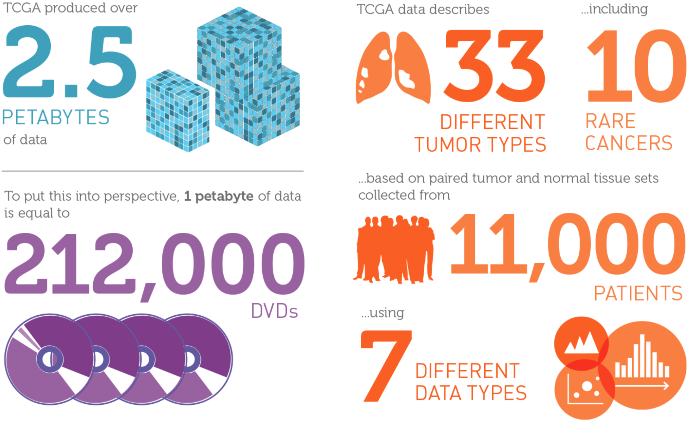
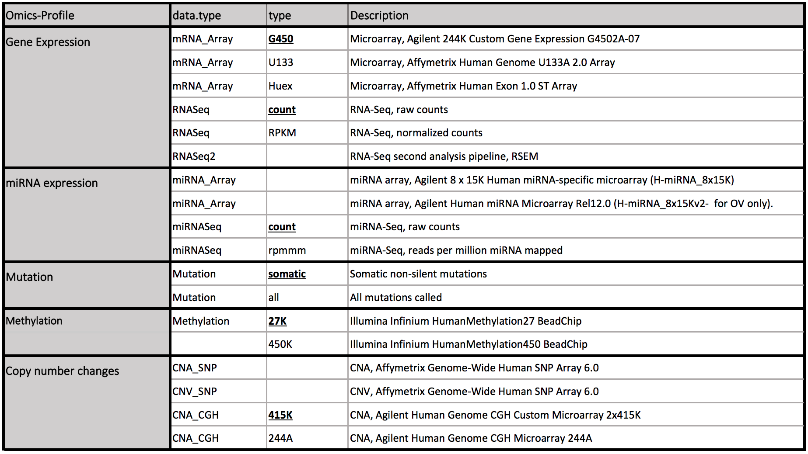
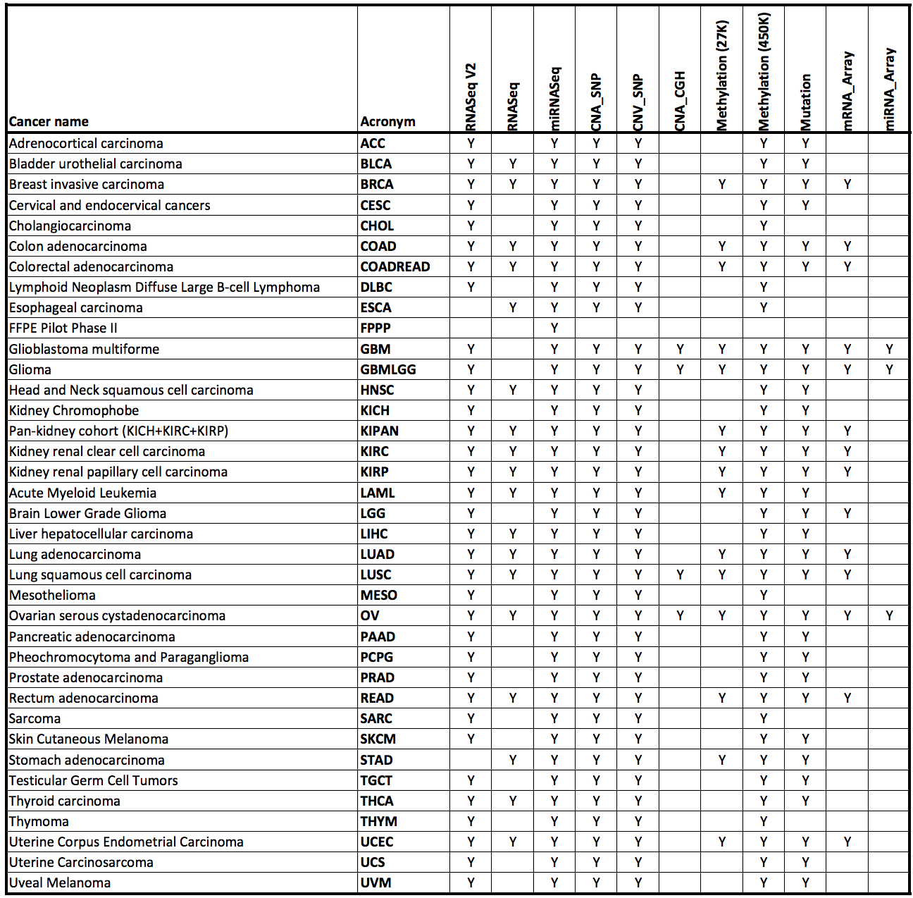
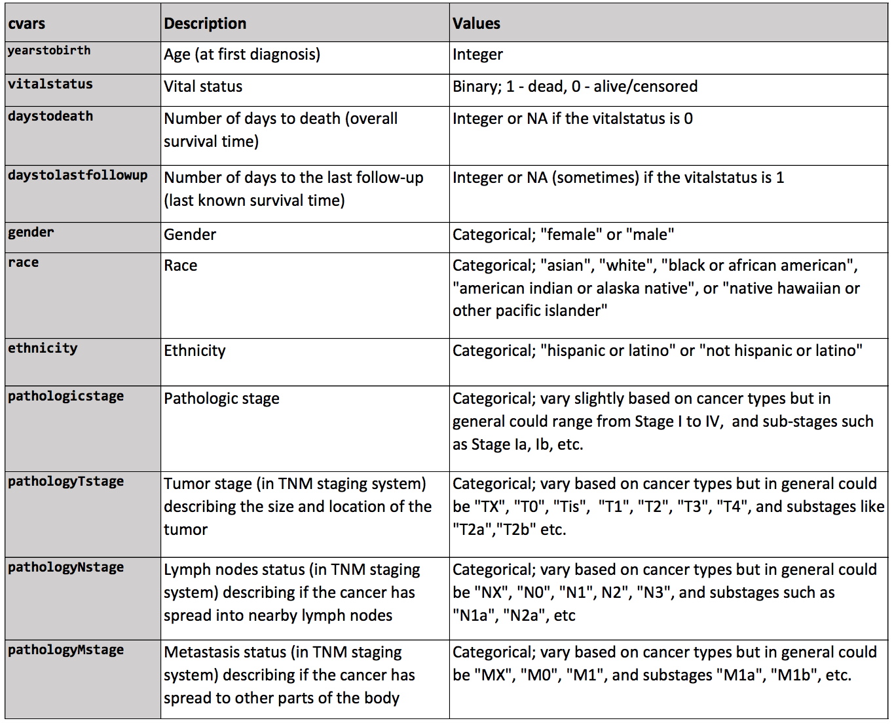
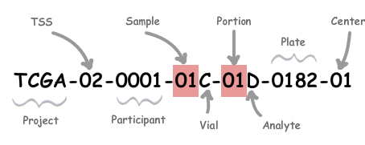
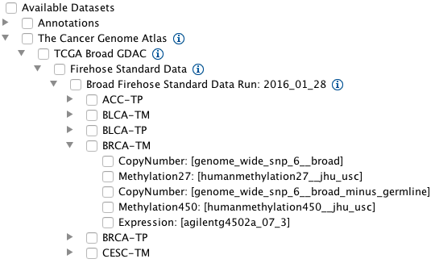
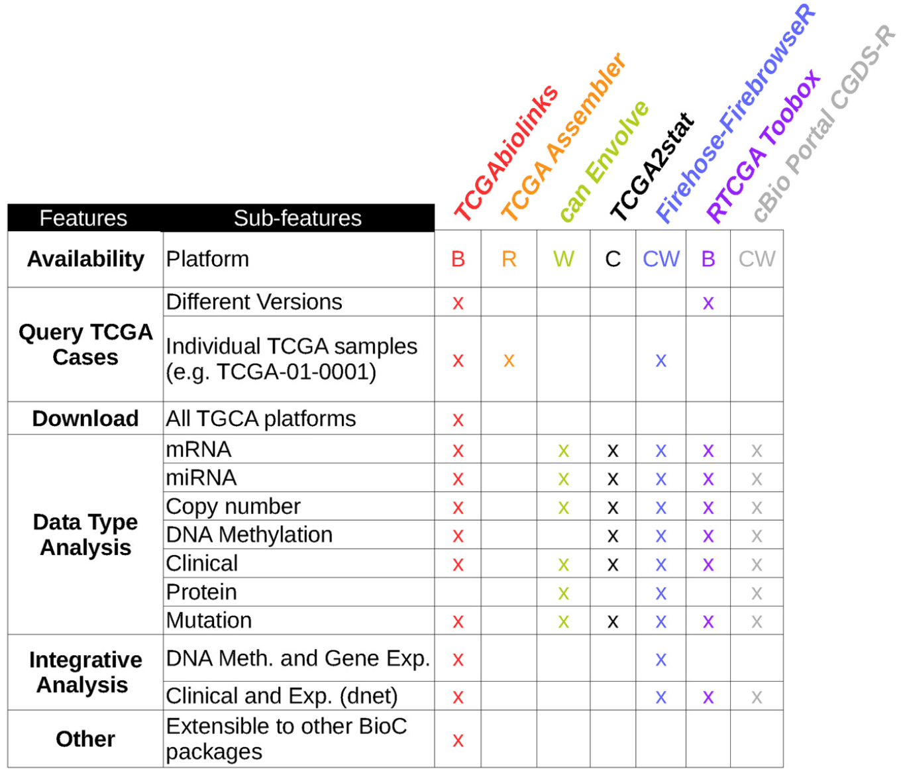
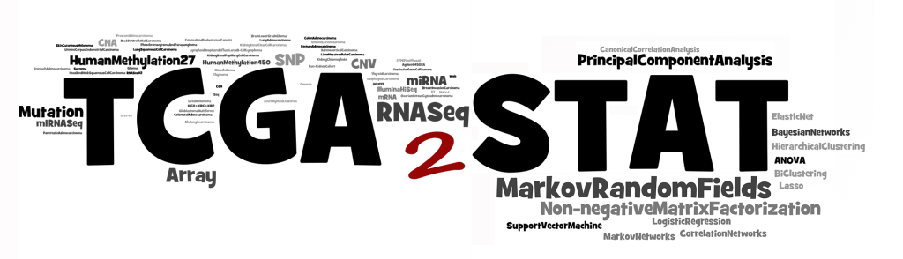

```{r xaringan-themer, include = FALSE}
library(xaringanthemer)
mono_light(
  base_color = "midnightblue",
  header_font_google = google_font("Josefin Sans"),
  text_font_google   = google_font("Montserrat", "500", "500i"),
  code_font_google   = google_font("Droid Mono"),
  link_color = "#8B1A1A", #firebrick4, "deepskyblue1"
  text_font_size = "28px"
)
library(dplyr)
library(ggplot2)
```

<!-- HTML style block -->
<style>
.large { font-size: 130%; }
.small { font-size: 70%; }
.tiny { font-size: 40%; }
</style>


## The Cancer Genome Atlas (TCGA)

- Started December 13, 2005, phase II in 2009, ended in 2014

- Mission - to accelerate our understanding of the molecular basis of cancer through the application of genome analysis technologies, including large-scale genome sequencing.

- Data generation
    - Clinical information about participants
    - Metadata about the samples (e.g. the weight of a sample portion, etc.)
    - Histopathology slide images from sample portions
    - Molecular information derived from the samples (e.g. mRNA/miRNA expression, protein expression, copy number, etc.)

.small[ https://www.cancer.gov/ccg/research/genome-sequencing/tcga ]

---
## TCGA by the numbers

```{r, out.width = "800px", fig.align='center', echo=FALSE}

```
.small[ https://www.cancer.gov/ccg/research/genome-sequencing/tcga ]

<!---
## Major TCGA Research Components

* **Biospecimen Core Resource (BCR)** - Collect and process tissue samples

* **Genome Sequencing Centers (GSCs)** - Use high-throughput Genome Sequencing to identify the changes in DNA sequences in cancer

* **Genome Characterization Centers (GCCs)** - Analyze genomic and epigenomic changes involved in cancer

* **Data Coordinating Center (DCC)** - The TCGA data are centrally managed at the DCC

* **Genome Data Analysis Centers (GDACs)** - These centers provide informatics tools to facilitate broader use of TCGA data.
-->

---
## TCGA Data Access Policy

* An access control policy is in place for TCGA data to ensure that personally identifiable information is kept from unauthorized users.

* **Open access** - Houses data that cannot be aggregated to generate a data set unique to an individual. This tier does not require user certification for data access.

* **Controlled access** - Houses individually-unique information that could potentially be used to identify an individual. This tier requires user certification for data access.

---
## TCGA Controlled Access Data

Access to controlled data is available to researchers who:

* Agree to restrict their use of the information to biomedical research purposes only

* Agree with the statements within TCGA Data Use Certification (DUC)

* Have their institutions certifiably agree to the statements within TCGA DUC

* Complete the Data Access Request (DAR) form and submit it to the Data Access Committee to be a TCGA Approved User. This form is available electronically through dbGaP.

.small[ https://gdc.cancer.gov/access-data/obtaining-access-controlled-data ]

---
## TCGA data types

```{r, out.width = "850px", fig.align='center', echo=FALSE}

```
.small[ http://www.liuzlab.org/TCGA2STAT/DataPlatforms.pdf ]

---
## TCGA cancer types

```{r, out.width = "750px", fig.align='center', echo=FALSE}

```
.small[ http://www.liuzlab.org/TCGA2STAT/CancerDataChecklist.pdf ]

---
## TCGA Clinical data

```{r, out.width = "700px", fig.align='center', echo=FALSE}

```
.small[ http://www.liuzlab.org/TCGA2STAT/ClinicalVariables.pdf ]

---
## TCGA sample identifiers

* Each sample has a unique ID (barcode), like `TCGA-AO-A128` or `TCGA-A1-A0SK-01A`

* Each barcode can and should be parsed

```{r, out.width = "400px", fig.align='center', echo=FALSE}

```

* Can be used to distinguish normal and tumor samples (Sample: Tumor types range from 01 - 09, normal types from 10 - 19 and control samples from 20 - 29)

* Not to be confused with case UUIDs, like `7eea2b6e-771f-44c0-9350-38f45c8dbe87`, which are bound to filenames

.small[ https://wiki.nci.nih.gov/display/TCGA/TCGA+barcode ]

---
## PAM50

* Breast cancer can be classified into 4 major intrinsic subtypes: Luminal A, Luminal B, Her2-enriched, Basal

* Subtypes are clinically relevant for drug sensitivity and long-term survival

* Determine tumor subtype by looking at the gene expression of 50 genes

.small[ Parker, Joel S., Michael Mullins, Maggie C. U. Cheang, Samuel Leung, David Voduc, Tammi Vickery, Sherri Davies, et al. “Supervised Risk Predictor of Breast Cancer Based on Intrinsic Subtypes.” Journal of Clinical Oncology: Official Journal of the American Society of Clinical Oncology 27, no. 8 (March 10, 2009): 1160–67. https://doi.org/10.1200/JCO.2008.18.1370. ]

.small[ https://xenabrowser.net/datapages/?dataset=TCGA.BRCA.sampleMap/BRCA_clinicalMatrix&host=https://tcga.xenahubs.net ]

.small[ `genefu` R package for PAM50 classification and survival analysis. https://www.bioconductor.org/packages/release/bioc/html/genefu.html ]

---
## The Broad Institute Genome Data Analysis Center (GDAC) Firehose

* Standardized, analysis-ready TCGA datasets
  * Aggregated, version-stamped
  * Analysis-ready format / semantics

* Standardized analyses results
  * Gold standard algorithms: GISTIC (Genomic Identification of Significant Targets in Cancer), MutSig (significantly mutated genes), ...
  * Companioned with biologist-friendly reports

.small[ http://gdac.broadinstitute.org/ ]

---
## Firehose data access

<!-- * `fbget` - Python application programming interface (API) with >27 functions for Sample-level data, Firehose analyses, Standard data archives, Metadata access -->

* Unix command-line access, `firehose_get`

* `FirebrowseR` - An R client for broads firehose pipeline, providing TCGA data sets

* `web-TCGA` - a shiny app to access TCGA data from Firebrowse

.small[
http://firebrowse.org/

https://broadinstitute.atlassian.net/wiki/spaces/GDAC/pages/844333139/Download

<!-- https://confluence.broadinstitute.org/display/GDAC/fbget -->

<!-- https://confluence.broadinstitute.org/display/GDAC/Download -->

https://github.com/mariodeng/FirebrowseR

https://github.com/mariodeng/web-TCGA
]

<!---
## Firehose data visualization

Firehose data comes pre-loaded in IGV (File/Load from server)

```{r, out.width = "700px", fig.align='center', echo=FALSE}

```
-->


---
## R resources to access TCGA data

* `curatedTCGAData` - Curated Data From The Cancer Genome Atlas (TCGA) as MultiAssayExperiment Objects
  * MultiAssayExperiment objects integrate multiple assays (e.g. RNA-seq, copy number, mutation, microRNA, protein, and others) with clinical / pathological data.
  * Patient IDs are matched (same number and order) across multiple assays, enabling harmonized subsetting of rows (features) and columns (patients / samples) across the entire experiment.

* `HarmonizedTCGAData` - Processed Harmonized TCGA Data of Five Selected Cancer Types

.small[
https://bioconductor.org/packages/release/data/experiment/html/curatedTCGAData.html

MultiAssayExperiment TCGA data, http://tinyurl.com/MAEOurls https://bioconductor.org/packages/release/data/experiment/html/HarmonizedTCGAData.html
]

---
## R resources to access TCGA data

* `curatedOvarianData`
  * 30 datasets, > 3K unique samples
  * survival, surgical debulking, histology...

* `curatedCRCData` (colorectal)
  * 34 datasets, ~4K unique samples
  * many annotated for MSS, gender, stage, age, N, M

* `curatedBladderData`
  * 12 datasets, ~1,200 unique samples
  * many annotated for stage, grade, OS

---
## TCGA packages

* `TCGAbiolinks` - an R/Bioconductor package for integrative analysis of TCGA data

```{r, out.width = "300px", fig.align='center', echo=FALSE}

```

.small[ Colaprico, Antonio, Tiago C. Silva, Catharina Olsen, Luciano Garofano, Claudia Cava, Davide Garolini, Thais S. Sabedot, et al. “TCGAbiolinks: An R/Bioconductor Package for Integrative Analysis of TCGA Data.” Nucleic Acids Research 44, no. 8 (May 5, 2016): e71. https://doi.org/10.1093/nar/gkv1507. ]

.small[ https://bioconductor.org/packages/release/bioc/html/TCGAbiolinks.html ]

<!---
 TCGA2STAT

```{r, out.width = "800px", fig.align='center', echo=FALSE}

```

* Well-structured TCGA data access in R

.small[ http://www.liuzlab.org/TCGA2STAT/ ]
-->


<!--
## Gitools

* A framework for analysis and visualization of multidimensional genomic data using interactive heatmaps
* User-provided and precompiled datasets: TCGA, IntOGen
* Analyses: Enrichment, Group Comparison, Mutual exclusion and co-occurrence test, Correlations, Overlaps, Combination of p-values

```{r, out.width = "90px", fig.align='center', echo=FALSE}

```

.small[ http://www.gitools.org/ ]
-->

---
## TCGA analysis on the cloud

* Goal - simplify centralized access to TCGA data and provide easy analysis

* Three centers were awarded to develop cloud access
  * Institute for Systems Biology Cancer Genomics Cloud (ISB-CGC)
  * Broad Institute FireCloud
  * Seven Bridges Cancer Genomics Cloud

.small[
http://cgc.systemsbiology.net/

https://software.broadinstitute.org/firecloud/

http://www.cancergenomicscloud.org/
]

