```{r xaringan-themer, include = FALSE}
library(xaringanthemer)
mono_light(
  base_color = "midnightblue",
  header_font_google = google_font("Josefin Sans"),
  text_font_google   = google_font("Montserrat", "500", "500i"),
  code_font_google   = google_font("Droid Mono"),
  link_color = "#8B1A1A", #firebrick4, "deepskyblue1"
  text_font_size = "28px"
)
library(dplyr)
library(ggplot2)
```


<!-- HTML style block -->
<style>
.large { font-size: 130%; }
.small { font-size: 70%; }
.tiny { font-size: 40%; }
</style>


## Problem: Exact String Matching

- **Input**: A text string $T$, where $\|T\| = n$, and a pattern string $P$, where $\|P\| = m$.

- **Output**: An index $i$ such that $T_{i+j-1} = P_j$ for all $1 \le j \le m$, i.e. showing that $P$ is a substring of $T$.

---
## String Matching Algorithm

The following brute force search algorithm always uses at most $n \times m$ steps:

```
# i is the starting position in T where we attempt to match P
for i = 1 to n - m + 1 do 
  # j indexes the current character of the pattern P being compared
  j = 1
  
  while (j <= m) and (T[i + j - 1] == P[j]) do
    # Compare characters of T and P one by one
    # T[i + j - 1] is the character in T aligned with P[j]
    # Continue while characters match and pattern not exhausted
    
    j = j + 1
    # Move to the next character in the pattern
  
  if (j > m) then
    # If j > m, all m characters of P matched successfully
    
    print "pattern at position ", i
    # Report that P occurs in T starting at position i

```

---
## String Matching Algorithm
```{r eval=FALSE}
# T is the text string (length n)
# P is the pattern string (length m)
string_match <- function(T, P) {
  n <- nchar(T)
  m <- nchar(P)
  
  # i is the starting position in T where we attempt to match P
  for (i in 1:(n - m + 1)) {
    # j indexes the current character of the pattern P being compared
    j <- 1
    
    while (j <= m && substr(T, i + j - 1, i + j - 1) == substr(P, j, j)) {
      # Compare characters of T and P one by one
      # substr(T, i + j - 1, i + j - 1) is the character in T aligned with P[j]
      # Continue while characters match and pattern not exhausted
      
      j <- j + 1
      # Move to the next character in the pattern
    }
    
    if (j > m) {
      # If j > m, all m characters of P matched successfully
      cat("Pattern found at position", i, "\n")
      # Report that P occurs in T starting at position i
    }
  }
}

# Example usage:
# string_match("GCATCGCAGAGAGTATACAGTACG", "GCAGAG")
```

---
## Analysis

- This algorithm might use only $n$ steps if we are lucky, e.g. $T = aaaaaaaaaaa$, and $P = bbbbbbb$.

- We might need $\sim n \times m$ steps if we are unlucky, e.g. $T = aaaaaaaaaaa$, and $P = aaaaaab$.

- We can’t say what happens "in practice", so we settle for a worst case analysis.

--


- By being more clever, we can reduce the worst case running time to $O(nm)$.
- Certain generalizations won’t change this, like stopping after the first occurrence of the pattern.
- Certain other generalizations seem more complicated, like matching with gaps.


---
## Algorithm Complexity

We use the "Big oh" notation to state an upper bound on the number of steps that an algorithm takes in the worst case. Thus the brute force string matching algorithm is $O(nm)$, or takes _quadratic_ time.  

- A _linear_ time algorithm, i.e. $O(n + m)$, is fast enough for almost any application.
- A _quadratic_ time algorithm is usually fast enough for small problems, but not big ones, since $1000^2 = 1, 000, 000$ steps is reasonable but $1,000,000^2$ is not.
<div class="incremental">
- An exponential-time algorithm, i.e. $O(2^n)$ or $O(n!)$, can only be fast enough for tiny problems, since $2^{20}$ and $10!$ are already up to $1, 000, 000$.
- Unfortunately, for many alignment problems, there is no known polynomial algorithm.
- Even worse, most of these problems can be proven NP-complete, meaning that no such algorithm can exist!
</div>

<!--
End: - `Basics_of_alignment_lecture1.pdf` - Excerpt from http://www.algorist.com/computational_biology/pdf/lecture1.pdf, video https://www.youtube.com/watch?v=pJAIalWDgY0&list=PLA48145CC64FE7990
-->

---
## String graph

- Alignments that may be transitively inferred from all pairwise alignments are removed

- A graph is created with a vertex for the endpoint of every read

- Edges are created both for each unaligned interval of a read and for each remaining pairwise overlap

- Vertices connect edges that correspond to the reads that overlap

- When there is allelic variation, alternative paths in the graph are formed

.small[ Chaisson, M., Wilson, R. & Eichler, E. Genetic variation and the de novo assembly of human genomes. Nat Rev Genet 16, 627–640 (2015). https://doi.org/10.1038/nrg3933 ]

<!--c | String graph. Alignments that may be transitively inferred from all pairwise alignments are removed (grey arrows). A graph is created with a vertex for the endpoint of every read. Edges are created both for each unaligned interval of a read and for each remaining pairwise overlap. Vertices connect edges that correspond to the reads that overlap. When there is allelic variation, alternative paths in the graph are formed. Not shown, but common to all three algorithms, is the use of read pairs to produce the final assembly product.-->

---
## String graph

```{r, out.width = "800px", fig.align='center', echo=FALSE}
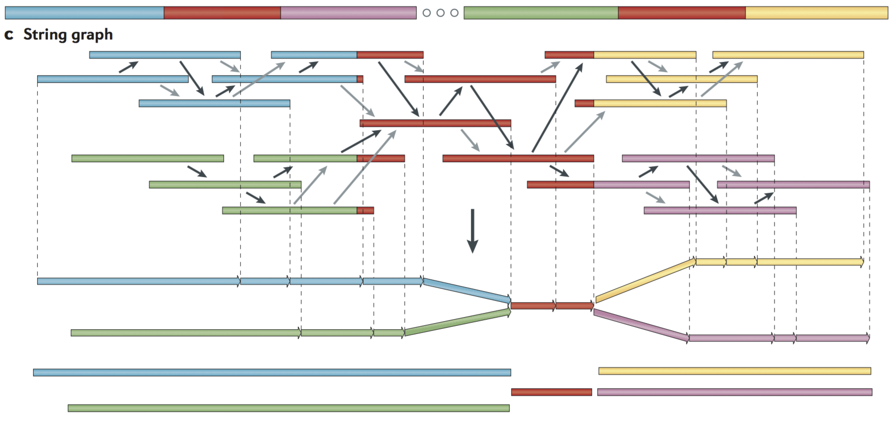
```

.small[ Chaisson, M., Wilson, R. & Eichler, E. Genetic variation and the de novo assembly of human genomes. Nat Rev Genet 16, 627–640 (2015). https://doi.org/10.1038/nrg3933 ]

<!--
Begin: - `Basics_of_alignment_lecture1.pdf` - Excerpt from http://www.algorist.com/computational_biology/pdf/lecture1.pdf, video https://www.youtube.com/watch?v=pJAIalWDgY0&list=PLA48145CC64FE7990
-->

---
## Real-world assembly methods

.pull-left[
- OLC - Overlap-Layout-Consensus assembly

- DBG - De Bruijn graph assembly

- Both handle unresolvable repeats by essentially leaving them out

- Unresolvable repeats break the assembly into fragments Fragments are contigs (short for contiguous)
]
.pull-right[
```{r, out.width = "500px", fig.align='center', echo=FALSE}
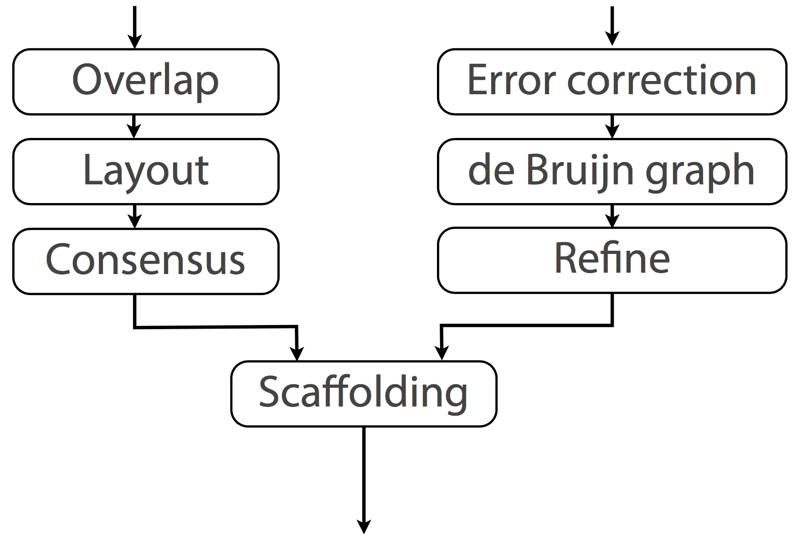
```
]

---
## Overlap‐layout‐consensus (OLC)

```{r, out.width = "900px", fig.align='center', echo=FALSE}
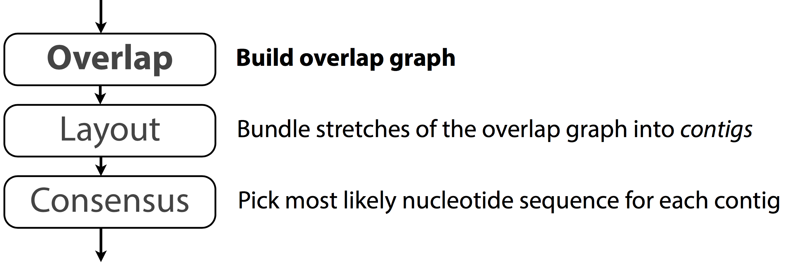
```

---
## Overlap‐layout‐consensus (OLC)

- All pairwise alignments (arrows) between reads (solid bars) are detected.
- Reads are merged into contigs (below the vertical arrow) until a read at a repeat boundary (split colour bar) is detected, leading to a repeat that is unresolved and collapsed into a single copy. 

```{r, out.width = "800px", fig.align='center', echo=FALSE}
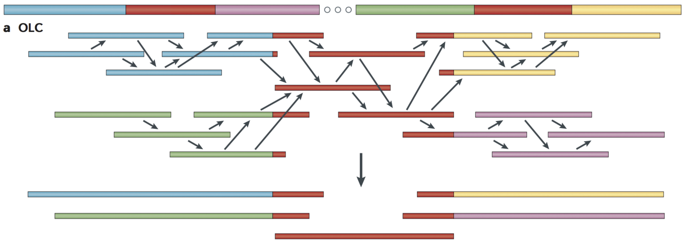
```
.small[ Chaisson, M., Wilson, R. & Eichler, E. Genetic variation and the de novo assembly of human genomes. Nat Rev Genet 16, 627–640 (2015). https://doi.org/10.1038/nrg3933 ]

<!--A genome schematic is shown at the top with four unique regions (blue, violet, green and yellow) and two copies of a repeated region (red). Three different strategies for genome assembly are outlined below this schematic. a | Overlap-layout-consensus (OLC). All pairwise alignments (arrows) between reads (solid bars) are detected. Reads are merged into contigs (below the vertical arrow) until a read at a repeat boundary (split colour bar) is detected, leading to a repeat that is unresolved and collapsed into a single copy.-->

---
## Overlap graph formulation

- Treat each sequence as a "node"

- Draw an edge between two nodes if there is significant overlap between the two sequences

- Hopefully the contig covers all or large number of sequences, once for each sequence

- In other words, we are looking for Hamiltonian path in the overlap graph

- Pros: straightforward formulation

- Cons: no efficient accurate algorithm; repeats

---
## de Bruijn assembly

- Reads are decomposed into overlapping k‐mers. 

- Identical k‐mers are merged and connected by an edge when appearing adjacently in reads. 

- Contigs are formed by merging chains of k‐mers until repeat boundaries are reached. 

- If a k‐mer appears in multiple positions (red segment) in the genome, it will fragment assemblies and additional graph operations must be applied to resolve such small repeats. 

- The k‐mer approach is ideal for short‐read data generated by massively parallel sequencing (MPS). 

.small[ https://en.wikipedia.org/wiki/Nicolaas_Govert_de_Bruijn ]

<!--b | de Bruijn assembly. Reads are decomposed into overlapping k-mers. An example of the decomposition for k = 3 nucleotides is shown, although in practice k ranges between 31 and 200 nucleotides. Identical k-mers are merged and connected by an edge when appearing adjacently in reads. Contigs are formed by merging chains of k-mers until repeat boundaries are reached. If a k-mer appears in multiple positions (red segment) in the genome, it will fragment assemblies and additional graph operations must be applied to resolve such small repeats. The k-mer approach is ideal for short-read data generated by massively parallel sequencing (MPS).-->

---
## de Bruijn assembly

- An example of the decomposition for k = 3 nucleotides is shown, although in practice k ranges between 31 and 200 nucleotides. 

```{r, out.width = "900px", fig.align='center', echo=FALSE}
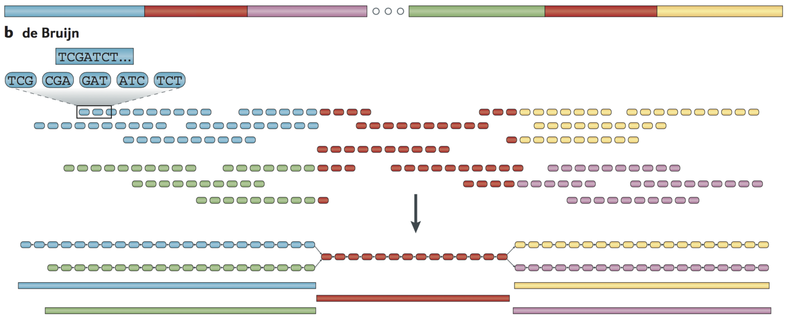
```

---
## de Bruijn assembly problems

Erroneous data create three types of graph structures: 

- "tips" due to errors at the edges of reads. 

- "bulges" due to internal read errors or to nearby tips.

- erroneous connections due to cloning errors or to distant merging tips.

---
## Velvet: de novo assembly using very short reads

```{r, out.width = "800px", fig.align='center', echo=FALSE}
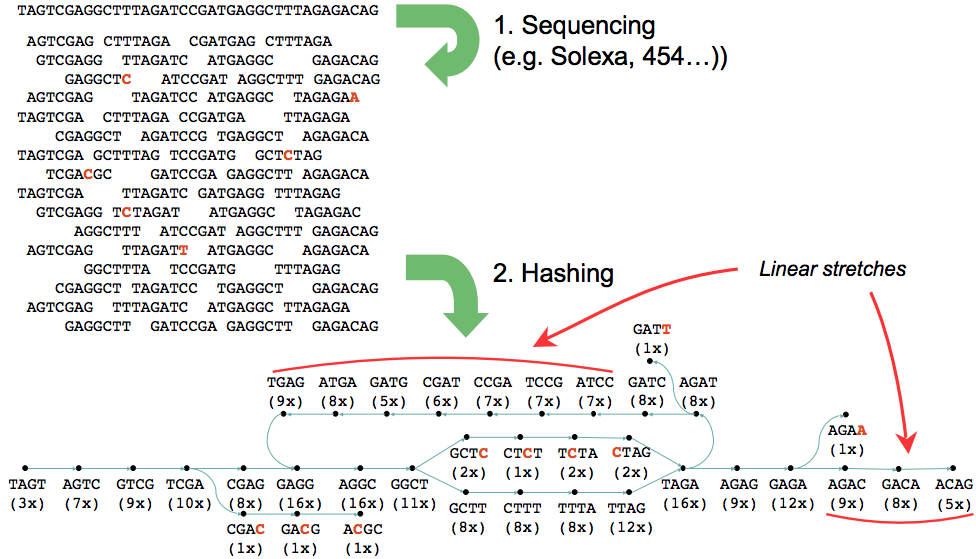
```

---
## Velvet: de novo assembly using de Bruijn graph

```{r, out.width = "800px", fig.align='center', echo=FALSE}
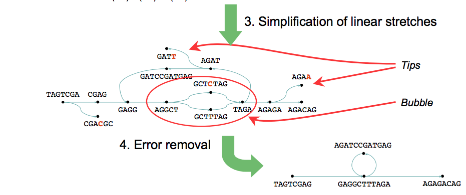
```

.small[ https://github.com/dzerbino/velvet

Zerbino, Daniel R., and Ewan Birney. "Velvet: Algorithms for de Novo Short Read Assembly Using de Bruijn Graphs." Genome Research 18, no. 5 (May 2008): 821–29. https://doi.org/10.1101/gr.074492.107. ]

---
class: middle,center
# Issues with reference genome sequence

---
## Alignment problems

- The genome being sequenced contains genomic variants

- Reads contain two kinds of errors: base substitutions and indels. Base substitutions occur with a frequency from 0.5–2%. Indels occur roughly 10 times less frequently

- Strand orientation is unknown

- Computers excel at finding exact matches. Errors should be explicitly handled
\- "Fuzzy" pattern matching is much more computationally expensive

---
## Alignment problems

- \> 50% of human genome is repeats - a major problem for fragment assembly
- Over 1 million Alu repeats (about 300 bp)
- About 200,000 LINE repeats (1000 bp and longer)
 
```{r, out.width = "500px", fig.align='center', echo=FALSE}
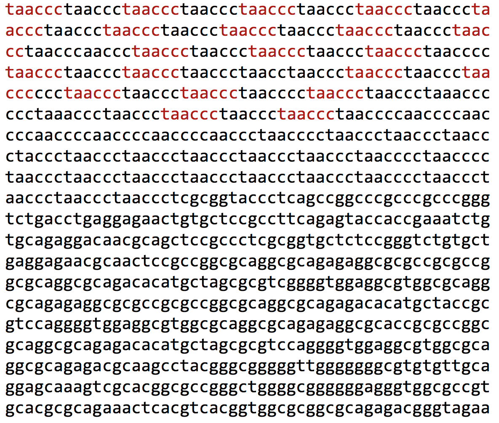
```

---
## Alignment with repeats

```{r, out.width = "900px", fig.align='center', echo=FALSE}
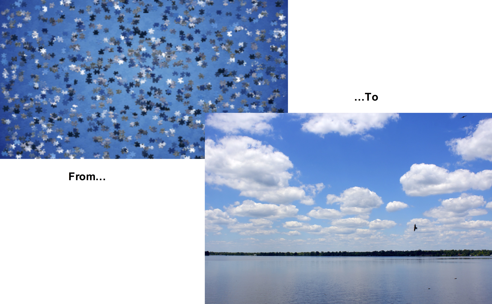
```

---
## Gaps

- Since we rely on fragment overlaps to identify their position, we must sample sufficient fragments to ensure enough overlaps.

- Let $T$ be the length of the target molecule being sequenced using $n$ random fragments of length $l$, where we recognize all overlaps of length $t$ or greater.

- The **Lander-Waterman equation** gives the expected number of gaps $g$ as:
$$g = ne^{\frac{-n(l-t)}{T}}$$

---
## Calculations

- Suppose we have fragments of length $l=1$. We sequence as many fragments as there is bases. Thus, $T = n$ and each fragment is length 1. The probability $p$ that base $i$ is not sampled is:

$$p=\left( \frac{n-1}{n} \right)^n -> \frac{1}{e}$$

---
## Gaps

- **Sequence-coverage gaps** - Sequencing gaps occur, under the simplest condition, where no sequence reads have been sampled for a particular portion of the genome

- **Segmental duplication-associated gaps** - Over one-third (206/540) of the euchromatic gaps in the human reference genome (GRCh38) are flanked by large, highly identical segmental duplications

- **Satellite-associated gaps** - These include short and long runs of tandem repeats designated as short tandem repeats (STRs; also known as microsatellites), variable number of tandem repeats (VNTRs; also known as macrosatellites) and Mb-sized centromeric satellite repeats

---
## Gaps

- **Muted gaps** - Muted gaps are defined as regions that are inadvertently closed in an assembly but that actually show additional or different sequences in the vast majority of individuals

- **Allelic variation gaps** - Some regions of a genome also show extraordinary patterns of allelic variation, often reflecting deep evolutionary coalescence

---
## Gaps

```{r, out.width = "800px", fig.align='center', echo=FALSE}
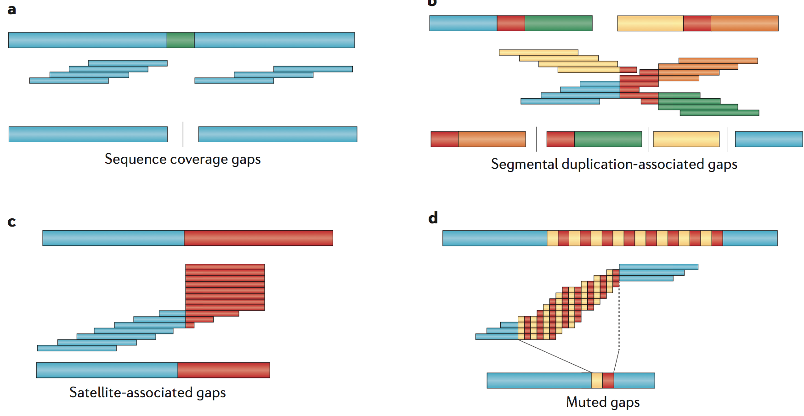
```
.small[ Chaisson, M., Wilson, R. & Eichler, E. Genetic variation and the de novo assembly of human genomes. Nat Rev Genet 16, 627–640 (2015). https://doi.org/10.1038/nrg3933 ]

---
## Coverage

- The coverage of a sequencing project is the ratio of the total sequenced fragment length to the genome length, i.e. $nl/T$.

- Gaps are very difficult and expensive to close in any sequencing strategy, meaning that very high coverage is necessary to use shotgun sequencing on a large genome.

---
## Evaluating Assemblies

- Coverage is a measure of how deeply a region has been sequenced

- The Lander-Waterman model predicts 8-10 fold coverage is needed to minimze the number of contigs for a 1 Mbp genome

- The **N50** length is a statistics in genomics defined as the shortest contig at which half of the total length of the assembly is made of contigs of that length or greater. 

- It is commonly used as a metric to summarize the contiguity of an assembly.

---
## Longer sequencing to complete human genomes

- Human genome is incomplete - ~160 gaps in euchromatin
- ~55% of them have been closed using Oxford Nanopore technology

```{r, out.width = "800px", fig.align='center', echo=FALSE}
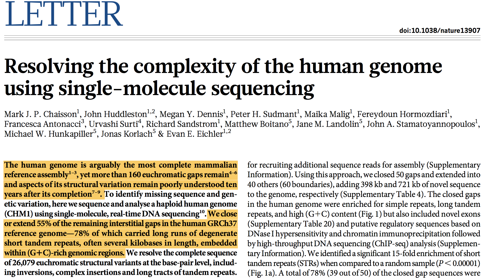
```

---
## Improving the Human Reference Genome(s)

```{r, out.width = "500px", fig.align='center', echo=FALSE}
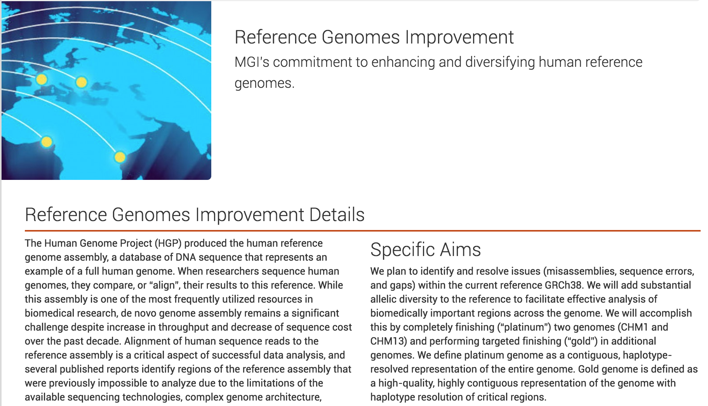
```

.small[ Jain, Miten, Sergey Koren, Karen H Miga, Josh Quick, Arthur C Rand, Thomas A Sasani, John R Tyson, et al. “Nanopore Sequencing and Assembly of a Human Genome with Ultra-Long Reads.” Nature Biotechnology, January 29, 2018. https://doi.org/10.1038/nbt.4060. - MinION nanopore sequencing to sequence human genome. Closed 12 gaps, fully typed MHC region. PCR-free sequencing preserves epigenetic modifications. Canu genome assembler. GraphMap, Minimap2 for mapping long reads. SVTyper, LUMPY for structural variants. https://www.genengnews.com/gen-exclusives/first-nanopore-sequencing-of-human-genome/77901044 ]

---
## The T2T-CHM13 Genome: First Complete Human Genome (2022)

- **T2T-CHM13v1.1** published in Science (2022) - truly gapless, telomere-to-telomere assembly

- **Added 238 Mbp** of new sequence not in GRCh38 (primarily centromeres, segmental duplications, rDNAs)

- **Closed all ~160 euchromatic gaps** in the reference genome

- **Discovered 115 new protein-coding genes** and corrected numerous misassemblies

- **Complete assembly of all acrocentric short arms** (66.1 Mbp previously unsequenced)

- **Accuracy:** Consensus quality >Q60 (1 error per million bases)

.small[ Sergey Nurk et al. ,The complete sequence of a human genome.Science376,44-53(2022).DOI:10.1126/science.abj698 ]

---
## Technologies and Methods for T2T Assembly

**Cell Line:**
- CHM13hTERT - complete hydatidiform mole (functionally haploid, no maternal genome)
- Eliminated phasing complexity of diploid genomes

**Sequencing Technologies:**
- **30× PacBio HiFi** (high accuracy, 10-20 kb reads, >99.9% accuracy)
- **120× Oxford Nanopore ultra-long** (median 50-150 kb, some >1 Mb reads)
- **70× PacBio CLR** (continuous long reads)
- **Hi-C and Strand-seq** for scaffolding and validation

---
## Technologies and Methods for T2T Assembly

**Assembly Strategy:**
- Homopolymer compression and self-correction of HiFi reads
- String graph construction from 100% identical overlaps
- Manual curation using ultra-long ONT reads to resolve complex repeats
- Iterative polishing and validation with multiple data types

Data includes BioNano optical mapping and Arima Hi-C.  
Assembly pipeline: HiCanu, custom graph methods, Winnowmap for mapping.

<!--
## Longer reads - more errors

- The increased read length and error rate of single-molecule sequencing has challenged genome assembly programs originally designed for shorter, highly accurate reads
- Several new approaches have been developed to address this, roughly categorized as hybrid, hierarchical, or direct
    - **Hybrid methods** use single-molecule reads to reconstruct the long-range structure of the genome, but rely on complementary short reads for accurate base calls
    - **Hierarchical methods** do not require a secondary technology and instead use multiple rounds of read overlapping (alignment) and correction to improve the quality of the single-mol- ecule reads prior to assembly
    - **Direct methods** attempt to assemble single-molecule reads from a single overlapping step without any prior correction
- Hierarchical strategy is the most suitable to produce continuous _de novo_ assembly

## Canu: scalable and accurate long-read assembly via adaptive k-mer weighting and repeat separation

- Overlapping and assembly algorithm
- MinHash alignment process to overlap noisy sequencing reads 
- Adaptive k-mer weighting to probabilistically handle repeats
- A modification of the greedy "best overlap graph" that avoids collapsing diverged repeats and haplotypes.

.small[ Koren, Sergey, Brian P. Walenz, Konstantin Berlin, Jason R. Miller, Nicholas H. Bergman, and Adam M. Phillippy. “Canu: Scalable and Accurate Long-Read Assembly via Adaptive k-Mer Weighting and Repeat Separation.” Genome Research 27, no. 5 (May 2017): 722–36. https://doi.org/10.1101/gr.215087.116.

https://github.com/marbl/canu, https://canu.readthedocs.io/en/latest/ ]
-->


