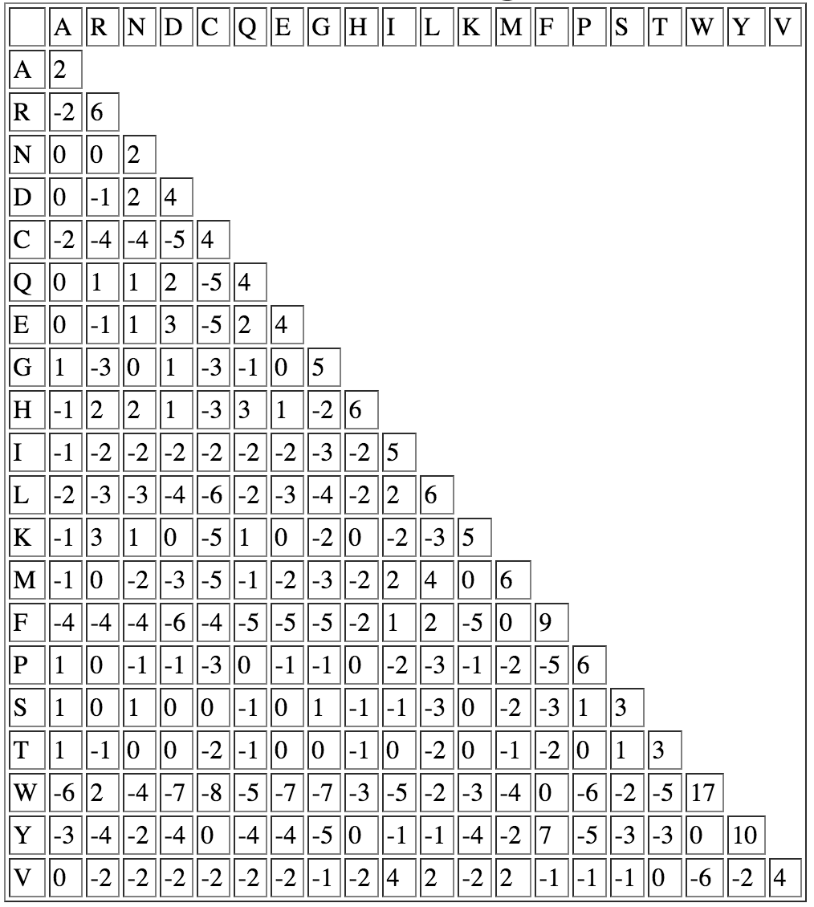

```{r xaringan-themer, include = FALSE}
library(xaringanthemer)
mono_light(
  base_color = "midnightblue",
  header_font_google = google_font("Josefin Sans"),
  text_font_google   = google_font("Montserrat", "500", "500i"),
  code_font_google   = google_font("Droid Mono"),
  link_color = "#8B1A1A", #firebrick4, "deepskyblue1"
  text_font_size = "28px"
)
library(dplyr)
library(ggplot2)
```


<!-- HTML style block -->
<style>
.large { font-size: 130%; }
.small { font-size: 70%; }
.tiny { font-size: 40%; }
</style>

## Alignment goals

- **Homology** - sequence similarity - helps to infer functions of genes uncharacterized in one organism but known in another

- **Global sequence alighment** (Needleman-Wunch)

- **Gapped local sequence alignment** (Smith-Waterman)

---
## Glibal alignment

Global alignment attempts to align two sequences end-to-end, forcing an alignment across their entire lengths.

When it is appropriate:

- Sequences are of similar length
- Sequences are homologous over their full length

---
## Glibal alignment

Typical use cases:

- Comparing orthologous genes
- Aligning full-length proteins
- Pairwise alignment in phylogenetics

Key properties:

- Penalizes gaps anywhere, including at sequence ends
- Sensitive to unrelated regions or large insertions/deletions
- Produces a single optimal alignment covering both sequences

---
## Local alignment

Local alignment finds the best matching subsequences within two sequences, without requiring alignment of the entire length.

When it is appropriate

- Sequences differ substantially in length
- Only subregions are homologous

---
## Local alignment

Typical use cases:

- Searching for domains or motifs
- Aligning reads to a reference
- Database searches

Key properties

- Does not penalize unaligned ends
- Can return multiple high-scoring local matches
- Robust to non-homologous flanking regions


---
## Needleman–Wunsch Algorithm (Global Alignment)

- The problem of finding best possible alignment of two sequences is solved by Saul B. Needleman and Christian D. Wunsch in 1970

- The Needleman-Wunsch algorithm is an example of dynamic programming, a discipline invented by Richard E. Bellman in 1953

- It refers as optimal matching problem or global alignment

.small[ Needleman, S. B., and C. D. Wunsch. “A General Method Applicable to the Search for Similarities in the Amino Acid Sequence of Two Proteins.” Journal of Molecular Biology (March 1970) https://doi.org/10.1016/0022-2836(70)90057-4  

Wikipedia: https://en.wikipedia.org/wiki/Needleman%E2%80%93Wunsch_algorithm ]

---
## Needleman-Wunsch algorithm

Core idea

- Dynamic programming over a 2D matrix

- Each cell represents the best alignment score up to that position

- The alignment must span both sequences entirely

---
## Needleman-Wunsch algorithm

- In its simplest form, assign a value $A$ where the aligned pair consists of the same letters (nucleotides, amino acids) 

- If the letters differ, subtract $B$ - edit penalty.

- If a gap needs to be made, subtract a gap penalty times the number of gaps

---
## Steps

1. Initialization of the score matrix $D(i,j)$ with gap penalties along the first row and column
2. Calculation of scores, such that
$$
D(i,j) = \max(\text{match},\ \text{delete},\ \text{insert})
$$

$$
\text{match} = D(i-1,j-1) + s(i,j)
$$

$$
\text{delete} = D(i-1,j) + g
$$

$$
\text{insert} = D(i,j-1) + g
$$

Where $s(i,j)$ is the substitution score for entries $i$ and $j$, and $g$ is the gap penalty

---
## Example of a simple penalty matrix

|   | A | G | C | T |
|:--:|:--:|:--:|:--:|:--:|
| **A** |  1 | -1 | -1 | -1 |
| **G** | -1 |  1 | -1 | -1 |
| **C** | -1 | -1 |  1 | -1 |
| **T** | -1 | -1 | -1 |  1 |

In reality, similarity matrices were derived based on evolutionary observations

---
## Alignment of two sequences

* **G A T** (horizontal)

* **G C T** (vertical)

* Scoring scheme:

  * Match = +1
  * Mismatch = −1
  * Gap = −1

---
## Step 1: Create the scoring matrix framework

Rows = vertical sequence (+ empty prefix)
Columns = horizontal sequence (+ empty prefix)

|   |   | G | A | T |
|---|---|---|---|---|
|   | 0 |   |   |   |
| G |   |   |   |   |
| C |   |   |   |   |
| T |   |   |   |   |

---
## Step 2: Initialize first row and first column with gap penalties

|   |   | G | A | T |
|---|---|---|---|---|
|   |  0 | -1 | -2 | -3 |
| G | -1 |    |    |    |
| C | -2 |    |    |    |
| T | -3 |    |    |    |

---
## Step 3: Fill cell (G,G)

Choices:
Diagonal: 0 + match = 0 + 1 = 1
Up:      -1 + gap   = -2
Left:    -1 + gap   = -2

Take max = 1

|   |   | G | A | T |
|---|---|---|---|---|
|   |  0 | -1 | -2 | -3 |
| G | -1 |  1 |    |    |
| C | -2 |    |    |    |
| T | -3 |    |    |    |

---
## Step 4: Fill cell (G,A)

Choices:
Diagonal: -1 + mismatch = -2
Up:       -2 + gap      = -3
Left:      1 + gap      =  0

Take max = 0

|   |   | G | A | T |
|---|---|---|---|---|
|   |  0 | -1 | -2 | -3 |
| G | -1 |  1 |  0 |    |
| C | -2 |    |    |    |
| T | -3 |    |    |    |

---
## Step 5: Fill cell (G,T)

Choices:
Diagonal: -2 + mismatch = -3
Up:       -3 + gap      = -4
Left:      0 + gap      = -1

Take max = -1

|   |   | G | A | T |
|---|---|---|---|---|
|   |  0 | -1 | -2 | -3 |
| G | -1 |  1 |  0 | -1 |
| C | -2 |    |    |    |
| T | -3 |    |    |    |

---
## Step 6: Fill cell (C,G)

Choices:
Diagonal: -1 + mismatch = -2
Up:        1 + gap      =  0
Left:     -2 + gap      = -3

Take max = 0

|   |   | G | A | T |
|---|---|---|---|---|
|   |  0 | -1 | -2 | -3 |
| G | -1 |  1 |  0 | -1 |
| C | -2 |  0 |    |    |
| T | -3 |    |    |    |

---
## Step 7: Fill cell (C,A)

Choices:
Diagonal:  1 + mismatch =  0
Up:        0 + gap      = -1
Left:      0 + gap      = -1

Take max = 0

|   |   | G | A | T |
|---|---|---|---|---|
|   |  0 | -1 | -2 | -3 |
| G | -1 |  1 |  0 | -1 |
| C | -2 |  0 |  0 |    |
| T | -3 |    |    |    |

---
## Step 8: Fill cell (C,T)

Choices:
Diagonal:  0 + mismatch = -1
Up:       -1 + gap      = -2
Left:      0 + gap      = -1

Take max = -1

|   |   | G | A | T |
|---|---|---|---|---|
|   |  0 | -1 | -2 | -3 |
| G | -1 |  1 |  0 | -1 |
| C | -2 |  0 |  0 | -1 |
| T | -3 |    |    |    |

---
## Step 9: Fill cell (T,G)

Choices:
Diagonal: -2 + mismatch = -3
Up:        0 + gap      = -1
Left:     -3 + gap      = -4

Take max = -1

|   |   | G | A | T |
|---|---|---|---|---|
|   |  0 | -1 | -2 | -3 |
| G | -1 |  1 |  0 | -1 |
| C | -2 |  0 |  0 | -1 |
| T | -3 | -1 |    |    |

---
## Step 10: Fill cell (T,A)

Choices:
Diagonal:  0 + mismatch = -1
Up:        0 + gap      = -1
Left:     -1 + gap      = -2

Take max = -1

|   |   | G | A | T |
|---|---|---|---|---|
|   |  0 | -1 | -2 | -3 |
| G | -1 |  1 |  0 | -1 |
| C | -2 |  0 |  0 | -1 |
| T | -3 | -1 | -1 |    |

---
## Step 11: Fill cell (T,T)

Choices:
Diagonal:  0 + match = 1
Up:       -1 + gap   = -2
Left:     -1 + gap   = -2

Take max = 1

Final scoring matrix:

|   |   | G | A | T |
|---|---|---|---|---|
|   |  0 | -1 | -2 | -3 |
| G | -1 |  1 |  0 | -1 |
| C | -2 |  0 |  0 | -1 |
| T | -3 | -1 | -1 |  1 |

---
## Traceback

- Global alignment forces full-length alignment

- Traceback always starts at the bottom-right

- Each move corresponds to a biological interpretation:
  - Diagonal → match/mismatch
  - Horizontal/vertical → insertion/deletion

- Multiple traceback paths ⇒ multiple optimal alignments

---
## Example of penalty matrix

Suppose your empirically defined matrix is

|   | A  | G  | C  | T  |
|:--:|:--:|:--:|:--:|:--:|
| **A** | 10 | -1 | -3 | -4 |
| **G** | -1 |  7 | -5 | -3 |
| **C** | -3 | -5 |  9 |  0 |
| **T** | -4 | -3 |  0 |  8 |

.pull-left[with gap penalty= -5  
Apply it to the second sequence:]
.pull-right[Read: AGACTAGTTAC  
Ref:  CGA---GACGT]

.center[-3+7+10+(3)(-5)+7-4+0-1+0 = 1]

---
## PAM250 

- The similarity matrix is frequently used to score aligned peptide sequences to determine the similarity of those sequences. 

- Derived from comparing aligned sequences of proteins with known homology and determining the "point accepted mutations" (PAM) observed. 

- The frequencies of these mutations are in this table as a "log odds-matrix" where: $M_{ij} = 10(log_{10}R_{ij})$,
where $M_{ij}$ is the matrix element and $R_{ij}$ is the probability of that substitution as observed in the database, divided by the normalized frequency of occurence for amino acid $i$. 

---
## PAM250 

```{r, out.width = "400px", fig.align='center', echo=FALSE}

```

.small[ https://www.thegpm.org/BIOML/aainfo/pam250.htm ]

---
## BLOSUM - BLOcks Substitution Matrix

- BLOSUM62 - sequences having at least 62% identity are merged together. 

- BLOSUM30 - sequences having at least 30% identity are merged together. 

- BLOSUM90 - sequences having at least 90% identity are merged together.

---
## Best possible alignment for two sequences

- The Needleman-Wunsch algorithm is mathematically proven to find the best alignment of two sequences

- N-W algorithm takes $O(n^2)$ to find best alignment of $n$ letters in two sequences

- Accessing all possible alignments one by one would take $\binom{2n}{n}$ steps, so $n^2$ is much smaller

---
## Sequence searching and alignment

- **FASTA** - a DNA and protein sequence alignment software package by David J. Lipman and William R. Pearson in 1985.  

- **BLAST** (Basic Local Alignment Search Tool) - an algorithm for comparing primary biological sequence information, such as the amino-acid sequences of proteins or the nucleotides of DNA sequences. 
    - Designed by Stephen Altschul, Warren Gish, Webb Miller, Eugene Myers, and David J. Lipman
    - Innovation: heuristic database search (speed), followed by optimal alignment (accuracy, statistics)

---
## BLAST

- BLAST is not used for NGS because it is too slow.

- Format for command line version: `blastall -d assemblyfasta -i genefasta -o output.blast -p blastn -e 1e-15`
    - `-i` indicates what is the gene file
    - `-o` indicates what you want the output to be
    - `-p` with ending "n" means nucleotide alignment -e statistical significance of alignments

- Magic-BLAST is an alternative

.small[https://ncbi.github.io/magicblast/

https://ncbiinsights.ncbi.nlm.nih.gov/2016/10/13/introducing-magic-blast/ ]

---
## BLAT (BLAST-Like Alignment Tool)

**BLAT** = fast alignment tool optimized for finding high-similarity sequences. 
Developed by Jim Kent (UCSC Genome Browser)

* Index the **genome**, not the query
* Use **k-mer exact matches** (default k=11 for DNA)
* Extend matches into longer alignments
* Optimized for **long, highly similar sequences**

BLAT trades sensitivity for speed and is ideal for **quick genomic coordinate mapping of similar sequences**.

.small[ https://genome.ucsc.edu/cgi-bin/hgBlat?command=start ]

---
## Significance of the alignment

- For local alignment we want to address how high an alignment score $S$ exceeds a cutoff $x$. 

- If the quality score is within random chance then it probably isn't a good alignment. We use an extreme value (aka  Gumbel) distribution with parameter:

$$P(S > x) = 1 - exp(-K M N e^{-\lambda x})$$

- $M$ is the effective length of the query sequence

- $N$ is the effective length of the reference sequence

- $K$ and $\lambda$ are positive parameters that depend on the score matrix and the composition of the sequences being compared

---
## E-values

- E-values are the number of alignments with scores at least equal to $x$ that would be expected by chance alone. The larger the database the more likely you will have a hit by chance, therefore we must take the size of the database into consideration.

- We can treat E-values as multiple comparison corrected p-values.
    - Low E-value ~ strong match or good hits
    - Commonly used threshold: E-value < 0.05

<!--
## New Aligners for NGS data: MAQ, BWA, Bowtie, SOAP, Rsubread, etc.

- The main technique for faster alignment: indexing. We make substrings of length $k$ (short integer) and put the substring and its location in a hash table.
- **MAQ** - Mapping and Assemblies with Quality (Li, Ruan, Durbin 2008)
    - Does the alignment but also calls SNPs
    - At the alignment stage it searches for the un-gapped match with the lowest mismatch score, defined as the sum of qualities at mismatching bases
    - Only considers positions that have two or fewer mismatches in the first 28 base pairs (this is the default which can be changed)
- Sequences that fail to reach a mismatch score threshold are searched with Smith-Waterman algorithm that allows for gaps
- Always reports a single alignment, positions aligned equally well to a read are chosen randomly
- Potential problem - multimapped reads will not contribute to variant calling
-->

---
## BWA, Bowtie

- Bowtie employs Burrows-Wheeler transform (BWT) based on the full-text minute-space (FM) index. Index is built using `bwa index`, `bowtie2-build`

```
acaacg$ → $acaacg →(sort) $acaacg → gc$aaac
          g$acaac         aacg$ac
          cg$acaa         acaacg$
          acg$aca         acg$aca
          aacg$ac         caacg$a
          caacg$a         cg$acaa
          acaacg$         g$acaac
```
- Bowtie has a memory footprint of 1.3 GB for the human genome. Very fast.
- The last first mapping can transform it back to the original sequence.

