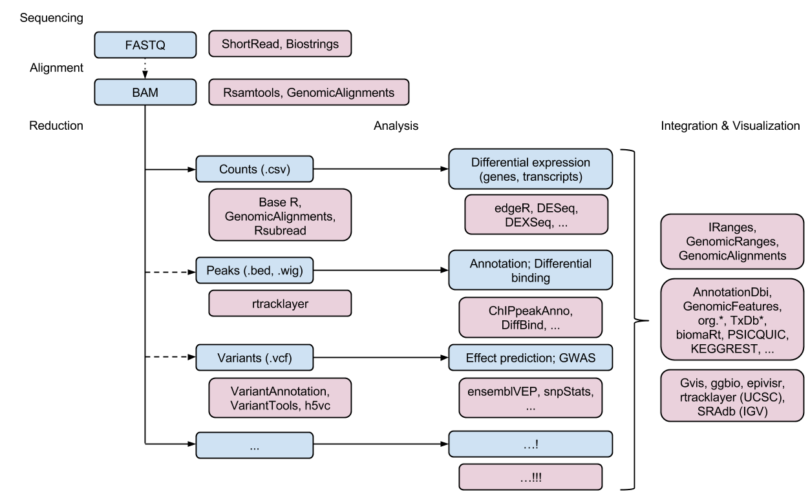
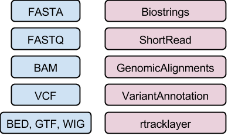

```{r xaringan-themer, include = FALSE}
library(xaringanthemer)
mono_light(
  base_color = "midnightblue",
  header_font_google = google_font("Josefin Sans"),
  text_font_google   = google_font("Montserrat", "500", "500i"),
  code_font_google   = google_font("Droid Mono"),
  link_color = "#8B1A1A", #firebrick4, "deepskyblue1"
  text_font_size = "28px"
)
library(dplyr)
library(ggplot2)
```

<!-- HTML style block -->
<style>
.large { font-size: 130%; }
.small { font-size: 70%; }
.tiny { font-size: 40%; }
</style>

<!--
## High-throughput sequence workflow
```{r, out.width = "800px", fig.align='center', echo=FALSE}

```
-->

## Bioconductor

**Analysis and comprehension of high-throughput genomic data**

* **Statistical Analysis:** Rigorous methods specifically designed for the unique noise and scale of large genomic datasets (e.g., normalization for sequencing depth).

* **Interpretation & Visualization:** Tools to bridge the gap between raw numbers and biological insights, including pathway analysis and publication-quality genomic plots.

* **Unified Framework:** Ensures reproducibility by providing a consistent object-oriented structure across different data types.

---
## Bioconductor

**Comprehensive Technology Support:**

* **Next-Gen Sequencing (NGS):** RNA-Seq, ChIP-Seq, Single-cell, Variant Calling, and Copy Number analysis.

* **Proteomics & Metabolomics:** Mass spectrometry and protein interaction data.

* **Single-Cell Analysis:** Flow cytometry, CyTOF, and spatial transcriptomics.

* **Bio-Imaging:** Automated high-content screening and image processing.

.small[ https://github.com/mikelove/bioc-refcard ]

---
## Bioconductor Package Ecosystem

- **Official Repository:** [bioconductor.org](https://www.bioconductor.org/)

- **Scale:** Currently hosts over **2,000+** software packages, along with thousands of annotation and experiment data packages.

- **Discovery via `biocViews`:** A specialized ontology (tags) used to browse packages by biological topic (e.g., *Epigenetics*), technology (e.g., *SingleCell*), or function (e.g., *Classification*).

.small[ **Browse all software:** http://bioconductor.org/packages/release/BiocViews.html#___Software ]

---
## Bioconductor Package Ecosystem

- **Package 'Landing Pages':** Every package features a standardized entry point including:
    - **Documentation:** Direct links to **Vignettes** (long-form tutorials) and **Reference Manuals**.
    - **Installation:** Specific `BiocManager::install()` commands.
    - **Community Metrics:** Support site activity and monthly download statistics.
    - **Provenance:** Author/maintainer contact and citation requirements.

- **Release Cycle:** - **Release Branch:** Stable versions updated every six months (aligned with R releases) for production work.
    - **Devel Branch:** The "bleeding edge" where new features are integrated and tested.

---
## Documentation: Manuals & Vignettes

* **Function-Level Help:** Every user-exposed function includes a dedicated help page. Assembled in **reference manuals**.
    * Access via `?function_name` (e.g., `?readVcf`).
    * Contains **runnable examples** that use built-in sample data to demonstrate immediate utility.

--

* **Vignettes (Narrative Tutorials):** A hallmark of *Bioconductor*. Provide high-level context and step-by-step analysis workflows.
    * **Integrated Code:** Combines explanatory text with executable R code blocks.
    * **Format:** Usually available as polished HTML or PDF documents.
    * **Discovery:** Use `vignette(package="PackageName")` to list available tutorials.

.small[ **Example Resource:** http://bioconductor.org/packages/devel/AnnotationHub ]

---
## The S4 Object System: Interoperability by Design

*Bioconductor* relies on a formal object-oriented system called **S4**. This ensures that complex biological data—like gene sequences, sample metadata, and quality scores—stay bundled together correctly and can be passed from one package to another without breaking.

* **Data Integrity:** S4 classes have "slots" with strict data types, preventing you from accidentally putting a character string where a genomic coordinate should be.

* **Interoperability:** Because many packages agree on a single format (like `GRanges`), you can use a package for alignment, another for filtering, and a third for visualization without manual reformatting.

---
## Exploring Objects Interactively

R provides built-in tools to "peek under the hood" of these complex objects:

* **Discovery:** Use `methods(class="GRanges")` to see every function that can operate on a specific object type.

* **Definitions:** * `getClass("GRanges")`: Shows the internal structure and slots of a class.
    * `selectMethod("findOverlaps", c("GRanges", "GRanges"))`: Shows the specific R code used to run a function for that object.

---
## Exploring Objects Interactively

**Accessing the Right Help.**

Because S4 uses "multiple dispatch" (the same function name might do different things for different objects), precise help is key:

* **Class Help:** Use `?GRanges-class` to see the documentation for the object structure itself.

* **Method Help:** Type `?findOverlaps,` and then hit the **`<Tab>`** key. This allows you to choose the documentation for the specific version of the function you are using (e.g., `findOverlaps` for `GRanges` vs. `GRangesList`).

---
## High-throughput sequence data

```{r, out.width = "700px", fig.align='center', echo=FALSE}

```

---
## DNA/amino acid sequences: FASTA files

- The `Biostrings` package is used to represent DNA and other sequences, with many convenient sequence-related functions, e.g., `?consensusMatrix`.

Input & manipulation, FASTA file example:

> NM_078863_up_2000_chr2L_16764737_f chr2L:16764737-16766736
> gttggtggcccaccagtgccaaaatacacaagaagaagaaacagcatctt
> gacactaaaatgcaaaaattgctttgcgtcaatgactcaaaacgaaaatg

.small[ http://bioconductor.org/packages/Biostrings ]

---
## `Biostrings`, DNA or amino acid sequences

**Classes**

* `XString`, `XStringSet`, e.g., `DNAString`, `DNAStringSet`

**Methods**

* Manipulation, e.g., `reverseComplement()`

* Summary, e.g., `letterFrequency()`

* Matching, e.g., `matchPDict()`, `matchPWM()`

.small[ http://bioconductor.org/packages/Biostrings ]

---
## Reads: FASTQ files

- The `ShortRead` package can be used for lower-level access to FASTQ files: `readFastq()`, `FastqStreamer()`, `FastqSampler()`

Input & manipulation, FASTQ file example: 

```text
@ERR127302.1703 HWI-EAS350_0441:1:1:1460:19184#0/1
CCTGAGTGAAGCTGATCTTGATCTACGAAGAGAGATAGATCTTGATCGTCGAGGAGATGCTGACCTTGACCT
+
HHGHHGHHHHHHHHDGG<GDGGE@GDGGD<?B8??ADAD<BE@EE8EGDGA3CB85*,77@>>CE?=896=:
```

.small[ http://bioconductor.org/packages/ShortRead ]

---
## Processing Aligned Reads: SAM/BAM Files

**'Low-Level' Control: `Rsamtools`.**
Designed for developers or specialized tasks requiring granular control over the BAM file interface.

* **Functionality:** Provides a direct wrapper around the **HTSlib** C library.

* **Capabilities:** 
  * `scanBam()`: Retrieves raw data from BAM files as a list of lists.
  * `indexBam()` / `sortBam()` / `mergeBam()`: File management utilities.
  * `pileup()`: Summarizes nucleotides at each genomic position.

* **Best for:** Developing new tools, custom filtering based on bitwise flags, or memory-restricted streaming.

.small[ http://bioconductor.org/packages/Rsamtools ]

---
## Processing Aligned Reads: SAM/BAM Files

**'High-Level' Analysis: `GenomicAlignments`**
Designed for biologists and bioinformaticians performing standard analysis. It abstracts the complexity of the BAM file into familiar genomic objects.

* **Functionality:** Reads alignments directly into `GAlignments` or `GAlignmentPairs` objects.

* **Ease of Use:** Automatically handles CIGAR strings to determine the "footprint" of a read on the genome.

* **Best for:** Overlap counting, coverage calculations, and visualising read density.

.small[ https://bioconductor.org/packages/GenomicAlignments ]


---
## `GenomicAlignments`: Processing Aligned Reads

GenomicAlignments classes inherit from the `GenomicRanges` infrastructure, making them compatible with standard range operations while adding alignment-specific metadata:

* **`GAlignments`**: Represents a set of "single-end" alignments. Stores the genomic position, strand, and the **CIGAR string** (which describes insertions, deletions, and matches).

* **`GAlignmentPairs`**: Specifically designed for "paired-end" data, maintaining the relationship between the first and last fragments of a DNA molecule.

* **`GAlignmentsList`**: A container for grouping alignments, often used for reads that map to multiple locations or chimeric alignments.

---
## `GenomicAlignments`: Processing Aligned Reads

The `GenomicAlignments` package provides a specialized framework for representing and manipulating short-read alignments (typically from BAM files) against a reference genome.

* **Data Input:**
    * `readGAlignments()`: Efficiently loads BAM files into R.
    * `readGAlignmentsList()`: Useful for loading paired-end data where some reads may have multiple or complex fragments.

* **Quantification:**
    * `summarizeOverlaps()`: A high-level function used to count how many reads overlap with specific genomic features (like exons or genes). This is a critical step for preparing data for differential expression analysis (e.g., with `DESeq2`).

.small[ https://bioconductor.org/packages/release/bioc/html/GenomicAlignments.html ]

---
## `VariantAnnotation`: VCF Format Analysis

The `VariantAnnotation` package is the primary Bioconductor tool for interacting with **Variant Call Format (VCF)** files. It allows for high-performance reading, filtering, and functional annotation of SNPs, insertions, and deletions.

* `readVcf()`: Loads the entire VCF (or a subset) into a `VCF` object, which coordinates fixed data (location, alleles), info data (site-level metadata), and genotype data (sample-level data).

* `readInfo()`: Retrieves only the site-specific annotations (e.g., ancestral allele, mapping quality).

* `readGeno()`: Extracts specific sample-level fields like Genotype (`GT`) or Depth (`DP`).

---
## Data Structures and Methods for Variants

The `VariantAnnotation` package utilizes specialized S4 classes to represent genomic variation, leveraging the `GenomicRanges` infrastructure.

* **`VCF` (Wide Format)**: The primary container for VCF data. 
    * It is "wide" because it maintains a matrix-like structure where rows represent variants and columns represent samples.
    * Best for multi-sample analysis where you need to compare genotypes (GT), depths (DP), or qualities (GQ) across an entire cohort.

--

* **`VRanges` (Tall Format)**: A specialized version of `GRanges`.
    * It is "tall" because it treats each variant-sample combination as an individual row.
    * Optimized for single-nucleotide variant (SNV) analysis, filtering, and performing statistical operations on specific alleles.

---
## `VariantAnnotation`: Analytical Methods

**Input/Output & Filtering**:

* `readVcf()` / `writeVcf()`: Standard functions for importing and exporting VCF data.

* `filterVcf()`: Allows for "streaming" through a VCF file on disk to create a new, smaller VCF based on specific criteria without loading the entire file into memory.

---
## `VariantAnnotation`: Analytical Methods

**Functional Annotation**:

* `locateVariants()`: Maps variants to gene structures (coding, promoter, UTR, intronic).

* `predictCoding()`: Translates DNA changes into protein consequences using a `BSgenome` reference and a `TxDb` object.

* `summarizeVariants()`: High-level counting of variants per genomic feature.

---
## `VariantAnnotation`: Analytical Methods

**SNP Analysis**:

* `genotypeToSnpMatrix()`: Converts VCF genotype data into the `SnpMatrix` format required by the `snpStats` package for Genome-Wide Association Studies (GWAS).

* `snpSummary()`: Provides quick transition and transversion counts and other allele frequencies.

.small[ http://bioconductor.org/packages/VariantAnnotation ]

---
## `rtracklayer`: Bridging Files and Ranges

- The `rtracklayer` package serves as the primary interface between external genomic file formats and Bioconductor’s internal data structures. 

- It provides a unified framework for importing and exporting data, while also offering direct integration with the UCSC Genome Browser.

- The `import()` and `export()` functions automatically detect file formats and convert them into `GRanges` or `UCSCData` objects.

---
## `rtracklayer`: Genomic Browser Integration

* **BED (Browser Extensible Data):** Used for defining genomic features and track annotations. 
  * *Result:* Imported as a `GRanges` object with standard columns (chrom, start, end, strand) and optional name/score metadata.

* **WIG / bigWig:** Used for dense, continuous-valued data such as conservation scores or signal tracks (ChIP-seq peaks). 
  * *Result:* `bigWig` is preferred for large datasets as it allows for fast, random access to genomic regions without loading the entire file.

---
## `rtracklayer`: Genomic Browser Integration

* **GTF / GFF (Gene Transfer Format):** The standard for describing gene models, including exons, introns, and CDS.
  * *Result:* Imported with detailed metadata columns for `gene_id`, `transcript_id`, and `exon_number`.

* **UCSC Interaction:** Beyond file handling, `rtracklayer` allows you to create, manage, and view "tracks" directly on the UCSC Genome Browser from within your R session.

* **LiftOver Support:** Provides the `liftOver()` function to translate genomic coordinates between different genome assemblies (e.g., converting `hg19` coordinates to `hg38`).

.small[ http://bioconductor.org/packages/rtracklayer ]

---
## Summary: The Bioconductor Ecosystem

* **Comprehensive Genomic Toolkit:** *Bioconductor* is a world-leading repository of open-source software, providing specialized tools for almost every high-throughput biological assay.

* **Data Integrity via S4 Classes:** The project relies on **formal S4 classes** (like `GRanges`, `SummarizedExperiment`, and `VCF`). These classes act as "containers" that enforce data integrity and cross-compatibility.

* **Vignettes as the Primary Resource:** **Vignettes** provide end-to-end analysis workflows, combining explanatory text with executable code that serves as a template for your own research.

.small[ The Bioconductor Help Page https://www.bioconductor.org/help/ ]

