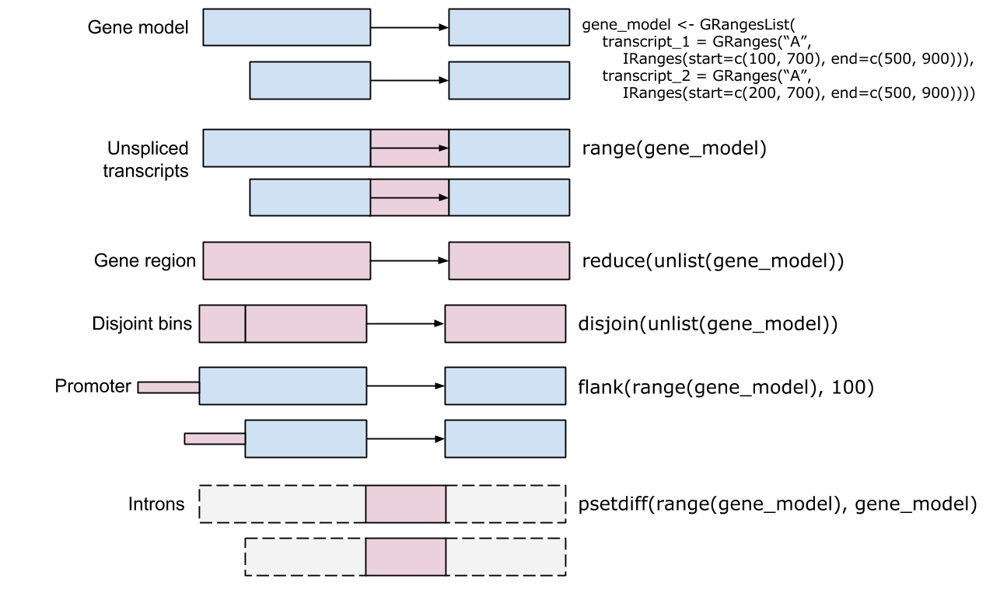
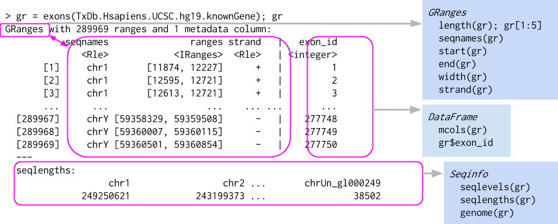
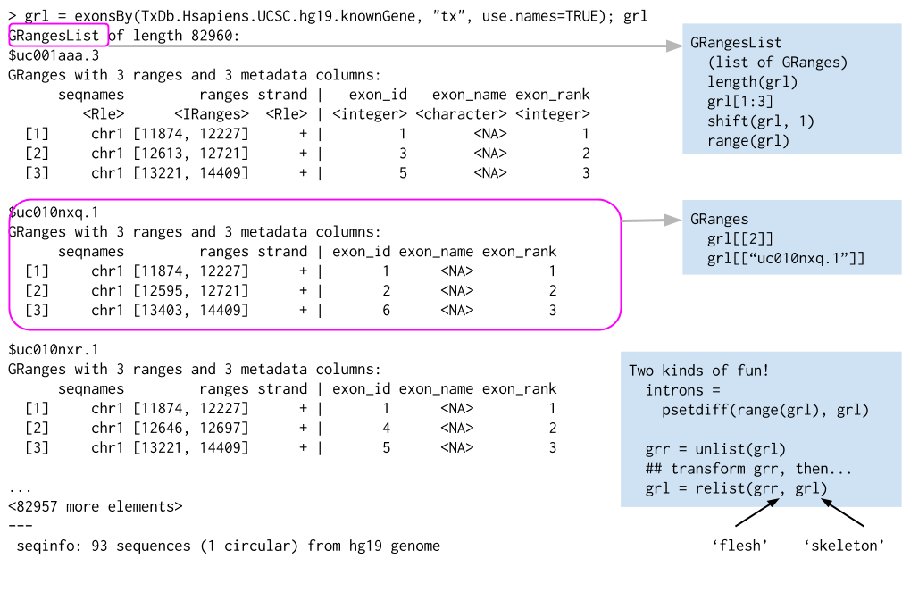

```{r xaringan-themer, include = FALSE}
library(xaringanthemer)
mono_light(
  base_color = "midnightblue",
  header_font_google = google_font("Josefin Sans"),
  text_font_google   = google_font("Montserrat", "500", "500i"),
  code_font_google   = google_font("Droid Mono"),
  link_color = "#8B1A1A", #firebrick4, "deepskyblue1"
  text_font_size = "28px"
)
library(dplyr)
library(ggplot2)
```

<!-- HTML style block -->
<style>
.large { font-size: 130%; }
.small { font-size: 70%; }
.tiny { font-size: 40%; }
</style>

## Ranges overview

```{r, out.width = "800px", fig.align='center', echo=FALSE}

```

---
## Ranges in Bioconductor: IRanges and GRanges

Bioconductor utilizes a hierarchical range infrastructure to manage genomic intervals efficiently, moving from simple integer math to complex genomic coordinates.

`IRanges` (Integer Ranges)

The fundamental building block for interval algebra in R. It focuses strictly on the sequence of integers without biological context.
* **Core Components:** Defined by any two of `start`, `end`, and `width`.
* **Properties:**
    * **List-like Behavior:** Supports standard R operations like `length()`, subsetting `[]`, and `c()`.
    * **Metadata (`mcols`):** Allows you to attach any amount of data (e.g., p-values, scores) to each specific range.

* **Primary Use:** Non-genomic intervals or internal calculations where strand and chromosome are irrelevant.

---
## Ranges in Bioconductor: IRanges and GRanges

Bioconductor utilizes a hierarchical range infrastructure to manage genomic intervals efficiently, moving from simple integer math to complex genomic coordinates.

`GRanges` (Genomic Ranges)

Extends `IRanges` by placing intervals onto a biological map. This is the "workhorse" class for most Bioconductor analyses.

* **The "Genomic" Context:** 
* `seqnames`: The chromosome or scaffold name (e.g., "chr1").
* `start`, `end`: Genomic coordinates
* `strand`: Defines the directionality (`+`, `-`, or `*` for unstranded).

.small[ **Key Methods:** `start(gr)`, `end(gr)`, `width(gr)`, `seqnames(gr)`, `strand(gr)`, and `mcols(gr)` ]

---
## Ranges in Bioconductor: IRanges and GRanges

```{r, out.width = "900px", fig.align='center', echo=FALSE}

```

---
## Ranges in Bioconductor: IRanges and GRanges

**`Seqinfo`:** A critical metadata component that tracks:

* **Genome Build:** (e.g., "hg38").

* **Sequence Lengths:** Ensures ranges do not accidentally exceed chromosome boundaries.

* **Circular Flags:** Identifies circular DNA (like mitochondria).

---
## Range methods

* **Intra-range**: `shift()`, `narrow()`, `flank()`, `promoters()`, `resize()`

* **Inter-range**: `range()`, `reduce()`, `gaps()`, `disjoin()`, `coverage()`

* **Between-range**: `findOverlaps()`, `countOverlaps()`, `summarizeOverlaps()`, `%over%`, `union()`, `intersect()`

---
## Lists of Genomic Ranges

* Useful for elements of the same type (e.g., exons within transcripts).

* Common trick: apply vectorized functions to unlisted representation, then re-list.

```{r, out.width = "800px", fig.align='center', echo=FALSE}

```

