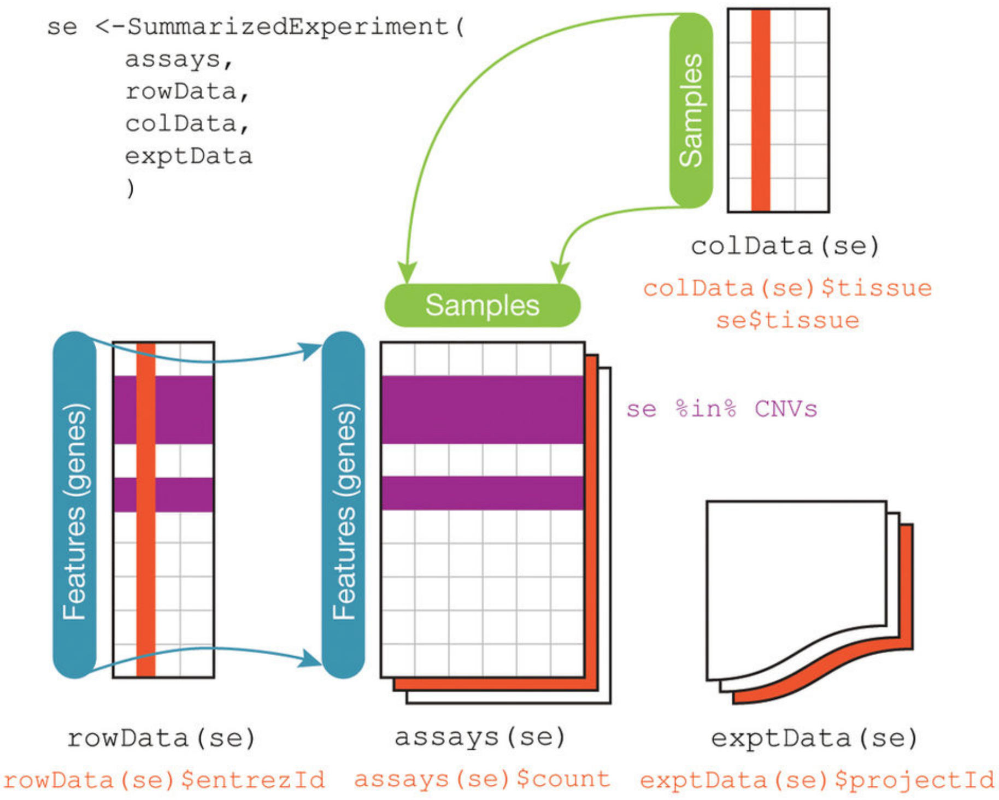
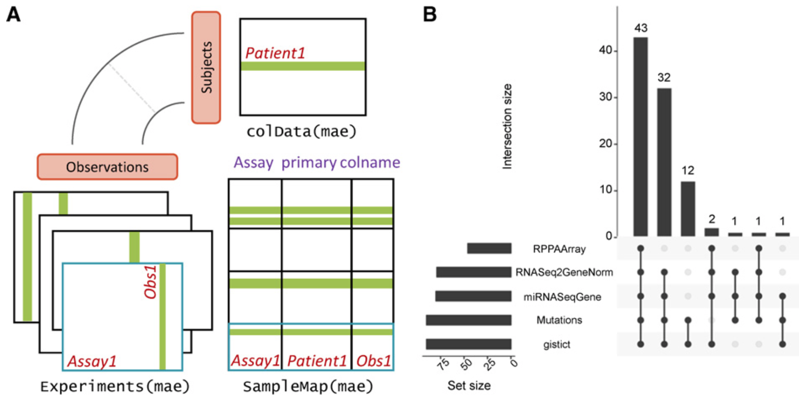

```{r xaringan-themer, include = FALSE}
library(xaringanthemer)
mono_light(
  base_color = "midnightblue",
  header_font_google = google_font("Josefin Sans"),
  text_font_google   = google_font("Montserrat", "500", "500i"),
  code_font_google   = google_font("Droid Mono"),
  link_color = "#8B1A1A", #firebrick4, "deepskyblue1"
  text_font_size = "28px"
)
library(dplyr)
library(ggplot2)
```

<!-- HTML style block -->
<style>
.large { font-size: 130%; }
.small { font-size: 70%; }
.tiny { font-size: 40%; }
</style>

## SummarizedExperiment: The Core Data Container

The `SummarizedExperiment` class is the gold standard for coordinating high-throughput data with its associated metadata. It synchronizes three main components:
.pull-left[
* **Assays:** A list of matrices (e.g., `counts`, `logcounts`) where **rows are features** (genes, proteins) and **columns are samples**.
* **colData:** A dataframe containing sample-level metadata (e.g., treatment, age, clinical data).
* **rowData:** A dataframe containing feature-level metadata (e.g., gene symbols, GC content).
]
.pull-right[
```{r, out.width = "500px", fig.align='center', echo=FALSE}

```
]

---
## SummarizedExperiment: The Core Data Container

The `SummarizedExperiment` class is the gold standard for coordinating high-throughput data with its associated metadata. It synchronizes three main components:
.pull-left[
**The "Locking" Rule:** 

Subsetting a `SummarizedExperiment` by sample or feature automatically subsets all associated assays and metadata, preventing data misalignment.
]
.pull-right[
```{r, out.width = "500px", fig.align='center', echo=FALSE}

```
]

---
## RangedSummarizedExperiment

A `RangedSummarizedExperiment` is a specialized version of the container where feature metadata is grounded in physical genomic locations.

* **`rowRanges()`:** Replaces or extends `rowData` with a `GRanges` or `GRangesList` object.

* **Spatial Context:** Each row is now linked to a specific chromosome, start/end position, and strand.

* **Integration:** Allows for immediate spatial queries, such as "Find all features overlapping a specific SNP" or "Extract promoter sequences for these rows."

.small[ https://bioconductor.org/packages/SummarizedExperiment/ ]

---
## SingleCellExperiment: Specialized for scRNA-seq

The `SingleCellExperiment` (SCE) class inherits from `SummarizedExperiment` but adds specialized "slots" to address the unique challenges of single-cell analysis, such as sparsity and high dimensionality.

* **Reduced Dimensionality (`reducedDims`):** A dedicated slot to store low-dimensional embeddings like **PCA**, **t-SNE**, and **UMAP**. This keeps coordinates synchronized with the main expression data.

* **Alternative Experiments (`altExps`):** Allows you to store data from different "modalities" (e.g., CITE-seq protein counts or CRISPR tags) for the exact same cells.

* **Size Factors:** Includes native support for storing scaling factors used to normalize for differences in sequencing depth between individual cells.

.small[ https://bioconductor.org/packages/SingleCellExperiment ]

---
## MultiAssayExperiment: Multi-Omics Integration

The `MultiAssayExperiment` (MAE) is designed to manage complex datasets where multiple types of biological assays (e.g., RNA-seq, Methylation, Proteomics) are performed on the same set of patients or biological samples.

* **Unified Interface:** Provides a single object to store diverse data types that may have different dimensions (e.g., 20,000 genes vs. 500,000 methylation sites).

* **Sample Map:** A robust internal "map" that tracks which assay belongs to which patient, even if some patients are missing data for certain experiments.

* **Coordinated Subsetting:** Much like `SummarizedExperiment`, you can subset an MAE by patient ID or clinical characteristic (e.g., "Stage IV Cancer"), and it will automatically update all underlying experiments.

---
## MultiAssayExperiment Details

```{r, out.width = "900px", fig.align='center', echo=FALSE}

```
.small[ https://bioconductor.org/packages/MultiAssayExperiment ]

