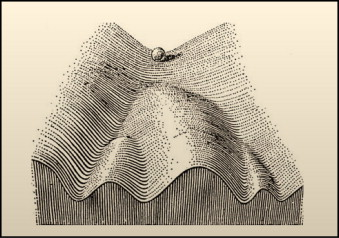
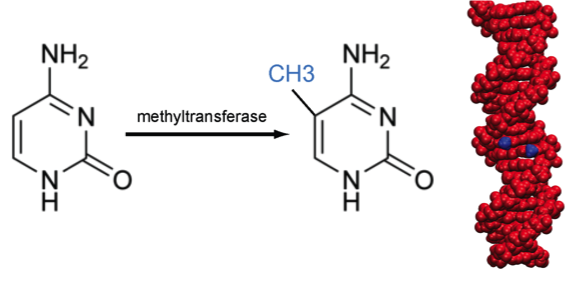
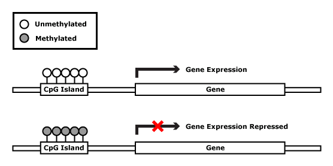
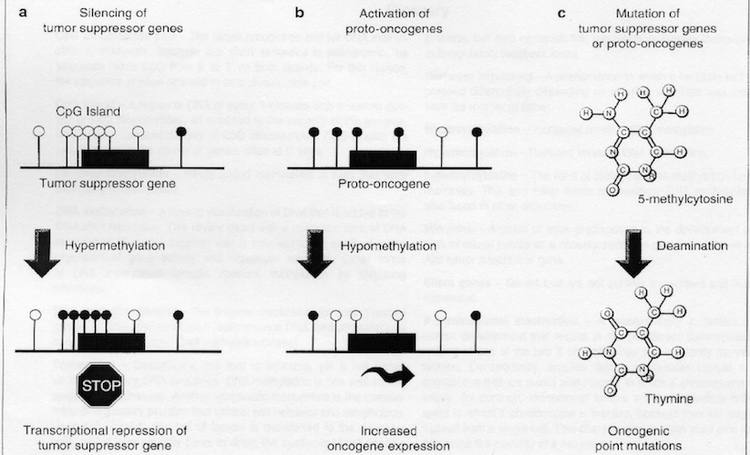

```{r xaringan-themer, include = FALSE}
library(xaringanthemer)
mono_light(
  base_color = "midnightblue",
  header_font_google = google_font("Josefin Sans"),
  text_font_google   = google_font("Montserrat", "500", "500i"),
  code_font_google   = google_font("Droid Mono"),
  link_color = "#8B1A1A", #firebrick4, "deepskyblue1"
  text_font_size = "28px"
)
library(dplyr)
library(ggplot2)
```

<!-- HTML style block -->
<style>
.large { font-size: 130%; }
.small { font-size: 70%; }
.tiny { font-size: 40%; }
</style>

<!-- https://gemini.google.com/u/2/app/27600da0f5d8f386 -->

## Epigenomics

.pull-left[
- **Epigenomics** can be defined as the genome-wide investigation of stably heritable phenotypes resulting from changes in a chromosome without alterations in the DNA sequence.
- Term coined by Conrad Hal Waddington in 1942.
]

.pull-right[
```{r, out.width = "80%", fig.align='center', echo=FALSE}

```
]

.small[ Berger, S. L., Kouzarides, T., Shiekhattar, R., and Shilatifard, A. (2009). An operational definition of epigenetics. Genes Dev. 23, 781–783. doi: 10.1101/gad.1787609 ]

---
## DNA methylation

- DNA methylation is a type of chemical modification of DNA which involves the addition of a methyl group to the number 5 carbon of the cytosine (5C), to convert cytosine to 5-methylcytosine (5mC).
- The most well-characterized epigenetic mechanism.
- In humans, DNA methylation occurs in cytosines that precede guanines (hence, CpG).
- Invertebrates (Drosophila, yeast) do not exhibit cytosine methylation.

```{r, out.width = "50%", fig.align='center', echo=FALSE}

```

---
## DNA modifications

- Other nucleotides (Adenine, Guanine, Thymine) can also be modified.
- Mainly in bacteria, but genomes of eukaryotes may contain base modifications on bases other than cytosine, such as methylated adenine or guanine.

```{r, out.width = "50%", fig.align='center', echo=FALSE}

```

.small[ Sood AJ, Viner C, Hoffman MM. 2016. "**DNAmod: the DNA modification database.**" bioRxiv 071712. https://www.pmgenomics.ca/hoffmanlab/proj/dnamod/ ]

---
## CpG Sites and CpG islands

- CpG sites are not randomly distributed in the genome—the frequency of CpG sites in human genomes is 1% (~28 million CpGs), which is less than the expected (~4-6%).

- Around 60-90% of CpGs are methylated in mammals.

- DNA methylation frequently occurs in repeated sequences and may help to suppress transcription from these sequences and aid chromosomal stability.

---
## CpG Sites and CpG islands

- There are regions of the DNA that have a higher concentration of CpG sites (> 60%), named CpG islands, which tend to be located in the promoter regions of many genes.

- Between 200-1000 bp in length.

- Usually not methylated.

- Less than 10% of CpGs occur in CG-dense regions.

---
## non-CG methylation

- Embryonic stem cells (ESCs) have ~25% non-CG methylation (mCHG and mCHH, where H=A, C, T).

- non-CG methylation correlates with gene expression in ESCs.

- non-CG methylation is on the anti-sense strand of gene bodies and correlates with increased _intronic_ transcription in ESCs.

- non-CG methylation is depleted in enhancers in ESCs.

.small[ Lister, Ryan, Mattia Pelizzola, Robert H. Dowen, R. David Hawkins, Gary Hon, Julian Tonti-Filippini, Joseph R. Nery, et al. “Human DNA Methylomes at Base Resolution Show Widespread Epigenomic Differences.” Nature 462, no. 7271 (November 19, 2009): 315–22. https://doi.org/10.1038/nature08514. ]

---
## Creation and maintenance of DNA methylation

- In humans, DNA is methylated by three enzymes: DNA methyltransferase DNMT1, DNMT3a, and DNMT3b.

- **DNMT1** is the maintenance methyltransferase responsible for copying DNA methylation patterns to the daughter strands during DNA replication.

- **DNMT3a and 3b** are the _de novo_ methyltransferases that, in combination with DNMT3L, set up DNA methylation patterns early in development.

---
## Removal of DNA methylation

- Loss of 5mC can be achieved **passively** by dilution during replication or exclusion of DNMT1 from the nucleus.

- **Ten-eleven translocation (TET)** family of proteins can **actively** convert 5-methylcytosine (5mC) into 5-hydroxymethylcytosine (5hmC) in vertebrates—demethylation.

- Iterative oxidations of 5hmC catalyzed by TET result in 5-formylcytosine (5fC) and 5-carboxylcytosine (5caC). The 5caC mark is excised from DNA by G/T mismatch-specific thymine-DNA glycosylase (TDG), which returns the cytosine residue back to its unmodified state.

.small[ Guo, Junjie U., Yijing Su, Chun Zhong, Guo-li Ming, and Hongjun Song. “Hydroxylation of 5-Methylcytosine by TET1 Promotes Active DNA Demethylation in the Adult Brain.” Cell 145, no. 3 (April 29, 2011): 423–34. https://doi.org/10.1016/j.cell.2011.03.022. ]

---
## Roles of DNA methylation

.pull-left[
- Transcriptional gene silencing

- Maintain genome stability

- Embryonic development

- Genomic imprinting

- X chromosome inactivation (females)
]
.pull-right[
```{r, out.width = "100%", fig.align='center', echo=FALSE}

```
]

.small[ http://learn.genetics.utah.edu/content/epigenetics/imprinting/ ]

---
## Factors associated with changes in DNA methylation

- Aging (developmental stage)

- Diet

- Inflammatory patterns

- Environmental exposures

- Smoking

- Alcohol

---
## DNA methylation and cancer

**Hypomethylation** – decrease methylation levels

- A lower level of DNA methylation in tumors was one of the first epigenetic alterations to be found in human cancer (Feinberg AP, et al., 1983).

- Demethylation of the promoter region of proto-oncogenes will activate normally repressed gene expression.

- Global hypomethylation of DNA sequences that are normally heavily methylated may result in:
  - Chromosomal instability
  - Increased transcription from transposable elements
  - An elevated mutation rate due to mitotic recombination

---
## DNA hypermethylation

**Hypermethylation** – increase methylation levels

- Hypermethylation of CpG islands in the promoter regions of tumor-suppressor genes is a major event in the origin of many cancers.

- Hypermethylation of promoters can inactivate tumor-suppressor genes, affecting genes involved in the cell cycle, DNA repair, and the metabolism of carcinogens.

- The profiles of hypermethylation of CpG islands in tumor-suppressor genes are specific to the cancer type.

---

```{r, out.width = "80%", fig.align='center', echo=FALSE}

```

.small[ Laird PW "**Oncogenic mechanisms mediated by DNA methylation.**" Mol Med Today. 1997 http://www.cell.com/moltod/pdf/S1357-4310(97)01019-8.pdf ]

---
## Technologies for Measuring DNA Methylation

- **Bisulfite Sequencing (BS-Seq):** The "Gold Standard." Bisulfite treatment converts unmethylated cytosines to uracil, while 5mC remains intact.

- **MeDIP-seq:** Methylated DNA Immunoprecipitation followed by sequencing; uses antibodies to isolate methylated fragments.

- **BeadChip Arrays (e.g., Illumina EPIC):** High-throughput hybridization-based method targeting specific known CpG sites across the genome.

- **Nanopore Sequencing:** Direct detection of modified bases by measuring electrical current changes as DNA passes through a pore.

---
## Application of DNA methylation assays

**Early diagnosis** - Detection of CpG-island hypermethylation in biological fluids and serum.

**Prognosis** - Hypermethylation of specific genes. Whole DNA methylation profiles.

**Prediction** - CpG island hypermethylation as a marker of response to chemotherapy.

**Prevention** - Developing DNMT inhibitors as chemopreventive drugs to reactivate silenced genes.
