```{r xaringan-themer, include = FALSE}
library(xaringanthemer)
mono_light(
  base_color = "midnightblue",
  header_font_google = google_font("Josefin Sans"),
  text_font_google   = google_font("Montserrat", "500", "500i"),
  code_font_google   = google_font("Droid Mono"),
  link_color = "#8B1A1A", #firebrick4, "deepskyblue1"
  text_font_size = "28px"
)
library(dplyr)
library(ggplot2)
```

<!-- HTML style block -->
<style>
.large { font-size: 130%; }
.small { font-size: 70%; }
.tiny { font-size: 40%; }
</style>

## Genome is more than genes

One way to expand the capacity of mammalian genomes has been the addition of regulatory elements located at a distance from their target genes. Functionally, these elements can be subdivided into three categories:

1. **Enhancer sequences**, an activating influence on transcription

2. **Silencers**, providing a repressive influence

3. **Insulators**, prevent the transmission of regulatory influence between genomic regions.

---
## Genome is more than genes

The regulatory elements greatly outnumber promoters and have, therefore, been proposed as a driving force behind transcriptional regulation.

These elements may have overlapping functions, they may play different roles in different cell types or developmental stages, and they may overlap with promoters and genes. 

---
## Epigenetics

- **Epigenetics** (*epi* - "over, on top of" + genetic) is the study of (heritable) changes in gene function that occur without a change in the sequence of the DNA.

- Critical for development and differentiation.

- Epigenetic dysregulation is involved in developmental diseases, cancers, certain infectious diseases, and more.

```{r, out.width = "40%", fig.align='center', echo=FALSE}
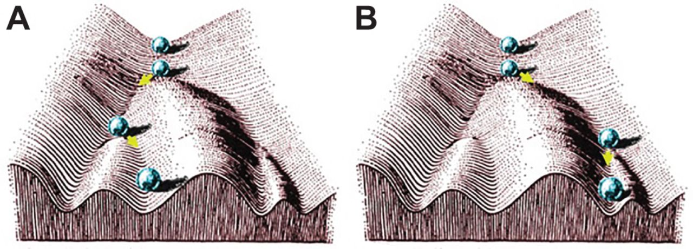
```

.small[ Waddington, C. H. 1942. Canalization of development and the inheritance of acquired characters. Nature 150(3811):563–565. ]

---
## Functional Genomics

**Functional genomics** is a field of molecular biology that attempts to make use of the vast wealth of data produced by genomic projects (such as genome sequencing projects) to describe gene (and protein) functions and *interactions*.

- **ChIP-seq**: Analyzes protein binding with DNA, identifying binding sites of DNA-associated proteins (e.g., modified histones, transcription factors).

- **ATAC-seq**: Assesses genome-wide chromatin accessibility to find open regulatory regions.

- **WGBS (Whole Genome Bisulfite Sequencing)**: Determines the DNA methylation status of cytosines across the genome at single-base resolution.

<!-- - These high-throughput sequencing methods provide the foundational data for consortia like ENCODE and IHEC to map functional genomic elements. -->

---
## Active and inactive chromatin

```{r, out.width = "50%", fig.align='center', echo=FALSE}
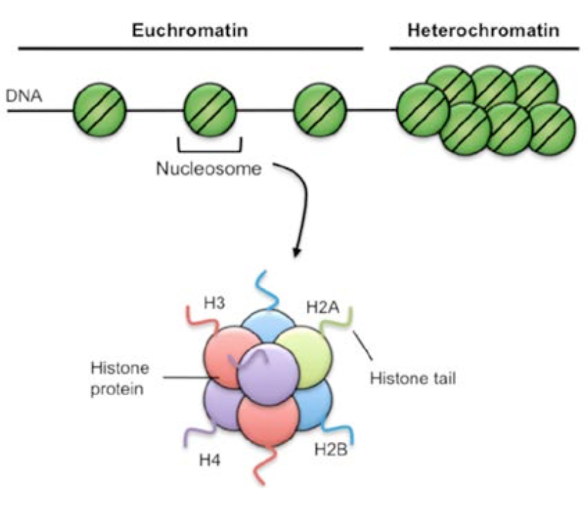
```

---
## Histone modifications

.pull-left[
- Methylation of lysine residues

- Methylation of arginine residues

- Acetylation

- Ubiquitination

- ADP-ribosylation

- Phosphorylation

- Mono/di/tri methylation
]
.pull-right[
```{r, out.width = "100%", fig.align='center', echo=FALSE}
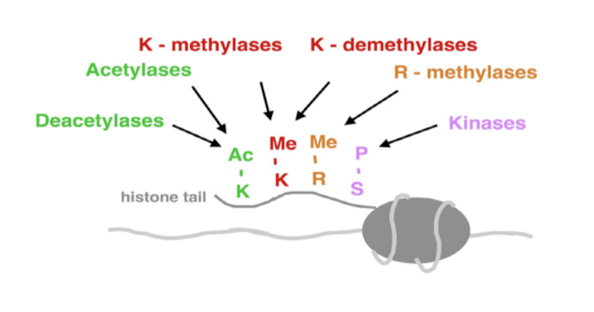
```

.small[ Witte S, O'Shea J, Vahedi G
Super-enhancers: Asset management in immune cell genomes
Trends in Immunology, 2015; 36, 519-52 https://doi.org/10.1016/j.it.2015.07.005 ]
]

---
## Histone code

- Histone modifications demarcate functional elements in mammalian genomes.
- Can be broadly divided into activating and repressive histone marks.

```{r, out.width = "60%", fig.align='center', echo=FALSE}
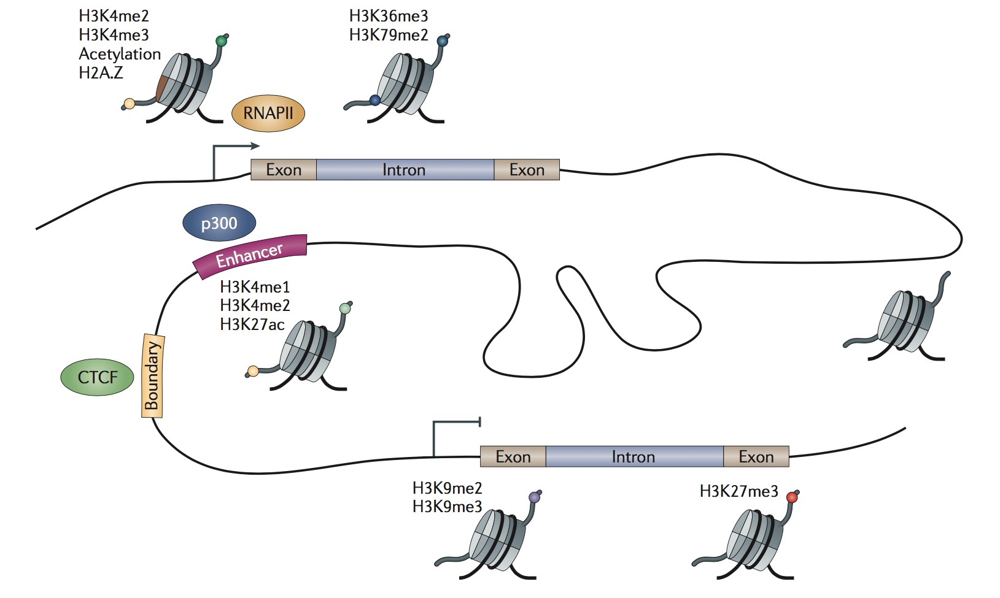
```

.small[ Zhou, V., Goren, A. & Bernstein, B. Charting histone modifications and the functional organization of mammalian genomes. Nat Rev Genet 12, 7–18 (2011). https://doi.org/10.1038/nrg2905 ]

---
## Histone code summary

```{r, out.width = "80%", fig.align='center', echo=FALSE}
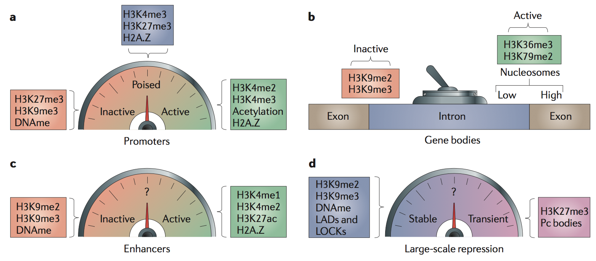
```

.small[ Zhou, V., Goren, A. & Bernstein, B. Charting histone modifications and the functional organization of mammalian genomes. Nat Rev Genet 12, 7–18 (2011). https://doi.org/10.1038/nrg2905 ]

---
## Methylation and histone code interplay

```{r, out.width = "70%", fig.align='center', echo=FALSE}
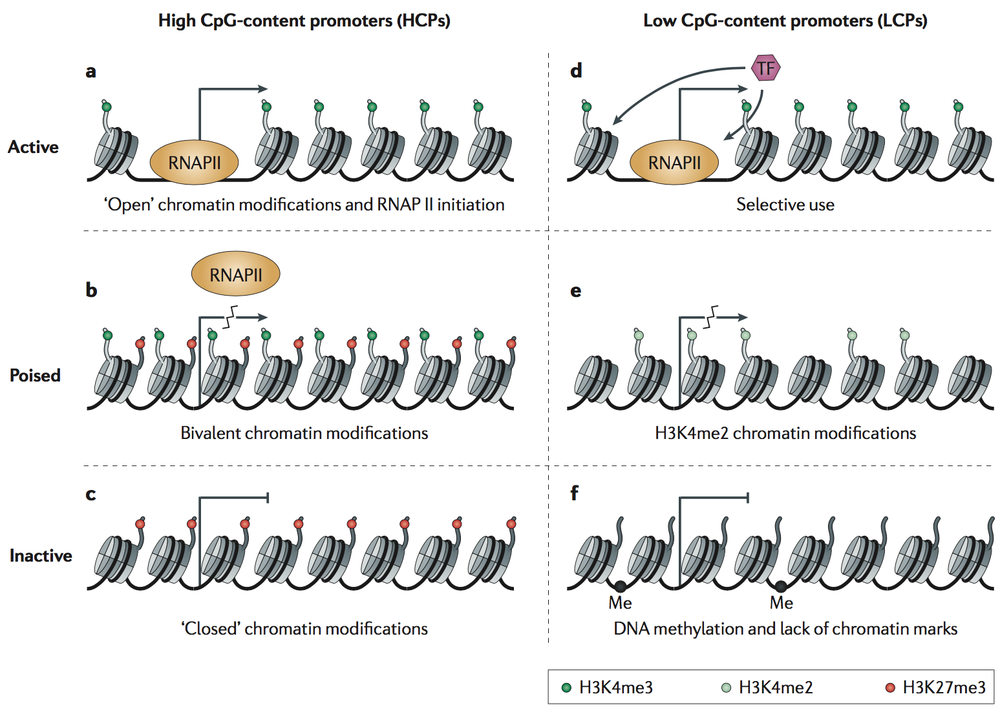
```

.small[ https://www.ncbi.nlm.nih.gov/pubmed/21116306 ]

<!--
Summary of histone modifications

```{r, out.width = "70%", fig.align='center', echo=FALSE}
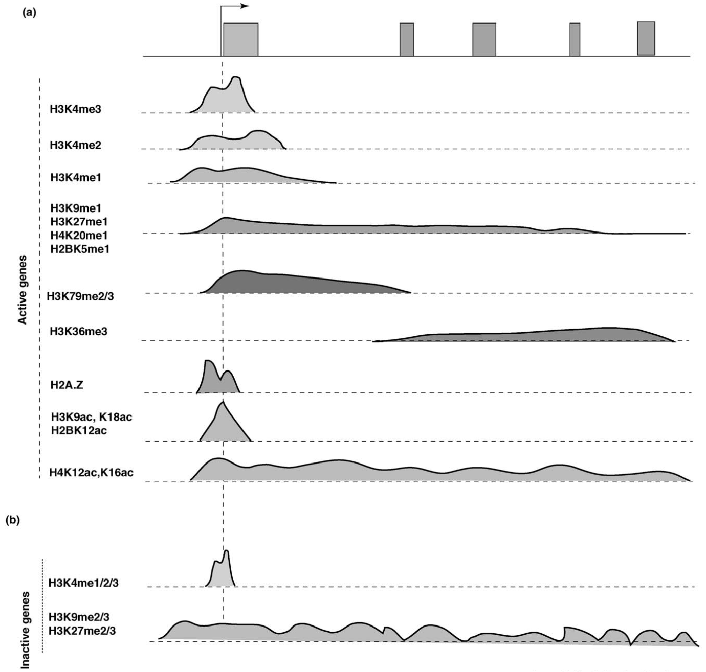
```

Schematic showing the characteristics (broad or narrow peaks) of different histone modification marks and their regulatory role (activation or repression) in gene regulation. The first row in the figure shows an exemplary gene region and the arrow represents the Transcription Start Site (TSS) and the direction of transcription. The signal of H3K4me1/2/3 is characterized by a narrow peak, whereas H3K27me3 is associated with broad and diffused peaks.

.small[ Wang, Zhibin, Dustin E. Schones, and Keji Zhao. “Characterization of Human Epigenomes.” Current Opinion in Genetics & Development 19, no. 2 (April 2009): 127–34. https://doi.org/10.1016/j.gde.2009.02.001. ]
-->

---
## Histone Marks by Genomic Element

| ELEMENT | HISTONES MODIFICATIONS |
|-------|----------------|
| Transcriptional start site | H3K27ac, H3K4me3, open euchromatin |
| Active promoter | H3K27ac, H3K4me3, open euchromatin |
| Enhancer | H3K27ac, H3K4me1, H2A.Z, euchromatin |
| Gene body, towards 3’ end | H3K79me2/3, H3K36me3 |
| Large introns | H3K9ac, H3K18ac, H3K36me1 |
| Translation | H3K4me1, H3K79me1 |
| Strong polycomb repression | H3K9me2/3, H3K27me2/me3 |

<!---
## Histone Marks by Genomic Element

```{r, out.width = "160%", fig.align='center', echo=FALSE}
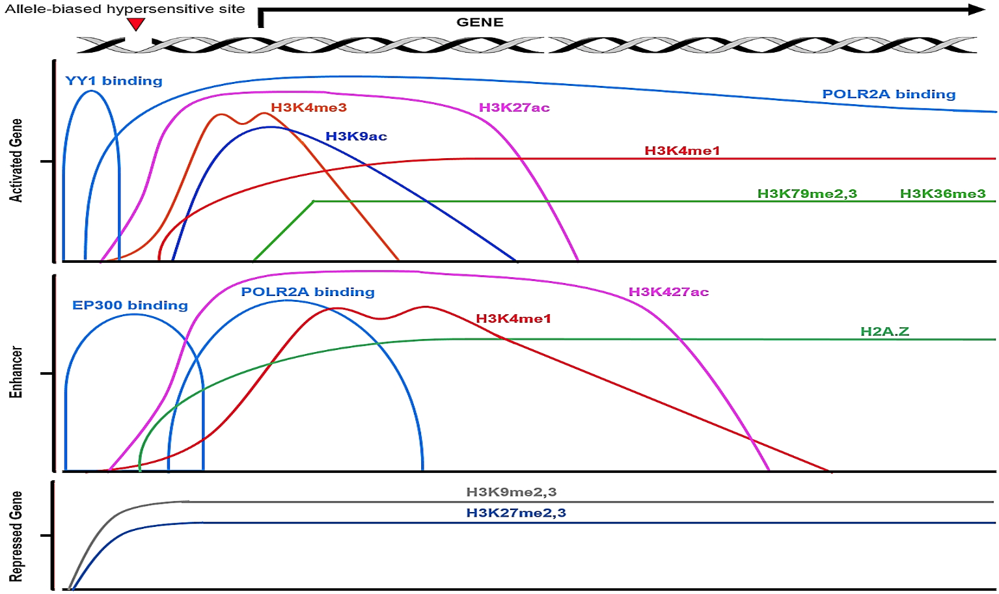
```

Selected histone modifications used in current applications for prediction and classification of non-coding variants that detect gene regulatory elements. Distribution of histone modifications and other characteristics of epigenomic regulatory elements; EP300: E1A Binding Protein P300; YY1: POLR2A: DNA-dependent RNA polymerase II; Ying Yang 1.
-->

---
## Chromatin structure

- Chromatin organization has multiple structural layers and organizes chromatin into "domains".

- Both DNA methylation and chromatin marks contain important functional information.  
```{r, out.width = "500px", fig.align='center', echo=FALSE}
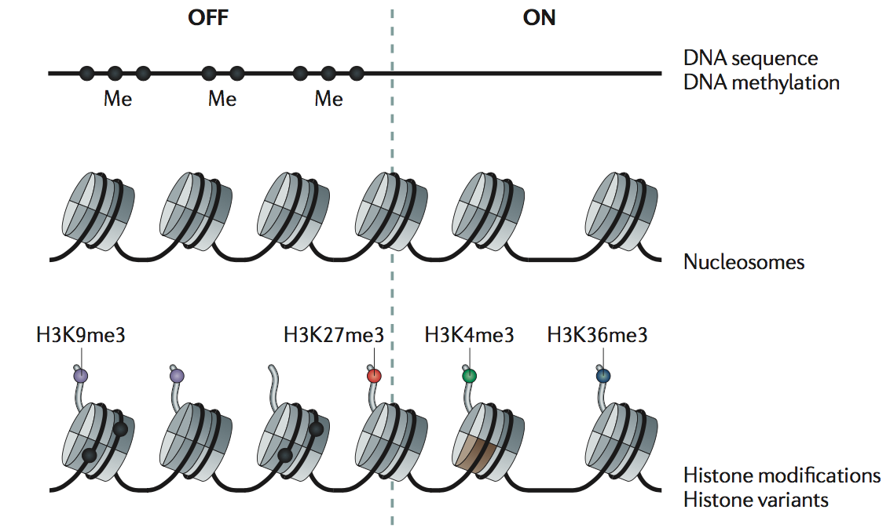
```
.small[ Zhou, V., Goren, A. & Bernstein, B. Charting histone modifications and the functional organization of mammalian genomes. Nat Rev Genet 12, 7–18 (2011). https://doi.org/10.1038/nrg2905 ]

---
## Chromatin structure

- Open chromatin - actively transcribed genes
- Heterochromatin - silent, transcriptionally inactive DNA
```{r, out.width = "60%", fig.align='center', echo=FALSE}
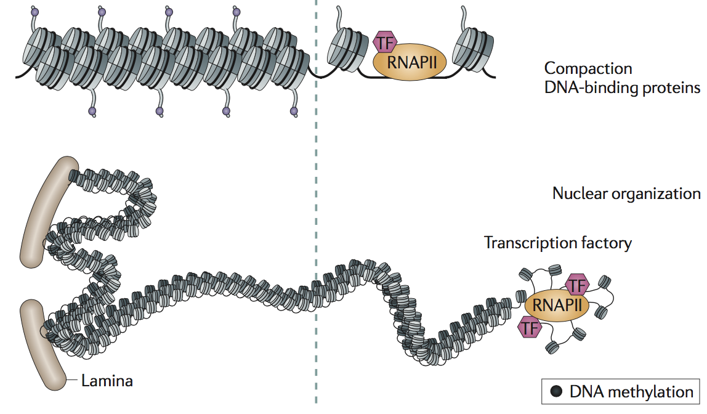
```

.small[ Zhou, V., Goren, A. & Bernstein, B. Charting histone modifications and the functional organization of mammalian genomes. Nat Rev Genet 12, 7–18 (2011). https://doi.org/10.1038/nrg2905 ]

---
## Chromatin structure affects cellular identity and state transitions

```{r, out.width = "80%", fig.align='center', echo=FALSE}
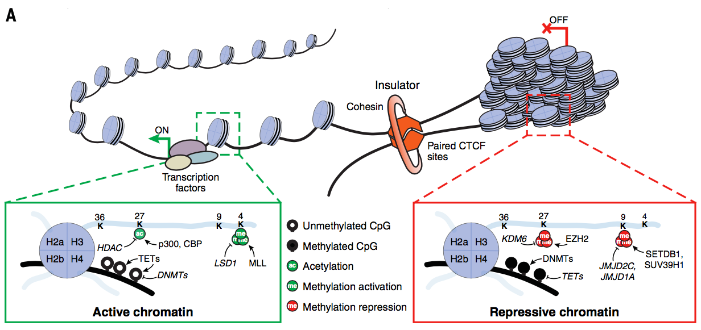
```

.small[ William A. Flavahan et al. ,Epigenetic plasticity and the hallmarks of cancer. Science 357, eaal2380 (2017). https://doi.org/10.1126/science.aal2380 ]

---
## Role of chromatin structure in cancer

```{r, out.width = "90%", fig.align='center', echo=FALSE}
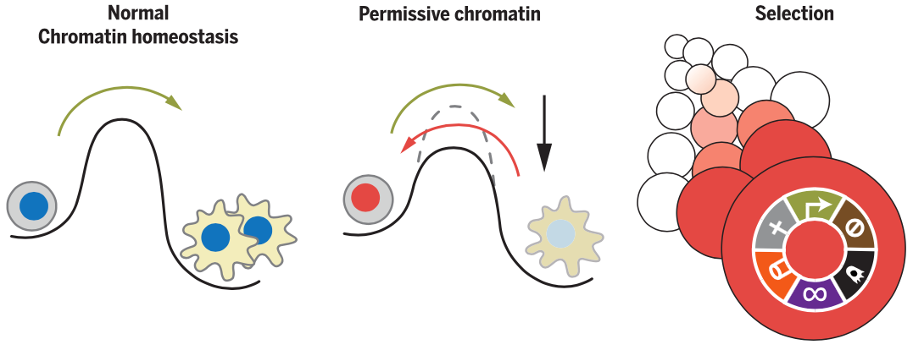
```

---
## Insulators/boundaries of open/closed chromatin

```{r, out.width = "80%", fig.align='center', echo=FALSE}
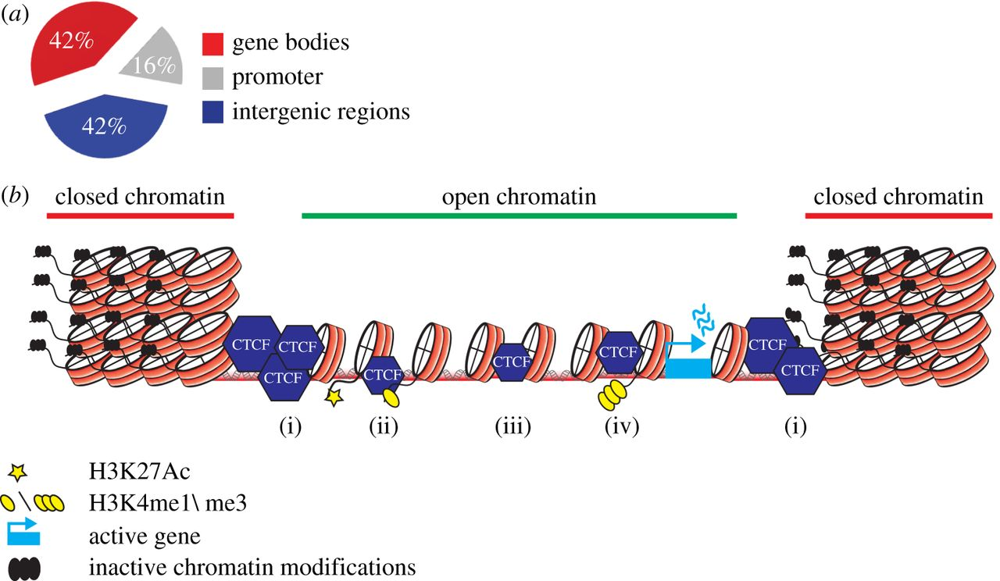
```

---
## Super-enhancers

```{r, out.width = "90%", fig.align='center', echo=FALSE}
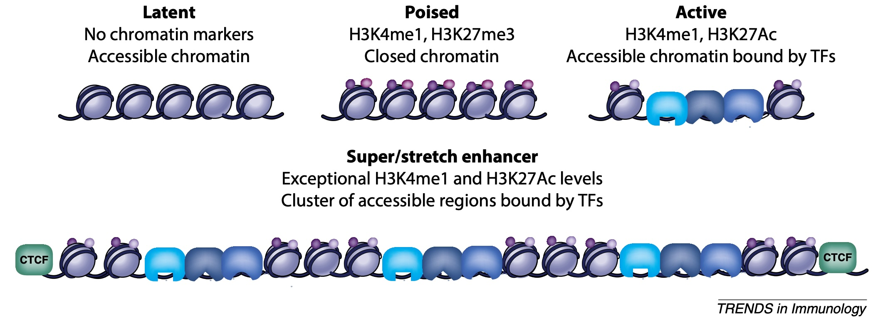
```

.small[ Witte S, O'Shea J, Vahedi G
Super-enhancers: Asset management in immune cell genomes
Trends in Immunology, 2015; 36, 519-526 https://doi.org/10.1016/j.it.2015.07.005 ]

---
## ENCODE: Encyclopedia Of DNA Elements

- Grand question: Where are the promoter, enhancer, and other regulatory regions of the human genome?

- 14 manually chosen and 30 randomly selected human genomic regions, in total \~30Mb (1%) of the human genome sequence.

- Dozens of labs did ChIP-seq, under rigorous quality guidelines, for over 100 transcription factors and histone modifications, plus related assays for DNA methylation, chromatin accessibility, etc.

.small[ The ENCODE Project Consortium. An integrated encyclopedia of DNA elements in the human genome. Nature 489, 57–74 (2012). https://doi.org/10.1038/nature11247, over 100 authors]

---
## The Encyclopedia of DNA Elements Project

```{r, out.width = "80%", fig.align='center', echo=FALSE}
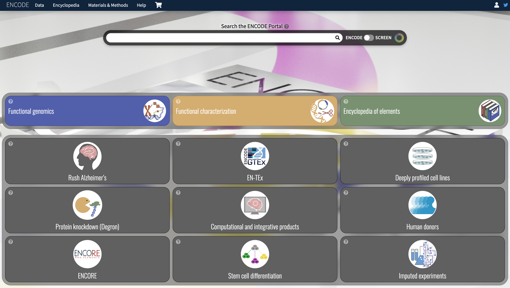
```

.small[ https://www.encodeproject.org/ ]

<!--
Roadmap Epigenomics: chromatin regulation in normal cells

```{r, out.width = "180px", fig.align='center', echo=FALSE}
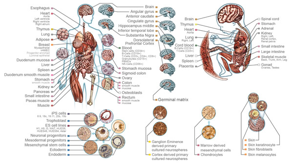
```

.small[ http://www.roadmapepigenomics.org/ ]
-->

---
## IHEC - the International Human Epigenome Consortium

<!-- - Nowadays, the most recent and complete resource is IHEC, the International Human Epigenome Consortium. -->
- International effort with several funding agencies.
- Goal: Providing standardized reference epigenomes for a variety of normal and disease tissues.
- Member groups take part in committees working on standards (assays, data/metadata distribution, ethics...).

```{r, out.width = "45%", fig.align='center', echo=FALSE}
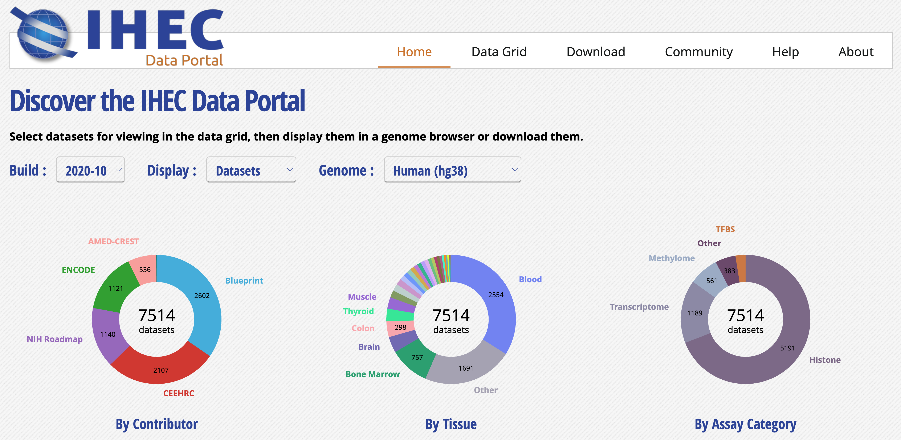
```

.small[ http://ihec-epigenomes.org/ ]

---
## IHEC Data Portal

- Goal: Integrate epigenomic public datasets produced within the International Human Epigenome Consortium.
- Raw data is in controlled access repositories.
- Over 7,500 human datasets, from 5 consortia.
- Offers tools for dataset discovery, visualization, and pre-analysis.

```{r, out.width = "45%", fig.align='center', echo=FALSE}

```

.small[ http://epigenomesportal.ca/ihec/ ]

---
## IHEC Data Portal

- Publicly accessible datasets
    - Datasets made available in the IHEC Data Portal are publicly accessible for everyone’s own research.

- Human data offered by such consortia usually falls in one of two categories:
    - Controlled access data
        - Raw data from sequencers
        - Clinical/sensitive information such as phenotypes
        - Archived at repositories such as EGA and dbGaP
    - Public data
        - Annotation tracks, to use in tools such as UCSC Genome Browser, Ensembl, and IGV.
        - Some donor, sample, and library metadata.

