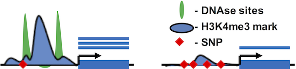
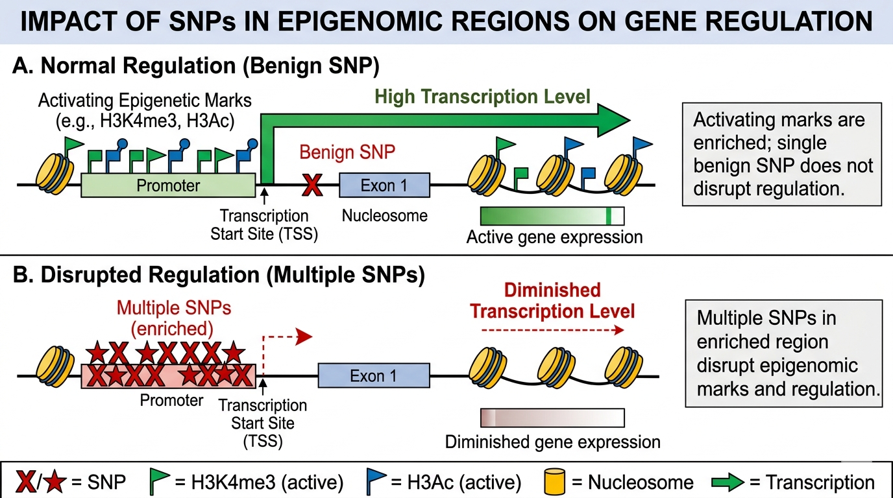
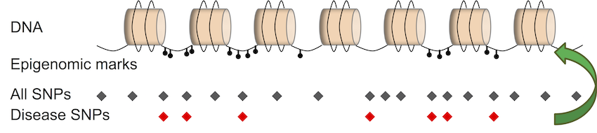
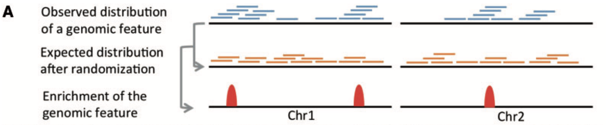
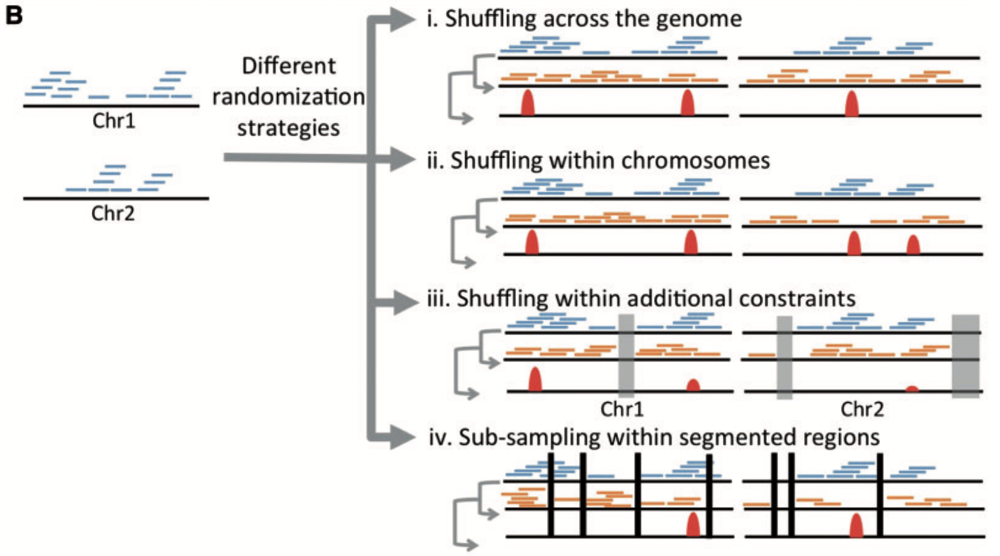
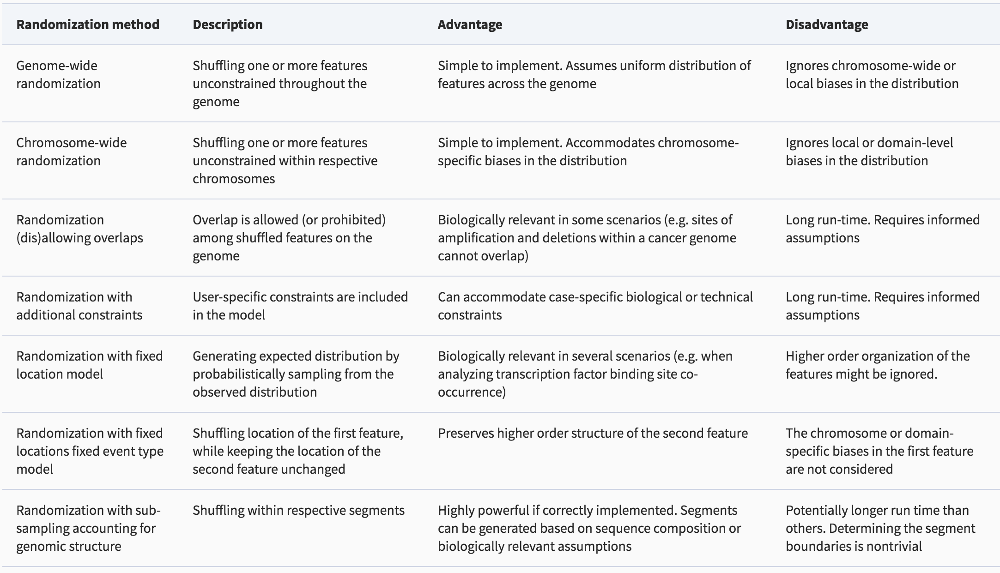
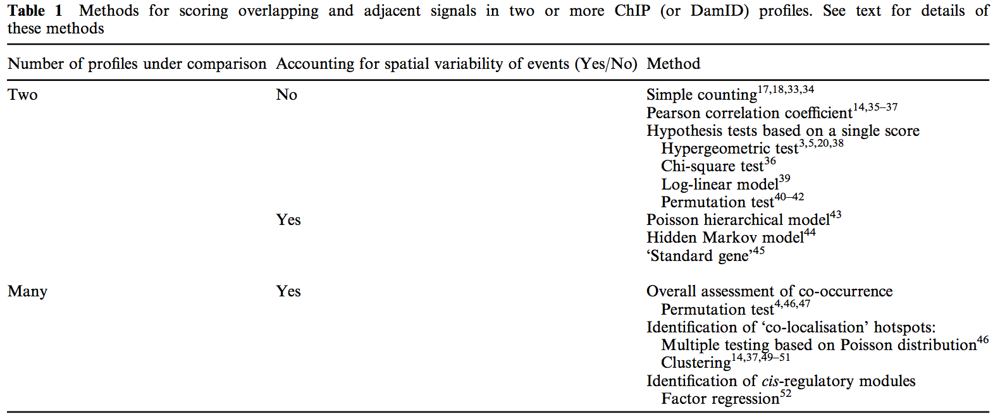
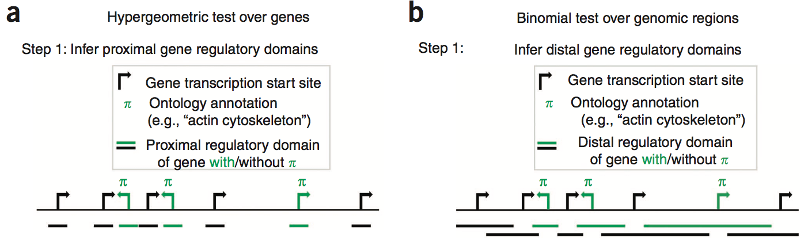
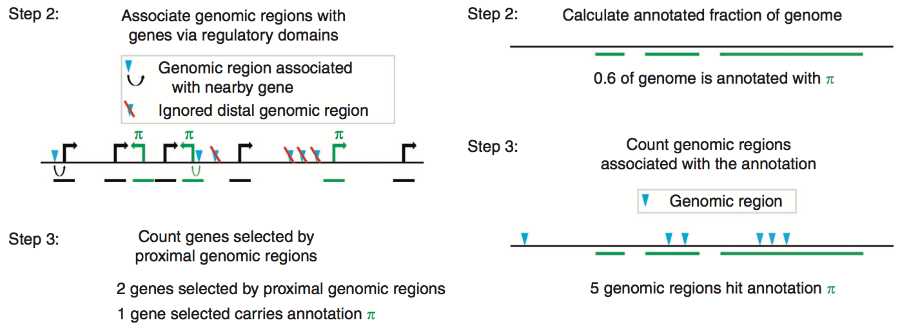
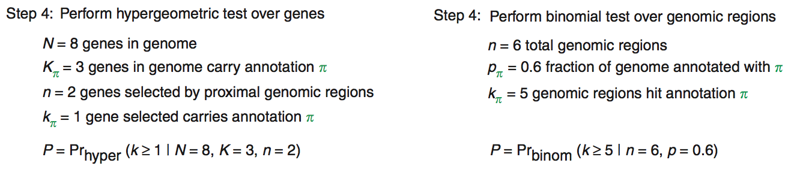

```{r xaringan-themer, include = FALSE}
library(xaringanthemer)
mono_light(
  base_color = "midnightblue",
  header_font_google = google_font("Josefin Sans"),
  text_font_google   = google_font("Montserrat", "500", "500i"),
  code_font_google   = google_font("Droid Mono"),
  link_color = "#8B1A1A", #firebrick4, "deepskyblue1"
  text_font_size = "28px"
)
library(dplyr)
library(ggplot2)
```

<!-- HTML style block -->
<style>
.large { font-size: 130%; }
.small { font-size: 70%; }
.tiny { font-size: 40%; }
</style>

<!-- https://gemini.google.com/u/2/app/79a29fdaace9e795 -->

## Gene enrichment vs. genome enrichment

- **Gene set enrichment analysis** - summarizing many **genes** of interest, such as differentially expressed genes, with a few common **gene annotations** (molecular functions, canonical pathways)

<br>

- **Epigenomic enrichment analysis** - summarizing many **genomic regions** of interest, such as disease-associated genomic variants, with a few common **genome annotations** (chromatin states, transcription factor binding sites)

---
## Genomic regions

- Gene/exon boundaries, promoters

- Single Nucleotide Polymorphisms (SNPs)

- Transcription Factor Binding Sites (TFBS)

- Differentially methylated regions

- CpG islands

Each genomic region has coordinates (unique IDs): 

`Chromosome`, `Start`, `End`

---
## Annotations of genomic regions

- **Epigenomic (regulatory) regions** - genomic regions annotated as carrying functional and/or regulatory potential

- DNaseI hypersensitive sites

- Histone modification marks

- Transcription Factor Binding Sites

- DNA methylation

- Enhancers

- ...

---
## Why "genomic region enrichment analysis"?

Enrichment = functional impact

- **Hypothesis**: SNPs in epigenomic regions may disrupt regulation

- More significant enrichment = more SNPs in epigenomic regions = more regulation is disrupted (SNP burden)

```{r, out.width = "90%", fig.align='center', echo=FALSE}

```

---
## Why "genomic region enrichment analysis"?

<!-- https://gemini.google.com/app/f8e8ec8949444e1f -->
<!-- Create a scientific image for a presentation illustrating that SNPs enriched in ep[igenomic regions may disrupt regulation. Create two adjacent panels, horizontal layout, one showing a gene (first exon), the promoter region, activating epigenetic marks, and a SNP that doesn't harm regulation and gene is highly transcribed. The other panel shows the same picture but there are many SNPs, leading to disruption of epigenetic marks, regulation, and diminished transcription. -->

```{r, out.width = "90%", fig.align='center', echo=FALSE}

```

---
## Regulatory marks are highly non-random

- Statistical analysis of pilot ENCODE regions showed highly non-random locations of regulatory elements

- There are regulatory "hotspots" enriched in transcription factor binding sites and histone marks, as well as "deserts" depleted of regulatory marks

- Combinations of different types of regulatory marks matter

.small[ Zhang, Z. D., A. Paccanaro, Y. Fu, S. Weissman, Z. Weng, J. Chang, M. Snyder, and M. B. Gerstein. “Statistical Analysis of the Genomic Distribution and Correlation of Regulatory Elements in the ENCODE Regions.” Genome Research 17, no. 6 (June 1, 2007): 787–97. https://doi.org/10.1101/gr.5573107. ]

---
## Statistics of epigenomic enrichments

```{r, out.width = "90%", fig.align='center', echo=FALSE}

```

- 6 out of 7 disease-associated SNPs overlap with epigenomic marks

- How likely is this to be observed by chance? (Chi-square test/Binomial test/Permutation test)

---
## Basic concepts of epigenomic enrichments

| TF1 | 0 | 0 | 0 | 1 | 1 | 1 | 1 | 1 | 0 | 1 | 1 | 1 | 0 | 1 | 1 | 1 | 1 | 1 | 1 | 0 |
|-----|---|---|---|---|---|---|---|---|---|---|---|---|---|---|---|---|---|---|---|---|
| TF2 | 0 | 0 | 0 | 0 | 1 | 1 | 1 | 0 | 0 | 1 | 0 | 0 | 1 | 1 | 1 | 1 | 1 | 1 | 1 | 1 |

- Pearson correlation coefficient $r$: this quantity gives equal weight to co-binding (1,1) and co-non-binding (0,0). 

- Hence, high values may not necessarily imply high levels of co-occurrence. For the above example, $r=0.36$.

---
## Statistics of epigenomic enrichments

|         | TF2 no  | TF2 yes |       |
|---------|---------|---------|-------|
| TF1 no  | n-k+t   | m-t     | m+n-k |
| TF1 yes | k-t     | t       | k     |
|         | n       | m       | m+n   |

- **Hypergeometric test**: It tests for co-occurrence based on the contingency table, which can be re-written using random variables.

- Assume that the row and column sums ($m$, $n$, $k$) are fixed. The probability of observing $t$ co-occurrences follows a hypergeometric distribution. The p-value for the example is $p = \text{Pr}(T \ge 10 | H_0, m=12, n=8, k=14) = 0.14$.

---
## Statistics of epigenomic enrichments

|         | TF2 no  | TF2 yes |       |
|---------|---------|---------|-------|
| TF1 no  | n-k+t   | m-t     | m+n-k |
| TF1 yes | k-t     | t       | k     |
|         | n       | m       | m+n   |

.small[
- **Chi-square test**: It tests for statistical dependence (not just co-occurrence) between TF1 and TF2, and is best applied to contingency tables with large counts.
- The difference between observed and expected counts can be approximated by a chi-square distribution with one degree of freedom:

$$D = \sum_{i=1}^2 \sum_{j=1}^2 \frac{(O_{ij} - E_{ij})^2}{E_{ij}}$$

where $O_{ij}$ are the observed counts, and $E_{ij}$ are the expected counts under the null hypothesis. Expected counts are computed using the fixed row and column sums, e.g., $E_{22} = \frac{mk}{m+n}$.
]

---
## Statistics of epigenomic enrichments

.small[
- **Poisson distribution**: It can be used to compute how likely it is for a single TF to have, say, three binding events in a 1 kb window given a background rate of 300 events per 1 Mb. The formula is:

$$\text{Pr}\left(x=3; L=1\text{ kb}; \rho=\frac{300}{1000\text{ kb}}\right) = e^{-L\rho}\frac{(L\rho)^x}{x!}$$

where $\rho$ is the binding rate per base pair (bp), and $L$ is the region length. 

- **Fisher’s method for combining p-values**: One can calculate a p-value for each TF in a genomic region to assess whether that TF has more binding sites than expected. To assess whether multiple TFs bind more than expected collectively, p-values are combined using Fisher’s method:

$$P = -2 \sum_{i=1}^n \ln(p_i)$$

where $n$ is the number of TFs, and $\ln$ is the natural logarithm. The quantity $P$ follows a chi-square distribution with $2n$ degrees of freedom. A small combined p-value suggests significant co-occurrence.
]

---
## Permutation

- Genomic features are nonrandomly distributed throughout the genome

- In permutation schemes, we need to consider this to properly calculate observed and expected overlaps

- **Permutation test**: it tests for co-occurrence through repeatedly permuting observed enriched regions (or binding events) in one or both profiles many times

- A pre-defined co-occurrence score is calculated for each permutation

- Many permutations produce a null distribution of the co-occurrence score. One can then use this null distribution to compute a p-value for the observed co-occurrence score

---
## Permutation

```{r, out.width = "90%", fig.align='center', echo=FALSE}

```

.small[ De, Subhajyoti, Brent S. Pedersen, and Katerina Kechris. “The Dilemma of Choosing the Ideal Permutation Strategy While Estimating Statistical Significance of Genome-Wide Enrichment.” Briefings in Bioinformatics 15, no. 6 (November 2014): 919–28. https://doi.org/10.1093/bib/bbt053. ]

---
## Permutation on steroids

```{r, out.width = "90%", fig.align='center', echo=FALSE}

```

---
## Permutation strategies

```{r, out.width = "90%", fig.align='center', echo=FALSE}

```

.small[ De, Subhajyoti, Brent S. Pedersen, and Katerina Kechris. “The Dilemma of Choosing the Ideal Permutation Strategy While Estimating Statistical Significance of Genome-Wide Enrichment.” Briefings in Bioinformatics 15, no. 6 (November 2014): 919–28. https://doi.org/10.1093/bib/bbt053. ]

---
## Evaluating overlap between sets of genomic regions

```{r, out.width = "90%", fig.align='center', echo=FALSE}

```

.small[ Fu, Audrey Qiuyan, and Boris Adryan. “Scoring Overlapping and Adjacent Signals from Genome-Wide ChIP and DamID Assays.” Molecular BioSystems 5, no. 12 (December 2009): 1429–38. https://doi.org/10.1039/B906880e. ]

---
## Looking for significant GO enrichment

- We can evaluate the biological significance of our peaks using **Gene Ontology (GO)** term annotations.
    - GO: A set of structured, controlled vocabularies for community use in annotating genes, gene products, and sequences.

- **Popular tool**: The Genomic Regions Enrichment of Annotations Tool (GREAT).

.small[ http://great.stanford.edu/public/html/ ]

---
## GREAT: Functional Enrichment of Cis-Regulatory Regions

* Distal regulatory elements (e.g., enhancers) are frequently located far from the proximal promoter of their target genes.

* GREAT accounts for this by assigning non-coding genomic regions to their putative target genes using predefined or custom **regulatory domains** (rather than just nearest-gene proximity).

* **Input**: A BED file containing your genomic regions of interest (e.g., ChIP-seq or ATAC-seq peaks).

* **Output**: Statistical enrichment of functional annotations, including GO terms (Molecular Functions, Biological Processes, Cellular Components), Human Phenotypes, Disease Ontologies, and Pathways.

---
## GREAT: Cis-regulatory regions functions prediction

```{r, out.width = "90%", fig.align='center', echo=FALSE}

```

.small[ McLean, Cory Y., Dave Bristor, Michael Hiller, Shoa L. Clarke, Bruce T. Schaar, Craig B. Lowe, Aaron M. Wenger, and Gill Bejerano. “GREAT Improves Functional Interpretation of Cis-Regulatory Regions.” Nature Biotechnology 28, no. 5 (May 2010): 495–501. https://doi.org/10.1038/nbt.1630. ]

---
## GREAT: Cis-regulatory regions functions prediction

```{r, out.width = "90%", fig.align='center', echo=FALSE}

```

.small[ McLean, Cory Y., Dave Bristor, Michael Hiller, Shoa L. Clarke, Bruce T. Schaar, Craig B. Lowe, Aaron M. Wenger, and Gill Bejerano. “GREAT Improves Functional Interpretation of Cis-Regulatory Regions.” Nature Biotechnology 28, no. 5 (May 2010): 495–501. https://doi.org/10.1038/nbt.1630. ]

---
## GREAT: Cis-regulatory regions functions prediction

```{r, out.width = "90%", fig.align='center', echo=FALSE}

```

.small[ McLean, Cory Y., Dave Bristor, Michael Hiller, Shoa L. Clarke, Bruce T. Schaar, Craig B. Lowe, Aaron M. Wenger, and Gill Bejerano. “GREAT Improves Functional Interpretation of Cis-Regulatory Regions.” Nature Biotechnology 28, no. 5 (May 2010): 495–501. https://doi.org/10.1038/nbt.1630. ]

---
## Alternative Region Enrichment Tools

While GREAT is an excellent tool for functional interpretation based on GO terms, alternative tools and packages provide diverse enrichment strategies depending on the biological question:

- **LOLA (Locus Overlap Analysis)**: Specifically tests for enrichment of your genomic region sets against a core database of pre-defined region sets (like ENCODE TFBS).

- **bedtools fisher**: Directly calculates the significance of overlaps between two BED files using Fisher's Exact Test.

- **GenomeRunner**: Evaluates the functional impact of genomic regions (like SNPs) by testing for enrichment against epigenomic and regulatory annotations using whole-genome Monte Carlo simulations.

.small[ Dozmorov, M. G., et al. "GenomeRunner: automating genome exploration." Bioinformatics 28, no. 3 (February 2012): 419–420. ]

---
## Generating Null Ranges: `matchRanges`

- Genomic covariates (like GC content, region length, or chromatin accessibility) are not uniformly distributed. Using unadjusted random background sets can introduce bias into enrichment analyses.

- `matchRanges` (part of the R/Bioconductor `nullranges` package) generates covariate-matched null sets of genomic ranges from a larger background pool.

- It calculates propensity scores via logistic regression to perform subset selection, ensuring the resulting null set mirrors the exact covariate distribution of your focal set of interest.

- **Matching Options**: Supports nearest-neighbor matching, rejection sampling, and stratified sampling.

.small[ Davis, E. S., et al. "matchRanges: generating null hypothesis genomic ranges via covariate-matched sampling." Bioinformatics 39, no. 5 (May 2023). ]

---
## Generating Null Ranges: `bootRanges`

- Standard permutation or simple shuffling of genomic regions can destroy natural spatial patterns and local correlations, which often artificially inflates statistical significance.

- `bootRanges` (also part of the `nullranges` package) provides a robust alternative by utilizing a **block bootstrap** methodology.

- It constructs null genomic-range sets by sampling larger blocks (segments) of the genome with replacement, rather than shuffling individual features.

- **Result**: Preserves local genomic correlation structures (e.g., natural clustering of transcription factor binding sites) to produce highly accurate null distributions for hypothesis testing.

.small[ Mu, W., et al. "bootRanges: flexible generation of null sets of genomic ranges for hypothesis testing." Bioinformatics 39, no. 5 (May 2023). ]