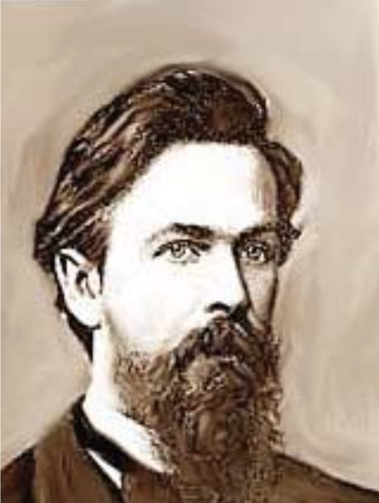
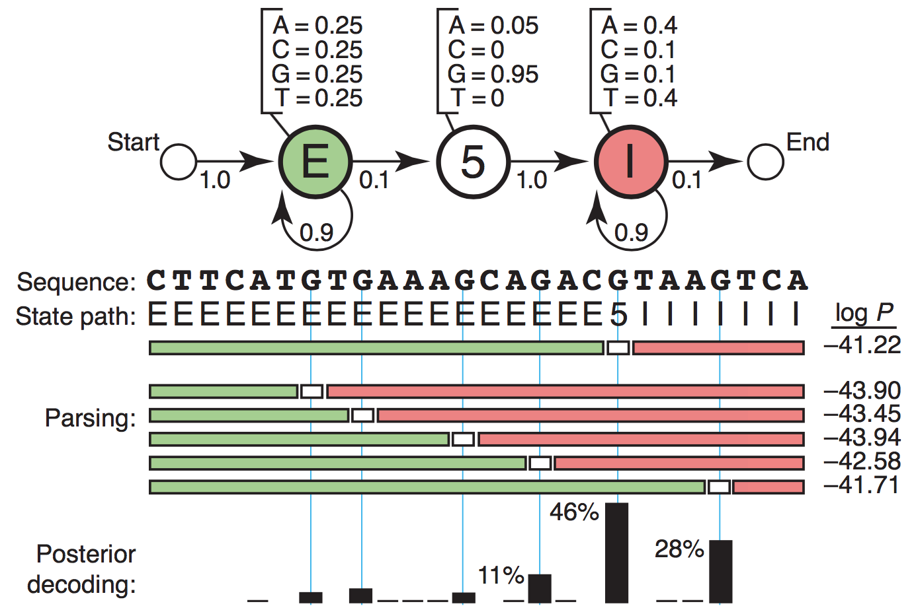
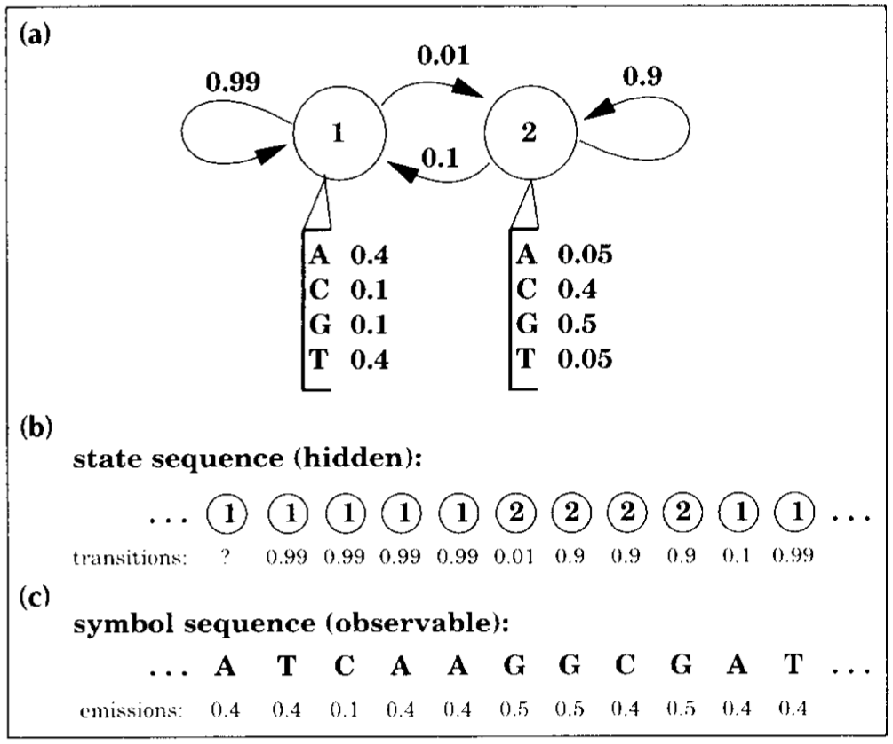
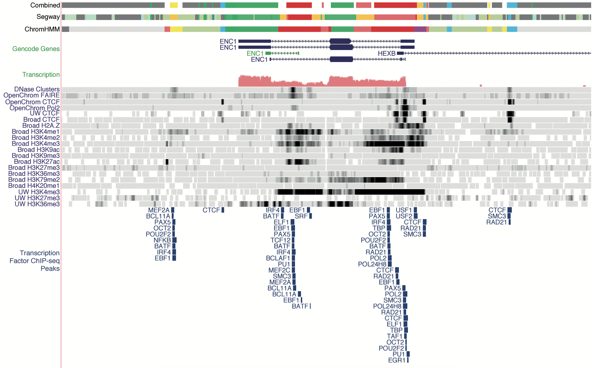
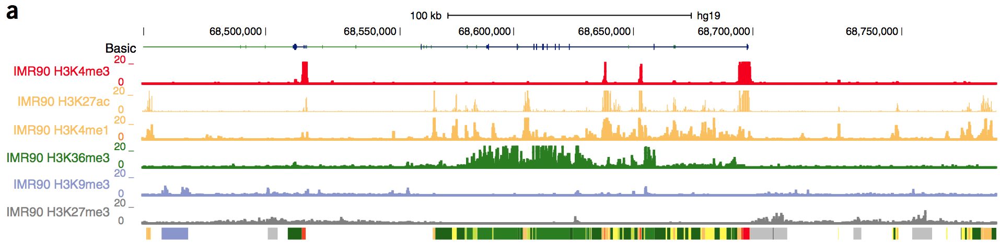
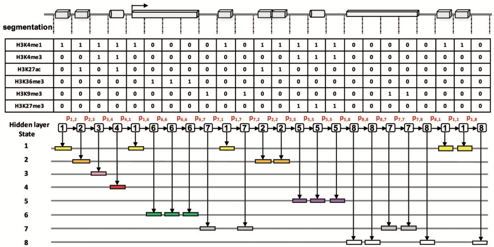
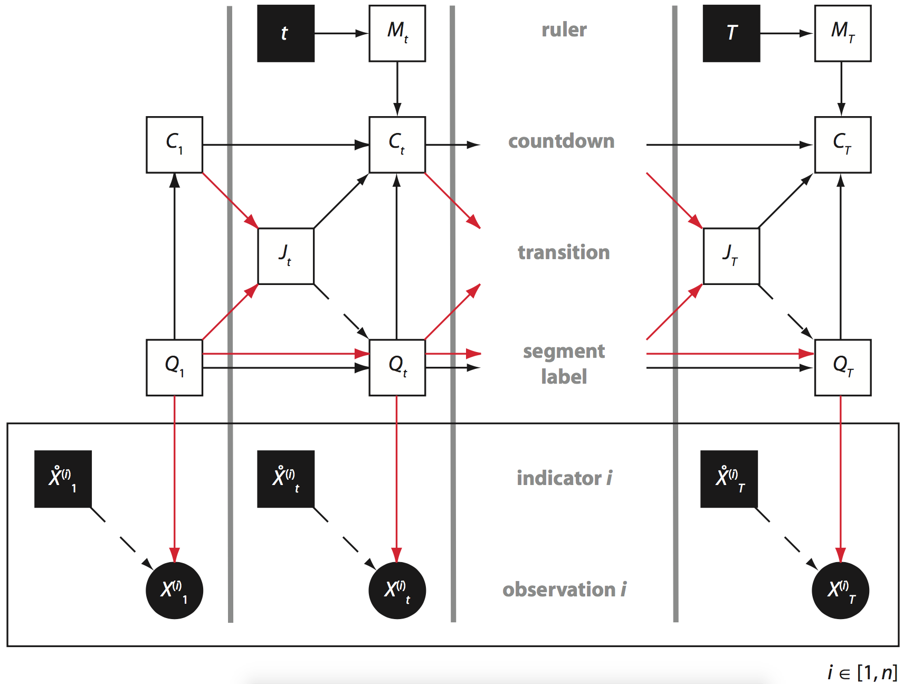
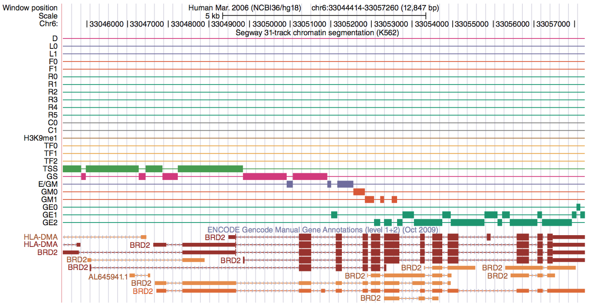
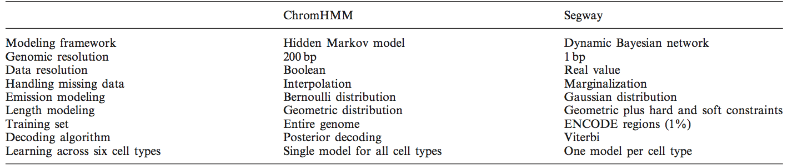
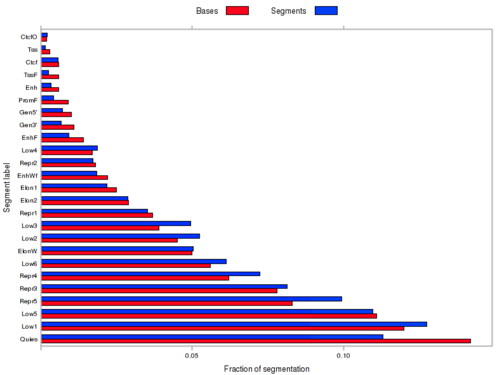

```{r xaringan-themer, include = FALSE}
library(xaringanthemer)
mono_light(
  base_color = "midnightblue",
  header_font_google = google_font("Josefin Sans"),
  text_font_google   = google_font("Montserrat", "500", "500i"),
  code_font_google   = google_font("Droid Mono"),
  link_color = "#8B1A1A", #firebrick4, "deepskyblue1"
  text_font_size = "28px"
)
library(dplyr)
library(ggplot2)
```

<!-- HTML style block -->
<style>
.large { font-size: 130%; }
.small { font-size: 70%; }
.tiny { font-size: 40%; }
</style>

<!-- https://gemini.google.com/u/2/app/86afb74ac501b077 -->

## Markov Model (aka Markov Chain)

- **Stochastic Process**: A sequence of random variables $X_1, X_2, X_3, \dots$ representing a system that changes over time.

- **The Markov Property**: The "Memoryless" property. The probability of moving to the next state depends **only** on the current state, not on the sequence of events that preceded it.
.pull-left[
The future is independent of the past, given the present.

.small[**Andrey Markov (1856–1922):** Developed these chains to model vowel/consonant patterns in Russian literature, proving that independence isn't required for the Law of Large Numbers to hold.]
]
.pull-right[
```{r, out.width = "220px", fig.align='center', echo=FALSE}

```
]

---
## Markov Model (aka Markov Chain)

- A discrete stochastic process $X_1, X_2, X_3,...$ has the Markov property

$$P(X_{n+1}=j|X_1=x_1, X_2=x_2, ..., X_n=x_n) = P(X_{n+1}=j|X_n=x_n)$$
$$for\ all\ x_i, all\ j, all\ n$$

- A random process which has the property that the future (next state) is conditionally independent of the past given the present (current state)

---
## Elements of Hidden Markov Models

- An alphabet of $n$ emitted symbols (e.g., "A", "T", "C", "G")

- A set of $k$ hidden states (e.g., CG-island, regular sequence)

- Transition = ($transition_{l,k}$) - a $|States| \times |States|$ matrix of **transition probabilities** for changing from state $l$ to state $k$

- Emission = ($emission_k(symbol_n)$) - a $|States| \times n$ matrix of **emission probabilities** (of emitting $symbol_n$ when the HMM is in state $k$) 

---
## A simple hidden Markov model

.pull-left[
```{r, out.width = "100%", fig.align='center', echo=FALSE}

```
]
.pull-right[
.small[The model generates two strings of information. One is the underlying _state path_ (the labels), as we transition from state to state. The other is the _observed sequence_ (the DNA), each residue being emitted from one state in the state path. The efficient Viterbi algorithm is guaranteed to find the most probable state path given a sequence and an HMM. The Viterbi algorithm is a dynamic programming algorithm quite similar to those used for standard sequence alignment.]
]

.small[Eddy, Sean R. “What Is a Hidden Markov Model?” Nature Biotechnology 22, no. 10 (October 2004): 1315–16. https://doi.org/10.1038/nbt1004-1315.]

---
## A simple hidden Markov model

.pull-left[
```{r, out.width = "100%", fig.align='center', echo=FALSE}

```
]
.pull-right[
A two-state HMM describing DNA sequence with a heterogeneous base composition. 

(a) State 1 generates AT-rich sequence, and state 2 generates CG-rich sequence. State transitions and their associated probabilities are indicated by arrows, and symbol emission probabilities for A,C,G and T for each state are indicated below the states. 
]

---
## A simple hidden Markov model

.pull-left[
```{r, out.width = "100%", fig.align='center', echo=FALSE}

```
]
.pull-right[
A two-state HMM describing DNA sequence with a heterogeneous base composition. 

(b) This model generates a state sequence as a Markov chain and each state generates a symbol according to its own emission probability distribution 
]

---
## A simple hidden Markov model

.pull-left[
```{r, out.width = "100%", fig.align='center', echo=FALSE}

```
]
.pull-right[
A two-state HMM describing DNA sequence with a heterogeneous base composition. 

(c) The probability of the sequence is the product of the state transitions and the symbol emissions. For a given observed DNA sequence, we are interested in inferring the hidden state sequence that 'generated' it, that is, whether this position is in a CG-rich segment or an AT-rich segment.
]

---
## Chromatin States

- **Epigenetic Marks:** The genome is modified with various histone modifications (e.g., methylation, acetylation) and DNA methylation.

- **Combinatorial Patterns:** Specific combinations of these epigenetic marks reliably correspond to distinct functional genomic elements.

- **Functional Annotation:** A "chromatin state" is a classification of a genomic region based on these recurrent patterns, simplifying complex multi-track data into interpretable labels.

- **Examples:** Active Promoter, Strong Enhancer, Repressed Heterochromatin, or Transcribed Region.

---
## Chromatin segmentation

```{r, out.width = "60%", fig.align='center', echo=FALSE}

```

.small[Hoffman, Michael M., Jason Ernst, Steven P. Wilder, Anshul Kundaje, Robert S. Harris, Max Libbrecht, Belinda Giardine, et al. “Integrative Annotation of Chromatin Elements from ENCODE Data.” Nucleic Acids Research 41, no. 2 (January 2013): 827–41. https://doi.org/10.1093/nar/gks1284.]

---
## Ideas for chromatin track analysis

- Hidden Markov Model (ChromHMM)  

- Dynamic Bayesian Network (Segway)  
    - Bayesian Network that models data sampled at intervals. Still a directed acyclic graph (DAG).  
    - Can learn model with Graphical Model Toolkit (GMTK)  
    - Can incorporate relationships between variables and handle missing data  
    - 1bp analysis resolution

---
## ChromHMM

```{r, out.width = "70%", fig.align='center', echo=FALSE}

```
- ChromHMM learns chromatin-state signatures using a multivariate hidden Markov model (HMM) that explicitly models the combinatorial presence or absence of each mark
- ChromHMM uses these signatures to generate a genome-wide annotation for each cell type by calculating the most probable state for each genomic segment
- ChromHMM provides an automated enrichment analysis of the resulting annotations to facilitate the functional interpretations of each  state

.small[Ernst, Jason, and Manolis Kellis. “Chromatin-State Discovery and Genome Annotation with ChromHMM.” Nature Protocols 12, no. 12 (December 2017): 2478–92. https://doi.org/10.1038/nprot.2017.124.]

---
## ChromHMM

```{r, out.width = "50%", fig.align='center', echo=FALSE}

```

.small[The genome is split into nonoverlapping segments, and ChIP-seq signal for histone modifications is binarized (0 or 1) and collected for each segment, which are further built into input matrix for HMM training. The hidden state of the current segment is dependent on the state of the previous one, and the transition probabilities (in red) of changing from one state to another are learnt from training on the input matrix. ChromHMM outputs trained hidden states for each segmentation, which are then interpreted as chromatin states based on the chromatin profile and gene annotations, such as active promoter/enhancer, transcriptional elongation or repressive states.]

.small[Jiang, Shan, and Ali Mortazavi. “Integrating ChIP-Seq with Other Functional Genomics Data.” Briefings in Functional Genomics, March 20, 2018. https://doi.org/10.1093/bfgp/ely002.]

---
## Graphical model representation of the default Segway Dynamic Bayesian Network

.pull-left[
```{r, out.width = "90%", fig.align='center', echo=FALSE}

```
]
.pull-left[
Nodes represent random variables (squares: discrete, circles: continuous)

Color is visibility (white: hidden, black: observed). 

Arrows are conditional dependence: black (deterministic), red (stochastic), dashed (switching). 

The central column represents time $t$, stepping to $T$]
]

---
## Graphical model representation of the default Segway Dynamic Bayesian Network

.small[
* **Time and Resolution:** Unlike standard HMMs that often use fixed-size bins, Segway works at single-nucleotide resolution. The central column represents time step $t$, but instead of just stepping to $t+1$, it incorporates variables $t$, $M_t$, $C_t$, and $J_t$ to control the length of genomic segments.

* **Controlling Segments:**
    * **Ruler ($t$, $M_t$):** An observation track acts as a clock, triggering a ruler $M_t$ that ticks at each position.
    * **Countdown ($C_t$):** The countdown variable counts down nucleotides.
    * **Transition ($J_t$):** Once the countdown hits zero, $J_t$ flips, enabling a transition to a potentially new **Segment label ($Q_t$)**. This mechanism allows segments to persist for variable lengths.

* **Observations (at each position $i$):**
    * **Segment Label ($Q_t$):** This is the functional state (e.g., enhancer, promoter) for that position.
    * **Missing Data Indicator ($\mathring{X}^{(i)}_t$):** This is an observed variable that tells the model whether data is available (black square).
    * **Genomic Tracks ($X^{(i)}_t$):** This represents the continuous observation (e.g., ChIP-seq signal) at position $t$ for track $i$, modeled as conditional on $Q_t$ *only* when the indicator shows data is available.
]

---
## Segway segmentation

```{r, out.width = "90%", fig.align='center', echo=FALSE}

```

---
## ChromHMM vs. Segway

```{r, out.width = "100%", fig.align='center', echo=FALSE}

```

.small[Hoffman, Michael M., Jason Ernst, Steven P. Wilder, Anshul Kundaje, Robert S. Harris, Max Libbrecht, Belinda Giardine, et al. “Integrative Annotation of Chromatin Elements from ENCODE Data.” Nucleic Acids Research 41, no. 2 (January 2013): 827–41. https://doi.org/10.1093/nar/gks1284.]

---
## Notes about chromatin segmentation

.small[A large portion of the human genome exists in a quiescent state, which holds across multiple cell types.]

```{r, out.width = "50%", fig.align='center', echo=FALSE}

```

.small[Hoffman, Michael M., Jason Ernst, Steven P. Wilder, Anshul Kundaje, Robert S. Harris, Max Libbrecht, Belinda Giardine, et al. “Integrative Annotation of Chromatin Elements from ENCODE Data.” Nucleic Acids Research 41, no. 2 (January 2013): 827–41. https://doi.org/10.1093/nar/gks1284.]

