```{r xaringan-themer, include = FALSE}
library(xaringanthemer)
mono_light(
  base_color = "midnightblue",
  header_font_google = google_font("Josefin Sans"),
  text_font_google   = google_font("Montserrat", "500", "500i"),
  code_font_google   = google_font("Droid Mono"),
  link_color = "#8B1A1A", #firebrick4, "deepskyblue1"
  text_font_size = "28px"
)
library(dplyr)
library(ggplot2)
```

<!-- HTML style block -->
<style>
.large { font-size: 130%; }
.small { font-size: 70%; }
.tiny { font-size: 40%; }
</style>

<!-- https://gemini.google.com/u/2/app/86afb74ac501b077 -->

## Outline

- Introduction to ChIP-seq experiment
  - Biological motivation
  - Experimental procedure

- Methods and software for ChIP-seq peak calling
  - Protein binding ChIP-seq
  - Histone modifications

- Higher order ChIP-seq data analysis
  - Peak/motif detection
  - Differential binding
  - Correlate with other data such as RNA-seq

---
## Transcription factors regulate gene expression

- Transcription factors are proteins that bind to specific DNA sequences and act as regulators of gene expression
- Humans have ~2,000 transcription factors

```{r, out.width = "200px", fig.align='center', echo=FALSE}
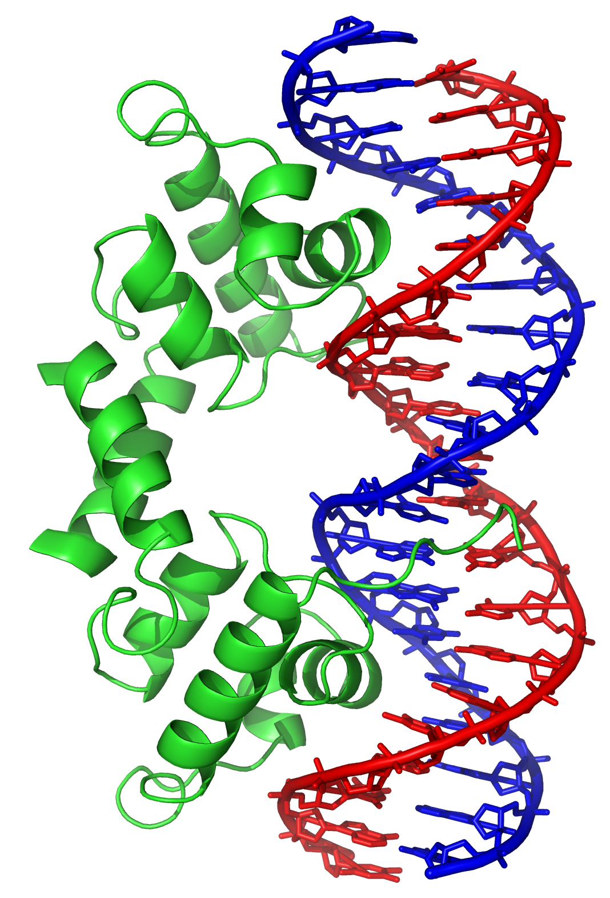
```

.small[https://en.wikipedia.org/wiki/DNA-binding_protein]

---
## Gene Regulation: DNA -> RNA -> Protein 

- What are the transcription factors (TFs) that control gene expression? 

- At what genes do these TFs operate?

- Understanding transcriptional regulatory network will
    - Reveal how cellular processes are connected and coordinated
    - Suggest new strategies to manipulate phenotypes and combat disease

```{r, out.width = "500px", fig.align='center', echo=FALSE}
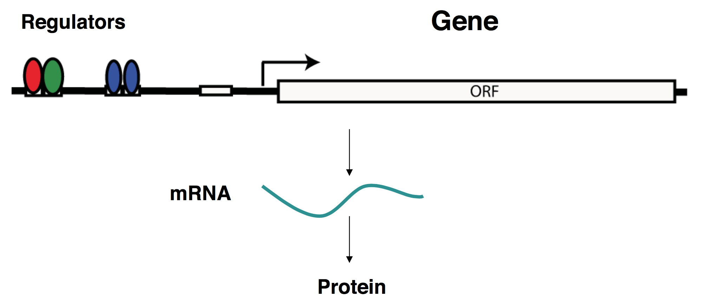
```

---
## ChIP-seq big picture

**Chromatin immunoprecipitation (ChIP)** is a technique that uses **antibodies** to selectively capture and isolate specific protein-DNA complexes from cells, allowing researchers to identify where particular proteins bind to DNA across the genome.

Combine high-throughput sequencing with ChIP to identify specific protein-DNA interactions genome-wide (ChIP-seq), including those of:

- Transcription factors
- Histones (various types and modifications)
- RNA Polymerase (survey of transcription)
- DNA polymerase (investigate DNA replication) 
- DNA repair enzymes
- Fragments of DNA that are modified (e.g. methylated)

---
## Antibodies

ChIP-seq uses antibodies to selectively enrich DNA fragments bound by a protein or marked by a specific histone modification  

- Antibodies bind **epitopes** (specific molecular features) on target proteins  
  - **Transcription factors** (e.g., TP53, CTCF)  
  - **Histone modifications** (e.g., H3K27ac, H3K4me3)  
  - **Histone variants** (e.g., H3.3, H2A.Z)  
  - **Chromatin-associated proteins** (e.g., RNA Pol II, cohesin)  

- **Critical considerations:**
  - **Specificity** → must distinguish closely related epitopes  
  - **Affinity** → strong binding improves signal-to-noise  
  - **Validation** → poor antibodies → false peaks  

---
## ChIP-seq experimental workflow

1. **Crosslink** - Fix protein–DNA interactions in vivo (e.g., formaldehyde)

2. **Chromatin fragmentation** - Shear DNA into ~100–300 bp fragments (sonication or enzymatic digestion)

3. **Immunoprecipitation (IP)**  - Use a specific antibody to enrich DNA bound by target protein or histone mark  

4. **Reverse crosslink & purification**  - Remove proteins and recover enriched DNA fragments  

5. **Library preparation & sequencing**  - Construct sequencing libraries and perform high-throughput sequencing  

.small[Each step impacts resolution, specificity, and overall data quality]

---
## ChIP-seq overview

```{r, out.width = "800px", fig.align='center', echo=FALSE}
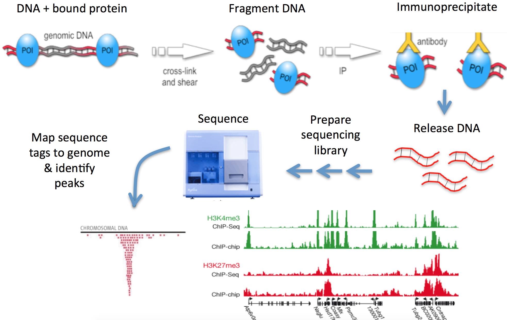
```

<!--
Advantages of ChIP-seq over ChIP-chip
```{r, out.width = "1000px", fig.align='center', echo=FALSE}
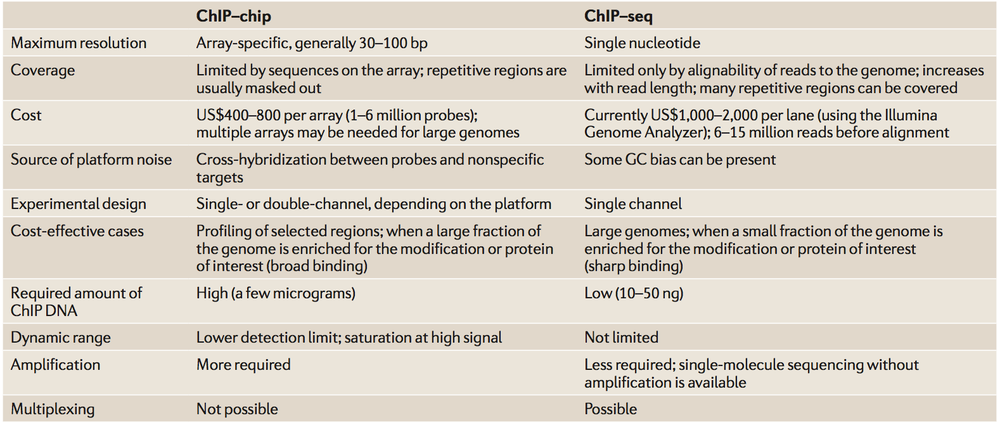
```
-->

---
## How many sequences to find ChIP-seq peaks?

- Effective analysis of ChIP-seq data requires sufficient coverage by sequence reads (sequencing depth)

- The required depth depends mainly on the size of the genome and the number and size of the binding sites of the protein

- For mammalian transcription factors (TFs) and chromatin modifications such as enhancer-associated histone marks, which are typically localized at specific, narrow sites and have on the order of thousands of binding sites, 20 million reads may be adequate (4 million reads for worm and fly)

- Proteins with more binding sites (e.g., RNA Pol II) or broader factors, including most histone marks, will require more reads, up to 60 million for mammalian ChIP-seq

.small[Bailey T, Krajewski P, Ladunga I, Lefebvre C, Li Q, Liu T, et al. (2013) Practical Guidelines for the Comprehensive Analysis of ChIP-seq Data. PLoS Comput Biol. https://doi.org/10.1371/journal.pcbi.1003326 ]

---
## CUT&RUN: An Alternative to ChIP-seq

**CUT&RUN = Cleavage Under Targets and Release Using Nuclease**

1. **Bind cells to beads** - Intact cells attached to magnetic beads (unfixed or lightly fixed)

2. **Antibody binding** - Add antibody against target protein; binds to target on chromatin *in situ*

3. **Recruit pA-MNase** - Protein A-Micrococcal Nuclease fusion binds to antibody

4. **Activate cleavage** - Add Ca²⁺ to activate MNase; cuts DNA at antibody-bound sites (~200-500 bp)
   - **This replaces sonication** - targeted enzymatic cleavage instead of random mechanical fragmentation

5. **Release and sequence** - DNA fragments diffuse out; collect supernatant and sequence

**Key advantage:** Only DNA near target protein is cut → very low background, no need for immunoprecipitation

.small[Peter J Skene, Steven Henikoff (2017) An efficient targeted nuclease strategy for high-resolution mapping of DNA binding sites eLife https://doi.org/10.7554/eLife.21856 ]

---
## CUT&RUN vs ChIP-seq: How It Works

.pull-left[
**Traditional ChIP-seq:**
1. Crosslink proteins to DNA
2. **Sonicate** chromatin into fragments
3. Immunoprecipitate with antibody
4. Reverse crosslink
5. Sequence DNA fragments

**Issues:**
- High background from sonication
- Requires millions of cells
- Incomplete fragmentation
]

.pull-right[
**CUT&RUN:**
1. Bind antibody to target protein *in situ*
2. Add Protein A-MNase fusion
3. **Targeted cleavage** around binding sites
4. Release fragments (no IP needed)
5. Sequence DNA fragments

**Advantages:**
- Only DNA near target is cut
- Very low background
- Works with few cells
- Direct release, no IP
]

---
## Data from ChIP-seq

- Raw data: sequence reads

- After alignments: genome coordinates (chromosome/position) of all reads

- Often, aligned reads are summarized into "counts" in equal sized bins genome-wide:
    1. Segment genome into small bins of equal sizes (e.g., 50bp)
    2. Count number of reads started at each bin

- Alternatively, consider counts in the regions of interest, e.g., promoters of protein-coding genes (2,000bp upstream and 500bp downstream of transcription start site)

<!--
## Modeling the tag profile 

- The ChIP-ed DNA fragment size (length) $l$ in an experiment follows a gamma distribution $p(l) = \Gamma(l|\alpha,\beta)$
- $\alpha$ - the shape parameter, typically 10
- The other parameter can be written as $\alpha\beta$, which is the mean of the gamma distribution, and can be estimated as the average DNA fragment size $L$ from data.

.small[Qi Y, Rolfe A, MacIsaac KD, Gerber GK, Pokholok D, Zeitlinger J, Danford T, Dowell RD, Fraenkel E, Jaakkola TS, et al: High-resolution computational models of genome binding events. Nat Biotechnol 2006, 24:963-970.

Reiss DJ, Facciotti MT, Baliga NS: Model-based deconvolution of genomewide DNA binding. Bioinformatics 2008, 24:396-403.]
-->

---
class: middle,center

# Methods and software for ChIP-seq peak/block calling

---
## ChIP-seq analysis workflow

.pull-left[
```{r, out.width = "300px", fig.align='center', echo=FALSE}
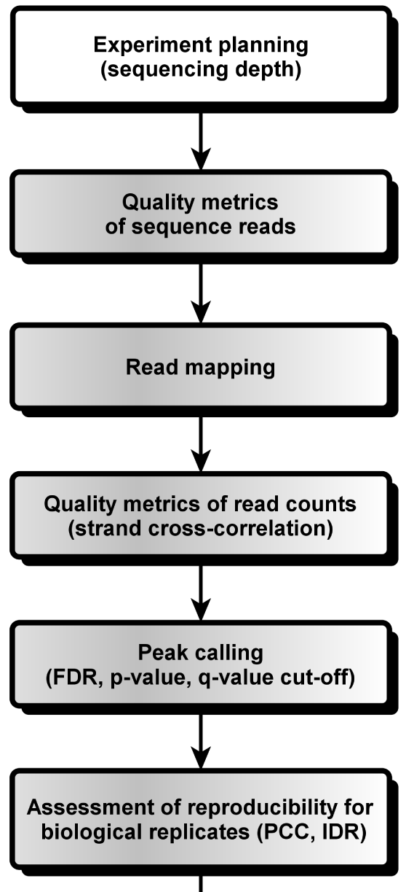
```
]
.pull-right[
```{r, out.width = "300px", fig.align='center', echo=FALSE}
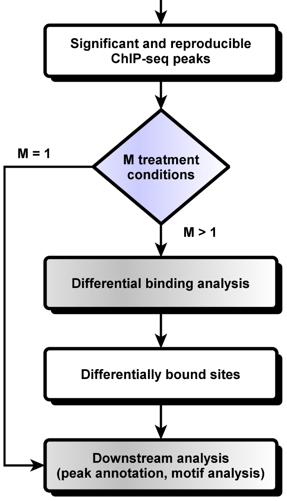
```
]

---
## ChIP-seq "peak" detection

- When plot the read counts against genome coordinates, the binding sites show a tall and pointy peak. So "peaks" are used to refer to protein binding or histone modification sites

```{r, out.width = "800px", fig.align='center', echo=FALSE}
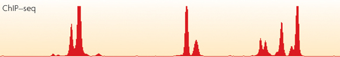
```

- Peak detection is the most fundamental problem in ChIP-seq data analysis

---
## Peak calling: a classic signal versus noise problem

```{r, out.width = "600px", fig.align='center', echo=FALSE}
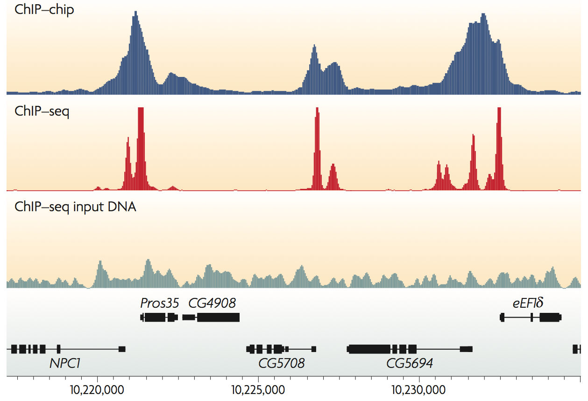
```

.small[Park, Peter J. "ChIP–seq: Advantages and Challenges of a Maturing Technology." Nature Reviews Genetics 10, no. 10 (October 2009): 669–80. https://doi.org/10.1038/nrg2641.]

---
## Simple ideas for peak detection

- Peaks are regions with reads clustered, so they can be detected from binned read counts

- Counts from neighboring windows need to be combined to make inference (so that it's more robust)

- To combine counts:
    - Smoothing based: moving average (`MACS`, `CisGenome`), HMM-based (`Hpeak`)
    - Model clustering of reads starting position (`PICS`, `GPS`)

- Moreover, some special characteristics of the data can be incorporated to improve the peak calling performance

---
## Before peak detection: what do we know about ChIP-seq?

- Artifacts need to be considered
    - DNA sequence: can affect amplification process or sequencing process
    - Chromatin structure (e.g., open chromatin region or not): may affect the DNA sonication process.
    - A control sample is necessary to correct artifacts

- Reads clustered around binding sites to form two distinct peaks on different strands

- Alignment issue: mappability

---
## Control sample is important

- A control sample is necessary for correcting many artifacts: DNA sequence biases, GC content, chromatin structure, repetitive regions, etc.

```{r, out.width = "800px", fig.align='center', echo=FALSE}
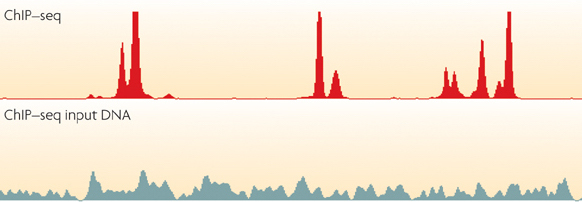
```

---
## Control sample is important

There are three commonly used types of control sample: 

1) **Input DNA** - a portion of the DNA sample removed prior to immunoprecipitation (IP)

2) **Mock IP DNA** - DNA obtained from IP without antibodies

3) **DNA from nonspecific IP** - IP performed using an antibody, such as immunoglobulin G, against a protein that is not known to be involved in DNA binding or chromatin modification

---
## Control sample is important

- Control samples should be sequenced significantly deeper than the ChIP ones. This is to ensure sufficient coverage of a substantial portion of the genome and non-repetitive autosomal DNA regions.

- Used as baseline for **peak calling normalization**  

```{r, out.width = "800px", fig.align='center', echo=FALSE}

```

---
## Mappability

- For each basepair position in the genome, whether a 35 bp sequence tag starting from this position can be uniquely mapped to a genome location

- Regions with low mappability (highly repetitive) cannot have high counts, thus affect the ability to detect peaks

```{r, out.width = "600px", fig.align='center', echo=FALSE}
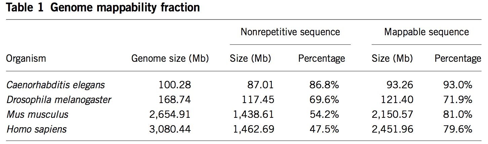
```

.small[Rozowsky, J., Euskirchen, G., Auerbach, R. et al. PeakSeq enables systematic scoring of ChIP-seq experiments relative to controls. Nat Biotechnol 27, 66–75 (2009). https://doi.org/10.1038/nbt.1518 ]

---
## How do peak-finders map binding sites?

- Fragments contain the TF binding site at a (mostly) random position within them
- Reads are randomly generated from left or right edges (sense or antisense) of fragments
- Binding site position = mid-way between sense tag peak and antisense tag peak
- To get binding site peak, shift sense downstream by 1⁄2 fragsize & antisense upstream by 1⁄2 fragsize

```{r, out.width = "500px", fig.align='center', echo=FALSE}
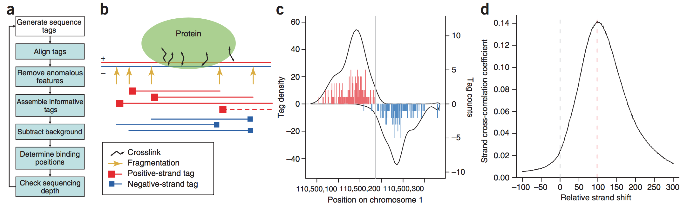
```

.small[ Kharchenko, P., Tolstorukov, M. & Park, P. Design and analysis of ChIP-seq experiments for DNA-binding proteins. Nat Biotechnol 26, 1351–1359 (2008). https://doi.org/10.1038/nbt.1508 ]

<!--(a) Main steps of the proposed ChIP-seq processing pipeline. (b) Schematic illustration of ChIP-seq measurements. DNA is fragmented or digested, and fragments cross-linked to the protein of interest are selected with immunoprecipitation. The 5′ ends (squares) of the selected fragments are sequenced, typically forming groups of positive- and negative-strand tags on the two sides of the protected region. The dashed red line illustrates a fragment generated from a long cross-link that may account for the tag patterns observed in CTCF and STAT1 data sets. (c) Tag distribution around a stable NRSF binding position. Vertical lines show the number of tags (right axis) whose 5′ position maps to a given location on positive (red) or negative (blue) strands. Positive and negative values on the y-axis are used to illustrate tags mapping to positive and negative strands, respectively. The solid curves show tag density for each strand (left axis, based on Gaussian kernel with σ = 15 bp). (d) Strand cross-correlation for the NRSF data. The y-axis shows Pearson linear correlation coefficient between genome-wide profiles of tag density of positive and negative strands, shifted relative to each other by a distance specified on the x-axis. The peak position (red vertical line) indicates a typical distance separating positive- and negative-strand peaks associated with the stable binding positions.-->

---
## Strand cross-correlation

- A high-quality ChIP-seq experiment often shows a significant clustering of enriched DNA sequence tags at the locations bound by the protein
- The enriched sequence tags on the forward and reversed strands are positioned at a distance from the binding site center that depends on the fragment size distribution
- The cross-correlation between the two strands, i.e., the Pearson correlation between the strand-specific read density profiles as a function of the shift (k) applied to one of the two strands

```{r, out.width = "500px", fig.align='center', echo=FALSE}
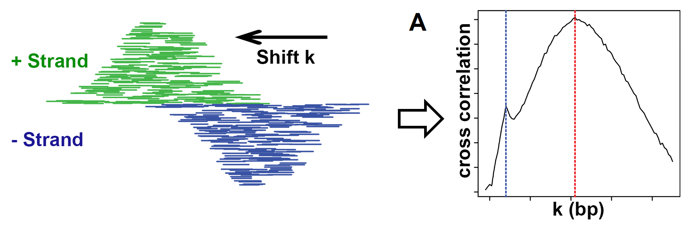
```

.small[Bailey T, Krajewski P, Ladunga I, Lefebvre C, Li Q, Liu T, et al. (2013) Practical Guidelines for the Comprehensive Analysis of ChIP-seq Data. PLoS Comput Biol 9(11): e1003326. https://doi.org/10.1371/journal.pcbi.1003326 ]

---
## Regions to watch out for abnormal peaks

- **Centromeres** - "acen" regions from http://hgdownload.cse.ucsc.edu/goldenpath/hg19/database/cytoBand.txt.gz

- **ENCODE blacklisted regions** - https://github.com/dozmorovlab/excluderanges

- **Gaps** - unsequenced parts of human genome, http://hgdownload.cse.ucsc.edu/goldenpath/hg19/database/gap.txt.gz

- **SuperDups** - large genomic duplications, http://hgdownload.cse.ucsc.edu/goldenpath/hg19/database/genomicSuperDups.txt.gz

.small[ Brydon P G Wall, Jonathan D Ogata, My Nguyen, Amy L Olex, Konstantinos V Floros, Anthony C Faber, Joseph L McClay, J Chuck Harrell, Mikhail G Dozmorov, Beyond blacklists: a critical assessment of exclusion set generation strategies and alternative approaches, Bioinformatics, Volume 42, Issue 3, March 2026, btag110, https://doi.org/10.1093/bioinformatics/btag110  ]

<!--
## Binding significance

- We compute a p-value with a binomial test for significance
- Null Model - $F(k,n,P)$ - probability $n-k$ reads observed in IP channel by chance with $k$ reads observed in control

$$F(k,n,P) = \sum_{I=0}^{\lceil k \rceil} \binom{n}{I} P^I (1 - P)^{(n-I)}$$

- $k$ - scaled control read count
- $n$ - total count of IP and scaled control reads
- $P$ - probability that reads occur from IP data, $P = 0.5$ means equal chance reads occurred in control and IP channels for null model
- We determine significant events using multiple testing correction, e.g., Benjamini-Hochberg False Discovery Rate (FDR)
-->

---
## Peak detection software

.small[See http://journals.plos.org/ploscompbiol/article?id=10.1371/journal.pcbi.1003326#s5 for full table]

.small[
| Software tool                  | Availability                                                        | Point- source (peaks) | Broad regions (domains) |
|--------------------------------|---------------------------------------------------------------------|-----------------------|-------------------------|
| BayesPeak                      | http://bioconductor.org/packages/BayesPeak/   | Yes                   |                         |
| BEADS                         | http://beads.sourceforge.net/                                       | Yes                   | Yes                     |
| CCAT                           | https://bioinformaticshome.com/db/tool/CCAT                  |                       | Yes                     |
| CisGenome                      | http://www.biostat.jhsph.edu/~hji/cisgenome/                        | Yes                   |                         |
| CSAR                           | https://bioconductor.org/packages/CSAR/        | Yes                   |                         |
| dPeak                          | https://pages.stat.wisc.edu/~chungdon/dpeak/                           | Yes                   |                         |
| GPS/GEM                        | https://groups.csail.mit.edu/cgs/onePageGPS/                                       | Yes                   |                         |
| HPeak                          | http://www.sph.umich.edu/csg/qin/HPeak/                             | Yes                   |                         |
| MACS                           | https://github.com/taoliu/MACS/                                     | Yes                   | Yes                     |
| NarrowPeaks                 | http://bioconductor.org/packages/NarrowPeaks/ | Yes                   |                         |
]

---
## Peak detection software

.small[
| Software tool | Availability                                                        | Point- source (peaks) | Broad regions (domains) |
|---------------|---------------------------------------------------------------------|-----------------------|-------------------------|
| PeakAnalyzer/ PeakSplitter  | http://www.bioinformatics.org/peakanalyzer                          | Yes                   |                         |
| PeakRanger    | http://ranger.sourceforge.net/                                      | Yes                   | Yes                     |
| PeakSeq       | http://info.gersteinlab.org/PeakSeq                                 | Yes                   |                         |
| polyaPeak  | https://www.haowulab.org/software/polyaPeak.html                | Yes                   |                         |
| RSEG          | https://smithlabresearch.org/software/rseg/                               |                       | Yes                     |
| SICER         | https://zanglab.github.io/SICER2/                             |                       | Yes                     |
| SIPeS         | https://sourceforge.net/projects/novebio-sipes/ | Yes                   |                         |
| SISSRs        | http://sissrs.rajajothi.com/                                        | Yes                   |                         |
| SPP           | http://compbio.med.harvard.edu/Supplements/ChIP-seq/                | Yes                   | Yes                     |
| USeq          | http://sourceforge.net/projects/useq/                               | Yes                   |                         |
| ZINBA         | http://code.google.com/p/zinba/                                     | Yes                   | Yes                     |
]

---
## Peak detection

- Calculate read count at each position (bp) in genome. Don't use a sliding window

- Determine if read count is greater than expected (at each position, bp)

- We need to correct for input DNA reads (control)
    - non-uniformly distributed
    - vastly different numbers of reads between ChIP and input

---
## The Poisson distribution: discrete distribution to model coverage

The Poisson distribution models the probability of observing a certain number of events when we know the average rate:

$$P(k\ events) = \frac{\lambda^k e^{-\lambda}}{k!}$$

where:
- $k$ = the actual number of events we observe (e.g., 0, 1, 2, 3...)
- $\lambda$ = the expected average number of events
- $e$ = Euler's constant (2.718)

---
## The Poisson distribution: discrete distribution to model coverage

**Example: The "hundred year flood"**
- $\lambda = 1$ (we expect 1 catastrophic flood per 100 years on average)
- $P(k=0)$ = probability of zero floods in 100 years
- $P(k=1)$ = probability of exactly one flood in 100 years  
- $P(k=2)$ = probability of two floods in 100 years

**In ChIP-seq:** $k$ = number of reads at a genomic position, $\lambda$ = expected background coverage

.small[https://en.wikipedia.org/wiki/Poisson_distribution]

---
## Poisson distribution with different values of $\lambda$

```{r, out.width = "700px", fig.align='center', echo=FALSE}
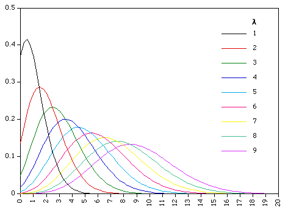
```

---
## Is the observed read count at a given genomic position greater than expected?

Read counts follow a Poisson distribution

$$ P(X \ge x) = 1 - \sum_0^{x-1}\frac{\lambda^xe^{-\lambda}}{x!} $$

- $x$ - observed read count; $\lambda$ - expected read count

Example:

- $x = 10$ reads, observed; $\lambda$ = 0.5 reads, expected
- $P(X \ge 10) = 1.7 x 10^{-10}$
- $-log_{10}P(X \ge 10) = 9.77$
- In R, $P(X \ge 10 | \lambda = 0.5)$ is `1 - sum(dpois(0:9, 0.5))`

---
## Is the observed read count at a given genomic position greater than expected?

```{r, out.width = "800px", fig.align='center', echo=FALSE}
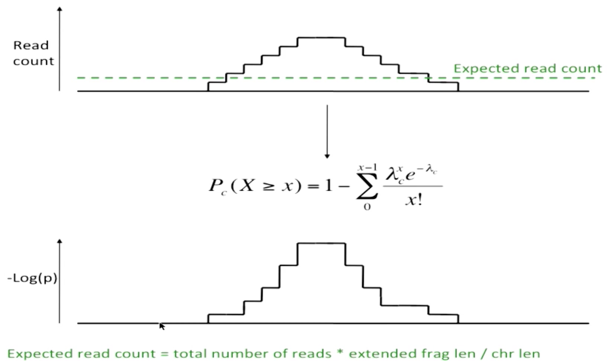
```

---
## Is the observed read count at a given genomic position greater than expected?

```{r, out.width = "800px", fig.align='center', echo=FALSE}
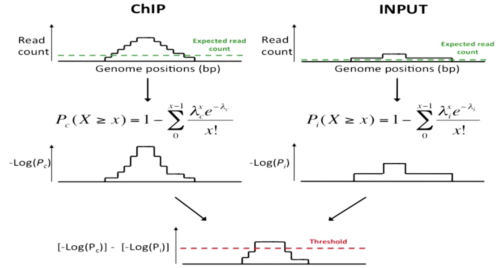
```

---
## Normalized Peak score at each bp

$$R = -log_{10}\frac{P(X_{ChIP})}{P(X_{Input})}$$

Will detect peaks with high read counts in ChIP, low in Input

Works when no input DNA ($X_{Input} = 0$)

$$ P(X \ge x) = 1 - \sum_0^{x-1}\frac{\lambda^xe^{-\lambda}}{x!} $$

---
## Ideally, sequencing coverage will follow a Poisson distribution. But...

```{r, out.width = "600px", fig.align='center', echo=FALSE}
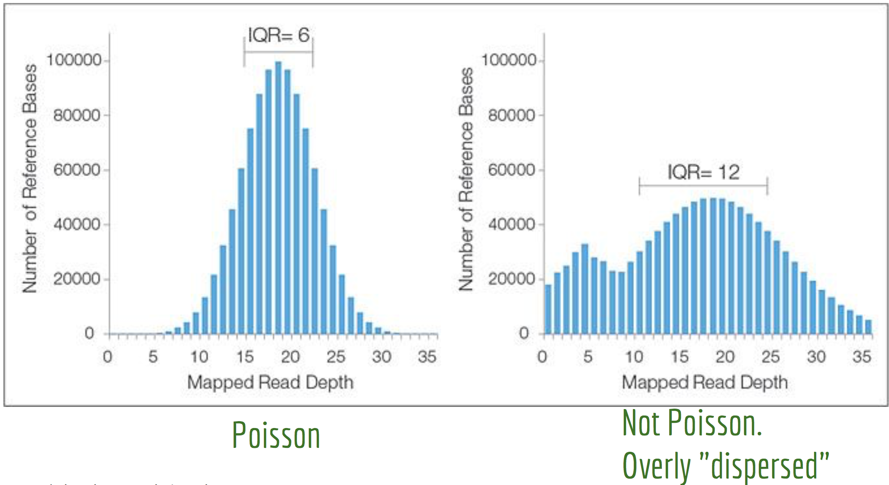
```

- Negative binomial fits sequencing coverage data much better

.small[https://www.youtube.com/watch?v=HK7WKsL3c2w, Kuan, P. F., Chung, D., Pan, G., Thomson, J. A., Stewart, R., & Keleş, S. (2011). A Statistical Framework for the Analysis of ChIP-Seq Data. Journal of the American Statistical Association, 106(495), 891–903. https://doi.org/10.1198/jasa.2011.ap09706]

---
## MACS (Model-based Analysis of ChIP-Seq) 

.pull-left[
```{r, out.width = "400px", fig.align='center', echo=FALSE}
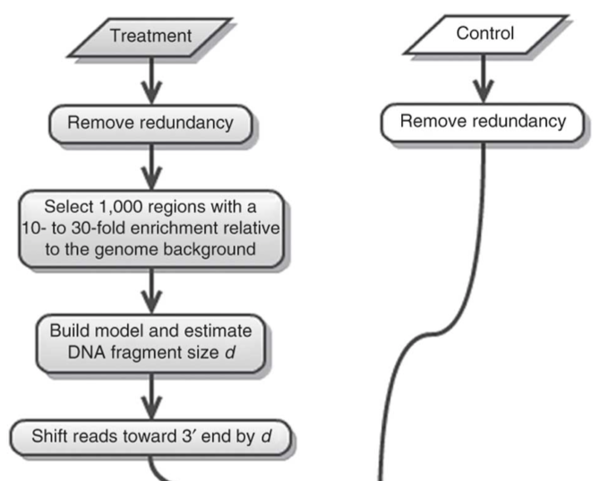
```
]
.pull-right[
```{r, out.width = "400px", fig.align='center', echo=FALSE}
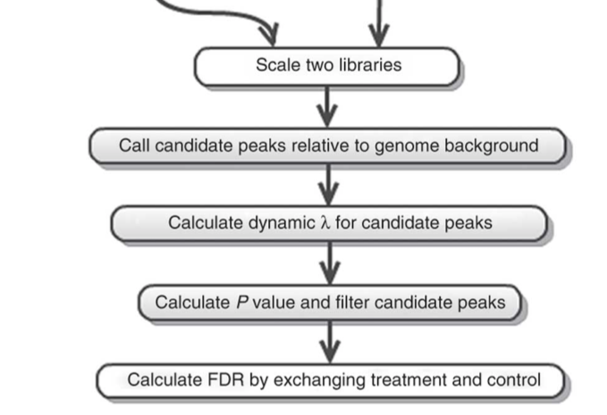
```
]

Written in Python, runs in command line. `macs14 -t sample.bed -c control.bed -n result`

.small[ https://github.com/macs3-project/MACS ]

.small[Zhang, Y., Liu, T., Meyer, C.A. et al. Model-based Analysis of ChIP-Seq (MACS). Genome Biol 9, R137 (2008). https://doi.org/10.1186/gb-2008-9-9-r137 ]

---
## MACS (Model-based Analysis of ChIP-Seq)

- Estimate shift size of reads $d$ from the distance of two modes from + and - strands.

- Shift all reads toward 3' end by $d/2$.

- Use a dynamic Possion model to scan genome and score peaks. 
    - Counts in a window are assumed to following Poisson distribution with rate : $\lambda_{local} = max(\lambda_{BG}, \lambda_{1K}, \lambda_{5K}, \lambda_{10K})$ where $\lambda_{1K}$, $\lambda_{5K}$ and $\lambda_{10K}$ are $\lambda$ estimated from the 1 kb, 5 kb or 10 kb window centered at the peak location in the control samples and call peaks. 

---
## MACS (Model-based Analysis of ChIP-Seq)

- FDR estimates from sample swapping: flip the IP and control samples and call peaks. 
  - The number of "negative" peaks should be ~10 times less

- Number of peaks detected under each p-value cutoff will be used as null and used to compute FDR
  
---
## MACS fine tuning

MACS can't build a model:

- Adjust the $mfold$ value (the fold over background ranges MACs considers for paired peaks)
- Tell MACS to not build a model, but instead use the shiftsize you specify.

Peaks/Negative Peaks ratio is poor or too few peaks are detected:

- Adjust model settings to see if you can improve both. Otherwise, you may have to conclude that 1) your library was no good or 2) the factor just doesn't bind to many places in the genome

<!--
## Cisgenome 

- Implemented with Windows GUI.
- Use a Binomial model to score peaks.

```{r, out.width = "400px", fig.align='center', echo=FALSE}
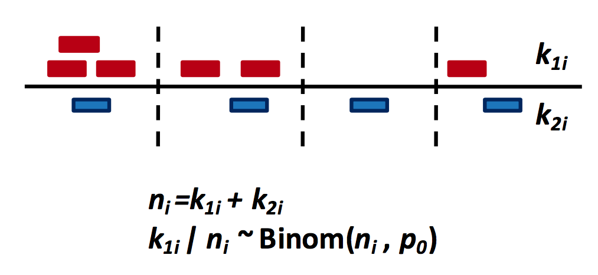
```

.small[http://www.biostat.jhsph.edu/~hji/cisgenome/index.htm

Ji, Hongkai, Hui Jiang, Wenxiu Ma, David S Johnson, Richard M Myers, and Wing H Wong. "An Integrated Software System for Analyzing ChIP-Chip and ChIP-Seq Data." Nature Biotechnology 26, no. 11 (November 2008): 1293–1300. https://doi.org/10.1038/nbt.1505. https://www.nature.com/nbt/journal/v26/n11/abs/nbt.1505.html]
-->

---
## Consider mappability: PeakSeq

- Two-pass analysis. First round - detect possible peak regions by identifying threshold while considering mappability
    - Cut genome into segments ($L=1Mb$). Within each segment, the same number of reads are permuted in a region of $f \times L$, there $f$ is  the proportion of mappable bases in the segment

```{r, out.width = "600px", fig.align='center', echo=FALSE}
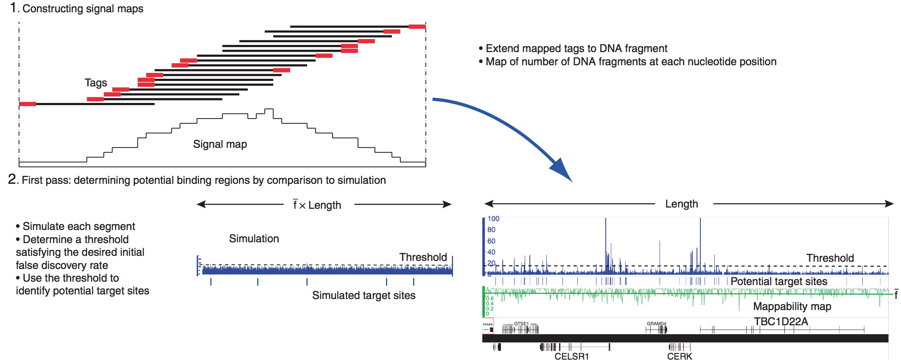
```

.small[Rozowsky, J., Euskirchen, G., Auerbach, R. et al. PeakSeq enables systematic scoring of ChIP-seq experiments relative to controls. Nat Biotechnol 27, 66–75 (2009). https://doi.org/10.1038/nbt.1518 ]

<!--(1) Mapped reads are extended to have the average DNA fragment length (reads on either strand are extended in the 3′ direction relative to that strand) and then accumulated to form a fragment density signal map. (2) Potential binding sites are determined in the first pass of the PeakSeq scoring procedure. The threshold is determined by comparison of putative peaks with a simulated segment with the same number of mapped reads. The length of the simulated segment is scaled by the fraction of uniquely mappable starting bases.-->

---
## Consider mappability: PeakSeq

- Second round analysis
    - Normalize data by counts in background regions
    - Test significance of the peaks identified in first round by comparing the total count in peak regions with control data, using binomial p-value with Benjamini-Hochberg correction

```{r, out.width = "800px", fig.align='center', echo=FALSE}
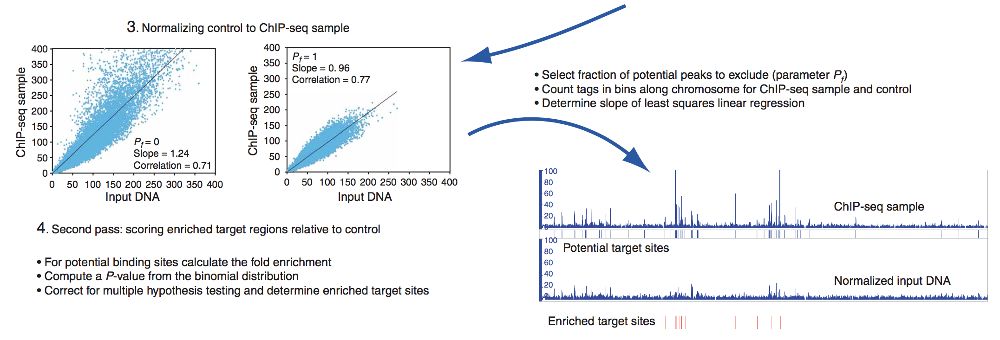
```

<!--(3) After selecting the fraction of potential target sites that should be excluded from the normalization, the scaling factor Pf is determined by linear regression of the ChIP-seq sample against the input-DNA control in 10-Kb bins. Bins that overlap the potential targets regions selected for exclusion are not used for regression. The fitted slopes as well as the Pearson correlations are displayed for Pf set to either 0 or 1. (4) Enrichment and significance are computed for putative binding regions.-->

<!--
## PICS: Probabilistic Inference for ChIP-seq

- Use shifted t-distributions to model peak shape
- Can deal with the clustering of multiple peaks in a small region
- Accounts for mappability
- A two step approach:
    - Roughly locate the candidate regions
    - Fit the model at each candidate region and assign a score
    - EM algorithm for estimating parameters
    - Computationally very intensive

.small[Zhang, Xuekui, Gordon Robertson, Martin Krzywinski, Kaida Ning, Arnaud Droit, Steven Jones, and Raphael Gottardo. "PICS: Probabilistic Inference for ChIP-Seq." Biometrics 67, no. 1 (March 2011): 151–63. https://doi.org/10.1111/j.1541-0420.2010.01441.x.]
-->


<!--
## PICS 

```{r, out.width = "500px", fig.align='center', echo=FALSE}
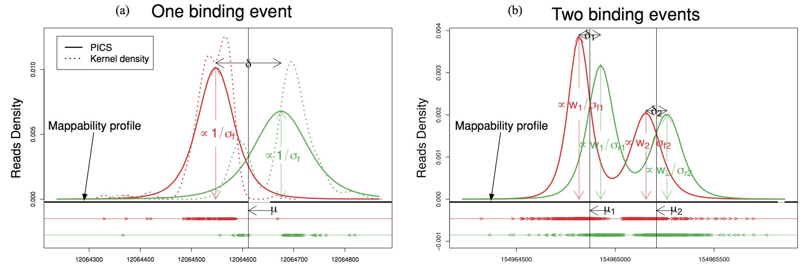
```

.small[(Zhang et al. 2010 Biometrics) http://onlinelibrary.wiley.com/doi/10.1111/j.1541-0420.2010.01441.x/abstract]
-->
<!--Predicted binding events in two candidate regions in the GABP data. PICS detected one binding event in the region in (a) and two binding events in the region in (b). The observed data of forward and reverse strand aligned reads are shown by ">" and "<" arrowheads, respectitvely. Vappapbity profis black/white lines, in which the white intervals show nonmappable regions. In (a), the distribution of reverse read positions was biased by a region with low mappability-->

---
## Comparing peak calling algorithms

```{r, out.width = "300px", fig.align='center', echo=FALSE}
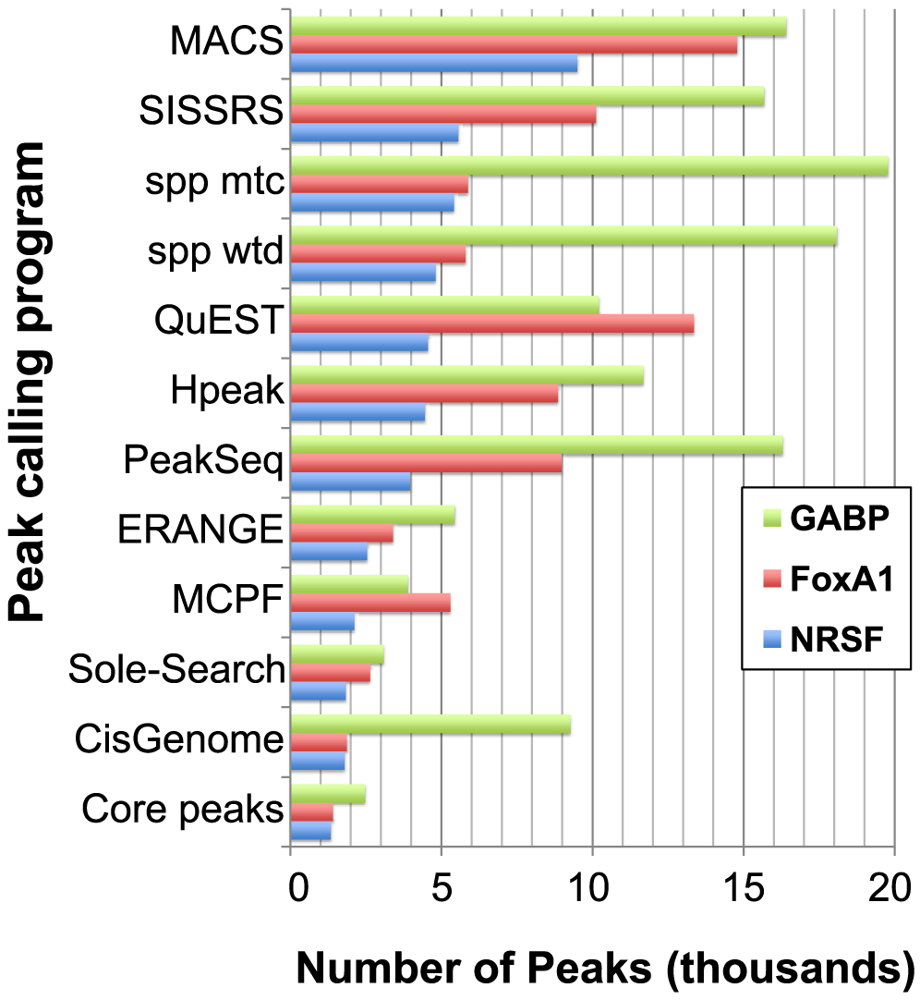
```

.small[Wilbanks EG, Facciotti MT (2010) Evaluation of Algorithm Performance in ChIP-Seq Peak Detection. PLoS ONE 5(7): e11471. https://doi.org/10.1371/journal.pone.0011471  
Laajala, T.D., Raghav, S., Tuomela, S. et al. A practical comparison of methods for detecting transcription factor binding sites in ChIP-seq experiments. BMC Genomics 10, 618 (2009). https://doi.org/10.1186/1471-2164-10-618 ]

---
## Quality Control Metrics

**Library complexity**: Assess using PCR bottleneck coefficient (PBC) and non-redundant fraction (NRF)
$$PBC = N_{1}/N_{d}$$

- $N_{1}$ - number of genomic locations (chromosome + strand + start position) with exactly 1 read
- $N_{d}$ - number of distinct genomic locations

$$NRF = Nd/N$$
- $N$ - total number of reads
  
---
## Quality Control Metrics

**Signal enrichment**: FRiP (Fraction of Reads in Peaks) score

- Proportion of reads that fall within called peaks
- Higher FRiP indicates better enrichment
  
**Cross-correlation metrics**: NSC (Normalized Strand Coefficient) and RSC (Relative Strand Coefficient)

- Derived from strand cross-correlation analysis
- Good quality data: NSC > 1.05, RSC > 0.8

---
## Reproducibility between samples

- Spearman's rank correlation provides a metric for replicate consistency but does not select consistent events

- Consider two ranked lists of $n$ detected events $X$ and $Y$, one from each replicate, each ranked by scores from most significant to least significant
 - For matched event $i$ ranks are $x_i$ and $y_i$ in $X$ and $Y$

```{r, out.width = "600px", fig.align='center', echo=FALSE}
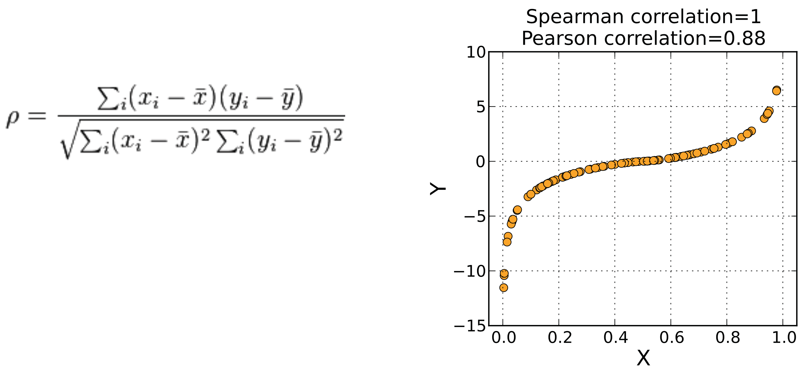
```

---
## Irreproducible Discovery Rate (IDR) Analysis

- Consider that the lists $X$ and $Y$ are a mixture of two kinds of events - reproducible and irreproducible

- Model the ranking scores as a two component mixture and learn the parameters of the reproducible and irreproducible components

- For IDR $\alpha$, select top $l$ pairs using their scores such that the probability that the rate of pairs from the irreproducible part of the mixture is $\alpha$

---
## Irreproducible Discovery Rate (IDR) Analysis

- $\Psi_n(t)$ is the fraction of the $n$ events that are paired in the top $n \times t$ events in both $X$ and $Y$. It is roughly linear from $t=0$ to the point when events are no longer reproducible (not shared between replicates within the ranking)

- $\Psi_n'(t)$ is first derivative of $\Psi_n(t)$ with respect to $t$. It allows us to visualize when we transition from reproducible to irreproducible events as $t$ increases

---
## Irreproducible Discovery Rate (IDR) Analysis

```{r, out.width = "600px", fig.align='center', echo=FALSE}
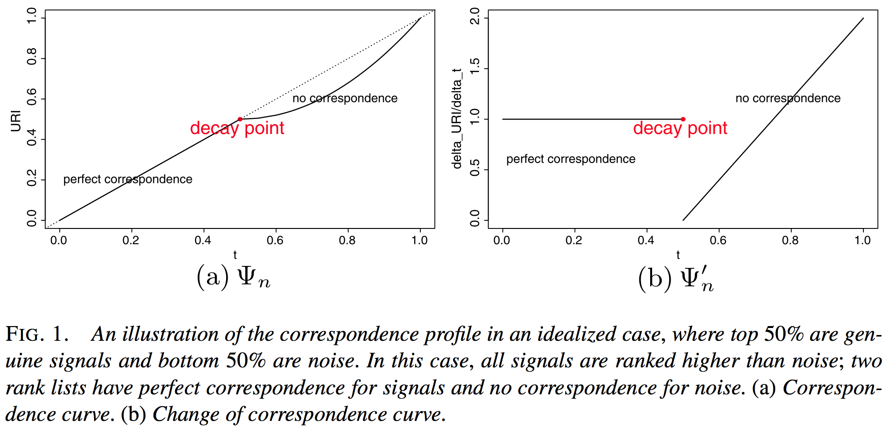
```

.small[Li, Qunhua, James B. Brown, Haiyan Huang, and Peter J. Bickel. "Measuring Reproducibility of High-Throughput Experiments." The Annals of Applied Statistics 5, no. 3 (September 2011): 1752–79. doi:10.1214/11-AOAS466.]

---
## The irreproducible discovery rate (IDR) framework for assessing reproducibility of ChIP-seq data sets

```{r, out.width = "500px", fig.align='center', echo=FALSE}
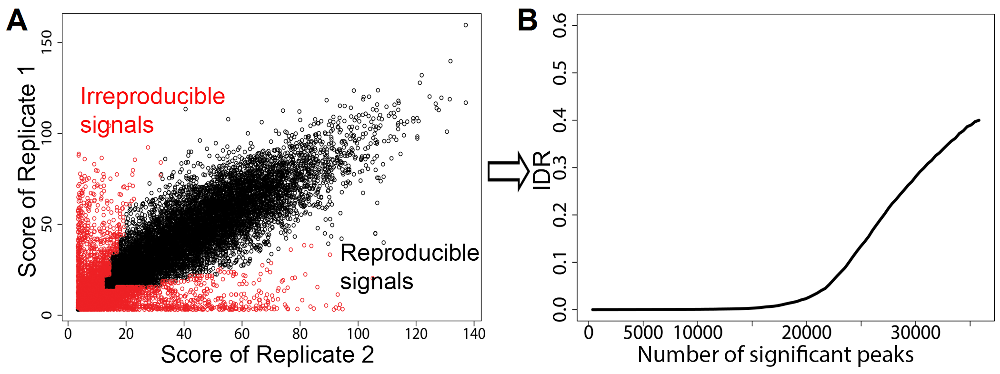
```

.small[Panel A shows a scatterplot of the significance scores of peaks identified in two replicate ChIP-seq experiments. The IDR method classifies peaks into reproducible (black) and irreproducible (red) groups, and computes for each peak the probability that the peak belongs to the irreproducible group. It ranks and selects peaks according to this probability, and computes IDR, the expected rate of irreproducible discoveries in the selected peaks. Panel B shows the estimated IDR at different rank thresholds when the peaks are sorted by the original significance score.

Bailey T, Krajewski P, Ladunga I, Lefebvre C, Li Q, Liu T, et al. (2013) Practical Guidelines for the Comprehensive Analysis of ChIP-seq Data. PLoS Comput Biol 9(11): e1003326. https://doi.org/10.1371/journal.pcbi.1003326]

<!--Irreproducible Discovery Rate Results
```{r, out.width = "600px", fig.align='center', echo=FALSE}
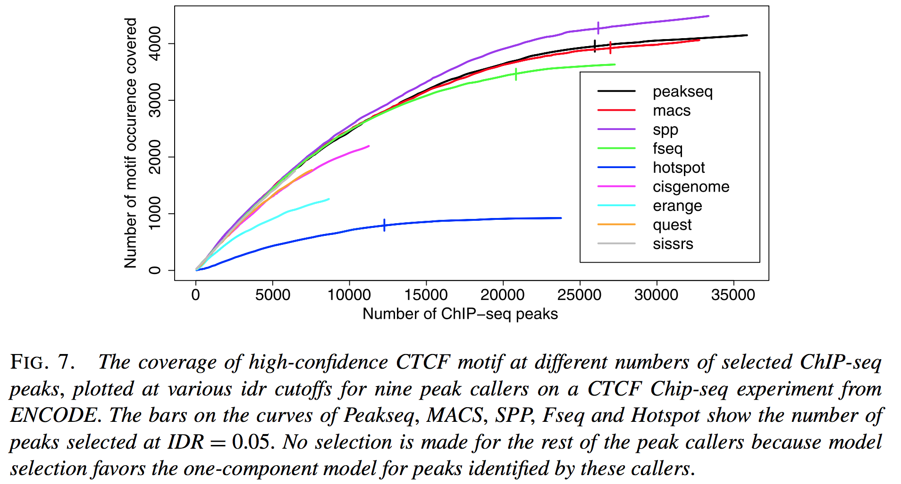
```
.small[Li, Qunhua, James B. Brown, Haiyan Huang, and Peter J. Bickel. "Measuring Reproducibility of High-Throughput Experiments." The Annals of Applied Statistics 5, no. 3 (September 2011): 1752–79. doi:10.1214/11-AOAS466.]
-->

---
## Core histone proteins and nucleosome structure

- Chromatin is organized into **nucleosomes**
  - ~147 bp DNA wrapped around histone proteins  
  - **H2A, H2B** (stabilize DNA wrapping), **H3, H4** (central scaffold) → core histone octamer (2 copies each)  
  - **H1 (linker histone)** → promotes chromatin compaction and higher-order folding   

```{r, out.width = "400px", fig.align='center', echo=FALSE}
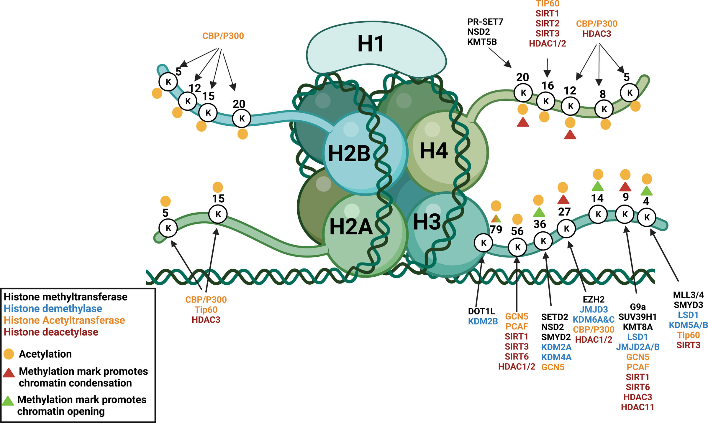
```

.small[ https://doi.org/10.1161/HYPERTENSIONAHA.123.21755 ]

---
## Histone modifications and chromatin states

Histone tails (mainly **H3 and H4**) undergo post-translational modifications (methylation, acetylation, phosphorylation) that affect DNA accessibility and gene regulation.
.pull-left[
* **H3K4me3** → active promoters
* **H3K27ac** → active enhancers
* **H3K4me1** → poised/active enhancers
* **H3K27me3** → repressed (Polycomb)
* **H3K9me3** → heterochromatin

Combinations of marks define **chromatin states** - regulatory context beyond transcription factor binding
]
.pull-right[
```{r, out.width = "70%", fig.align='center', echo=FALSE}
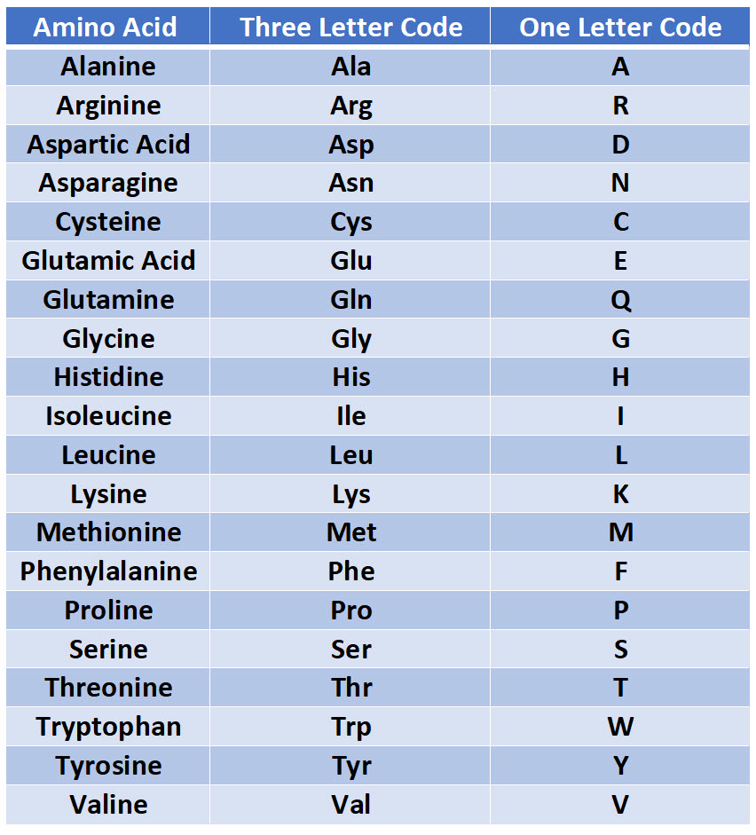
```
]

* ChIP-seq enables genome-wide mapping of histone marks

---
## ChIP-seq for histone modification

**ChIP-seq signal patterns vary by modification type:**

- **Sharp, narrow peaks** (similar to TF binding):
  - H3K4me3 at active promoters
  - H3K4me1 at enhancers

- **Wide blocks** (mega-bp domains):
  - H3K9me3 in heterochromatin
  - H3K27me3 in large repressed domains

- **Mixed patterns** (both peaks and domains):
  - H3K27me3, H3K36me3 depending on genomic context
  - RNA Pol II: sharp peaks when stalled, broad stretches during active transcription

---
## Histone modification ChIP-seq data

```{r, out.width = "900px", fig.align='center', echo=FALSE}
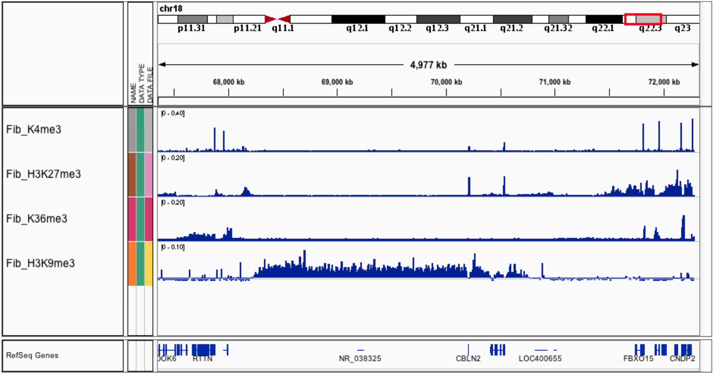
```

---
## The transcription factor and histone modification landscape

```{r, out.width = "500px", fig.align='center', echo=FALSE}
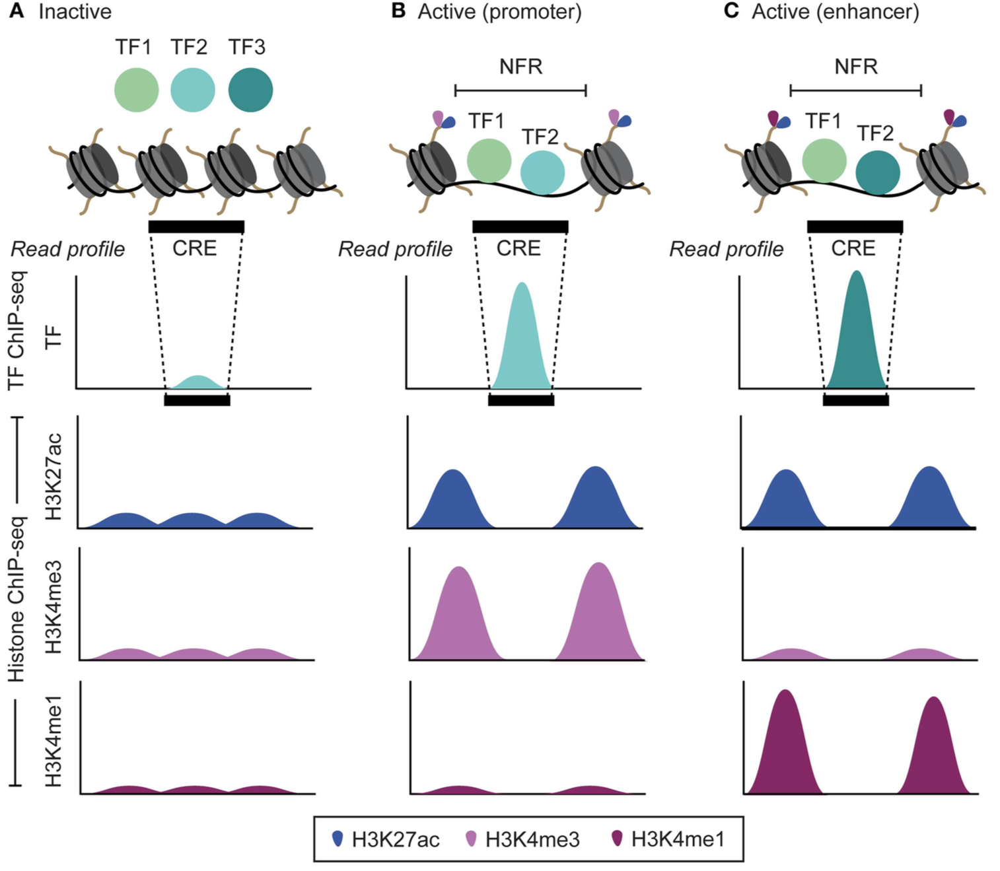
```

---
## Peak/block calling from histone ChIP-seq

**TF peak callers for histone modifications?**

- Works well for narrow marks: H3K4me3, H3K4me1

- Acceptable for mixed patterns: H3K27me3, H3K36me3

- Poor for broad domains: H3K9me3, H3K27me3 blocks
  - Problem: algorithms fragment long blocks into many small pieces
  - Misses the biological meaning of large repressed domains

---
## Peak/block calling from histone ChIP-seq

**Specialized methods for histone modifications:**

- **Smoothing-based**: aggregate signal over larger windows

- **Hidden Markov Models (HMM)**: segment genome into states (enriched vs. background)

- **Wavelet-based**: detect features at multiple scales

**Key challenge:** Need to detect both sharp peaks AND broad domains in the same dataset

---
## Complications in histone peak/block calling

Smoothing-based method:

- Long block requires bigger smoothing span, which hurts boundary detection
- Data with mixed peak/block (K27me3, K36me3) requires varied span: adaptive fitting is computationally infeasible

HMM-based method:

- Tend to overfit. Sometimes need to manually specify transition matrix

<!--
Available methods/software for histone data peak calling

- MACS2
- BCP (Bayesian change point caller)
- SICER
- RSEG
- UW Hotspot
- BroadPeak
- mosaicsHMM
- WaveSeq
- ZINBA
- ARHMM
- ...
-->

---
## Methods for histone data peak calling

- Machine learning and deep learning approaches emerging
- Specialized tools for low-background methods (CUT&Tag, CUT&RUN)
- Improved handling of mixed peak patterns

.small[
| Method/Tool | Best For | Availability |
|-------------|----------|--------------|
| **MACS2** | Narrow peaks (H3K4me3); broad peaks with `--broad` option | https://github.com/maldun/MACS |
| **SICER** | Broad domains (H3K9me3, H3K27me3) | http://home.gwu.edu/~wpeng/Software.htm |
| **GoPeaks** | CUT&Tag data; mixed patterns (H3K27ac) | https://github.com/maxsonBraunLab/gopeaks |
| **SEACR** | CUT&RUN/CUT&Tag; low-background data | https://github.com/FredHutch/SEACR |
| **CNN-Peaks** | Deep learning-based; visual inspection | https://github.com/odb9402/CNN-Peaks |
| **LanceOtron** | Machine learning; CUT&RUN data | https://github.com/LHentges/LanceOtron |
| **SpikeFlow** | Spike-in normalized ChIP-Rx data | https://github.com/Chiacchiera-Lab/spikeflow |
| **RSEG** | HMM segmentation for broad marks | http://smithlab.usc.edu/histone/rseg/ |
| **CCAT** | Broad chromatin domains | http://cmb.gis.a-star.edu.sg/ChIPSeq/paperCCAT.htm |
]

---
## MACS3 = Model-based Analysis of ChIP-Seq

- Major update from MACS2; actively maintained
- Now 14 subcommands for comprehensive ChIP-seq analysis workflow
- Python-based; install via PyPI (`pip install macs3`) or Bioconda

**Key features:**
- **Narrow peaks**: Standard TF ChIP-seq peak calling
- **Broad peaks**: `--broad` option for histone marks (combines nearby peaks)
- **ATAC-seq support**: Paired-end mode (`-f BAMPE`) and dedicated `hmmratac` subcommand
- **Differential binding**: `bdgdiff` for comparing conditions
- **Single-cell**: `hmmratac` supports scATAC-seq with barcode filtering

.small[ https://macs3-project.github.io/MACS/ ]

<!--
**Example commands:**

```bash
# TF ChIP-seq (narrow peaks)
macs3 callpeak -t ChIP.bam -c Control.bam -f BAM -g hs -n test -B -q 0.01

# Histone ChIP-seq (broad peaks)
macs3 callpeak -t ChIP.bam -c Control.bam --broad -g hs --broad-cutoff 0.1

# ATAC-seq with HMMATAC
macs3 hmmratac -i ATAC.bam -f BAMPE -n test
```
-->

<!--
RSEG
- By Andrew Smith at USC: http://smithlabresearch.org/software/rseg/
- Use negative binomial distribution to model the bin counts, "NBDiff" distribution for differences between IP and control
- HMM (3-state for TF data, 2-state for epigenomic domains) for genome segmentation. Use permutation to calculate p-values and determine boundaries
-->

---
## SICER

Algorithm:

- Cut genome of length $L$ into non-overlapping windows $w$ and compute a score $s$ for each window with $l$ reads out of $N$ total based on a Poisson model, $s(l)=-logP(l,\lambda)$, where $\lambda = wN/L$

- Identify "islands" vs. "non-islands" by thresholding the scores and clustering windows with significant scores

- For each island, compute the probability of observing the island with a given score. Constructing score distribution is involved

.small[Zang, Chongzhi, Dustin E. Schones, Chen Zeng, Kairong Cui, Keji Zhao, and Weiqun Peng. "A Clustering Approach for Identification of Enriched Domains from Histone Modification ChIP-Seq Data." Bioinformatics 25, no. 15 (August 1, 2009): 1952–58. https://doi.org/10.1093/bioinformatics/btp340.          

https://zanglab.github.io/SICER2/]

---
## SICER: Definition of island

.pull-left[
- Eligible and ineligible windows

$$\sum_{l=l_0}^\infty P(l, \lambda) \le p_0$$

- Eligible windows are separated by gaps of ineligible windows

- Island - cluster of eligible windows separated by gaps of size at most $g$ windows
]

.pull-right[
```{r, out.width = "500px", fig.align='center', echo=FALSE}
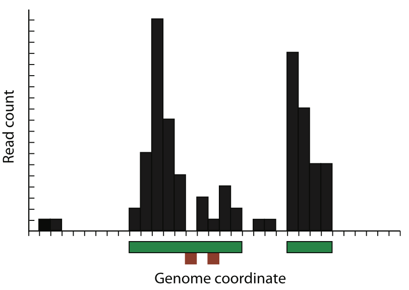
```

Example islands for read count threshold $l_0=2$ and number of gaps $g=2$
]

<!-- Schematicillustrationofdefinitionofislands.Shownisasegment of a genomic landscape of ChIP-Seq reads. The x-axis denotes the genome coordinates, where each interval represents a window. The y-axis denotes the read count. Each black vertical bar represents the read count in the respective window. The regions underlined by the green horizontal bars are the two identified islands under g = 1 and l0 = 2. The two windows underlined by brown boxes are gaps in the first island. -->

<!--
SICER: Scoring islands

- The scoring function is based on the probability of finding the observed tag count in a random background
- For a window with $m$ reads,
    - The probability of finding $m$ reads is Poisson $P(m, \lambda)$
    - $\lambda=wN/L$ is the average number of reads in each window ($w$ - genome window size, $L$ - genome length, $N$ - total number of reads in the ChIP-seq library)
- Scoring function for an eligible window:

$$s=-logP(m,\lambda)$$

- Key quantity: the score of an island
    - Aggregate score of all eligible windows in the island
    - It corresponds to the background probability of finding the observed pattern

SICER: Island score statistics

- Probability distribution of scores for a single window in a random background model ($\delta(*)$ - Dirac delta function):

$$p(s)=\sum_{l \ge l_0}\delta(s - s(l))P(l,\lambda)$$

- Probability of a window being 'ineligible':

$$t=P(0,\lambda)+P(1,\lambda)+...+P(l_0-1,\lambda)$$

- The number of 'ineligible' windows in a gap ranges from zero to $g$. Gap factor: 

$$G=1+t+t^2+...+t^g$$
SICER: Island score statistics 

- Probability of finding an island of score $s$: 

$$M(s)=t^{g+1}\tilde{M}(s)t^{g+1}$$

```{r, out.width = "300px", fig.align='center', echo=FALSE}
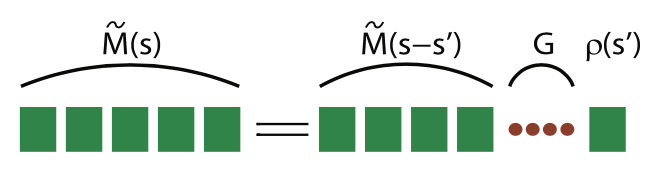
```

- The island score can be partitioned between the last 'eligible' window and the rest in a combinatorial manner, therefore a recursion relation can be constructed for the kernel $\tilde{M}(s)$:

$$\tilde{M}(s) = G(\lambda,l_0,g)\int_{s_0}^s \tilde{M}(s-s')p(s')ds'$$

SICER: Island score statistics

- Asymptotics of island score distribution in the random background 

$$\tilde{M}(s) = \alpha exp^{(-\beta s)}$$

- Estimate $\beta$ from

$$G(\lambda,l_0,g)\sum_{l \ge l_0}P(l,\lambda)^{1-\beta}=1$$

- then, estimate $\alpha$ by fitting

SICER: Island score statistics

- Significance determination with random background model:
    - E-value determines an island score threshold 
- Threshold score value $s_T$ can be determined by requiring the expected number of islands with scores above the threshold $s_T$ to be less than a E-value threshold $e$:

$$\sum_{s \ge s_T}LM(s) \le e$$

.small[Zang, Chongzhi, Dustin E. Schones, Chen Zeng, Kairong Cui, Keji Zhao, and Weiqun Peng. "A Clustering Approach for Identification of Enriched Domains from Histone Modification ChIP-Seq Data." Bioinformatics 25, no. 15 (August 1, 2009): 1952–58. https://doi.org/10.1093/bioinformatics/btp340.]
-->

---
## SICER: Choosing parameters

- Fragment size

- Window size: data resolution

- Gap size

- Compared with other methods, SICER focuses on the clustered enrichment rather than local enrichment

<!--
## Use SICER

- The software is written in Python
- Inputs are bed files for IP and control
- Good computational performance
- Results are sometimes sensitive to the parameters
- A typical command is like: `SICER.sh . h3k27me3.bed control.bed . hg19 2 200 150 0.74 600 0.01`
-->

---
## Summary for ChIP-seq peak/block calling

- Detect regions with reads enriched

- Control sample is important

- Incorporate some special characteristics of the data improves results

- Calling wide peaks is harder

- Many software available

---
## After peak/block calling

```{r, out.width = "600px", fig.align='center', echo=FALSE}
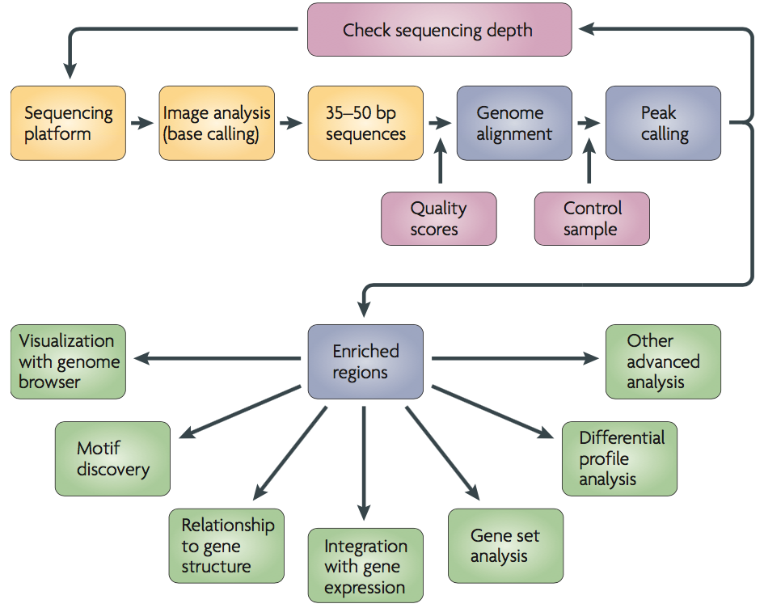
```

<!--The raw data for chromatin immunopre- Nature Reviews | Genetics
cipitation followed by sequencing (ChIP–seq) analysis are images from the next-generation sequencing platform (top left). A base caller converts the image data to sequence tags, which are then aligned to the genome. On some platforms, they are aligned with the aid of quality scores that indicate the reliability of each base call. Peak calling, using data from the ChIP profile and a control profile (which is usually created from input DNA), generates a list of enriched regions that are ordered by false discovery rate as a statistical measure. Subsequently, the profiles of enriched regions are viewed with a browser and various advanced analyses are performed.-->

---
## Signal enrichment

.pull-left[
- Plot signal intensity around specific regions (e.g., peak centers)

- EnrichedHeatmap R package, .small[ https://bioconductor.org/packages/EnrichedHeatmap/]

- deeptools, command line versatile visualization software, .small[https://deeptools.readthedocs.io]
]
.pull-right[
```{r, out.width = "400px", fig.align='center', echo=FALSE}
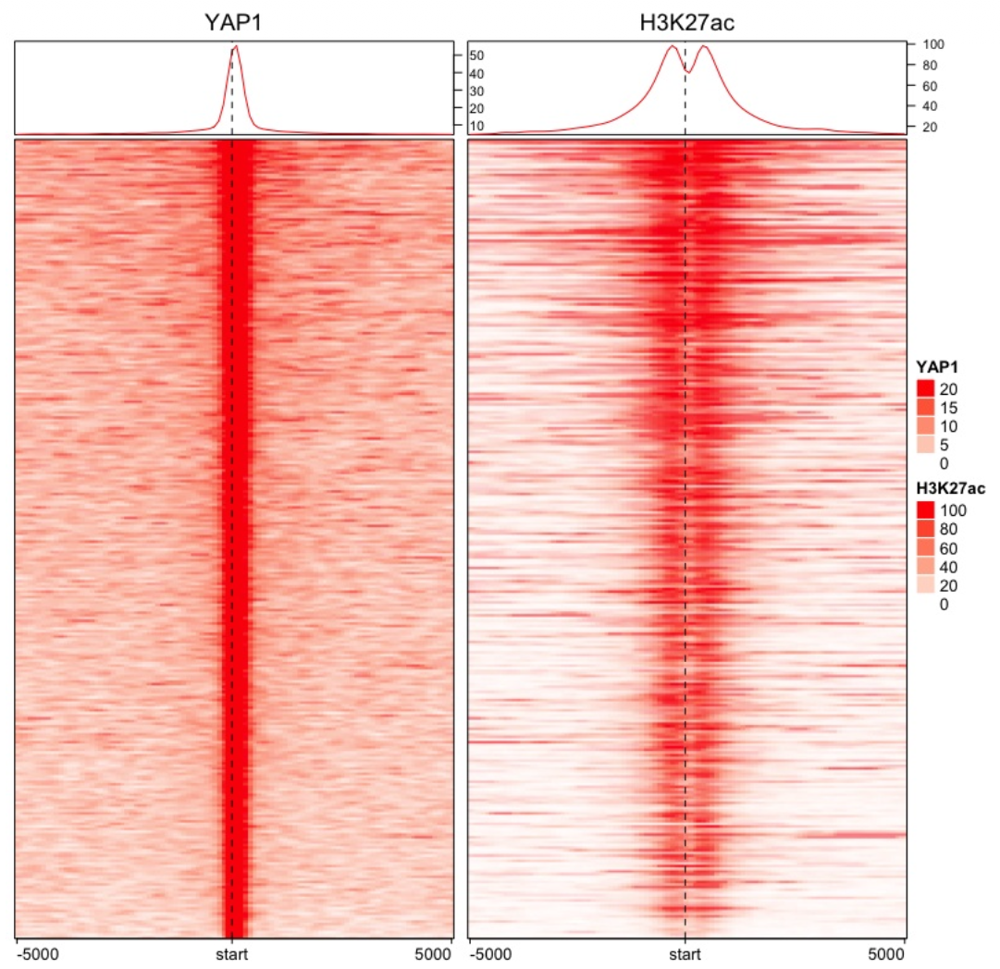
```
]

---
## Signal Metaprofile

.pull-left[
- Average signal intensity across targeted regions.

- Compare binding patterns and signal strength between different experimental conditions.

- Can be enhanced with 95% confidence interval.
]
.pull-right[
```{r, out.width = "400px", fig.align='center', echo=FALSE}
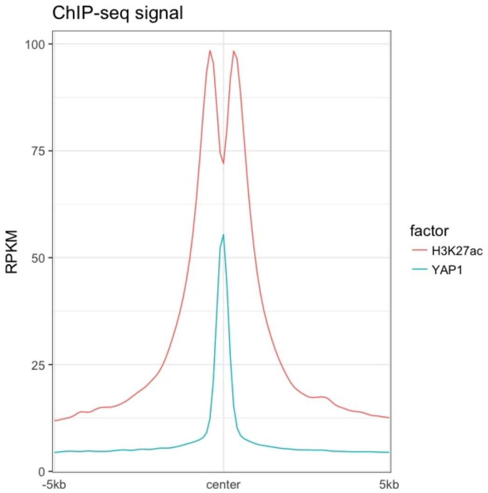
```
]

---
## Comparison of multiple ChIP-seq experiments

- Understand co-occurrence patterns of different TF bindings and/or histone modifications

- Identify combinatorial regulation (e.g., which TFs work together?)

- Map chromatin states (active promoters, enhancers, repressed regions)

- Compare conditions (cell types, treatments, developmental stages)

---
## Comparison of multiple ChIP-seq experiments

.pull-left[
**1. Overlap analysis (Post hoc)**
- Intersect peak lists from different experiments
- Visualize with Venn diagrams or UpSet plots
- Tools: BEDTools, ChIPpeakAnno, ChIPseeker

**Limitations:**
- Binary (overlapping or not)
- Ignores signal intensity
- Sensitive to peak calling thresholds
]
.pull-right[
**2. Quantitative comparison**
- Compare signal intensity across all datasets
- Heatmaps showing enrichment patterns
- Clustering/PCA to identify patterns
- Tools: deepTools, EaSeq, ChAsE

**Advantages:**
- Considers signal strength
- More robust to threshold choices
- Reveals subtle differences
]

**Advanced: Chromatin state annotation**
- ChromHMM, Segway: integrate multiple marks to define chromatin states
- Example: H3K4me3 + H3K27ac = active promoter; H3K27me3 = repressed

---
## Differential binding (DB) analysis

- Identifies regions where protein binding or histone modifications **change quantitatively** between conditions

- Different from overlap analysis: detects changes in binding strength, not just presence/absence

- Examples: TF binding after treatment, histone marks across cell types, developmental stages

---
## Differential binding (DB) analysis

.pull-left[
**1. Define candidate regions**
   - Call peaks in each condition separately
   - Create union of all peaks (consensus peak set)
   - Or use sliding windows across genome

**2. Quantify signal**
   - Count reads in each region for all samples
   - Creates a count matrix (regions × samples)
]
.pull-right[
**3. Statistical testing**
   - Apply methods from RNA-seq differential expression
   - Common tools: DESeq2, edgeR, limma
   - Or use specialized ChIP-seq methods (DiffBind, DBChIP, csaw)

**4. Results**
   - List of regions with significant binding changes
   - Fold changes and adjusted p-values
]

---
## Challenges in differential binding analysis

**Input control samples**

- Need to model IP-control relationship properly

- Simply subtracting control can introduce artifacts

- Solutions:
  - Include control in statistical model (DESeq2, edgeR)
  - Use control to estimate background in each region
  - Some methods (MAnorm) work without explicit controls

---
## Challenges in differential binding analysis

**Normalization between experiments**

- **Challenge**: Signal-to-noise ratios differ due to:
  - IP efficiency variations (technical)
  - True biological differences in global binding
  - Sequencing depth differences

- **Solutions**:
  - Library size normalization (total reads)
  - TMM normalization (edgeR) - assumes most regions unchanged
  - Background region normalization

<!-- - Spike-in normalization (gold standard but requires spike-ins) -->

---
## Challenges in differential binding analysis

**Experimental design considerations**

- **Biological replicates essential** (minimum 2-3 per condition)

- Batch effects must be considered

- Same design principles as RNA-seq apply

<!--
## Normalization methods for the comparative analysis of ChIP-seq data sets

| Linear Algorithms | Focus on negative control sample |
|-------------------|----------------------------------|
| PeakSeq           | Yes                              |
| Cisgenome         | Yes                              |
| MACS              | Yes                              |
| USeq              | Yes                              |
| RPKM              | No                               |

.small[Bailey, Timothy, Pawel Krajewski, Istvan Ladunga, Celine Lefebvre, Qunhua Li, Tao Liu, Pedro Madrigal, Cenny Taslim, and Jie Zhang. "Practical Guidelines for the Comprehensive Analysis of ChIP-Seq Data." Edited by Fran Lewitter. PLoS Computational Biology 9, no. 11 (November 14, 2013): e1003326. https://doi.org/10.1371/journal.pcbi.1003326.]

## Normalization methods for the comparative analysis of ChIP-seq data sets

.small[

| Non-linear Algorithms                                              | Focus on negative control sample |
|--------------------------------------------------------------------|----------------------------------|
| Locally weighted regression with respect to mean and variance      | No                               |
| MAnorm                                                             | No                               |
| POLYPHEMUS      (Quantile and locally weighted regression)         | No                               |
]

.small[Bailey, Timothy, Pawel Krajewski, Istvan Ladunga, Celine Lefebvre, Qunhua Li, Tao Liu, Pedro Madrigal, Cenny Taslim, and Jie Zhang. "Practical Guidelines for the Comprehensive Analysis of ChIP-Seq Data." Edited by Fran Lewitter. PLoS Computational Biology 9, no. 11 (November 14, 2013): e1003326. https://doi.org/10.1371/journal.pcbi.1003326.]
-->

<!--
Existing method/software for DB analysis

- **ChIPDiff** (Xu et al. 2008, Bioinformatics): HMM on differences of normalized IP counts between two groups
- **DIME** (Taslim et al. 2009, 2011, Bioinformatics): finite mixture model on differences of normalized IP counts
- **MAnorm** (Shao et al. 2012, Genome Biology): normalization based on MA plot of counts from two groups, then use normalized "M" values to rank differential peaks
- **ChIPnorm** (Nair et al. 2012, PLoS One): quantile normalization for each data. Ad hoc method for detecting differential peak
- **DBChIP** (Liang et al. 2012 Bioinformatics) and **DiffBind**: Bioconductor packages, based on RNA-seq method
- **ChIPComp** (Chen et al. 2015 Bioinformatics): Based on linear model framework, works for general design
-->

---
## Methods/software for differential binding analysis

.small[
| Method | Type | Best For | Key Features | Availability |
|--------|------|----------|--------------|--------------|
| **DiffBind** | Peak-based | General purpose; TFs and histones | Uses DESeq2/edgeR; handles complex designs; most popular | https://bioconductor.org/packages/DiffBind |
| **csaw** | Window-based | Diffuse signals; complex DB patterns | De novo detection; no peak calling needed; proper FDR control | https://bioconductor.org/packages/csaw |
| **MACS3** | Built-in | Simple comparisons | `bdgdiff` command for paired bedGraph files | https://github.com/macs3-project/MACS |
| **THOR** | One-stage | Histone marks with replicates | HMM-based; handles normalization well | https://reg-gen.readthedocs.io/en/latest/thor/introduction.html |
| **MAnorm2** | Peak-based | TFs; no replicates needed | MA-plot normalization; updated from MAnorm | https://github.com/tushiqi/MAnorm2 |
| **DiffChIPL** | Peak-based | High-noise data | Based on limma-voom; good sensitivity/specificity balance | https://github.com/yancychy/DiffChIPL |
]

---
## Methods/software for differential binding analysis

**Tool selection guide:**

- **With replicates + sharp peaks (TFs)**: DiffBind, csaw, THOR

- **With replicates + broad marks (histones)**: csaw, THOR, DiffBind

- **No replicates**: MAnorm2 (but replicates strongly recommended!)

- **Complex binding patterns**: csaw (window-based approach)

- **Quick analysis**: MACS3 bdgdiff

.small[ Sebastian Steinhauser, Nils Kurzawa, Roland Eils, Carl Herrmann, A comprehensive comparison of tools for differential ChIP-seq analysis, Briefings in Bioinformatics, Volume 17, Issue 6, November 2016, Pages 953–966, https://doi.org/10.1093/bib/bbv110 ]

<!--
Software packages for the analysis of differential binding in ChIP-seq

.small[

| Software tool             | Availability                                                         | Notes                                                                                  |
|---------------------------|----------------------------------------------------------------------|----------------------------------------------------------------------------------------|
| ChIPDiff [36]             | http://cmb.gis.a-star.edu.sg/ChIPSeq/paperChIPDiff.htm               | Differential histone modification sites using a hidden Markov model                    |
| Comparative ChIP-seq [25] | http://www.starklab.org/data/bardet_natprotoc_2011/                  | Fold change ratio between normalized peak heights                                      |
| DBChIP [33]               | http://pages.cs.wisc.edu/~kliang/DBChIP/                             | Assigns uncertainty measures in a test of non-differential binding (uses edgeR)        |
| DESeq§ [31]               | http://www.bioconductor.org/packages/release/bioc/html/DESeq.html    | Test based on a model using the negative binomial distribution                         |
| DiffBind                  | http://www.bioconductor.org/packages/release/bioc/html/DiffBind.html | Differential binding affinity analysis (uses edgeR and DESeq)                          |
| DIME [35]                 | http://cran.r-project.org/web/packages/DIME/                         | Differential identification using mixtures ensemble                                     |
| edgeR§ [32]               | http://www.bioconductor.org/packages/release/bioc/html/edgeR.html    | Empirical Bayes estimation and exact tests based on the negative binomial distribution |
| MACS [17] (version 2)     | https://github.com/taoliu/MACS/                                      | Differential peak detection based on paired four bedGraph files                        |
| MAnorm [34]               | http://bcb.dfci.harvard.edu/~gcyuan/MAnorm/MAnorm.htm                | Robust regression to derive a linear model                                             |
| MMDiff                    | http://bioconductor.org/packages/release/bioc/html/MMDiff.html       | Differences in shape using Kernel methods                                              |
| NarrowPeaks               | http://bioconductor.org/packages/release/bioc/html/NarrowPeaks.html  | Shape-based analysis of variation using functional PCA                                 |
| POLYPHEMUS [37]           | http://cran.r-project.org/web/packages/polyphemus/                   | Non-linear normalization on RNA Pol II profiling                                       |
]

.small[http://journals.plos.org/ploscompbiol/article?id=10.1371/journal.pcbi.1003326#s5]
-->

---
## Combine ChIP- and RNA-seq

It is of great interest to study how the gene expressions are controlled by protein bindings and epigenetic modifications

**Easy approach:**

- Look at the correlation of promoter TF binding (from ChIP-seq), and gene expression (from RNA-seq)

**More advanced approaches:**

- Build a model to predict gene expression (from RNA-seq) from protein binding and epigenetic data (from ChIP-seq)
- Build a network for all ChIP- and RNA-seq data

---
## Downstream analysis

- Find the nearest gene to each peak

- Check distribution relative to gene features (start site, exon, intron, upstream/downstream)

- Check if peaks are clustered or co-occur with other binding events

- Sequence conservation (or conservation of binding event, if data is available)

- Gene set functional analysis

- Find overrepresented motifs in peak region (TFBS binding sites of our factor + possible co-binders) - kmers/logos

---
## What are motifs?

- Short, recurring patterns in DNA that are presumed to have a biological function

- Often indicate sequence-specific binding sites for proteins such as nucleases and transcription factors (TF)

- In this example, if allowing 1 base mismatch, there are two motifs: TTGACA and GCATC:

```{r, out.width = "600px", fig.align='center', echo=FALSE}
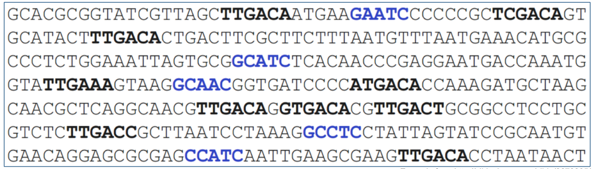
```

---
## Building models for predicting transcription factor binding sites

- Collect sequences, align, create consensus sequence by selecting a degeneracy nucleotide sequence for each position

- Note unusual binding sites, like one and eight, that have only 50% of the identical nucleotides

```{r, out.width = "500px", fig.align='center', echo=FALSE}
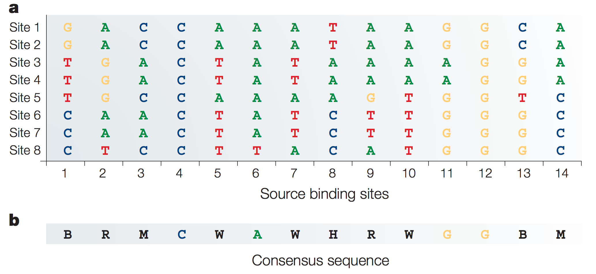
```

---
## Building models for predicting transcription factor binding sites

Corrected probabilities of observing a given nucleotide can be calculated as

$$p(b,i) = \frac{f_{b,i} + s(b)}{N + \sum_{b' \in \{A,C,G,T\}} s(b')}$$

where $p(b,i)$ - corrected probability of base $b$ in position $i$; $f_{b,i}$ - count of base $b$ in position $i$; $N$ - number of sites; $s(b)$ - pseudocount function

---
## Position frequency matrix

To more accurately reflect the characteristics at each position, a matrix that contains the number of observed nucleotides at each position is created

```{r, out.width = "900px", fig.align='center', echo=FALSE}
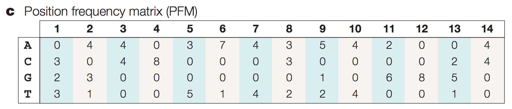
```

---
## Position weight matrix

A position weight matrix (PWM) is constructed by dividing the nucleotide probabilities by expected background probabilities and converting the values to a log-scale

$$W_{b,i} = log_2\frac{p(b,i)}{p(b)}$$

where $p(b)$ - background probability of base $b$; $p(b,i)$ - corrected probability of base $b$ in position $i$; $W_{b,i}$ - PWM value of base $b$ in position $i$

---
## Position weight matrix

- The frequency matrix is usually converted to a position weight matrix (PWM) by normalizing frequency values to a log-scale 

- PWMs are also known as position-specific scoring matrices (PSSMs)

- A quantitative score for any DNA sequence can be generated by summing the values that correspond to the observed nucleotide at each position. These scores are proportional to binding energies

```{r, out.width = "600px", fig.align='center', echo=FALSE}
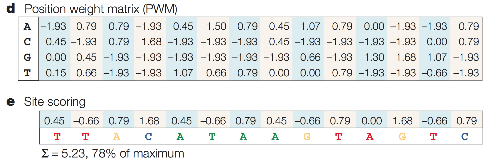
```

---
## Position weight matrix

The quantitative PWM score for a putative site is the sum of the PWM values for each nucleotide in the site

$$S = \sum_{i=1}^wW_{l_i,i}$$

where $l_i$ - the nucleotide in position $i$ in an input sequence; $S$ - PWM score of a sequence; $w$ - width of the PWM

```{r, out.width = "600px", fig.align='center', echo=FALSE}

```

---
## Sequence logo

- The specificity in each column of the alignment can be measured in terms of information content

- A sequence logo scales each nucleotide by the total bits of information multiplied by the relative occurrence of the nucleotide at the position

- Sequence logos enable fast and intuitive visual assessment of pattern characteristics

```{r, out.width = "500px", fig.align='center', echo=FALSE}
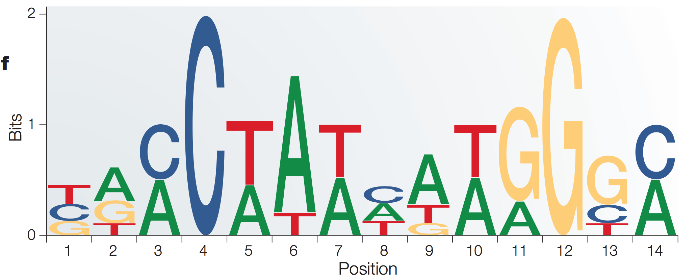
```

---
## Sequence logo

Probability values can be used to determine the total information content (in bits) in each position

$$D_i=2+\sum_b p(b,i)log_2 p(b,i)$$

where $D_i$ - information content in position $i$; $p(b,i)$ - corrected probability of base $b$ in position $i$

```{r, out.width = "500px", fig.align='center', echo=FALSE}

```

.small[Wasserman, Wyeth W., and Albin Sandelin. "Applied Bioinformatics for the Identification of Regulatory Elements." Nature Reviews. Genetics 5, no. 4 (April 2004): 276–87. https://doi.org/10.1038/nrg1315.]

---
## JASPAR: Transcription Factor Binding Profile Database

**Open-access database of curated, non-redundant transcription factor (TF) binding profiles**

- **Position Weight Matrices (PWMs)** for TF binding sites

- Covers vertebrates, plants, insects, fungi, nematodes

- \>2,000 TF profiles across multiple species

- Experimentally validated binding motifs (ChIP-seq, SELEX, PBM data)

---
## JASPAR: Transcription Factor Binding Profile Database

.pull-left[
**Database structure:**
- **CORE collection**: High-quality, manually curated profiles
- **Unvalidated**: Computationally predicted profiles
- **Species-specific collections**: Human, mouse, plant, etc.
- Each entry includes:
  - PWM and sequence logo
  - Source publication
  - TF protein information
  - Experimental evidence
]

.pull-right[
**How to use:**
- **Web interface**: Browse, search, download motifs
- **API access**: Programmatic acces
- **Integration**: Used by MEME Suite, HOMER, FIMO, etc.
- **Scan sequences**: Upload sequences to find motif matches


- Website: https://jaspar.elixir.no/
- Bioconductor: TFBSTools, JASPAR2024 packages
]

.small[ Jaime A Castro-Mondragon et al. JASPAR 2022: the 9th release of the open-access database of transcription factor binding profiles, Nucleic Acids Research, January 2022, https://doi.org/10.1093/nar/gkab1113 ]

---
## The Challenge of Motif Discovery

- **Hidden Patterns**: Regulatory motifs are often short (6-20 bp) and buried within thousands of base pairs of non-functional "background" sequence.

- **Sequence Variation**: Biological binding sites are degenerate; they rarely match a single consensus sequence perfectly across all occurrences.

- **Unknown Location**: Unlike sequence alignment, we don't know where the sites are or how many exist in each sequence.

---
## Motif finding

- Sequence $K$ reads. Goal, to find the locations of motif sites
    - Sequence 1: site starts at $a_1$
    - Sequence 2: site starts at $a_2$
    - ...
    - Sequence N: site starts at $a_N$

- We don't know the alignment variable $A=\{a_1, a_2, ..., a_N\}$

- We seek within each sequence mutually similar segments of specified width $W$ (hidden alignment problem)

---
## Motif finding

- The Gibbs motif sampling (a Monte-Carlo algorithm)
- Every position $i$ in the motif sequence follows probability distribution with $q_{ij}=\{q_{i,1}, ..., q_{i,4}\}$ (pattern probabilities)
    - $i$ ranges from 1 to motif length $w$
    - $j$ ranges across four nucleotides (paper describes 21 amino acids)

- Background - each non-motif position follows a common probability distribution $p_j=\{p_1, ..., p_4\}$ (background probabilities)


.small[Lawrence, C. E., S. F. Altschul, M. S. Boguski, J. S. Liu, A. F. Neuwald, and J. C. Wootton. "Detecting Subtle Sequence Signals: A Gibbs Sampling Strategy for Multiple Alignment." Science (New York, N.Y.) 262, no. 5131 (October 8, 1993): 208–14. https://doi.org/10.1126/science.8211139]

---
## Motif finding

- Start by choosing $w$ and randomly positioning each motif

- Predictive update step: Randomly **withhold one sequence**, calculate $q_{i,j}$ and $p_j$ from $N-1$ remaining sequences
```{r, out.width = "600px", fig.align='center', echo=FALSE}
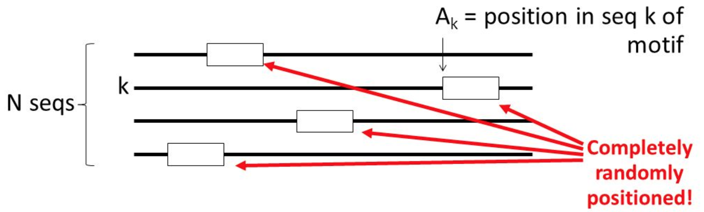
```
$$q_{i,j}=\frac{c_{i,j} + b_j}{N - 1 + \sum{b_j}}$$
- $b_j$ - background frequency of symbol $j$
- $c_{i,j}$ - count of symbol $j$ at position $i$

---
## Motif finding

- Stochastic sampling step: For withheld sequence, slide motif down sequence and calculate agreement with model

```{r, out.width = "600px", fig.align='center', echo=FALSE}
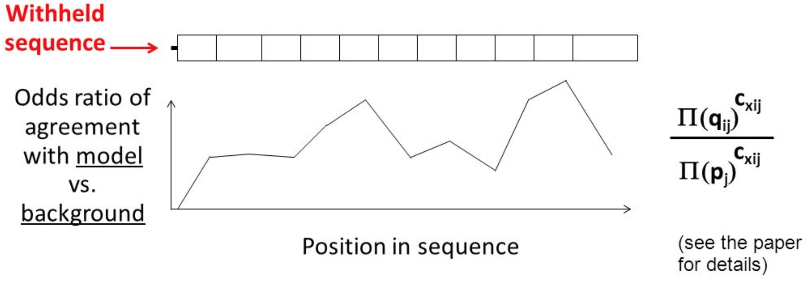
```

---
## Motif finding

- Don't just choose the maximum

- Instead, select a new $A_k$ position proportional to this odds ratio

- Then, choose a new sequence to withhold, and repeat everything

- Stop the iteration if there is no change in maximizing the likelihood function $F=\sum_{i=1}^W\sum_{j=1}^4 c_{i,j} log\frac{q_{i,j}}{p_{j}}$

```{r, out.width = "400px", fig.align='center', echo=FALSE}
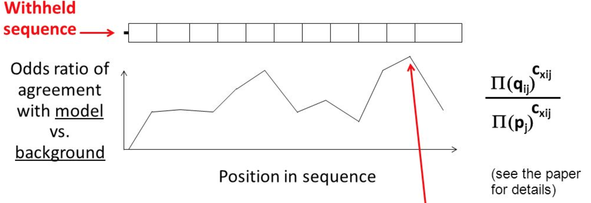
```

---
## HOMER

**HOMER = Hypergeometric Optimization of Motif EnRichment**

- Tries to identify regulatory elements enriched in one set of sequences compared to another

- Motif discovery algorithm designed for regulatory element analysis in genomics applications (DNA sequences only)
    - Known motifs counting
    - De novo motifs identification
    - Attempts to match _de novo_ motifs to known ones

.small[ http://homer.ucsd.edu/homer/motif/ ]

---
## Known motif databases

- Collections of experimentally derived **transcription factor binding motifs**  
  - Typically represented as **position weight matrices (PWMs)**  

- Common databases:
  - **JASPAR** → open-access, curated, non-redundant TF motifs  
  - **HOCOMOCO** → human/mouse TF motifs from large-scale ChIP-seq analyses  
  - **TRANSFAC** → comprehensive but partially commercial database  
  - **UniPROBE** → motifs from protein-binding microarray experiments  

<!-- Use cases:
  - Scan sequences for **known TF binding sites**  
  - Annotate discovered motifs from de novo analysis  
  - Integrate with ChIP-seq peak analysis  -->

.small[JASPAR: https://jaspar.genereg.net | HOCOMOCO: https://hocomoco11.autosome.org | TRANSFAC: https://gene-regulation.com | UniPROBE: http://the_brain.bwh.harvard.edu/uniprobe/]

---
## HOMER: Statistical Methods for Motif Analysis

**Known motif enrichment**

- **Method**: Hypergeometric test (or binomial)

- **Question**: Is motif X over-represented in target sequences vs. background?

$$P(k) = \frac{\binom{K}{k}\binom{N-K}{n-k}}{\binom{N}{n}}$$

where:
- $k$ = motifs found in target sequences
- $n$ = total target sequences
- $K$ = motifs in background
- $N$ = total background sequences

**Correction**: Bonferroni or Benjamini-Hochberg FDR for multiple testing

---
## HOMER: De novo motif discovery

- **Method**: Optimization algorithm

- **Input**: Target sequences (peaks) and background sequences (HOMER automatically matches GC content)

- Tests all possible k-mers (usually 8-20 bp) for enrichment in the target sequences compared to the background sequences. Significantly overrepresented k-mers are chosen as the "seeds".

- Iteratively refines rigid k-mers into flexible probability models (Position Weight Matrices, PWMs).

---
## HOMER: De novo motif discovery

- **Scoring**: Log Odds and the Hypergeometric Test
  * **Log odds ratio:** The probability of the sequence occurring under the motif model versus by random chance (the background).
  * **Enrichment $p$-value:** A hypergeometric distribution test of the statistical significance of finding this motif in the target sequences vs. the background. 

- **Selection**: Information Content and Masking
  * **Information Content:** Motif complexity estimation. If a motif is too degenerate (e.g., a repeating string of A's and T's), it is discarded. 
  * **Masking:** HOMER "masks" all instances of the most significant motif and repeats the entire process to find the second most enriched motif.

---
## HOMER: Motif matching

- Compare de novo motifs to known databases (JASPAR, TRANSFAC)

- **Similarity metric**: Pearson correlation of PWM columns

- Reports best matches with similarity scores

.small[Heinz, Sven, et al. "Simple combinations of lineage-determining transcription factors prime cis-regulatory elements required for macrophage and B cell identities." Molecular cell (2010) https://doi.org/10.1016/j.molcel.2010.05.004 ]

<!--
## HOMER

- `findMotifsGenome.pl` attempts to identify motifs in a provided list of genomic regions
- Input:
    - BED file containing the regions (peaks file)
    - Column 1: chromosome
    - Column 2: starting position
    - Column 3: ending position
    - Column 4: Unique Peak ID
    - Column 5: not used
    - Column 6: Strand (+/- or 0/1, where 0="+", 1="-")
- Reference genome assembly
- Size: fragment size to use for motif finding

## HOMER - Execution steps

1. Verify peak/BED file
2. Extract sequences from the genome corresponding to the regions in the input file
3. Calculate GC/CpG content of peak sequences
4. Preparse the genomic sequences of the selected size to serve as background sequences
5. Randomly select background regions for motif discovery 
6. Autonormalization of sequence bias
7. Check enrichment of known motifs
8. _de novo_ motif finding

## HOMER

- Among generated result files, two HTML-formatted reports will be available:
    - `homerResults.html` - _de novo_ motif finding
    - `knownResults.html` - known motif finding
-->

---
## MEME: Multiple EM for Motif Elicitation

**A Gold Standard in Bioinformatics**

Deciphering the regulatory grammar of genomes using probabilistic modeling.

- Identifies recurring subsequences without gaps.

- Operates in an unsupervised manner.

- Utilizes statistical modeling to find optimal width and occurrences.

.small[ https://meme-suite.org/meme/ ]

---
## Position-Specific Probability Matrix

MEME models a motif as a matrix of probabilities where each cell $P_{c,k}$ is the probability of character $c$ appearing at position $k$.

- **Information Content:** Measures how much the motif differs from background noise.

- **No Gaps:** Classical MEME models fixed-length, contiguous patterns.

- **Sequence Logos:** Visual representation where height reflects conservation.

---
## The EM Algorithm

**Step 1: The E-Step (Expectation)**

**Estimating Probable Sites**

The algorithm calculates the expected values of the "hidden variables"—the starting positions of the motifs.

- Given the current motif model, what is the probability that a motif starts at index $j$ in sequence $i$?

- Generates a weight matrix $Z_{i,j}$ for all possible starting positions.

- Accounts for both motif and background likelihoods.

---
## The EM Algorithm

**Step 2: The M-Step (Maximization)**

**Updating the Motif Model**

The algorithm updates the motif parameters to maximize the likelihood of the data given the expected positions found in the E-step.

- Update the character probabilities $P_{c,k}$ in each column of the PWM.

- Update the background frequencies.

- Calculates a new "consensus" that better fits the weighted occurrences.

<!--
## Distribution Models

- **OOPS (One Occurrence Per Sequence)**: Assumes exactly one site per sequence. Simplest model, high sensitivity but assumes perfect coverage.

- **ZOOPS (Zero or One Per Sequence)**: Allows some sequences to contain no motif at all. More robust for noisy biological datasets.

- **TCM (Two-Component Mixture)**: Allows any number of non-overlapping occurrences per sequence. Ideal for repetitive elements.
-->

---
## Algorithm Convergence

The E and M steps iterate until the model parameters stabilize and likelihood increases are negligible.

- **Seeding:** Since EM is sensitive to initial points, MEME tries several "starting seeds" derived from subsequences.

- **Log-Likelihood:** MEME maximizes the joint log-likelihood of the data.

---
## The MEME Ecosystem

.pull-left[
MEME is the foundation of a comprehensive suite of motif analysis tools used by thousands of researchers worldwide.
]
.pull-right[
```{r, out.width = "100%", fig.align='center', echo=FALSE}
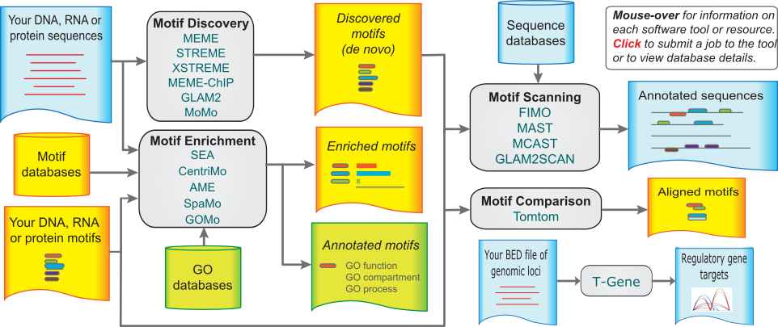
```
]

- **MAST/FIMO:** Searching sequences for motif matches.

- **Tomtom:** Comparing motifs to databases (e.g., JASPAR).

- **STREME:** Fast discovery for large datasets (ChIP-seq).

- **GOMO:** Assigning Gene Ontology terms to motifs.

---
## EM vs. Gibbs Sampling

| Feature | EM (MEME) | Gibbs Sampling |
| :--- | :--- | :--- |
| **Approach** | Deterministic (Probabilistic) | Stochastic (Sampling) |
| **Optimization** | Iterative refinement of PWM | Iterative sampling of sites |
| **Local Optima** | Susceptible; needs good starts | Better at escaping local optima |
| **Execution** | Generally faster | Can be slower due to sampling |

---
## Summary

- ChIP-seq detects TFBS or measure histone modifications along the genome

- Peak (short and long) detection is the major goal of data analysis

- Number of aligned reads are input data. Data in neighboring regions need to be combined to call peaks

- Many similar technologies, and the methods are more or less the same

---
## Software tools for motif analysis of ChIP-seq peaks and their uses


Obtaining sequences

.small[
| Software tool | Web Server | Obtain peak regions | Motif discovery | Motif comparison | Central motif enrichment analysis | Local motif enrichment analysis | Motif spacing analysis | Motif prediction/mapping |
|---------------|------------|---------------------|-----------------|------------------|-----------------------------------|---------------------------------|------------------------|--------------------------|
| Galaxy | X | X | | | | | | |
| RSAT | X | X | | | | | | |
| UCSC Genome Browser | X | X | | | | | | |
]

---
## Software tools for motif analysis of ChIP-seq peaks and their uses

.small[
| Software tool | Web Server | Obtain peak regions | Motif discovery | Motif comparison | Central motif enrichment analysis | Local motif enrichment analysis | Motif spacing analysis | Motif prediction/mapping |
|---------------|------------|---------------------|-----------------|------------------|-----------------------------------|---------------------------------|------------------------|--------------------------|
| ChIPMunk | X | | X | | | | | |
| CisGenome | | | X | X | | | | |
| CompleteMOTIFS | X | | X | X | | | | |
| MEME-ChIP | X | | X | X | X | | | |
| peak-motifs | X | | X | X | | | | X |
| Cistrome | X | X | X | | X | X | | X |

See http://journals.plos.org/ploscompbiol/article?id=10.1371/journal.pcbi.1003326#s5 for full table]

<!--
Software tools for motif analysis of ChIP-seq peaks and their uses

**Motif comparison**

| Software tool | Web Server | Obtain peak regions | Motif discovery | Motif comparison | Central motif enrichment analysis | Local motif enrichment analysis | Motif spacing analysis | Motif prediction/mapping |
|---------------|------------|---------------------|-----------------|------------------|-----------------------------------|---------------------------------|------------------------|--------------------------|
| STAMP | X | | | X | | | | |
| TOMTOM | X | | | X | | | | |

Motif enrichment/spacing

| Software tool | Web Server | Obtain peak regions | Motif discovery | Motif comparison | Central motif enrichment analysis | Local motif enrichment analysis | Motif spacing analysis | Motif prediction/mapping |
|---------------|------------|---------------------|-----------------|------------------|-----------------------------------|---------------------------------|------------------------|--------------------------|
| CentriMo | X | | | | X | X | | |
| SpaMo | X | | | | | | X | |

Motif prediction/mapping

| Software tool | Web Server | Obtain peak regions | Motif discovery | Motif comparison | Central motif enrichment analysis | Local motif enrichment analysis | Motif spacing analysis | Motif prediction/mapping |
|---------------|------------|---------------------|-----------------|------------------|-----------------------------------|---------------------------------|------------------------|--------------------------|
| FIMO | X | | | | | | | X |
| PATSER | X | | | | | | | X |
-->
