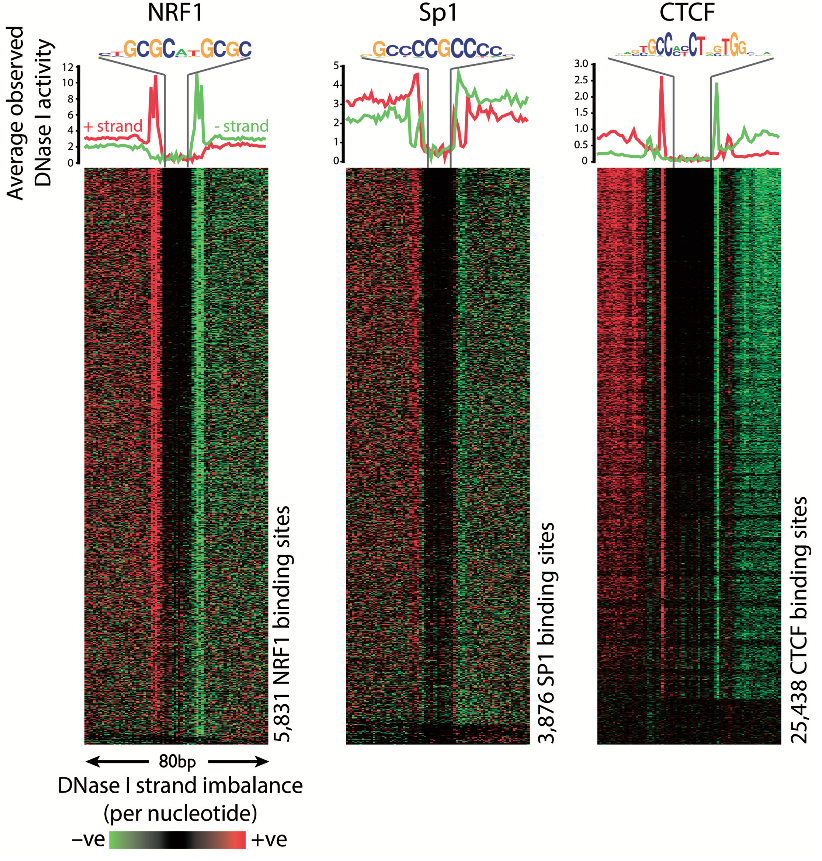
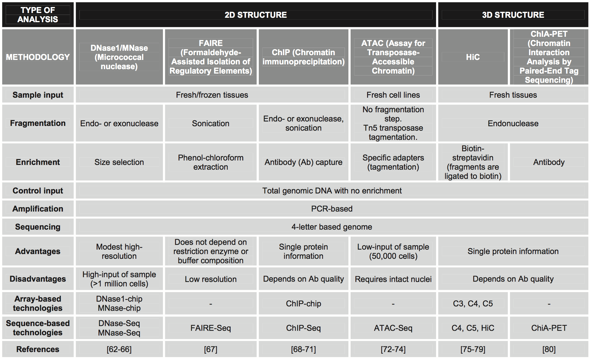
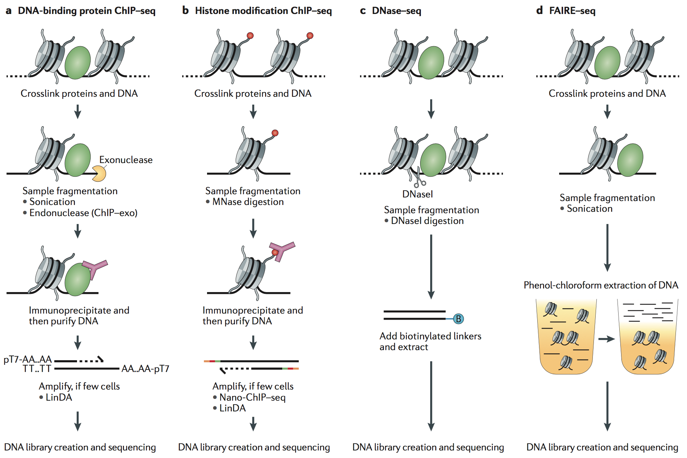
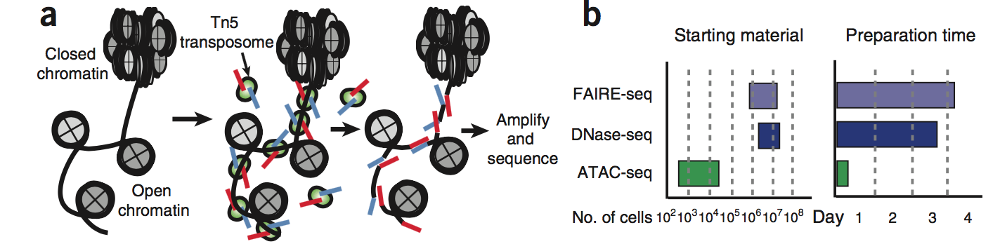
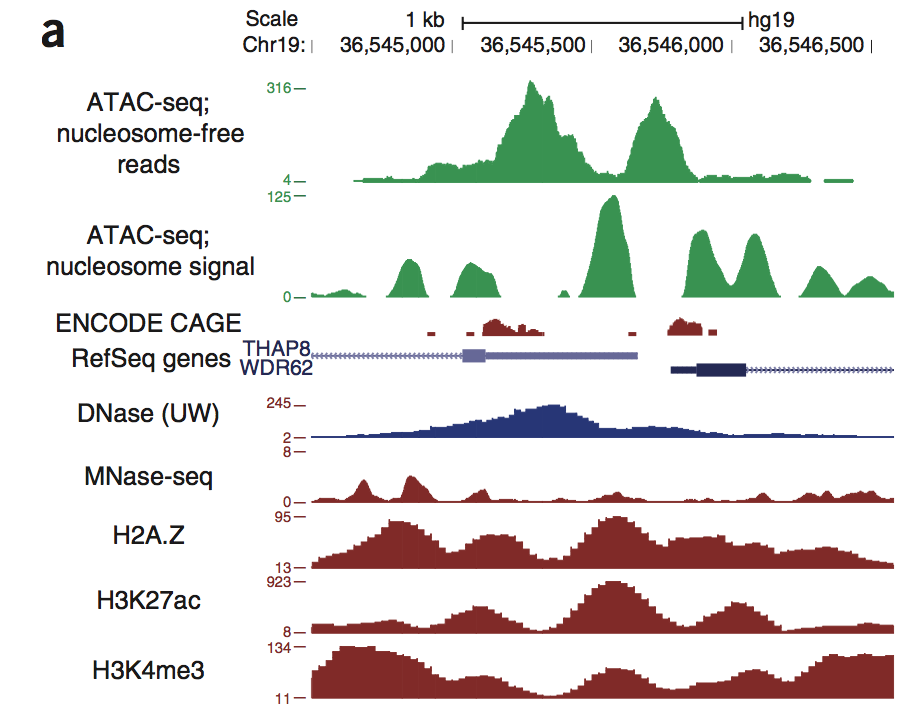
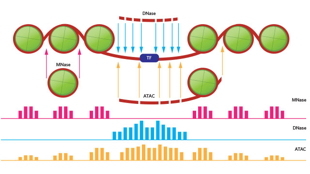
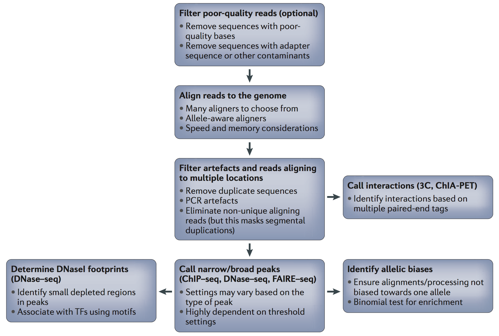
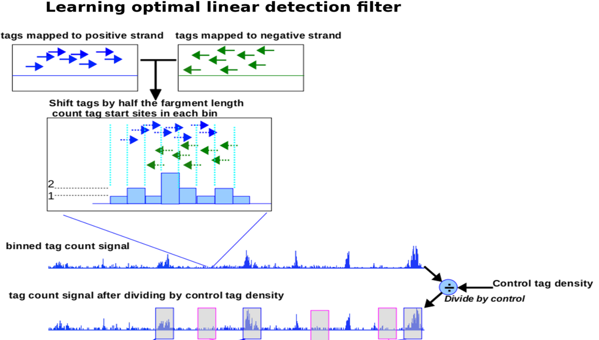
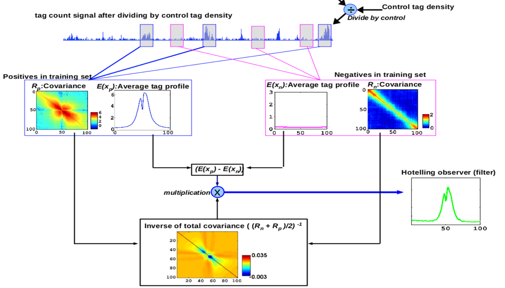
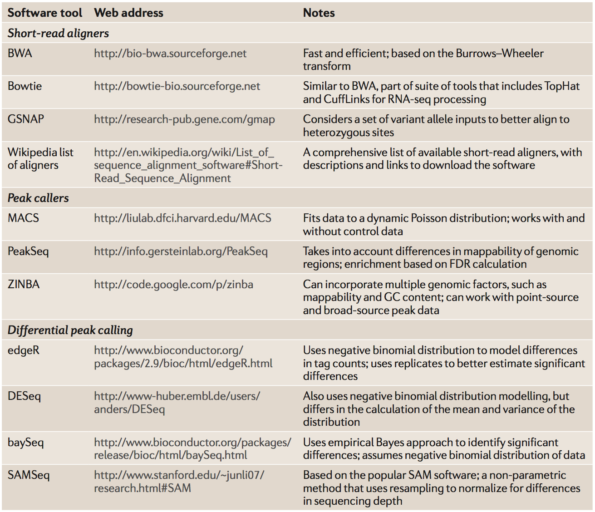

```{r xaringan-themer, include = FALSE}
library(xaringanthemer)
mono_light(
  base_color = "midnightblue",
  header_font_google = google_font("Josefin Sans"),
  text_font_google   = google_font("Montserrat", "500", "500i"),
  code_font_google   = google_font("Droid Mono"),
  link_color = "#8B1A1A", #firebrick4, "deepskyblue1"
  text_font_size = "28px"
)
library(dplyr)
library(ggplot2)
```

<!-- HTML style block -->
<style>
.large { font-size: 130%; }
.small { font-size: 70%; }
.tiny { font-size: 40%; }
</style>

<!-- https://gemini.google.com/u/2/app/86afb74ac501b077 -->

## Other "captured/targeted" sequencing technologies

Enrich and then sequence selected genomic regions.

- **MeDIP-seq**: measure methylated DNA.

- **DNase-seq**: detect DNase I hypersensitive sites.

- **FAIRE-seq**: detect open chromatin sites.

- **Hi-C**: study 3D structure of chromatin conformation.

- **GRO-seq**: map the position, amount and orientation of transcriptionally engaged RNA polymerases.

- **Ribo-seq**: detect ribosome occupancy on mRNA. This is captured RNA-seq.

---
## What is Open Chromatin?

- **Chromatin Accessibility:** In eukaryotes, DNA is tightly packaged into chromatin via nucleosomes. Not all genomic regions are equally accessible to the transcriptional machinery.

- **Gene Regulation:** "Open" chromatin represents regions where nucleosomes have been displaced or remodeled, indicating active regulatory elements like promoters, enhancers, silencers, and insulators.

- **Why targeted seq?** Instead of whole-genome sequencing, technologies like DNase-seq and ATAC-seq enrich for these functionally relevant, accessible regions to map the regulatory landscape of different cell types and states.

---
## DNAse-seq

.pull-left[
- A widely used approach in gene regulation studies uses DNase I as a tool to identify DNase I Hypersensitive Sites (DHSs) within chromatin

- DHSs represent open chromatin regions that are normally only accessible at sites of active regulatory elements such as transcriptional enhancers
]
.pull-right[
```{r, out.width = "80%", fig.align='center', echo=FALSE}

```
]
.small[Cockerill, P.N. (2011) Structure and function of active chromatin and DNase I hypersensitive sites. FEBS J., 278, 2182–2210.]

---
## High-throughput chromatin organization techniques

```{r, out.width = "60%", fig.align='center', echo=FALSE}

```

.small[Kagohara, Luciane T., Genevieve L. Stein-O’Brien, Dylan Kelley, Emily Flam, Heather C. Wick, Ludmila V. Danilova, Hariharan Easwaran, et al. “Epigenetic Regulation of Gene Expression in Cancer: Techniques, Resources and Analysis.” Briefings in Functional Genomics, August 11, 2017. https://doi.org/10.1093/bfgp/elx018.]

---
## Comparison of experimental protocols

```{r, out.width = "60%", fig.align='center', echo=FALSE}

```

.small[Furey, Terrence S. “ChIP–seq and beyond: New and Improved Methodologies to Detect and Characterize Protein–DNA Interactions.” Nature Reviews Genetics 13, no. 12 (October 23, 2012): 840–52. doi:10.1038/nrg3306.]

---
## ATAC-seq: finding open chromatin regions

ATAC-seq is an ensemble measure of open chromatin that uses the prokaryotic Tn5 transposase to tag regulatory regions by inserting sequencing adapters into accessible regions of the genome

```{r, out.width = "90%", fig.align='center', echo=FALSE}

```

.small[Jason D Buenrostro et al., “Transposition of Native Chromatin for Fast and Sensitive Epigenomic Profiling of Open Chromatin, DNA-Binding Proteins and Nucleosome Position,” Nature Methods 10, no. 12 (December 2013): 1213–18, https://doi.org/10.1038/nmeth.2688.]

---
## ATAC-seq: finding open chromatin regions

```{r, out.width = "60%", fig.align='center', echo=FALSE}

```

.small[Jason D Buenrostro et al., “Transposition of Native Chromatin for Fast and Sensitive Epigenomic Profiling of Open Chromatin, DNA-Binding Proteins and Nucleosome Position,” Nature Methods 10, no. 12 (December 2013): 1213–18, https://doi.org/10.1038/nmeth.2688.]

---
## Technology-specific data

```{r, out.width = "70%", fig.align='center', echo=FALSE}

```

Peaks produced by different technologies are different - calling peaks should be adjusted. .small[https://www.biostars.org/p/209592/]

---
## General pipeline for sequence-tag experiments

```{r, out.width = "60%", fig.align='center', echo=FALSE}

```

.small[Furey, T. ChIP–seq and beyond: new and improved methodologies to detect and characterize protein–DNA interactions. Nat Rev Genet 13, 840–852 (2012). https://doi.org/10.1038/nrg3306]

---
## Calling peaks in any-seq

- General signal detection problem for peaks of arbitrary shape
- `DFilter` algorithm - a linear detection filter, known as a Hotelling observer, that provides mathematically optimal detection accuracy
- The objective of the Hotelling detection filter is to maximize the difference between filter outputs at true-positive regions and noise regions. 
- More precisely, the Hotelling detection filter maximizes the ratio of the mean of this difference to its standard deviation. 

.small[Kumar, Vibhor, Masafumi Muratani, Nirmala Arul Rayan, Petra Kraus, Thomas Lufkin, Huck Hui Ng, and Shyam Prabhakar. “Uniform, Optimal Signal Processing of Mapped Deep-Sequencing Data.” Nature Biotechnology 31, no. 7 (July 2013): 615–22. https://doi.org/10.1038/nbt.2596.]

.small[https://reggenlab.github.io/DFilter/]

.small[Hotelling, Harold. “The Generalization of Student’s Ratio.” The Annals of Mathematical Statistics 2, no. 3 (August 1931): 360–78. https://doi.org/10.1214/aoms/1177732979. https://projecteuclid.org/download/pdf_1/euclid.aoms/1177732979]

---
## Hotelling detection filter = "Smart Template"

- **The true peak selection**. The peak shape is learned from the data (from the strongest patterns), as well as selected from predefined templates (narrow, broad peaks, open chromatin regions).

- **The anti-peak selection**. The noise shape is learned from the negative regions (areas of the genome with no signal). 

The Hotelling filter slides a "template" across the genome and asks, "How well does the data here match the shape of a real peak?" Strand shift is accounted for.

---
## Hotelling detection filter

```{r, out.width = "80%", fig.align='center', echo=FALSE}

```

---
## Hotelling detection filter

```{r, out.width = "80%", fig.align='center', echo=FALSE}

```


<!--
Selected software tools available for three key steps in the analysis of sequence data

```{r, out.width = "40%", fig.align='center', echo=FALSE}

```

.small[Furey, T. ChIP–seq and beyond: new and improved methodologies to detect and characterize protein–DNA interactions. Nat Rev Genet 13, 840–852 (2012). https://doi.org/10.1038/nrg3306]
-->

