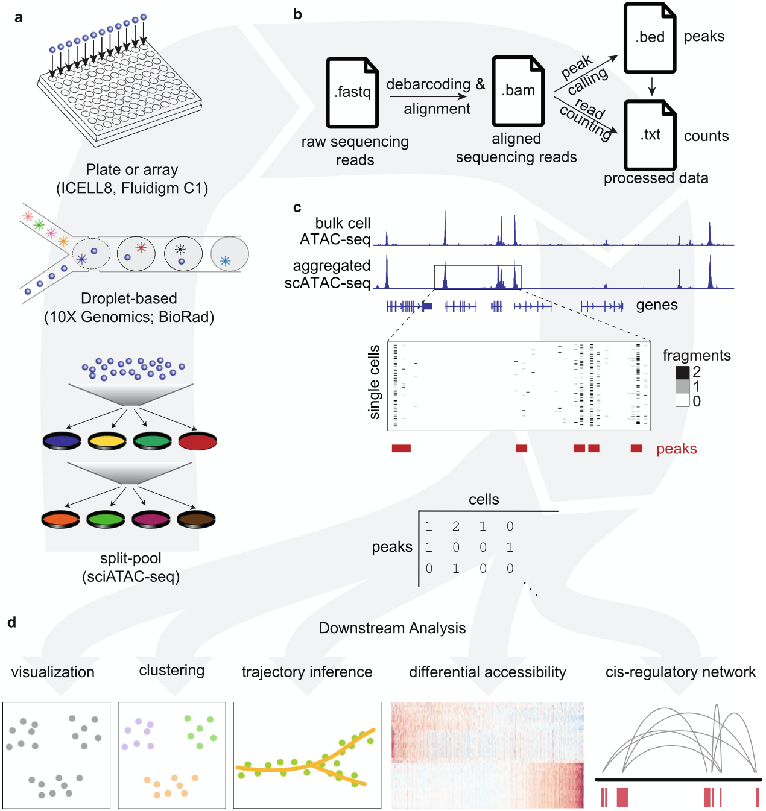
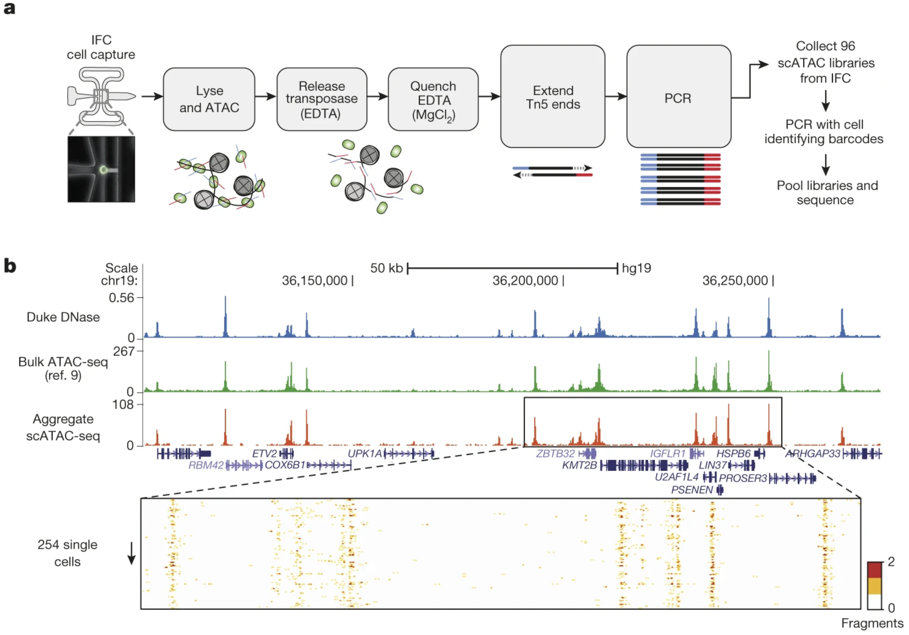
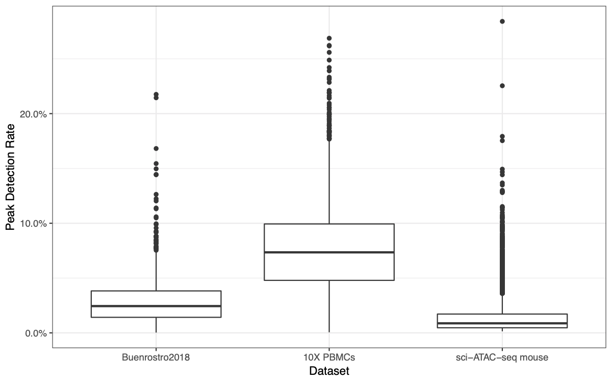

```{r xaringan-themer, include = FALSE}
library(xaringanthemer)
mono_light(
  base_color = "midnightblue",
  header_font_google = google_font("Josefin Sans"),
  text_font_google   = google_font("Montserrat", "500", "500i"),
  code_font_google   = google_font("Droid Mono"),
  link_color = "#8B1A1A", #firebrick4, "deepskyblue1"
  text_font_size = "28px"
)
library(dplyr)
library(ggplot2)
```


<!-- HTML style block -->
<style>
.large { font-size: 130%; }
.small { font-size: 70%; }
.tiny { font-size: 40%; }
</style>

## single-cell ATAC-seq agrees with bulk ATAC-seq

.pull-left[
```{r, out.width = "90%", fig.align='center', echo=FALSE}

```
]
.pull-right[ scATAC-seq (Single-cell Assay for Transposase-Accessible Chromatin using sequencing) - maps regions of the genome are "open" or "closed."

.small[ Chen, H., Lareau, C., Andreani, T. et al. Assessment of computational methods for the analysis of single-cell ATAC-seq data. Genome Biol 20, 241 (2019). https://doi.org/10.1186/s13059-019-1854-5 ]
]

---
## scATAC-seq data

```{r, out.width = "80%", fig.align='center', echo=FALSE}

```

.small[Buenrostro, J., Wu, B., Litzenburger, U. et al. Single-cell chromatin accessibility reveals principles of regulatory variation. Nature 523, 486–490 (2015). https://doi.org/10.1038/nature14590]

---
## single-cell ATAC-seq challenges

.pull-left[
* While for an expressed gene several RNA molecules are present in a single cell, scATAC-seq assays profile DNA, a molecule which is present in only two copies per cell (for a diploid organism).
]
.pull-right[
```{r, out.width = "400px", fig.align='center', echo=FALSE}

```
]
* The low copy number results in an inherent per-cell data sparsity, where only 1– 10% of expected accessible peaks are detected in single cells from scATAC-seq data, compared to 10–45% of expressed genes detected in single cells from scRNA-seq data.

---
## single-cell ATAC-seq challenges

- The feature set in scATAC-seq includes genome-wide regions of accessible chromatin

- It is typically 10–20X the size of the feature set in scRNA-seq experiments (which is defined and limited by the number of genes expressed).

- A highly skewed distribution of accessibility across the genome, with a small number of peaks being detected in a large fraction of cells and a long tail of peaks being detected in only a few cells.