```{r xaringan-themer, include = FALSE}
library(xaringanthemer)
mono_light(
  base_color = "midnightblue",
  header_font_google = google_font("Josefin Sans"),
  text_font_google   = google_font("Montserrat", "500", "500i"),
  code_font_google   = google_font("Droid Mono"),
  link_color = "#8B1A1A", #firebrick4, "deepskyblue1"
  text_font_size = "28px"
)
library(dplyr)
library(ggplot2)
```


<!-- HTML style block -->
<style>
.large { font-size: 130%; }
.small { font-size: 70%; }
.tiny { font-size: 40%; }
</style>

## Introduction to Single-Cell RNA-seq 

.pull-left[
* **Bulk RNA-seq** measures the average expression level for each gene across a large population of cells.

* **scRNA-seq** measures the distribution of expression levels for each gene across a population of cells.
]

.pull-right[
**scRNA-seq advantages:**

* Infer cell lineages

* Identify subpopulations

* Outline temporal evolution

* Define cell-specific biological characteristics, e.g., differentially expressed genes
]

---
## scRNA-seq Applications

- **Basic Research**: Cell atlas generation, developmental biology, immunology, neuroscience

- **Translational Medicine**: Biomarker discovery, drug target identification, treatment response prediction

- **Clinical Diagnostics**: Minimal residual disease monitoring, tumor microenvironment profiling, immune repertoire analysis

- **Drug Development**: Target validation, mechanism of action studies, patient stratification


---
## Single cell timeline

```{r, out.width = "1000px", fig.align='center', echo=FALSE}
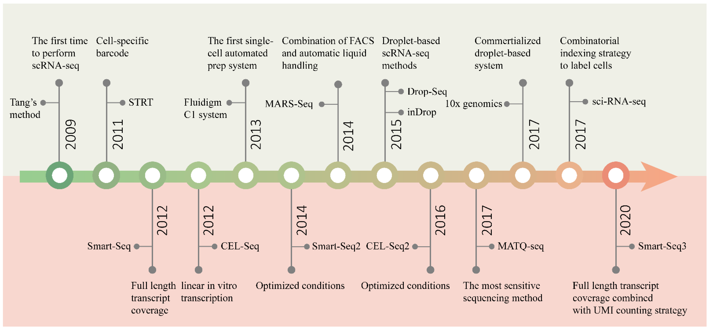
```
.small[ Pan, Y.; Cao, W.; Mu, Y.; Zhu, Q. Microfluidics Facilitates the Development of Single-Cell RNA Sequencing. Biosensors 2022, 12, 450. https://doi.org/10.3390/bios12070450 ]

---
## Single-cell Sequencing Technology

.pull-left[
A single device has three input ports (oil, barcoded beads in lysis buffer, and cells of interest) and a single output port used for collecting bead–cell-containing lipid droplets. 

Then each cell (or RNA in the cell) is marked by the unique barcode and processed on the bead for sequencing.
]
.pull-right[
```{r, out.width = "500px", fig.align='center', echo=FALSE}
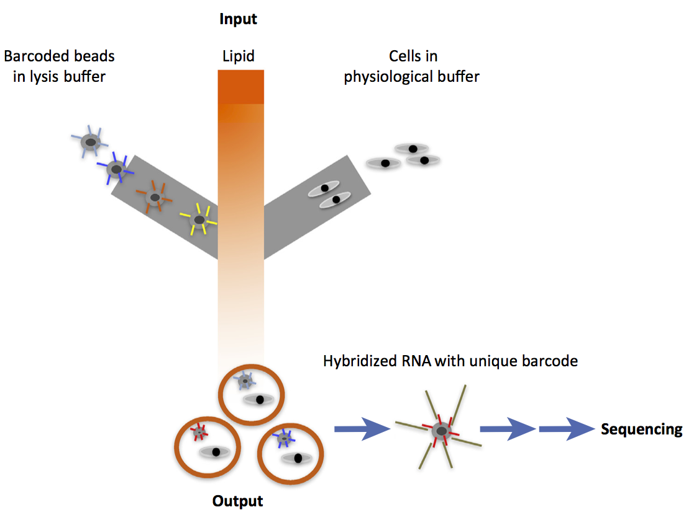
```

]

---
## Bulk and scRNA-seq expression agreement

```{r, out.width = "400px", fig.align='center', echo=FALSE}
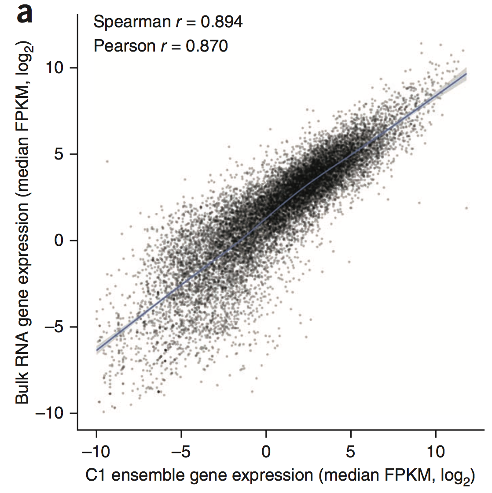
```

.small[ Wu, A., Neff, N., Kalisky, T. et al. Quantitative assessment of single-cell RNA-sequencing methods. Nat Methods 11, 41–46 (2014). https://doi.org/10.1038/nmeth.2694 ]

---
## How does single-cell data differ from bulk RNA-seq

* In theory, up to 10,000 cells could be sequenced on a single standard 10x Next GEM (Gel Beads-in-Emulsion) platform.

--

* Even with the most sensitive platforms, the data are relatively sparse owing to a high frequency of dropout events (lack of detection of specific transcripts), and much more variable.

--

* The numbers of expressed genes detected from single cells are typically lower compared with population-level ensemble measurements.

--

* The commonly used ‘reads per kilobase per million’ (RPKM) transcript quantification is biased on a single-cell level; at the very least, ‘transcripts per million’ (TPM) should be used.

---
## Gene expression quantification
```{r, out.width = "500px", fig.align='center', echo=FALSE}
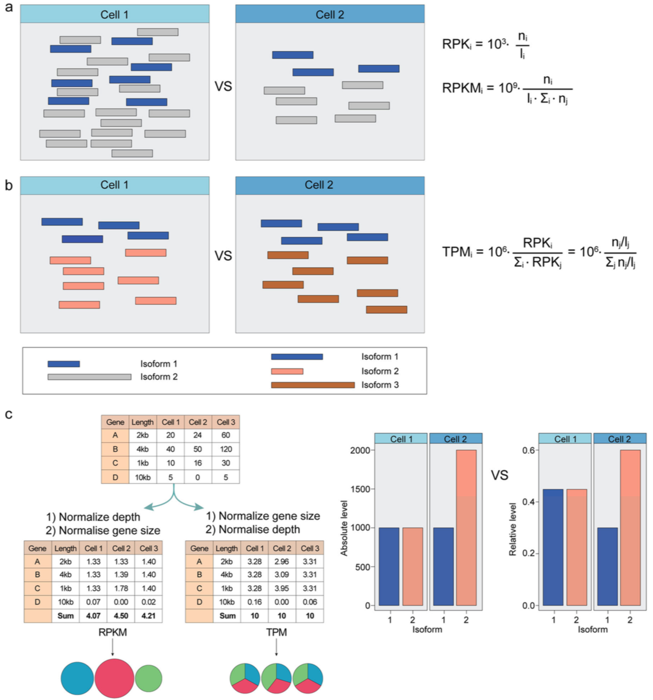
```


---
## Abundance of zeros

```{r, out.width = "600px", fig.align='center', echo=FALSE}
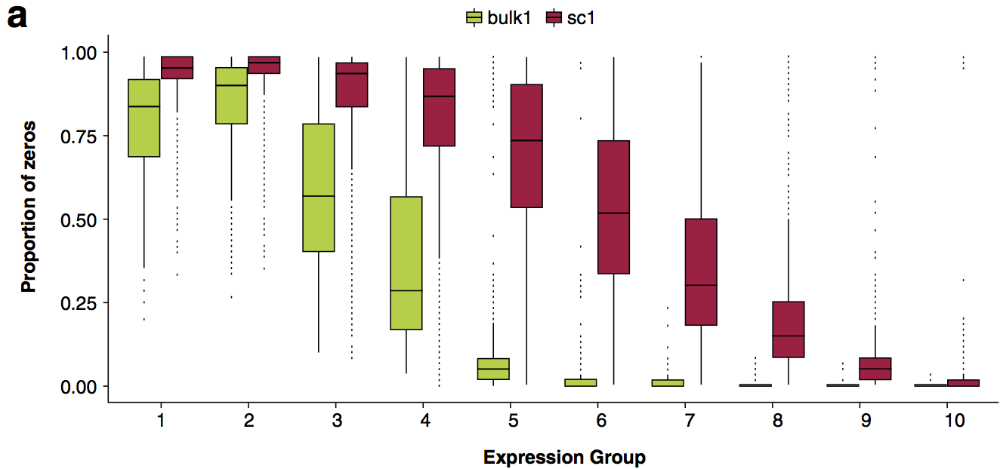
```

.small[ Bacher, Rhonda, and Christina Kendziorski. “Design and Computational Analysis of Single-Cell RNA-Sequencing Experiments.” Genome Biology (April 7, 2016) https://doi.org/10.1186/s13059-016-0927-y ]

---
## Multimodal distribution of variance

```{r, out.width = "600px", fig.align='center', echo=FALSE}
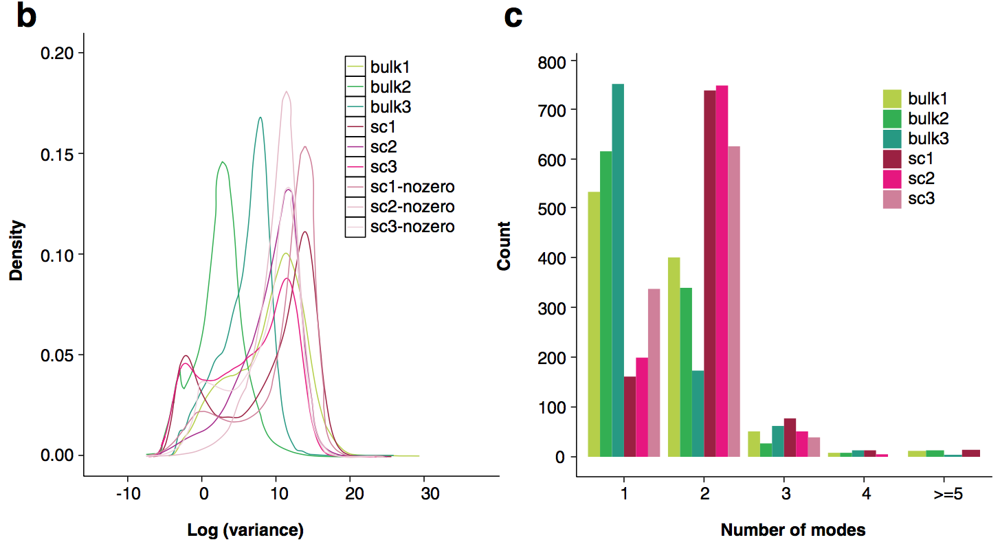
```

.small[ Bacher, Rhonda, and Christina Kendziorski. “Design and Computational Analysis of Single-Cell RNA-Sequencing Experiments.” Genome Biology (April 7, 2016) https://doi.org/10.1186/s13059-016-0927-y ]

<!--

## Single-cell Sequencing Technology

```{r, out.width = "400px", fig.align='center', echo=FALSE}
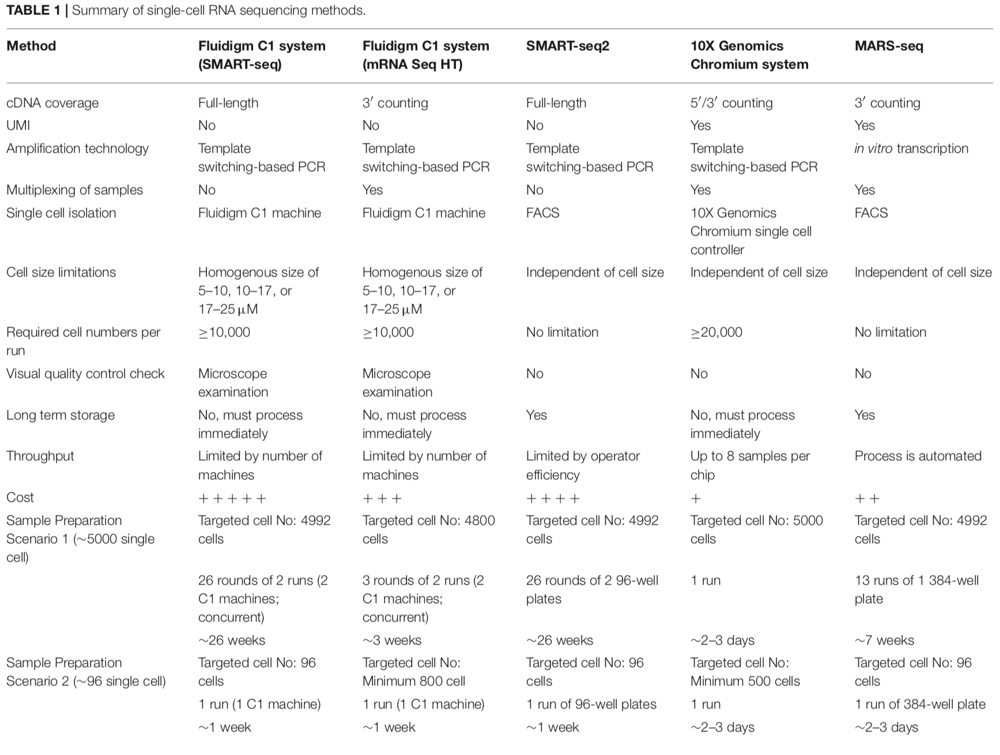

```

.small[ Chen, Jinmiao, and Florent Ginhoux. “A Single-Cell Sequencing Guide for Immunologists.” Frontiers in Immunology 9 (2018): 13. ]


## Timeline of single-cell technologies

```{r, out.width = "400px", fig.align='center', echo=FALSE}
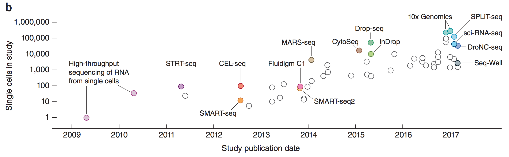
```

.small[ Svensson, Valentine, Roser Vento-Tormo, and Sarah A. Teichmann. “Exponential Scaling of Single-Cell RNA-Seq in the Past Decade.” Nature Protocols 13, no. 4 (April 2018): 599–604. [https://doi.org/10.1038/nprot.2017.149](https://doi.org/10.1038/nprot.2017.149). ]
-->

---
## Current single-cell Platforms

**10x Genomics** is the industry leader in droplet-based single-cell analysis, utilizing their proprietary GEM (Gel Bead-in-Emulsion) technology to partition and barcode thousands of individual cells simultaneously.

* **Chromium Controller** (Standard instrument)
    * **Next GEM chips** (3' v4, 5' v3, ATAC, Multiome): 3,000-10,000 cells/sample, 8 samples/chip
    * Recovery rate: ~70-80% of loaded cells

* **Chromium Single Cell HT**: Up to 20,000 cells/sample, 16 samples/chip (320,000 cells total)

---
## Current single-cell Platforms

**Chromium X** (Newer instrument platform)
- **GEM-X chips**: Up to 20,000 cells/sample, 8 samples/chip (160,000 cells total)
- Higher throughput with improved cell capture and library quality
- Compatible with Gene Expression, Immune Profiling, ATAC, and Multiome assays

**Additional Features**
- Cell multiplexing (CellPlex, hashtag antibodies) available across platforms for population-scale studies
- Fixed RNA Profiling enables use of archived FFPE samples

---
## Overview of 10x Chromium Platform

**Core Technology**: Microfluidic droplet-based cell encapsulation system that isolates individual cells into nanoliter-scale reaction chambers (GEMs - Gel Bead-in-Emulsions) for massively parallel single-cell profiling.

**Key Innovation**: Each gel bead contains millions of barcoded oligonucleotides with a unique cellular barcode, enabling post-sequencing assignment of reads back to their cell of origin.

```{r, out.width = "400px", fig.align='center', echo=FALSE}
knitr::include_graphics("img/Figure_1.png")
```

.small[https://www.10xgenomics.com/blog/the-next-generation-of-single-cell-rna-seq-an-introduction-to-gem-x-technology]

---

## Platform Capabilities

**Gene Expression Profiling**
- 3' and 5' gene expression quantification
- Full-length V(D)J immune receptor sequencing
- Cell surface protein detection (Feature Barcoding)

**Chromatin & Epigenetics**
- Single-cell ATAC-seq for chromatin accessibility
- Multiome: Simultaneous gene expression + ATAC

**Spatial Transcriptomics**
- Visium: Spatially-resolved gene expression on tissue sections
- Xenium: High-resolution in situ imaging with subcellular resolution

---
## Workflow: From Cells to Data

**Sample Preparation** → Dissociate tissue to single-cell suspension (500-20,000 cells per library)

**Chromium Controller** → Microfluidic partitioning: cells + gel beads + reagents → GEMs

**Barcoding & Library Prep** → Cell lysis, reverse transcription with barcoded primers, cDNA amplification, sequencing library construction

**Sequencing** → Standard Illumina NGS platforms (typically 50,000-100,000 reads per cell)

**Analysis** → Cell Ranger pipeline: demultiplexing, alignment, UMI counting, quality control

---
## Molecular Barcoding and Unique Molecular Identifiers (UMIs)

**The Quantification Problem in Single-Cell RNA-seq**

Traditional RNA-seq quantification relies on read counts, but PCR amplification introduces severe quantitative bias. Multiple reads from the same original molecule are counted as independent transcripts, leading to:
- Overestimation of highly amplified molecules
- Underestimation of poorly amplified molecules
- Amplification noise masking true biological variation

**The Innovation**: Unique Molecular Identifiers (UMIs) enable accurate molecule counting by labeling individual RNA molecules before amplification.

.small[ Islam, S., Zeisel, A., Joost, S. et al. Quantitative single-cell RNA-seq with unique molecular identifiers. Nat Methods 11, 163–166 (2014). https://doi.org/10.1038/nmeth.2772 ]

---
## How UMIs Work: Principle and Workflow

.pull-left[
**1. Molecular Tagging During Reverse Transcription**
Each mRNA molecule is reverse transcribed with a primer containing:
]
.pull-right[
```{r, out.width = "400px", fig.align='center', echo=FALSE}
knitr::include_graphics("img/Figure_1.png")
```
]
- **Cell Barcode**: Identifies which cell the molecule came from (10x: 16 nucleotides)

- **Unique Molecular Identifier (UMI)**: Random sequence that uniquely labels each individual mRNA molecule (10x: 10-12 nucleotides)

- **Poly(T) sequence**: Captures polyadenylated mRNA

---
## How UMIs Work: Principle and Workflow

.pull-left[
**2. PCR Amplification**
The tagged cDNA is amplified. All copies of the same original molecule share the same UMI, while different original molecules (even from the same gene) have different UMIs.
]
.pull-right[
```{r, out.width = "400px", fig.align='center', echo=FALSE}
knitr::include_graphics("img/Figure_1.png")
```
]

---
## How UMIs Work: Principle and Workflow

.pull-left[
**3. Bioinformatic Deduplication**
After sequencing, reads are grouped by:
- Cell barcode → assigns reads to cells
- Gene identity → identifies which gene was expressed
- UMI sequence → collapses all reads with the same UMI to a single molecule count
]
.pull-right[
```{r, out.width = "400px", fig.align='center', echo=FALSE}
knitr::include_graphics("img/Figure_1.png")
```
]
**Result**: Each unique UMI = one original mRNA molecule, regardless of how many times it was amplified or sequenced.

---
## Advantages of using UMIs

**Quantitative Accuracy**

- UMI-based counting nearly eliminates PCR amplification bias

- Strong correlation (r² > 0.9) with gold-standard single-molecule FISH measurements

- Linear relationship between molecule counts and expression levels across the full dynamic range

---
## Advantages of using UMIs

**Improved Sensitivity**

- Fivefold improvement in mRNA capture efficiency through optimized reagents and microfluidic preparation

- Detection of low-abundance transcripts with minimal technical noise

**Biological Insight**
<!-- - Revealed true transcriptional noise in mouse embryonic stem cells -->
- Distinguished biological variability from technical artifacts

- Enabled quantitative analysis of gene expression heterogeneity at single-cell resolution

---
## UMI Design Considerations

**UMI Length and Collision Rates**
- 10-12 nucleotide UMIs provide $4^{10}$ to $4^{12}$ possible sequences (~1 million to 16 million unique tags)

- Collision probability depends on molecules per gene: for typical expression levels (~100-1,000 molecules/gene/cell), 10-12 nt UMIs have negligible collision rates

- Sequencing errors can create false UMIs → corrected using error-correction algorithms that cluster similar UMI sequences

---
## UMI Implementations

- 10x Genomics: 10-12 nt UMIs (platform-dependent)

- Drop-seq: 8 nt UMIs

- inDrops: 6 nt UMIs

- UMI length balanced against sequencing cost and collision probability for expected transcript abundance

```{r, out.width = "500px", fig.align='center', echo=FALSE}
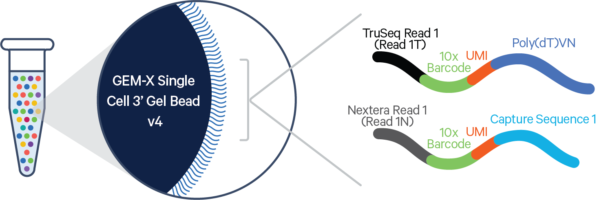
```

---
## Impact on Single-Cell Transcriptomics

**Before UMIs (Read-Based Counting)**

- High technical noise obscures biological signal

- Difficulty distinguishing amplification bias from true expression differences

- Limited quantitative accuracy for differential expression analysis

---
## Impact on Single-Cell Transcriptomics

**After UMIs (Molecule-Based Counting)**

- Accurate absolute molecule counts per gene per cell

- Minimal amplification bias enables detection of subtle biological differences

- Foundation for quantitative downstream analyses: differential expression, trajectory inference, RNA velocity

**Current Standard**: UMIs are now universally implemented in commercial single-cell platforms (10x Genomics, BD Rhapsody, Parse Biosciences) and have become essential for reproducible, quantitative single-cell RNA-seq.

---
## Drop-seq: Scalable Single-Cell Barcoding with Microfluidic Droplets

Co-encapsulate thousands of individual cells with uniquely barcoded microparticles (beads) in nanoliter droplets, enabling massively parallel single-cell transcriptome profiling. 

This technology formed the foundation for commercial platforms like 10x Genomics Chromium.

---
## Drop-seq: Scalable Single-Cell Barcoding with Microfluidic Droplets

```{r, out.width = "900px", fig.align='center', echo=FALSE}
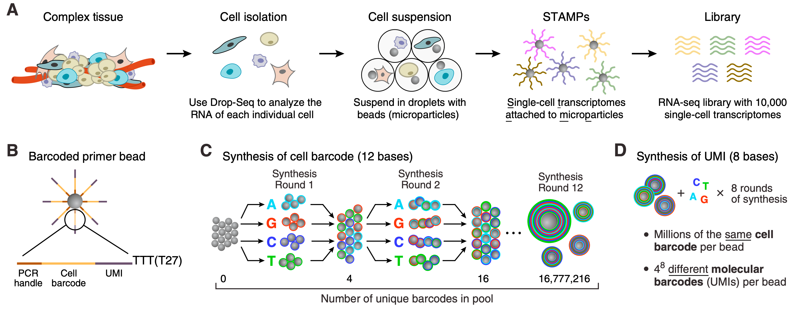
```

.small[ Macosko et al., “Highly Parallel Genome-Wide Expression Profiling of Individual Cells Using Nanoliter Droplets.” https://doi.org/10.1016/j.cell.2015.05.002 ]

---
## Molecular Barcoding Architecture

Each primer on a bead contains four critical elements:

**[PCR Handle] — [Cell Barcode (12 nt)] — [UMI (8 nt)] — [Poly(T) tail (30 nt)]**

- **PCR Handle**: Universal sequence enabling PCR amplification after reverse transcription
- **Cell Barcode (12 nt)**: Identifies which cell the transcript came from → 4¹² = 16,777,216 possible cell barcodes
- **UMI (8 nt)**: Identifies individual mRNA molecules within a cell → 4⁸ = 65,536 possible UMIs per gene
- **Poly(T) sequence (30 nt)**: Captures polyadenylated mRNA transcripts

**Critical Design Feature**: All $\sim10^8$ primers on a single bead share the same cell barcode but have different UMIs, enabling molecule counting for that specific cell.

---
## Split-Pool Barcode Synthesis

How do you synthesize millions of uniquely barcoded beads efficiently?

**Split-Pool Strategy for Cell Barcodes**:
1. Start with a pool of identical microparticles
2. **Split** the pool into 4 equal portions
3. Add one of the four DNA bases (A, T, G, or C) to each portion
4. **Pool** all beads back together
5. Repeat for 12 cycles total

**Result**: Each bead follows a unique path through 12 synthesis cycles → 4¹² = 16,777,216 unique 12-nucleotide cell barcodes

---
## Synthesizing UMIs

After cell barcode synthesis is complete, **all beads** are subjected to 8 rounds of **degenerate synthesis** where all four bases (A, T, G, C) are added simultaneously in each cycle.

Each individual primer on a bead receives a random 8-nucleotide sequence → $4^8$ = 65,536 possible UMIs

Multiple primers on the same bead share the same cell barcode but have different UMIs, enabling molecule counting within individual cells.

```{r, out.width = "500px", fig.align='center', echo=FALSE}

```

---
## Single cell workflow

```{r, out.width = "600px", fig.align='center', echo=FALSE}
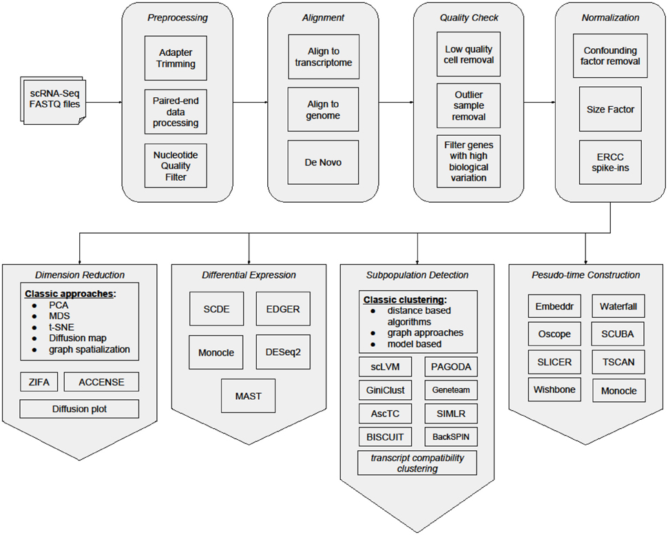
```
.small[ Bacher, R., Kendziorski, C. Design and computational analysis of single-cell RNA-sequencing experiments. Genome Biol 17, 63 (2016). https://doi.org/10.1186/s13059-016-0927-y ]

---
## Cell Ranger

Cell Ranger is the standard 10x Genomics software pipeline for processing raw single-cell RNA-seq data into gene-by-cell count matrices suitable for downstream analysis.

Input:
* Raw base call (BCL) files from Illumina sequencers or FASTQ files
* Reference genome and transcript annotation (e.g., GRCh38 + GTF)

.small[ https://www.10xgenomics.com/support/software/cell-ranger/downloads#reference-downloads ]

---
## Cell Ranger steps

**1. Demultiplexing**
* Converts BCL files to FASTQ files (`cellranger mkfastq`)
* Separates reads by sample index and library type

**2. Alignment / Pseudo-alignment**
* Reads aligned to the reference transcriptome (STAR-based)
* Assigns each read to a gene (exonic reads only for expression counts)

---
## Cell Ranger steps

**3. Barcode and UMI Processing**
* Corrects sequencing errors in:
  * Cell barcodes
  * Unique Molecular Identifiers (UMIs)
* Collapses reads with identical (cell barcode, UMI, gene) into single molecules

**4. PCR Duplicate Removal**
* UMIs used to remove amplification bias
* Produces molecule-level rather than read-level counts

---
## Cell Ranger filtering

* Distinguishes real cells from:
  * Empty droplets
  * Ambient RNA background
* Uses UMI count distributions and statistical models (e.g., knee/inflection points)

**Key QC Metrics Computed Per Cell**
* Total UMI counts
* Number of detected genes
* Fraction of reads mapped to:
  * Mitochondrial genes
  * Ribosomal genes
* Sequencing saturation

---
##  Outputs of Cell Ranger

* A filtered set of high-confidence cell barcodes
* Unfiltered data retained for custom QC or alternative cell-calling methods

* **Gene × Cell count matrix**
  * Sparse matrix format (`matrix.mtx`)
  * Gene annotation (`features.tsv`)
  * Cell barcodes (`barcodes.tsv`)

---
##  Outputs of Cell Ranger

Web-based HTML report:

* Sequencing depth per cell

* Median genes per cell

* Fraction mitochondrial reads

* Cell count estimates

Alignment statistics and run logs

---
## The computational workflow for scRNA-seq

```{r, out.width = "1000px", fig.align='center', echo=FALSE}
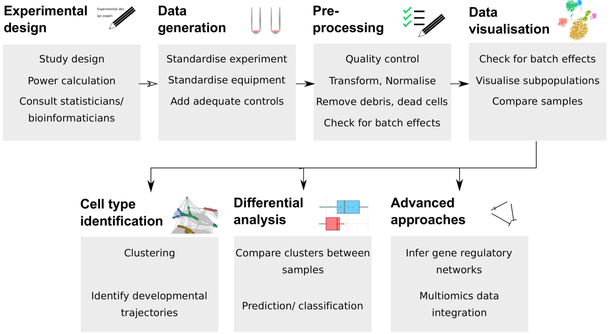
```

---
## QC in scRNA-seq

* Assess sample and cell quality before downstream analyses.

* Remove barcodes that represent *empty droplets*, *ambient RNA*, *poor quality cells*, or *multiplets*.

* Avoid confounding clustering, differential expression, and biological interpretation.

---
## Filtering

* Filter cells (UMI counts per barcode) and/or genes (Number of expressed features (genes) per barcode)

* No single consensus; additional criteria include:
  * Fraction of reads mapping to mitochondria-encoded genes 
  * Doublet scores / empty droplets
  * Ambient RNA contamination

**Visualize QC metrics** (violin/density/box plots) to understand distribution and decide filtering strategy.

---
## Core QC Metrics and Filtering Methods

**1. UMI Count Filters**

* Low total UMI counts suggest ambient RNA or empty droplets.

* High counts could indicate *doublets/multiplets*.

* Thresholds may be *arbitrary* or *data-driven* (e.g., median ± MAD).

**2. Feature (Gene) Count Filters**

* Cells with few expressed genes likely have poor transcript capture.

* Cells with excessive features may be multiplets.

* Thresholds again can be data-specific. 

---
## Core QC Metrics and Filtering Methods

**3. Percent Mitochondrial Reads**

* High mitochondrial proportion often reflects stressed or dying cells.

* Must interpret cautiously; some cell types naturally express higher mt transcripts.

**4. Doublet and Empty Droplet Detection**

* Doublet tools (e.g., **Scrublet**, **DoubletFinder**, **Solo**) generate and score artificial doublets.

* **emptyDrops** distinguishes real cells by comparing to ambient RNA profiles.

---
## Advanced QC and Removal Strategies

**Multivariate Outlier Detection**

* Combine multiple QC metrics into a multivariate statistic (e.g., robust PCA or outlyingness).

* Identify cells that are global outliers across metrics.

* Can improve discrimination of borderline poor-quality cells.

**Iterative QC**

* Begin with permissive filters; evaluate downstream results.

* Adjust thresholds and methods based on visualization, cluster annotation, or sample heterogeneity. 

---
## scRNA-seq design considerations

**Reads per cell:** 

For standard 3′/5′ Gene Expression libraries, 10x Genomics recommends **a minimum of ~20,000 paired-end reads per cell** for broad cell-type clustering and annotation, with **30,000–70,000 reads per cell** often targeted for deeper expression coverage. 

**Average number of detected genes per cell:** 

In real 10x datasets (e.g., PBMCs), the **median number of genes detected per cell** often falls in the range of **~2,000–3,500 genes per cell** after sequencing and standard Cell Ranger processing.

---
## Noise in scRNA-seq

* Technical noise can be approximated with a Poisson distribution.
* Low–read count genes show strong noise and high–read count genes show weak noise.

```{r, out.width = "400px", fig.align='center', echo=FALSE}
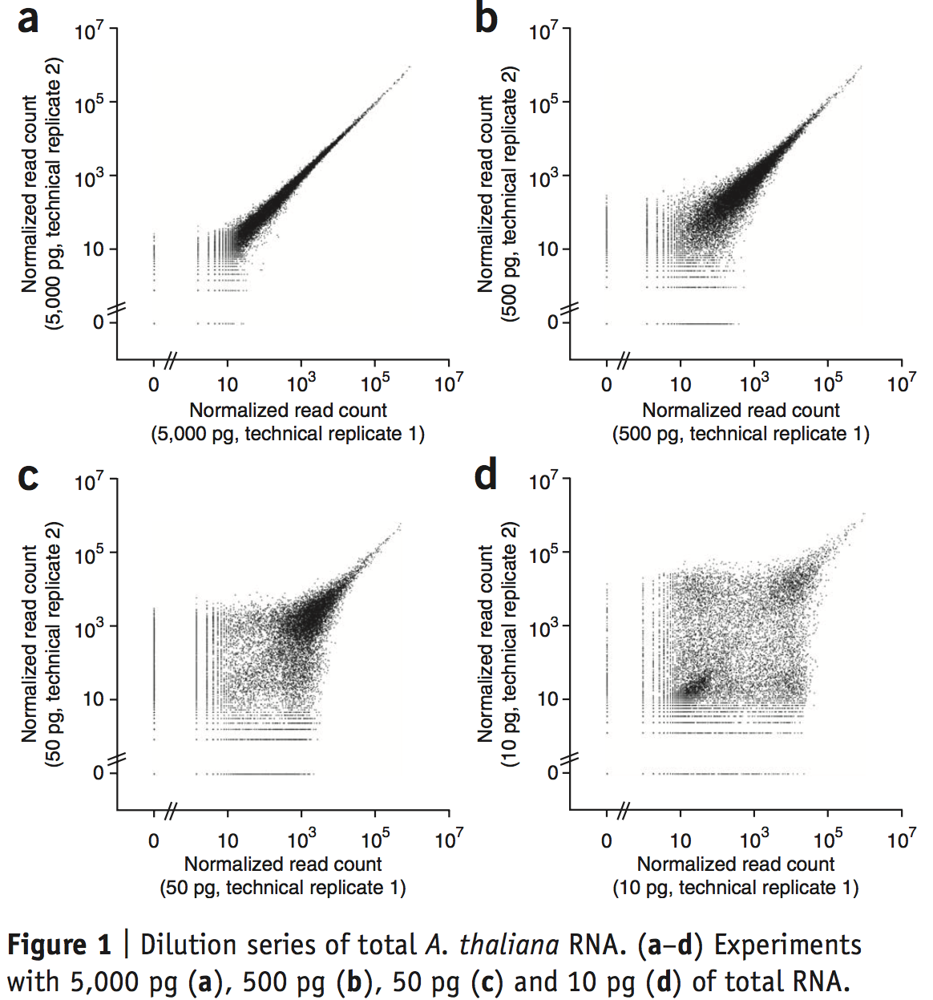
```

.small[ Brennecke, P., Anders, S., Kim, J. et al. Accounting for technical noise in single-cell RNA-seq experiments. Nat Methods 10, 1093–1095 (2013). https://doi.org/10.1038/nmeth.2645 ]

---
## Normalization

Ideally, normalize for:

* Capture efficiency

* Amplification biases

* GC content

* Differences in total RNA content

* Sequencing depth (that's what is done in reality)

---
## Global-scaling normalization

```{r, out.width = "900px", fig.align='center', echo=FALSE}
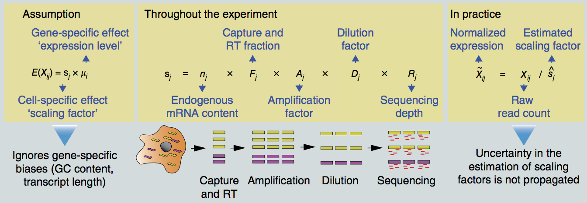
```

.small[ Vallejos, Catalina A, Davide Risso, Antonio Scialdone, Sandrine Dudoit, and John C Marioni. “Normalizing Single-Cell RNA Sequencing Data: Challenges and Opportunities.” Nature Methods 14, no. 6 (May 15, 2017) https://doi.org/10.1038/nmeth.4292 ]

---
## SCnorm: A Quantile Regression Approach for Normalization

* **Quantile regression** to estimate the dependence of transcript expression on sequencing depth for every gene. 
- For a gene $g$ in cell $i$, the model estimates the relationship:
    $$Q_{\tau}(\log(Y_{gi} + 1) | \log(X_i)) = \beta_{g,0} + \beta_{g,1} \log(X_i)$$
    where $Y_{gi}$ is the observed count, $X_i$ is the sequencing depth, and $\beta_{g,1}$ represents the gene-specific "slope" or dependence.

* Genes with similar dependence are then grouped, and a second quantile regression is used to estimate scale factors within each group.

.small[ Bacher, R., Chu, LF., Leng, N. et al. SCnorm: robust normalization of single-cell RNA-seq data. Nat Methods 14, 584–586 (2017). https://doi.org/10.1038/nmeth.4263 ]

---
## SCnorm: A Quantile Regression Approach for Normalization

- SCnorm iteratively increases the number of groups ($K$) until the median $slope$ within each group is sufficiently close to the predicted theoretical relationship (typically 1 on the log-log scale).

* Within-group adjustment for sequencing depth is then performed using the estimated scale factors to provide normalized estimates of expression.
  - The normalized count $Y'_{gi}$ is calculated as:
    $$Y'_{gi} = \frac{Y_{gi}}{\eta_g(X_i)} \cdot \phi$$
    where $\eta_g(X_i)$ is the group-specific predicted value from the quantile regression and $\phi$ is a constant to scale back to the original magnitude.

---
## ZINB-WaVE: Zero-Inflated Negative Binomial for Signal Extraction

* **General Framework**: A zero-inflated negative binomial (ZINB) model for normalization, batch removal, and dimensionality reduction.

* **Variation Partitioning**: Extends the **RUV (Remove Unwanted Variation)** model with a more careful definition of variation, partitioning it into:
    * **Known sample-level covariates** ($X$): e.g., batch, treatment, or cell type.
    * **Known gene-level covariates** ($V$): e.g., gene length or GC content.
    * **Unknown latent factors** ($W$): Represents the low-dimensional biological signal of interest.

---
## ZINB-WaVE: The Statistical Model

The counts $Y_{gj}$ for gene $g$ in cell $j$ are modeled as a mixture of a point mass at zero and a Negative Binomial (NB) distribution:
$$P(Y_{gj} = y) = \pi_{gj} \delta_0(y) + (1 - \pi_{gj}) f_{NB}(y; \mu_{gj}, \theta_g)$$

The parameters for the mean ($\mu$) and the probability of zero-inflation ($\pi$) are modeled as:
$$\ln(\mu) = X\beta_\mu + (V\gamma_\mu)^T + W\alpha_\mu + O_\mu$$
$$\text{logit}(\pi) = X\beta_\pi + (V\gamma_\pi)^T + W\alpha_\pi + O_\pi$$
.small[
* $W$ is a $J \times K$ matrix of latent factors (the dimensionality reduction).
* $O$ represents fixed offsets (e.g., for sequencing depth).
* $\theta_g$ is the gene-specific dispersion parameter.

Risso, D., Perraudeau, F., Gribkova, S. et al. A general and flexible method for signal extraction from single-cell RNA-seq data. Nat Commun 9, 284 (2018). https://doi.org/10.1038/s41467-017-02554-5 ]

---
## ZINB-WaVE

```{r, out.width = "1000px", fig.align='center', echo=FALSE}
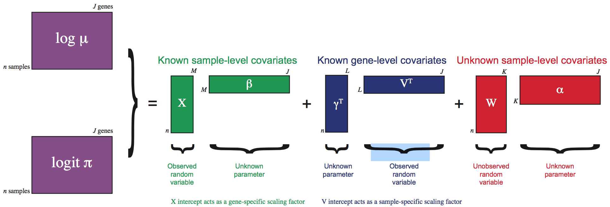
```

---
class: middle,center

# Tools and methods within Seurat R package

---
class: middle, center

# scRNA-seq with Bioconductor

---
## The Bioconductor Ecosystem

While Seurat is a "comprehensive" toolkit, the **Bioconductor** approach is modular. It relies on specialized packages that communicate through a standardized data structure.

* **Orchestrating Single-Cell Analysis (OSCA)**: The definitive community-standard book/workflow for this framework.

**Key Packages**:

* `scater`: Single-cell analysis toolkit for expression monitoring.

* `scran`: Methods for RNA-seq data analysis (normalization, doublet detection).

* `scuttle`: Utility functions for QC and normalization.

.small[ https://bioconductor.org/books/release/OSCA/ ]

---
## The `SingleCellExperiment` (SCE) Object

The foundation of the Bioconductor scRNA-seq workflow. It is an S4 class container that stores all data, metadata, and results in a structured format.

```{r, out.width = "800px", fig.align='center', echo=FALSE}
knitr::include_graphics("https://bioconductor.org/books/3.13/OSCA.intro/images/SingleCellExperiment.png")
```

---
## The `SingleCellExperiment` (SCE) Object

The foundation of the Bioconductor scRNA-seq workflow. It is an S4 class container that stores all data, metadata, and results in a structured format.

* **`assays()`**: Stores the expression matrices (e.g., `counts`, `logcounts`).

* **`colData()`**: Cell-level metadata (e.g., batch, sample ID, QC metrics).

* **`rowData()`**: Gene-level metadata (e.g., symbols, genomic coordinates).

* **`reducedDims()`**: Dimensionality reduction results (PCA, t-SNE, UMAP).

* **`altExps()`**: "Alternative experiments" (e.g., CITE-seq ADTs or Spike-ins).

.small[ https://bioconductor.org/books/3.13/OSCA.intro/the-singlecellexperiment-class.html ]

---
## The Bioconductor Workflow Steps

**1. Quality Control (`scuttle`)**

Uses `perCellQCMetrics()` to identify outliers based on library size, number of detected genes, and mitochondrial percentage. Cells are typically filtered using `isOutlier()`.

**2. Normalization (`scran`)**

Instead of global scaling, Bioconductor often uses **Deconvolution-based size factors**.

* Cells are pooled to handle zeroes, and pool-based size factors are deconvolved to get cell-specific factors.

---
## The Bioconductor Workflow Steps

**3. Feature Selection (`scran`)**

Uses `modelGeneVar()` to model the per-gene variance. It decomposes total variance into **technical** and **biological** components to find highly variable genes (HVGs).

**4. Dimensionality Reduction & Clustering**

* **`denoisePCA()`**: Automatically chooses the number of PCs to retain.

* **`buildSNNGraph()`**: Constructs a Shared Nearest Neighbor graph for community detection (e.g., Louvain or Leiden clustering).

---
class: middle, center

# Sub-population identification

---
## Dimensionality Reduction for Dropout-Prone Data

**ZIFA** is a dimensionality reduction framework specifically designed to handle the "zero-inflation" characteristic of single-cell RNA-seq data, where many genes show zero expression due to technical dropouts.

* **The Dropout Model**: ZIFA assumes that the probability of a dropout event ($p_0$) is a decreasing function of the latent expression level ($\mu$). It uses a decaying exponential relationship:
  $$p(\text{dropout} | \mu) = \exp(-\lambda \mu^2)$$
  where $\lambda$ is a fitted parameter representing the dropout rate.

.small[ Pierson, E., Yau, C. ZIFA: Dimensionality reduction for zero-inflated single-cell gene expression analysis. Genome Biol 16, 241 (2015). https://doi.org/10.1186/s13059-015-0805-z ]

---
## ZIFA - Zero-inflated dimensionality reduction algorithm for single-cell data

* **Generative Framework**:
1.  **Latent Projection**: A low-dimensional latent state $z_i$ is mapped to a high-dimensional expression space: $x_i = Az_i + \mu + \epsilon$.
2.  **Zero-Inflation Masking**: An observed value $y_{ij}$ is zero if a dropout occurs (governed by $p_0$) or if the latent expression $x_{ij}$ is truly zero.

--

* **Inference via EM Algorithm**:
  - Employs an **Expectation-Maximization** approach to estimate the projection matrix $A$ and the dropout parameter $\lambda$.
  - In the E-step, the model computes the conditional expectation of the latent expression for the observed zeros, effectively "imputing" the missing values based on the model.

---
## SC3: Single-Cell Consensus Clustering

**SC3** is a highly robust, user-friendly tool available via Bioconductor that addresses the instability of individual clustering runs through a consensus approach.

* **Distance Metrics**: Computes distance matrices using Euclidean, Pearson, and Spearman metrics:
  $$d_{E}(u, v) = \sqrt{\sum (u_i - v_i)^2}$$

---
## SC3: Single-Cell Consensus Clustering

* **Spectral Clustering**: Performs PCA and Laplacian transformations on these matrices to reduce dimensionality.

* **Consensus Step**: Runs $k$-means on various subsets of the transformed data and builds a **Consensus Matrix**.
  * The matrix entry $C_{ij}$ represents the fraction of times cells $i$ and $j$ were clustered together.

* **Stability Index**: Automatically calculates a stability score for each cluster to help identify "true" biological sub-populations versus noise.

.small[ Kiselev, V., Kirschner, K., Schaub, M. et al. SC3: consensus clustering of single-cell RNA-seq data. Nat Methods 14, 483–486 (2017). https://doi.org/10.1038/nmeth.4236 ]

---
## Louvain Clustering: Modularity Optimization

* **Graph-based approach**: Popularized by Seurat, it identifies communities of cells in a Shared Nearest Neighbor (SNN) graph. It is a greedy, heuristic algorithm that aims to maximize the **Modularity** ($Q$) of the network.

* **Phase 1: Local Moving**: 
  - Each node starts in its own community. 
  - For each node $i$, the algorithm considers moving it to a neighbor's community and calculates the change in modularity ($\Delta Q$).
  - The node is moved to the community that provides the maximum positive $\Delta Q$. This repeats until a local maximum is reached.

---
## Louvain Clustering: Modularity Optimization

* **Graph-based approach**: Popularized by Seurat, it identifies communities of cells in a Shared Nearest Neighbor (SNN) graph. It is a greedy, heuristic algorithm that aims to maximize the **Modularity** ($Q$) of the network.

* **Phase 2: Community Aggregation**: 
  - Communities found in Phase 1 are compressed into single "super-nodes" to form a new, smaller graph.
  - Edges between super-nodes are weighted by the sum of weights between the original communities.
  - The process repeats iteratively until no further modularity gain is possible.

---
## Louvain Clustering: The Modularity Formula

Modularity measures the density of edges inside communities versus edges between communities:

$$Q = \frac{1}{2m} \sum_{i,j} \left[ A_{ij} - \frac{k_i k_j}{2m} \right] \delta(c_i, c_j)$$

Where:
* $A_{ij}$ is the weight of the edge between nodes $i$ and $j$.
* $k_i, k_j$ are the sums of the weights of the edges attached to nodes $i$ and $j$.
* $m$ is the total edge weight in the graph.
* $\delta(c_i, c_j)$ is $1$ if $i$ and $j$ are in the same community, and $0$ otherwise.

.small[Discovering Communities: Modularity & Louvain, https://www.youtube.com/watch?v=Xt0vBtBY2BU, 41m]

---
## Graph-Based Clustering: Beyond Louvain to Leiden

Most modern pipelines (including Seurat and Scanpy) have shifted from $k$-means to community detection on **Shared Nearest Neighbor (SNN)** graphs.

* **The SNN Graph**: Cells are nodes; edges are weighted by the number of shared neighbors between two cells (Jaccard similarity).
* **Modularity Optimization**: Algorithms seek to maximize the density of edges within a cluster compared to edges between clusters:
  $$Q = \frac{1}{2m} \sum_{i,j} \left( A_{ij} - \gamma \frac{k_i k_j}{2m} \right) \delta(c_i, c_j)$$

---
## Graph-Based Clustering: Beyond Louvain to Leiden

**The Leiden Algorithm**: An improvement over the popular **Louvain** method.

* **The Problem**: Louvain can produce internally disconnected or poorly connected communities.

* **The Solution**: Leiden guarantees well-connected communities and converges to a partition that is more biologically representative.

.small[ Traag, V.A., Waltman, L. & van Eck, N.J. From Louvain to Leiden: guaranteeing well-connected communities. Sci Rep 9, 5233 (2019). https://doi.org/10.1038/s41598-019-41695-z ]

---
## PhenoGraph: High-Dimensional Community Detection

Originally developed for CyTOF data, **PhenoGraph** is widely used for scRNA-seq to identify rare sub-populations in massive datasets.

* **Two-Step Graph Construction**:
  1.  Finds $k$-nearest neighbors for each cell.
  2.  Weights the edges using the **Jaccard coefficient** to capture the local density and similarity in high-dimensional space.
* **Clustering**: Applies the Louvain community detection method to the weighted graph.

.small[ Levine, J. H., et al. (2015). Data-Driven Phenotypic Dissection of AML Reveals Progenitor-like Cells that Predict Prognosis. *Cell*, 162(1), 184-197. [https://doi.org/10.1016/j.cell.2015.05.047](https://doi.org/10.1016/j.cell.2015.05.047) ]

---
## PhenoGraph: High-Dimensional Community Detection

Originally developed for CyTOF data, **PhenoGraph** is widely used for scRNA-seq to identify rare sub-populations in massive datasets.

**Strengths**: 

* Specifically designed to handle the "curse of dimensionality."

* Exceptional at identifying small, distinct cell types (e.g., rare progenitors) that might be "swallowed" by global clustering methods like $k$-means.

.small[ Levine, J. H., et al. (2015). Data-Driven Phenotypic Dissection of AML Reveals Progenitor-like Cells that Predict Prognosis. *Cell*, 162(1), 184-197. [https://doi.org/10.1016/j.cell.2015.05.047](https://doi.org/10.1016/j.cell.2015.05.047) ]

---
## scVI: Deep Generative Modeling for Sub-populations

**scVI** (single-cell Variational Inference) represents the "Deep Learning" era of sub-population identification.

* **Variational Autoencoder (VAE)**: Learns a non-linear, low-dimensional **latent space** ($z$) that represents the biological state of each cell.
* **Probabilistic Mapping**: Instead of a single point, each cell is modeled as a distribution, inherently accounting for technical noise and library size.
  $$p(x_n | z_n, s_n) = \text{ZINB}(f_\mu(z_n, s_n), f_\theta(z_n, s_n), f_\pi(z_n, s_n))$$
  where $s_n$ represents batch information and $f$ are neural networks.
* **Clustering**: Clustering is performed in the latent space $z$.

.small[ Lopez, R., et al. (2018). Deep generative modeling for single-cell transcriptomics. *Nature Methods*, 15(12), 1053-1058. [https://doi.org/10.1038/s41592-018-0229-2](https://doi.org/10.1038/s41592-018-0229-2) ]

---
## scVI: Deep Generative Modeling for Sub-populations

**scVI** (single-cell Variational Inference) represents the "Deep Learning" era of sub-population identification.

**Strengths**: 

* Performs normalization, batch correction, and clustering in a single integrated step.

* Scales linearly with the number of cells, making it ideal for atlas-scale projects.

.small[ Lopez, R., et al. (2018). Deep generative modeling for single-cell transcriptomics. *Nature Methods*, 15(12), 1053-1058. [https://doi.org/10.1038/s41592-018-0229-2](https://doi.org/10.1038/s41592-018-0229-2) ]

---

## Differentially expressed genes

* Need to accommodate unobserved dropouts, bimodality in expression levels due to abundance of zero or low values (**MAST**, **SCDE**).

* **scDD** - Distinguishes four types of differential expression changes to increase power:
  * Shifts in unimodal distribution
  * Differences in the number of modes
  * Differences in the proportion of cells within modes
  * Combination of the previous two

.small[ [https://github.com/kdkorthauer/scDD](https://github.com/kdkorthauer/scDD) ]

---
## SCDE - a Bayesian approach to single-cell differential expression detection

* A two-component mixture model to capture drop-out events (modeled by low-magnitude Poisson) and events where a transcript is faithfully amplified (Negative Binomial).

* Incorporates evidence from other cells to estimate both the likelihood of a gene being expressed in each subpopulation of cells and the likelihood of expression fold change between them.

* The derivations are complicated.

.small[ https://hms-dbmi.github.io/scde/index.html

Kharchenko, Peter V., Lev Silberstein, and David T. Scadden. “Bayesian Approach to Single-Cell Differential Expression Analysis.” Nature Methods (July 2014) https://doi.org/10.1038/nmeth.2967 ]

---

## SCDE - a Bayesian approach to single-cell differential expression detection

.small[
The posterior probability of a gene being expressed at an average level $x$ in a subpopulation of cells $S$ is determined as an expected value ($E$) as:

$$P(x|S) = E_{s \in B(S)} \left[ \prod_{i \in s} P(x|c_i) \right]$$

where $B(S)$ is a bootstrap sample of $S$, and $P(x|c_i)$ is the posterior probability for a given cell $c_i$, as:

$$P(x|c_i) = \frac{p(d_i) \cdot NB(x_i|x, \theta) + (1 - p(d_i)) \cdot Poisson(x_i| \lambda_0)}{P(x_i)}$$

where $p(d_i)$ is the probability of observing a dropout event, $NB$ and $Poisson$ are the probabilities of observing expression magnitude of $x_i$ in case of a successful amplification (NB) or dropout (Poisson) for a gene expressed at an average level $x$ in $S$ in cell $i$, with the parameters of the distributions determined by the error model fit.
]

---
## SCDE - a Bayesian approach to single-cell differential expression detection (added)

* For the differential expression analysis, the posterior probability that the gene shows a fold expression difference of $f$ between subpopulations $S_1$ and $S_2$ was evaluated as:

$$P(f) = \int_{x} P(x|S_1) \cdot P(x \cdot f | S_2) dx$$

where $x$ is the valid range of expression levels.

* The model accounts for technical noise and varying sequencing depths by convolving the individual cell error models to produce a robust subpopulation-level estimate.
* This Bayesian framework allows for the calculation of the probability that a gene is truly differentially expressed, rather than relying on a frequentist p-value.

---
## MAST: a flexible statistical framework for assessing transcriptional changes and characterizing heterogeneity in single-cell RNA sequencing data

* A two-part generalized linear model (hurdle model) explicitly parameterizing expressed and non-detectable gene distributions.

* Includes as a covariate the fraction of genes that are detectably expressed in each cell as a proxy for both technical and biological sources of variation (**Cellular Detection Rate**). For cell $i$, $CDR_i = \frac{1}{N} \sum_{g=1}^{N} z_{ig}$, where $z_{ig}$ is an indicator if gene $g$ in cell $i$ is expressed above background.

* The expression measure of a detected gene is modeled by linear regression and the probability of detection by logistic regression.

.small[ [https://github.com/RGLab/MAST](https://github.com/RGLab/MAST) ]

---
## MAST: The Mathematical Model

The expression $y_{ig}$ for gene $g$ in cell $i$ is defined by the two-part model:

$$logit(Pr(z_{ig} = 1)) = X_i \beta_g^D$$
$$E(y_{ig} | z_{ig} = 1) = X_i \beta_g^C$$

Where:
* $z_{ig}$ is the indicator for expression ($y_{ig} > 0$).
* $X_i$ is the design matrix containing the $CDR_i$ and other covariates.
* $\beta_g^D$ and $\beta_g^C$ are the regression coefficients for the discrete and continuous components, respectively.

.small[ Finak, G., McDavid, A., Yajima, M. et al. MAST: a flexible statistical framework for assessing transcriptional changes and characterizing heterogeneity in single-cell RNA sequencing data. Genome Biol 16, 278 (2015). https://doi.org/10.1186/s13059-015-0844-5 ]

---
## The Hurdle Model Approach

MAST decomposes gene expression into two distinct parts that are modeled simultaneously:

1. **Discrete Part**: A logistic regression model that predicts the probability of a gene being expressed (non-zero).
* *Captures "dropout" events and bimodal expression.*


2. **Continuous Part**: A Gaussian linear model for the expression level, given that the gene is expressed.
* *Usually modeled on  or similar normalized values.*

**The Combined Test**: The results from both parts are combined using a **Likelihood Ratio Test (LRT)** with 2 degrees of freedom to determine overall significance.

---
## Why choose MAST over simple tests?

| Feature | Student's t-test / Wilcoxon | MAST |
| --- | --- | --- |
| **Zeros** | Treated as values in a continuum | Modeled as a separate biological/technical state |
| **Covariates** | Difficult to include | Easily handles batch, CDR, and donors |
| **Sensitivity** | May lose signal in high-dropout data | Higher sensitivity for genes with altered detection rates |
| **Distribution** | Assumes normality/rank-based | Specifically models bimodality |

---
## Cell clustering

* Perhaps the most active topic in scRNA-seq.

* The goals include:
  * Cluster cells into subgroups.
  * Model temporal transcriptomic dynamics: reconstruct “pseudo-time” for cells. This is useful for understanding development or disease progression.

* Traditional methods like k-means or hierarchical clustering need to be used with caution due to dropout events.

---
## t-SNE: a useful visualization tool

* t-SNE (t-distributed stochastic neighbor embedding): visualize high-dimensional data on a 2-/3-D map.

* When projecting high-dimensional data into lower dimensional space, preserve the distances among data points.

* This alleviates the problem that many clusters overlap on low dimensional space.

* Try to make the pairwise distances of points similar in high and low dimensions.
* This is used in almost all scRNA-seq data visualization.

---
## Pseudotemporal ordering

* Idea - cells at different differentiation (or other biological process) stages are presented with different expression profiles.

* Dynamics of cellular processes can be reconstructed from expression profiles.

* Key assumption: genes do not change direction very often, thus samples with similar transcriptional profiles should be close in order.

* Most approaches are dimensionality reduction-based and apply graph theory designed to traverse nodes in a graph efficiently.

* **Monocle** - Independent component analysis, then a minimum spanning tree through the dimension-reduced data.

.small[ [https://cole-trapnell-lab.github.io/monocle-release/](https://cole-trapnell-lab.github.io/monocle-release/)  
Many more at [https://github.com/agitter/single-cell-pseudotime](https://github.com/agitter/single-cell-pseudotime) ]

---

## Monocle, An analysis toolkit for single-cell RNA-seq

Single-cell trajectories, clustering, visualization, differential expression

```{r, out.width = "600px", fig.align='center', echo=FALSE}
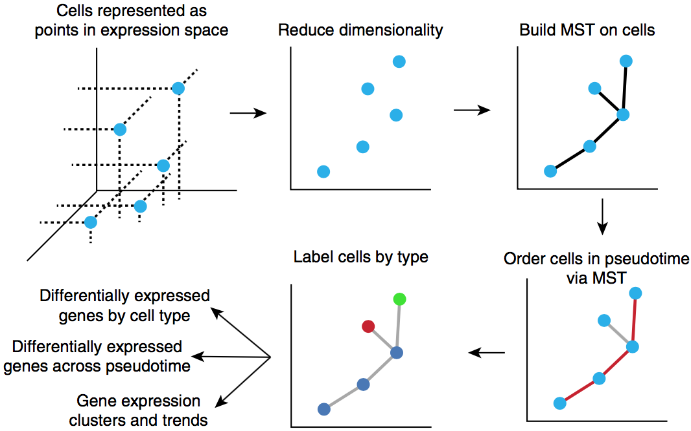
```

.small[ [https://cole-trapnell-lab.github.io/monocle-release/](https://cole-trapnell-lab.github.io/monocle-release/)  
Trapnell, Cole, Davide Cacchiarelli, Jonna Grimsby, Prapti Pokharel, Shuqiang Li, Michael Morse, Niall J. Lennon, Kenneth J. Livak, Tarjei S. Mikkelsen, and John L. Rinn. “The Dynamics and Regulators of Cell Fate Decisions Are Revealed by Pseudotemporal Ordering of Single Cells.” Nature Biotechnology 32, no. 4 (April 2014): 381–86. [https://doi.org/10.1038/nbt.2859](https://doi.org/10.1038/nbt.2859). ]

---
## Monocle: Single-cell Trajectory Analysis

**Monocle** is a comprehensive toolkit for analyzing single-cell RNA-seq data, most famous for introducing the concept of **pseudotime**. It allows researchers to transition from viewing cells as discrete clusters to viewing them as points along a continuous biological process.

* **Pseudotime** is an abstract unit of measure that captures how far an individual cell has progressed through a biological program.

* **Calculation**: Measured as the geodesic distance from a user-defined "root" (start) along the learned principal graph.

---
## Monocle 3 Workflow

1.  **Preprocessing**: Normalization and dimensionality reduction (PCA followed by UMAP).

2.  **Clustering & Partitioning**: Uses **Approximate Graph Abstraction (AGA)** to partition cells into "supergroups." Monocle 3 can learn multiple disjoint trajectories simultaneously.

3.  **Learning the Graph**: Fits a principal graph to the data using **Reversed Graph Embedding (RGE)**. 
    * *DDRTree*: For tree-like structures.
    * *L1-graph*: Can handle trajectories with loops.

4.  **Ordering Cells**: Cells are projected onto the nearest point on the graph to calculate their pseudotime.

<!--
## Differential Expression: The Census Algorithm

Monocle 2 introduced **Census**, which converts relative measures (like TPM/FPKM) into relative transcript counts.

The algorithm estimates the total number of mRNAs in a cell ($M_i$) by identifying the "capture transcript" mode in the distribution. The Census count ($y_{ig}$) for gene $g$ in cell $i$ is:

$$y_{ig} = X_{ig} \cdot \frac{M_i}{\sum_g X_{ig}}$$

where $X_{ig}$ is the initial relative expression. These counts follow a Negative Binomial distribution, making them compatible with standard regression tools.
-->

---
## Statistical Testing in Monocle 3

Monocle 3 provides two main ways to find genes of interest:

1.  **Regression Analysis (`fit_models`)**: Fits a Generalized Linear Model (GLM) to each gene.
    $$\log(E[y_i]) = \beta_0 + \beta_t \cdot \text{pseudotime}_i + \dots$$
    *Used to test if expression depends on pseudotime, treatment, or cluster.*

2.  **Graph-Autocorrelation (`graph_test`)**: Uses **Moran's I** statistic to find genes that vary "smoothly" across the trajectory graph.  
    *Highly effective for finding spatial or trajectory-dependent patterns without assuming a specific functional form (like linear or cubic).*

---
## Branch Analysis (BEAM)

**BEAM** (Branched Expression Analysis Modeling) is used to find genes that are regulated in a cell-fate-dependent manner.

- It compares two models: 
    - **Null Hypothesis**: The gene depends only on pseudotime.
    - **Alternative Hypothesis**: The gene's expression depends on which branch (fate) the cell has chosen.

- Significant genes are those that "diverge" at a branch point, representing the molecular drivers of cell fate decisions.

---
## Slingshot: Lineage and Pseudotime Inference

* **Goal**: Inferring multiple branching developmental lineages from single-cell gene expression data.
* **Two-Stage Approach**: 
    1.  **Lineage Inference**: Identifies the global structure using a cluster-based Minimum Spanning Tree (MST).
    2.  **Pseudotime Inference**: Learns smooth branching curves and projects cells onto them.
* **Robust Clustering**: Operates on low-dimensional space (e.g., PCA, UMAP) after clustering. Uses a distance measure between clusters (defaulting to **Mahalanobis distance** if cluster size permits) to build the MST.
* **Supervision**: Allows optional specification of **initial (root)** and **terminal (leaf)** states to orient the trajectories.

.small[ Street, K., Risso, D., Fletcher, R. et al. Slingshot: cell lineage and pseudotime inference for single-cell transcriptomics. BMC Genomics 19, 477 (2018). https://doi.org/10.1186/s12864-018-4772-0 ]

---
## Slingshot: The Two-Stage Algorithm

**1. Global Lineage Structure (MST)**

Slingshot builds a **Minimum Spanning Tree (MST)** on cluster centers to define the number of lineages ($L$) and their branching points.

* A lineage is defined as an ordered path of clusters from a starting node to a leaf node.

* If cluster sizes are large enough, it uses a **shape-sensitive distance**:
    $$d(C_j, C_k)^2 = (\bar{x}_j - \bar{x}_k)^T \hat{\Sigma}_{jk}^{-1} (\bar{x}_j - \bar{x}_k)$$
    where $\hat{\Sigma}_{jk}$ is the joint covariance matrix of clusters $j$ and $k$.

---
## Slingshot: The Two-Stage Algorithm

**2. Simultaneous Principal Curves**

To move from discrete clusters to continuous pseudotime, it fits $L$ principal curves $c_{\ell}(t)$ that are regularized to be smooth and "bundled" together near shared clusters:

* **Objective**: Minimize the distance between cells and their respective curves while ensuring curves are similar at shared lineage segments.

* **Pseudotime ($t_{i}$)**: Calculated by orthogonal projection of cell $i$ onto the curve $c_{\ell}$.

$$t_i = \text{argmax}_t \{ \| X_i - c_{\ell}(t) \|^2 \}$$
.small[ https://github.com/kstreet13/slingshot ]

---
## SCENIC: Single-Cell Regulatory Network Inference and Clustering

* `SCENIC` R package - single-cell network reconstruction and cell-state identification. Three modules:

1. **`GENIE3` / `GRNBoost2`** – Connects co-expressed genes and TFs using random forest regression.

- For each gene $j$, the model predicts expression $y_j$ based on TF expressions $\{x_1, x_2, \dots, x_{TF}\}$:
     $$y_j = f_j(x_1, x_2, \dots, x_{TF}) + \epsilon$$

- Importance scores are derived to rank potential TF-target interactions.

---
## SCENIC: Single-Cell Regulatory Network Inference and Clustering

* `SCENIC` R package - single-cell network reconstruction and cell-state identification. Three modules:

2. **`RcisTarget`** – Refines co-expression modules using cis-motif enrichment analysis.

- Prunes indirect targets by retaining only genes with a significant enrichment of the TF's binding motif in their regulatory regions (e.g., within 10kb of the TSS).

- Resulting high-confidence modules are termed **Regulons**.

---
## SCENIC: Single-Cell Regulatory Network Inference and Clustering

* `SCENIC` R package - single-cell network reconstruction and cell-state identification. Three modules:

3. **`AUCell`** – Assigns activity scores for each regulon in each individual cell.

- Uses the Area Under the Curve (AUC) to assess whether a regulon's targets are enriched at the top of the gene expression ranking within a cell:
 $$AUC_c = \frac{1}{n \cdot k} \sum_{i=1}^{k} rank(g_i, c)$$

- This allows for "binarized" activity matrices, making network activity robust to technical noise and scale.

.small[ Aibar, S., González-Blas, C., Moerman, T. et al. SCENIC: single-cell regulatory network inference and clustering. Nat Methods 14, 1083–1086 (2017). https://doi.org/10.1038/nmeth.4463]

---
## SCENIC: Regulon Activity Quantification

**AUCell: Robust Activity Scoring**
Instead of using mean expression (which is sensitive to dropouts), SCENIC uses **AUCell** to quantify regulon activity:

* **Ranking**: Genes in cell $i$ are ranked by expression: $r_{i,1}, r_{i,2}, \dots, r_{i,G}$.

* **Recovery Analysis**: For a regulon $R$, AUCell calculates the recovery of its genes among the top $X\%$ of the ranking (typically top 5%).

* **Binarization**: For each regulon, the distribution of AUC scores across all cells is used to set a threshold.
  - Cells with $AUC > \text{threshold}$ are "on" (1).
  - Cells with $AUC \leq \text{threshold}$ are "off" (0).

---
## SCENIC: Regulon Activity Quantification

**Key Advantages**

* **Batch Robustness**: Because it is based on within-cell rankings, it is largely independent of normalization methods and technical batch effects.

* **State Identification**: Clustering on the **Binary Regulon Activity Matrix** often reveals clearer biological states than clustering on raw gene expression.

.small[ https://github.com/aertslab/SCENIC  
https://github.com/aertslab/GENIE3  
https://github.com/aertslab/AUCell ]

---
## ZIFA: Dimensionality reduction for zero-inflated single-cell gene expression analysis

* **Model Framework**: An extension of Probabilistic Principal Components Analysis (PPCA) or Factor Analysis (FA) that explicitly accounts for the prevalence of "dropout" events in scRNA-seq.

* **Dropout Modeling**: Given the latent expression level $x_{ij}$, the dropout probability $p_0$ is modeled as a decaying exponential function:
$$p_0 = \exp(-\lambda x_{ij}^2)$$
  where $\lambda$ is a fitted parameter shared across genes, reflecting the empirical observation that genes with lower expected expression are more likely to result in zero counts.

---
## ZIFA: Dimensionality reduction for zero-inflated single-cell gene expression analysis

**Latent Variable Model**:

1. $z_i \sim \text{Normal}(0, I)$ (Latent space)
2. $x_i | z_i \sim \text{Normal}(A z_i + \mu, W)$ (Latent expression)
3. $h_{ij} | x_{ij} \sim \text{Bernoulli}(p_0)$ (Masking/Dropout indicator)
4. $y_{ij} = x_{ij}$ if $h_{ij} = 0$, and $y_{ij} = 0$ if $h_{ij} = 1$ (Observed expression)

**Statistical Inference**: Employs an **Expectation-Maximization (EM) algorithm** that incorporates an imputation step for the expected gene expression level of drop-outs in the E-step, while $\lambda$ is optimized numerically in the M-step.

.small[ Pierson, E., Yau, C. ZIFA: Dimensionality reduction for zero-inflated single-cell gene expression analysis. Genome Biol 16, 241 (2015). https://doi.org/10.1186/s13059-015-0805-z ]

<!--
## All-in-one tools

```{r, out.width = "400px", fig.align='center', echo=FALSE, eval=FALSE}
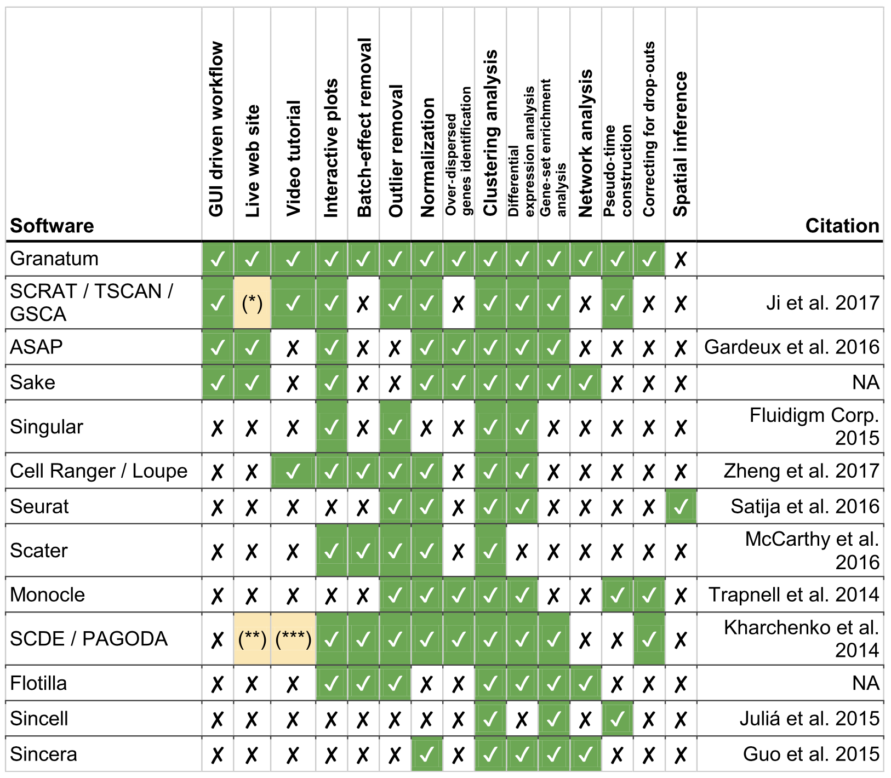
```

.small[ Zhu, Xun, Thomas K. Wolfgruber, Austin Tasato, Cédric Arisdakessian, David G. Garmire, and Lana X. Garmire. “Granatum: A Graphical Single-Cell RNA-Seq Analysis Pipeline for Genomics Scientists.” Genome Medicine 9, no. 1 (December 2017). [https://doi.org/10.1186/s13073-017-0492-3](https://doi.org/10.1186/s13073-017-0492-3). [http://garmiregroup.org/granatum/app](http://garmiregroup.org/granatum/app) ]
-->

<!--
## ascend - Analysis of Single Cell Expression, Normalisation and Differential expression

```{r, out.width = "400px", fig.align='center', echo=FALSE, eval=FALSE}
knitr::include_graphics("img/workflow1.png")

```

.small[ R package [https://github.com/IMB-Computational-Genomics-Lab/ascend](https://github.com/IMB-Computational-Genomics-Lab/ascend) ]
-->


---
## Analysis workflows

- Seurat - R toolkit for single cell genomics https://satijalab.org/seurat/

- 327 Bioconductor packages: https://bioconductor.org/packages/release/BiocViews.html#___SingleCell

- Many others do specific subsets; combine into a workflow https://bioconductor.org/books/release/OSCA/

- "Analysis of single cell RNA-seq data" course, https://www.singlecellcourse.org/index.html

- Also Python package scanpy https://github.com/scverse/scanpy


